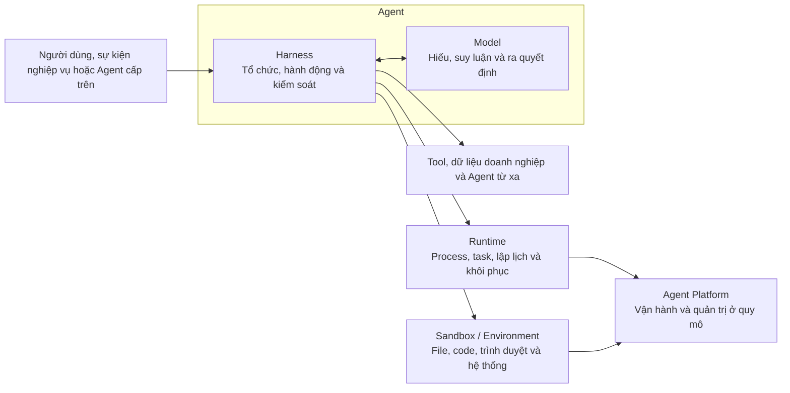
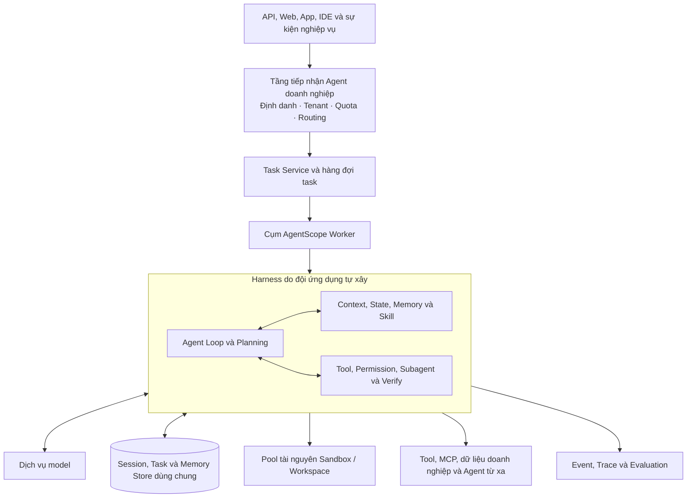
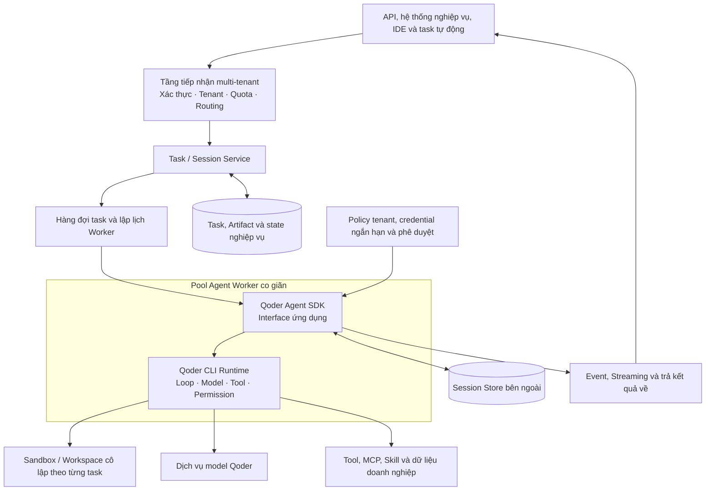
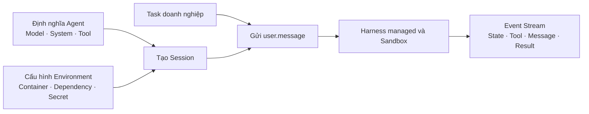
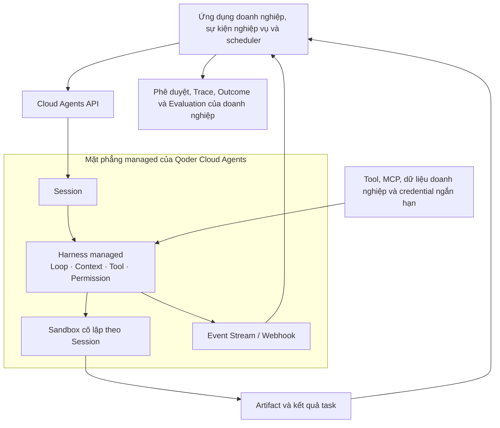

# Chương 3 — Paradigm: các cách xây Harness phổ biến và ranh giới trách nhiệm

Chương trước đã đưa ra kiến trúc tham chiếu của Agentic Application qua ba góc nhìn component, nền tảng và vòng đời, đồng thời xác định "thiết kế kiến trúc" là giai đoạn đầu tiên của vòng đời. Chương này bước vào phần thứ hai — "Xây dựng" — trình bày cách xây một Agent đáng tin cậy, đi từ các con đường xây Harness phổ biến và ba loại hợp đồng kỹ thuật: task, thông tin và hành động.

Coding Agent cung cấp một mẫu kỹ thuật quan sát được cho công việc này. Trong môi trường cấu thành từ code, file và test, model có thể hành động liên tục thông qua tool, còn hệ thống có thể kiểm chứng kết quả bằng compile, test và diff file. Nó cho thấy: năng lực model chỉ có thể chuyển hoá ổn định thành kết quả task sau khi đi qua tổ chức context, vòng lặp task, quản lý state, thực thi tool, kiểm soát quyền hạn và kiểm chứng kết quả. Nhưng bối cảnh lập trình không phải vật thay thế cho mọi nghiệp vụ doanh nghiệp. Các task phê duyệt, giao dịch, chăm sóc khách hàng và vận hành có trạng thái nghiệp vụ, ranh giới quyền hạn và tiêu chí thành công khác nhau; doanh nghiệp không thể bê nguyên một quy trình Coding Agent, mà nên tái sử dụng những cơ chế Harness mang tính tổng quát trong đó.

Từ góc nhìn kỹ thuật, công việc chính khi xây một Agent là thiết lập cho model một Harness tương xứng với cấu trúc task và mức rủi ro. Điều đó không có nghĩa doanh nghiệp phải tự hiện thực từ đầu toàn bộ hệ thống nằm ngoài model. Ứng với các mức độ tuỳ biến, trừu tượng sản phẩm và trách nhiệm vận hành khác nhau, hiện có thể khái quát thành bốn điểm xuất phát chính:

*   Tự xây Harness dựa trên Agent Framework high-code

*   Tái sử dụng Harness đã được đóng gói thành sản phẩm

*   Xây Agent dựa trên model (Managed Agents)

*   Xây nhanh Agent trên nền các năng lực dựng sẵn của sản phẩm cloud

Ngoài phạm vi một Agent đơn lẻ, doanh nghiệp còn cần một **Agent Platform** để tạo và tích hợp những Agent này, đồng thời cung cấp năng lực bàn giao ở quy mô, vận hành, quản trị, cộng tác, quan sát và tối ưu.

Chương này lần lượt lấy AgentScope, QwenPaw, Qoder Cloud Agents và Alibaba Cloud AgentCore làm ví dụ cho bốn cách xây dựng, và lấy Alibaba Cloud AgentCore làm ví dụ cho Agent Platform, để minh hoạ cách thống nhất việc tạo, tích hợp, bàn giao, quản lý và vận hành các Agent đa nguồn. **Bốn điểm xuất phát không phải một bậc thang trưởng thành từ thấp lên cao, và cũng không nhất thiết loại trừ nhau.** Cùng một doanh nghiệp có thể dùng framework high-code để xây các Agent lõi cần tuỳ biến sâu, dùng Coding Agent để nhúng Harness đóng gói sẵn vào ứng dụng hiện có, và cũng có thể dùng các năng lực dựng sẵn được tổ hợp trong sản phẩm cloud để tạo Agent thật nhanh, rồi giao cho một Agent Platform thống nhất quản lý và vận hành.

## 3.1 Agent = Model + Harness

### 3.1.1 Harness là hệ thống kỹ thuật nằm ngoài model

Cuốn sách trắng này định nghĩa Agent Harness là:

> **Phần code, cấu hình và logic thực thi nằm ngoài model, tổ chức context, năng lực, state, môi trường và cơ chế kiểm soát xoay quanh Agent Loop, và chuyển những nhận định của model thành một quá trình task thực thi được, khôi phục được, kiểm chứng được.**

Định nghĩa này gồm ba tầng ý nghĩa.

*   **Thứ nhất, Harness không phải một System Prompt dài hơn.** Prompt chỉ là một trong những input mà Harness sinh ra ở một vòng suy luận. Harness còn bao gồm các logic có tính xác định như state machine của task, đăng ký tool, quản lý kế hoạch, kiểm tra quyền hạn, thích ứng môi trường, xử lý sự kiện, khôi phục lỗi và kiểm chứng hoàn thành.

*   **Thứ hai, Harness không đồng nghĩa với một Agent Framework nào đó.** Framework có thể giúp doanh nghiệp hiện thực hoá Harness; một Coding Agent CLI hay SDK đã chín có thể cung cấp sẵn một bộ Harness; Managed Agents còn có thể host cả Harness lẫn dịch vụ thực thi. Harness mô tả **tầng hệ thống quy định Agent làm việc ra sao**, chứ không phải một loại hình thái sản phẩm nào đó.

*   **Thứ ba, Harness không phải Runtime hay Sandbox.** Harness quyết định bước tiếp theo nên cung cấp gì cho model, cho phép model đề xuất hành động nào, đẩy task tiến triển ra sao; Runtime chịu trách nhiệm gánh quá trình đó một cách liên tục; Sandbox chịu trách nhiệm giới hạn hành động thực tế trong một môi trường kiểm soát được. Ba thứ phối hợp với nhau nhưng trách nhiệm khác nhau.



Một lần gọi model không có state đáng tin cậy xuyên các lượt, và cũng không biết task đã được đẩy tiến ở node khác hay chưa; cửa sổ context hữu hạn, không thể tự nhiên giữ lại toàn bộ sự thật trong một task dài; lời gọi tool chỉ biểu đạt **ý định hành động**, không đồng nghĩa với việc người dùng hiện tại đã được uỷ quyền thực thi; model có thể tuyên bố task đã xong, nhưng không chứng minh được rằng file đã được sinh ra, test đã pass, đơn hàng đã được gửi hay phê duyệt đã có hiệu lực.

Vì vậy Harness phải nhúng những nhận định mang tính xác suất của model vào các ranh giới hệ thống có tính xác định. Model quyết định Agent hiểu và suy luận được tới đâu; Harness quyết định những năng lực đó chuyển hoá liên tục thành kết quả task ra sao; còn Runtime và Sandbox quyết định quá trình này được gánh và bị giới hạn thế nào.

| Tầng | Câu hỏi cốt lõi | Trách nhiệm chính |
| --- | --- | --- |
| Model | Agent hiểu và suy luận được tới đâu | Hiểu ngữ nghĩa, nhận định khi lập kế hoạch, tạo sinh và chọn tool |
| Orchestration Harness | Agent làm việc ra sao | Loop, Context, State, Plan, Tool, Skill, Subagent, Permission và Verification |
| Runtime | Agent chạy liên tục ra sao | Gánh process, lập lịch task, đồng thời, chờ đợi và khôi phục sự cố |
| Sandbox / Environment | Agent hành động ở đâu, phạm vi ảnh hưởng tới đâu | File, process, mạng, Secret, tài nguyên và cô lập môi trường |
| Agent Platform | Bàn giao và quản trị ở quy mô ra sao | Multi-tenant, phát hành, gateway, quota, quan sát, đánh giá, bảo mật và vận hành |

Những ranh giới logic này không nhất thiết ứng với năm sản phẩm hay năm đơn vị triển khai độc lập. Một SDK có thể chứa đồng thời Harness và Runtime cục bộ; một dịch vụ managed cũng có thể cung cấp cùng lúc Harness, Runtime và Sandbox. Nhưng trong thiết kế kiến trúc vẫn phải giữ ranh giới, nếu không doanh nghiệp sẽ không đánh giá được sự cố thuộc về ai, dữ liệu nằm ở đâu, chi phí di trú ra sao và trách nhiệm cuối cùng thuộc về bên nào.

### 3.1.2 Phát triển Harness cần hiện thực những đối tượng nào

Từ góc nhìn lập trình viên, xây Harness không phải liệt kê tính năng, mà là để một nhóm đối tượng kỹ thuật phối hợp với nhau trong cùng một vòng đời task:

| Đối tượng xây dựng | Câu hỏi cần trả lời ở giai đoạn phát triển | Sản phẩm chính |
| --- | --- | --- |
| Agent Contract | Agent làm việc cho ai, mục tiêu là gì, được phép và bị cấm những gì | Chỉ dẫn vai trò, input/output của task và tiêu chí thành công |
| Execution | Model lặp, lập kế hoạch, chờ đợi, uỷ nhiệm và kết thúc ra sao | Agent Loop, state machine, ngân sách và Verifier |
| Context & State | Mỗi lượt nhìn thấy gì, sự thật về task lưu ở đâu | Context Policy, Session / Task Schema, Workspace và Memory |
| Capability | Agent dùng được những phương thức và năng lực bên ngoài nào | Tool Schema, MCP, Skill, Subagent và danh mục năng lực |
| Environment | File, lệnh, trình duyệt hay hệ thống doanh nghiệp chạy ở đâu | Environment Contract, Sandbox và ranh giới Artifact |
| Control | Hành động dưới danh nghĩa ai, thao tác nào phải từ chối hoặc phê duyệt | Permission Policy, HITL và credential ngắn hạn |
| Interaction | Người dùng và ứng dụng cấp trên xem tiến độ, can thiệp và khôi phục ra sao | Event Schema, Streaming, Channel và con trỏ khôi phục |
| Quality | Chứng minh một task đã hoàn thành ra sao, và đánh giá version mới có tốt hơn không | Trace, Outcome, test case và baseline đánh giá |

Một Agent tối thiểu có thể chỉ hiện thực một phần trong số đó, nhưng khi bước vào môi trường production của doanh nghiệp, mọi vấn đề trên đều phải có người chịu trách nhiệm rõ ràng. Chọn con đường xây Harness, về bản chất, chính là quyết định **đối tượng nào do doanh nghiệp tự phát triển, đối tượng nào tái sử dụng sản phẩm sẵn có, đối tượng nào giao cho nền tảng managed gánh.**

Những đối tượng này có thể quy tiếp thành ba miền năng lực: thực thi và orchestration, context và state, hành động và phản hồi. Ở đây chúng chỉ được dùng như một checklist xây dựng; các chương 4–6 sẽ lần lượt triển khai nguyên lý bên trong, cách hiện thực và phương pháp tối ưu của chúng.

*Hình 3-1 — Quan hệ giữa việc xây dựng và việc đảm nhiệm Agent trong doanh nghiệp*


Xây Agent không nên bắt đầu từ việc chọn framework hay mở công cụ, mà nên cố định **hợp đồng task (Agent Contract)** trước. Hợp đồng task nói rõ Agent làm việc cho ai, nhận input gì, bàn giao kết quả gì, được phép ảnh hưởng tới hệ thống nào, thao tác nào bắt buộc phải từ chối hoặc phê duyệt, và bằng chứng nào chứng minh được task đã hoàn thành. Cùng một mục tiêu "vá lỗ hổng phụ thuộc rủi ro cao", Agent có thể chỉ sinh ra báo cáo phân tích, cũng có thể sửa code và chạy test trong môi trường cô lập, thậm chí tạo merge request; nhưng **trừ khi hợp đồng nói rõ đã trao quyền phát hành và quy định điều kiện phê duyệt, không Agent nào trong số đó được diễn giải "đã vá xong" thành "đã phát hành lên production".**

### 3.1.3 Bốn lối vào xây dựng giải quyết những vấn đề trách nhiệm khác nhau

Trước khi chọn cách hiện thực cụ thể, doanh nghiệp còn phải đánh giá **ai kiểm soát đường đi của task**. Task mà các bước, nhánh rẽ và ngoại lệ đã rõ ngay khi thiết kế thì phù hợp dùng Workflow; khi đường đi thực thi bắt buộc phải quyết định động theo kết quả trung gian và phản hồi môi trường thì có thể để Agent nắm một phần quyền quyết định; còn với task mà luồng chính rủi ro cao vốn ổn định nhưng nhận định cục bộ lại phức tạp thì có thể dùng Hybrid: Workflow cố định ranh giới phê duyệt, giao dịch và phát hành, còn Agent lo truy hồi, phân tích và sinh phương án. Workflow, Agent chủ đạo và Hybrid mô tả **cách kiểm soát đường đi**, chúng không phải các hình thái ứng dụng đặt song song với Single-Agent, Long-Horizon Agent và Multi-Agent.

Trên nền đó, bốn lối vào xây dựng phổ biến là: tự xây Harness bằng framework high-code, Harness đóng gói sản phẩm, dịch vụ Managed Agents, và sản phẩm Agent trên cloud. Khác biệt nổi bật nhất giữa chúng **không phải năng lực model, cũng không phải hình thái ứng dụng**, mà là: hành vi chung của Harness do ai hiện thực, Runtime và Sandbox do ai cung cấp, và ứng dụng doanh nghiệp còn phải bù thêm những trách nhiệm kiểm soát và nghiệm thu nào. Single-Agent, Long-Horizon Agent và Multi-Agent đều có thể xây từ bất kỳ lối vào nào trong số đó; **hình thái ứng dụng quyết định cần cách tổ chức task, state bền vững và hợp đồng cộng tác ra sao, còn lối vào xây dựng quyết định những năng lực đó chủ yếu do doanh nghiệp, do sản phẩm hay do nền tảng hiện thực.** AgentScope, QwenPaw, Qoder Cloud Agents và Alibaba Cloud AgentCore lần lượt là các case tiêu biểu của chương này. Bảng 3-2 so sánh trọng tâm kiểm soát, năng lực tái sử dụng được, trách nhiệm doanh nghiệp và điều kiện áp dụng của bốn lối vào.

| Lối vào xây dựng | Ví dụ | Trọng tâm doanh nghiệp kiểm soát trực tiếp | Năng lực tái sử dụng hoặc được host | Trách nhiệm doanh nghiệp vẫn phải gánh | Điều kiện phù hợp hơn |
| --- | --- | --- | --- | --- | --- |
| Tự xây Harness bằng Agent Framework high-code | AgentScope, LangChain, DeepSeek Harness | Loop, Context, Planning, ngữ nghĩa state, chính sách tool và logic kiểm chứng | Framework cung cấp các trừu tượng nền như model, message, tool, state và orchestration | Hành vi sau khi tổ hợp, nền tảng thực thi, bảo mật, khôi phục, đánh giá và nghiệm thu nghiệp vụ | Logic task đặc thù, cần tuỳ biến sâu, hoặc dữ liệu và môi trường bắt buộc do doanh nghiệp kiểm soát |
| Harness đóng gói sản phẩm | QwenPaw, Hermes | Mục tiêu nghiệp vụ, mở rộng tool, callback quyền hạn, Workspace và tích hợp ứng dụng | Hiểu workspace, lập kế hoạch task, thực thi tool, Session, event và can thiệp giữa chừng | Tích hợp multi-tenant, Task nghiệp vụ, môi trường cô lập, credential, Artifact và Outcome | Muốn tái sử dụng cách làm việc sẵn có, đồng thời nhúng vào sản phẩm hiện có hoặc quy trình doanh nghiệp |
| Xây Agent dựa trên model | Qoder Cloud Agents, Claude Managed Agent | Định nghĩa Agent, cấu hình Environment, tích hợp năng lực doanh nghiệp, uỷ nhiệm và nghiệm thu task | Harness trong phạm vi đã thoả thuận, đẩy Session tiến triển, luồng event, thực thi cô lập và tài nguyên chạy trên cloud | Ánh xạ định danh, state nghiệp vụ, phê duyệt, ranh giới dữ liệu, nghiệm thu kết quả và cơ chế thoát | Dịch vụ online, task bất đồng bộ, task theo lô và cần đưa vào production nhanh |
| Xây Agent dựa trên sản phẩm cloud | Alibaba Cloud AgentCore | Mục tiêu nghiệp vụ, cấu hình Agent, tổ hợp tài nguyên dùng chung, phạm vi phát hành và quy tắc nghiệm thu | Model, tri thức, tool, môi trường chạy và năng lực quản lý dựng sẵn của sản phẩm; phạm vi cụ thể theo từng version | Task nghiệp vụ, ranh giới dữ liệu và quyền hạn, tích hợp mở rộng, đánh giá hiệu quả và nghiệm thu cuối cùng | Muốn tạo Agent nhanh qua lối vào sản phẩm cloud, và kết nối với tài nguyên dùng chung cùng quản trị nền tảng của doanh nghiệp |

*Bảng 3-2 — Khác biệt chính giữa bốn lối vào xây dựng Agent*

Bốn lối vào không phải một phân loại kỹ thuật loại trừ nhau nghiêm ngặt. Agent xây bằng framework high-code vẫn có thể dùng Runtime managed; Harness đóng gói sản phẩm có thể chạy trên cụm của doanh nghiệp, cũng có thể do nền tảng lập lịch; Agent xây dựa trên model vẫn phải tích hợp tool, định danh và hệ thống nghiệp vụ của doanh nghiệp; còn Agent xây trên sản phẩm cloud vừa có thể cung cấp lối vào xây dựng native trong nền tảng, vừa có thể gánh thêm năng lực danh mục, vận hành và quản trị cho các Agent đa nguồn. Khi lựa chọn, nên đánh giá riêng rẽ: hiệu quả task có phụ thuộc vào việc sửa Loop hay Context không, dữ liệu và môi trường thực thi có được phép host bên ngoài không, đội ngũ có sẵn lòng bảo trì việc khôi phục state và Sandbox không, và đối tượng bàn giao cuối cùng là workspace cá nhân, ứng dụng nhúng, dịch vụ task bất đồng bộ hay Agent nghiệp vụ trong nền tảng.

## 3.2 Tự xây Harness bằng framework high-code

Agent Framework high-code cung cấp các trừu tượng ở mức code như model, message, tool, Agent, state và orchestration; đội ứng dụng dựa trên đó để định nghĩa vòng lặp task, chính sách context, tổ hợp năng lực và tích hợp doanh nghiệp. Chữ "high-code" ở đây nhấn mạnh việc đội phát triển có thể kiểm soát và mở rộng trực tiếp các cơ chế Harness, để phân biệt với những lối vào dựa vào cấu hình trực quan hay template dựng sẵn — **nó không hàm ý con đường framework nhất định phức tạp hơn hay chín hơn.** Lấy AgentScope Java làm ví dụ: `HarnessAgent` tổ chức các năng lực như workspace, state, Memory, nén Context, Plan Mode, Skill, Subagent, Sandbox và kiểm soát tương tác vào cùng một runtime context thống nhất, giúp đội ngũ tự xây Harness theo nhu cầu nghiệp vụ. Chữ "tự xây" ở đây có nghĩa là **đội phát triển dùng framework để thiết kế và hiện thực Harness**, chứ không phải Agent tự sinh ra hay tự tái cấu trúc Harness của nó.

Giá trị cốt lõi của con đường Framework là **kiểm soát ngữ nghĩa task**. Doanh nghiệp có thể quyết định Context mỗi lượt được tạo thành ra sao, lỗi nào được retry, kế hoạch sinh ra và cập nhật lúc nào, khi nào xin phê duyệt, tạo subtask ra sao, và bằng chứng nào thì tính là hoàn thành. Đổi lại, thứ Framework cung cấp là **vật liệu xây dựng** — nó không tự động bù đắp cô lập multi-tenant, khôi phục state, Sandbox, chính sách bảo mật, baseline đánh giá và nghiệm thu nghiệp vụ.

Một Harness AgentScope tối thiểu trước hết có thể xác định ba việc: dùng model nào, Agent làm việc trong Workspace nào, và một lần gọi thuộc về người dùng nào cùng Session nào.

```java
HarnessAgent agent = HarnessAgent.builder()
    .name("remediation-agent")
    .model(model)
    .workspace(Paths.get(".agentscope/workspace"))
    .build();

agent.call(message, RuntimeContext.builder()
    .userId("u-1842")
    .sessionId("remediation-2026-0917")
    .build()).block();

```

Đoạn code này đã thiết lập ranh giới Harness tối thiểu, nhưng vẫn chưa phải một Agent doanh nghiệp hoàn chỉnh. `name` định danh chủ thể hành vi, `model` cung cấp năng lực suy luận, `workspace` tạo không gian bên ngoài cho chỉ dẫn, file, kế hoạch, Memory, Skill và sản phẩm của task, còn `RuntimeContext` mang định danh người dùng và Session vào lần gọi hiện tại.

Tiếp theo **không nên** bật tất cả năng lực cùng lúc, mà nên suy ngược từ tiêu chí thành công của task ra phần Harness cần thiết. Ví dụ, một Agent vá lỗ hổng ít nhất cần đọc code, sinh patch, chạy test và kiểm chứng kết quả quét bảo mật; nếu kế hoạch chưa được xác nhận thì không được sửa code, ta cần Plan Mode và Permission; nếu việc phân tích và thẩm định chạy song song được, ta cần Subagent; nếu task trải qua nhiều lần gọi, ta cần state đưa ra ngoài và Workspace khôi phục được.

### 3.2.1 Tổ hợp năng lực Harness theo nhu cầu nghiệp vụ

AgentScope dùng Builder, Middleware và các tài sản trong workspace để chồng dần năng lực. Ví dụ dưới đây thêm vào Agent tối thiểu phần kế hoạch, Todo, nén context, offload kết quả tool lớn và Sandbox E2B:

```java
HarnessAgent agent = HarnessAgent.builder()
    .name("remediation-agent")
    .model(model)
    .workspace(Paths.get(".agentscope/workspace"))
    .enablePlanMode()
    .enableTaskList()
    .compaction(CompactionConfig.builder()
        .triggerMessages(30)
        .keepMessages(10)
        .build())
    .toolResultEviction(ToolResultEvictionConfig.defaults())
    .filesystem(new DockerFilesystemSpec()
        .image("ubuntu:24.04"))
    .build();

```

Công việc xây dựng thật sự không nằm ở chỗ gọi bao nhiêu phương thức Builder, mà ở chỗ **định nghĩa hợp đồng giữa các năng lực đó**:

| Năng lực | Lối vào xây dựng trong AgentScope | Đội ứng dụng cần quyết định gì |
| --- | --- | --- |
| Chỉ dẫn và context | `AGENTS.md`, Context bổ sung, Middleware | Phân cấp chỉ dẫn, thông tin động, ngân sách token và quy tắc xử lý xung đột |
| State và memory | Workspace, StateStore, Memory, Compaction | Ranh giới Session / Task, quy tắc ghi, khôi phục và cô lập multi-tenant |
| Kế hoạch và task | Plan Mode, Todo, Task State | Khi nào lập kế hoạch trước, ai phê duyệt, mục tiêu từng giai đoạn nghiệm thu ra sao |
| Tài sản năng lực | Tool, Skill Repository, Subagent | Khám phá năng lực, version, quyền hạn, uỷ nhiệm và hợp đồng output |
| Môi trường thực thi | FileSystem, Docker hoặc Sandbox khác | File, mạng, Secret, tài nguyên, snapshot và phạm vi cô lập |
| Kiểm soát và tương tác | Permission, Channel, Middleware | ALLOW / DENY / ASK, can thiệp của người dùng và ánh xạ event |
| Chất lượng và phản hồi | Trace, Verifier, interface đánh giá | Bằng chứng hoàn thành, các trường quan sát và tiêu chí hồi quy theo version |

Những bước ổn định, có tính xác định nên được tích tụ tối đa thành Tool, script hoặc policy; phần cần model hiểu mục tiêu và cân nhắc phương án thì để lại trong Agent Loop; còn những hành động có thể ảnh hưởng tới thế giới bên ngoài thì thống nhất đi qua quyền hạn và Sandbox. Chỉ Harness được xây theo cách đó mới có **ranh giới test được**, thay vì là một nhóm hành vi ngầm do Prompt dẫn dắt.

### 3.2.2 Từ một process đơn máy tới dịch vụ phân tán

`HarnessAgent` chạy cục bộ giải quyết chuyện *một Agent đơn lẻ làm việc ra sao*. Để biến nó thành một dịch vụ online cấp doanh nghiệp, còn phải thiết lập ở vòng ngoài các hệ thống: tiếp nhận multi-tenant, lập lịch task, state dùng chung, môi trường cô lập, gateway năng lực, cùng quan sát và đánh giá.



Instance online **không nên** dựa vào lịch sử message trong process để khôi phục task. Đội ứng dụng cần ánh xạ Session, Task, Plan, subtask và Artifact vào một interface state dùng chung; thiết lập cơ chế ghi đồng thời hoặc hợp đồng thuê thực thi (execution lease) cho cùng một task; khôi phục từ một điểm an toàn sau khi Worker hỏng; tạo hoặc tái sử dụng Sandbox theo tenant; và dùng định danh ngắn hạn để truy cập tool doanh nghiệp. Lưu trữ vật lý, lập lịch và chịu lỗi thuộc về Runtime, nhưng **Harness phải định nghĩa các hợp đồng logic tương ứng trước.**

Trọng tâm kiến trúc của một Agent workspace thì có khác: nó có thể chạy thẳng trong IDE, CLI hoặc Workspace của team, giữ lại file và tương tác người dùng có vòng đời dài hơn; nhưng chỉ cần bước vào bối cảnh nhiều người, nhiều dự án hoặc thực thi nền, nó cũng cần ranh giới định danh, state, quyền hạn, Artifact và Trace y như vậy.

### 3.2.3 Ranh giới áp dụng và sản phẩm xây dựng

Con đường Framework phù hợp với những bối cảnh mà logic nghiệp vụ đặc thù, dữ liệu hoặc môi trường thực thi không thể giao cho bên ngoài host, cần thay đổi chính sách Loop hay Context, hoặc doanh nghiệp muốn tích tụ một nền tảng công nghệ Agent thống nhất. Nó cũng đòi hỏi đội ngũ có năng lực về ứng dụng model, hệ phân tán, bảo mật và đánh giá hiệu quả.

Ở giai đoạn Build, con đường này ít nhất phải tạo ra: code Harness test được, Agent Contract, Schema của state, Context Policy, danh mục Tool và Skill, Environment Contract, Permission Policy, Verifier, mô hình event và bộ test hồi quy. **Chỉ khi model và những cấu hình hành vi này cùng được gắn version, kết quả trên production mới tái hiện và rollback được.**

## 3.3 Tái sử dụng Harness đã đóng gói thành sản phẩm

Thực tiễn production của Coding Agent, cùng các trợ lý workspace dạng Claw, đã hình thành một bộ cách làm việc tái sử dụng được: kiểm tra workspace, lập kế hoạch, gọi tool file và lệnh, duy trì Session, xin quyền, sinh Artifact, và nhận sự can thiệp của người dùng ngay trong lúc thực thi task dài. Bộ cơ chế này cũng áp dụng được cho các task doanh nghiệp xoay quanh file, tool và môi trường kiểm chứng được — ví dụ đọc dữ liệu rồi gọi script phân tích, thu thập log rồi định vị sự cố, tổng hợp tài liệu rồi sinh báo cáo. Nếu doanh nghiệp không cần thiết kế lại từ đầu những hành vi chung ấy, họ có thể dùng trực tiếp qua CLI, hoặc dùng SDK để nhúng Harness đóng gói sẵn vào ứng dụng nghiệp vụ, rồi tích hợp thêm tool nghiệp vụ, quy tắc quyền hạn và tiêu chí nghiệm thu.

### 3.3.1 Phân biệt CLI, SDK và trợ lý workspace

Coding Agent CLI phù hợp để lập trình viên thao tác trực tiếp trong workspace; SDK phù hợp để nhúng một Harness giống hoặc tương tự vào ứng dụng sẵn có; còn trợ lý workspace nhấn mạnh việc dùng liên tục xuyên nhiều lối vào và state mang tính cá nhân hoá. Khác biệt giữa ba thứ **không phải năng lực model cao thấp**, mà là: Harness do ai khởi phát, state do ai lưu, event do ai tiêu thụ, và bàn giao hướng tới workspace cá nhân hay hệ thống nghiệp vụ doanh nghiệp.

Qoder CLI và Qoder Agent SDK là case tiêu biểu của Coding Agent. Agent SDK là interface lập trình phía ứng dụng, lo việc gửi mục tiêu và tuỳ chọn, tiêu thụ event, xử lý yêu cầu quyền hạn và nối tiếp Session; còn thành phần CLI đi kèm lo việc chạy Harness do sản phẩm Qoder cung cấp, lập kế hoạch task trong workspace mục tiêu, gọi model và thực thi tool.

Trợ lý workspace thì mở rộng cùng loại Harness ấy sang phạm vi rộng hơn: tri thức cá nhân, cộng tác văn phòng, xử lý tin nhắn và task tự động hoá; OpenClaw, Hermes Agent và QwenPaw có thể xem là đại diện. Hai thứ này có thể kết hợp với nhau, và **cả hai đều không thể dùng Session hay kết quả chạy ở phía sản phẩm để thay thế Task doanh nghiệp, đánh giá quyền hạn và nghiệm thu Outcome.**

### 3.3.2 Coding Agent CLI và SDK

Qoder CLI và Agent SDK là đại diện cho con đường này. Agent SDK là interface lập trình phía ứng dụng, lo việc gửi Prompt cùng Options, tiêu thụ event và kiểm soát Session; Qoder CLI là Agent Runtime ở tầng dưới, lo việc lập kế hoạch task, gọi model và thực thi tool trong môi trường mục tiêu. Gói SDK thường mang theo một CLI Runtime tương thích, nên ứng dụng không phải cài CLI riêng thành một dịch vụ từ xa.

Dùng CLI trực tiếp thì phù hợp với workspace cá nhân và team; dùng SDK thì có thể đưa Agent vào IDE, nền tảng R&D, hệ thống xử lý sự cố, workbench doanh nghiệp hoặc task tự động hoá. Khác biệt giữa hai cách không phải năng lực model, mà là Harness do ai khởi phát, nhận event ra sao, và doanh nghiệp có cần dựng ứng dụng cùng mặt phẳng điều khiển của riêng mình hay không.

**Dùng Agent SDK để nhúng vào ứng dụng nghiệp vụ**

Ví dụ TypeScript dưới đây nhúng một Harness đã chín vào một dịch vụ vá lỗ hổng. Ứng dụng thiết lập thư mục làm việc, tập tool khả dụng và phạm vi uỷ quyền trước, xử lý các thao tác cần xác nhận qua callback phê duyệt, rồi tiêu thụ liên tục phần text, lời gọi tool và kết quả chạy:

```ts
import { accessTokenFromEnv, query } from '@qoder-ai/qoder-agent-sdk';

for await (const message of query({
  prompt: 'Phân tích các lỗ hổng phụ thuộc rủi ro cao của payment-service, sửa code và bổ sung test; không được phát hành.',
  options: {
    auth: accessTokenFromEnv(),
    cwd: '/workspace/payment-service',
    tools: ['Read', 'Write', 'Edit', 'Glob', 'Grep', 'Bash'],
    allowedTools: ['Read', 'Glob', 'Grep'],
    permissionMode: 'default',
    async canUseTool(toolName, input, context) {
      // Ứng dụng host hiện thực phần phê duyệt; huỷ hoặc timeout thì phải từ chối thực thi.
      const approved = await requestToolApproval({
        toolName, input, signal: context.signal,
      });
      return approved
        ? { behavior: 'allow', updatedInput: input, toolUseID: context.toolUseID }
        : { behavior: 'deny', message: 'Thao tác chưa được phê duyệt.', toolUseID: context.toolUseID };
    },
  },
})) {
  if (message.type === 'assistant') {
    for (const block of message.message.content) {
      if (block.type === 'text') publishText(block.text);
      if (block.type === 'tool_use') publishToolEvent(block.name);
    }
  }
  // Lưu kết quả chạy; chỉ xác nhận Outcome sau khi qua test, quét bảo mật và nghiệm thu nghiệp vụ.
  if (message.type === 'result') await persistRunResult(message);
}
```

Đoạn code này tái sử dụng các năng lực Harness như lập kế hoạch task, gọi model, thực thi tool, context và Session. `tools` giới hạn tập tool khả dụng, `allowedTools` chỉ uỷ quyền trước cho các tool đọc và tìm kiếm; những thao tác sửa file hoặc gọi lệnh cần xác nhận thì do `canUseTool` chuyển cho ứng dụng phê duyệt. `requestToolApproval`, `publishText`, `publishToolEvent` và `persistRunResult` đều do ứng dụng host hiện thực. Giao diện phê duyệt nên hiển thị thao tác thực tế cùng input của nó, và phải chấm dứt thao tác đó khi bị từ chối, huỷ hoặc timeout.

Doanh nghiệp còn phải trỏ `cwd` vào một Workspace có kiểm soát, **không** tiêm credential phát hành production vào môi trường đó, và chặn đường phát hành production bằng chính sách định danh cùng mạng — để thực thi đúng ràng buộc "không được phát hành". `result` chỉ được lưu như **kết quả chạy**; ứng dụng phải căn cứ vào file đã thay đổi, test, quét bảo mật và trạng thái nghiệp vụ để kiểm chứng tiêu chí thành công, rồi mới xác nhận Outcome nghiệp vụ, bàn giao thành quả và ghi nhận phản hồi.

SDK còn có thể tích hợp MCP, Skill, Plugin, Subagent, Hooks, Memory và Session Store bên ngoài. Khi xây dựng, nên ưu tiên dùng các điểm mở rộng đã có sẵn, thay vì mô phỏng lại cùng cơ chế đó trong Prompt ở vòng ngoài; **chỉ khi hành vi của Harness sẵn có không khớp với tiêu chí thành công nghiệp vụ, mới đánh giá xem có cần chuyển sang con đường Framework hay không.**

**Đóng gói một Harness đã chín thành dịch vụ phân tán**

Dĩ nhiên không thể lấy thẳng một process CLI làm dịch vụ online multi-tenant; doanh nghiệp cần thêm mặt phẳng điều khiển về định danh và task ở vòng ngoài SDK, và lập lịch mỗi lần Agent thực thi vào một Worker cùng Workspace có kiểm soát.



Session Store bên ngoài có thể phản chiếu lịch sử Session và cho phép các request sau tiếp tục thực thi trên một máy khác thông qua `session_id`. Nhưng nó **chỉ lo Session Transcript**, không đồng nghĩa với kho lưu task doanh nghiệp hoàn chỉnh, và cũng không lưu trạng thái xác thực, cấu hình ứng dụng, Checkpoint của file hay chính sách lưu giữ. Doanh nghiệp vẫn phải quản lý riêng Task State, Artifact, Sandbox Snapshot, credential và Outcome nghiệp vụ.

Session Store dùng chung còn bắt buộc phải bảo đảm cô lập theo khoá tenant và project, thứ tự append cho cùng một khoá, ghi idempotent và kiểm soát đồng thời. Sau khi Worker hỏng, dịch vụ task phải xác nhận hành động gốc và trạng thái workspace trước, rồi mới quyết định Resume, Retry hay chuyển cho người xử lý — **không được vì Session đọc được mà phát lại thẳng lời gọi tool cuối cùng.**

### 3.3.3 Trợ lý workspace

QwenPaw được nhà cung cấp định vị chính thức là một trợ lý AI cá nhân có thể triển khai trong môi trường cục bộ hoặc trên cloud, và cung cấp các lối vào như Web Console, ứng dụng desktop, giao diện dòng lệnh dạng TUI (Terminal User Interface), CLI và Channel tin nhắn. Kiến trúc của nó lấy **Agent Workspace** làm ranh giới liên tục: mỗi Agent ứng với một workspace, và workspace đảm nhiệm các state như cấu hình, Memory, Skill và lịch sử; còn MCP, Subagent, Cron và Sandbox thì mở rộng việc gọi năng lực, chạy task song song, thực thi theo lịch và chạy có kiểm soát. Chữ "môi trường cloud" ở đây có nghĩa là **phần mềm có thể triển khai lên cloud**, không đồng nghĩa với việc nhà cung cấp có dịch vụ Agent managed cấp doanh nghiệp.

Các lệnh dưới đây chỉ dùng để minh hoạ lối vào cơ bản của QwenPaw từ khởi tạo workspace đến mở ứng dụng hoặc vào chế độ Coding; điều kiện cài đặt và lệnh cụ thể nên theo tài liệu chính thức của version đang dùng.

```plaintext
pip install qwenpaw
qwenpaw init --defaults
qwenpaw app
qwenpaw .
```

Phần tái sử dụng mà trợ lý workspace mang lại không chỉ là viết ít đi một đoạn code Agent Loop. Khi người dùng vào cùng một Agent qua các Channel khác nhau, họ có thể tiếp tục dùng Memory, Skill và tool MCP sẵn có; Cron có thể đẩy các task định kỳ tiến triển trong Session độc lập, Subagent có thể chạy công việc nền. Doanh nghiệp vẫn phải xác nhận từng mục xem những state đó có đủ ngữ nghĩa về kiểm soát đồng thời, khôi phục, lưu giữ và audit theo yêu cầu hay không. Lấy QwenPaw làm ví dụ: tài liệu chính thức nói rõ Subagent chạy nền **không khôi phục được**, và Sandbox sẽ **không tự động cô lập** khi chưa bật ràng buộc — vì vậy **không thể đánh đồng "tính năng dùng được" với "trách nhiệm production đã được đáp ứng".**

**Đưa trợ lý workspace vào ứng dụng và nền tảng doanh nghiệp**

Trải nghiệm liên tục trong một workspace cá nhân không thay thế được dịch vụ task cấp doanh nghiệp. Khi tích hợp trợ lý workspace, doanh nghiệp cần bổ sung ở vòng ngoài phần kiểm soát về định danh, tenant, Task, phê duyệt và Outcome, đồng thời làm rõ ranh giới cô lập của Workspace, Memory, Credential và Sandbox cho từng người dùng, từng team hoặc từng task. Hình 3-3 lấy QwenPaw làm ví dụ để minh hoạ kiến trúc mục tiêu: Harness đóng gói sản phẩm giữ lại các năng lực workspace, Memory, Skill, MCP, Subagent và Channel; còn tầng tiếp nhận của doanh nghiệp lo việc ánh xạ chúng sang đối tượng nghiệp vụ và yêu cầu kiểm soát.

*Hình 3-3 — Đóng gói tiếp nhận trợ lý workspace vào doanh nghiệp, ví dụ với QwenPaw (minh hoạ kiến trúc mục tiêu)*


Phần lối vào multi-tenant, hàng đợi task và lập lịch instance trong hình thuộc về **kiến trúc mục tiêu**, không phải phát biểu trực tiếp về năng lực sản phẩm hiện tại của QwenPaw. QwenPaw Hub cho phép các team tin nhau dùng instance riêng của mình trên cùng một máy chủ, nhưng nhà cung cấp đánh dấu đây là bản sớm và nói rõ nó **không** tạo thành ranh giới multi-tenant mạnh hướng tới người dùng lạ. Doanh nghiệp không được diễn giải một triển khai dùng chung thành nền tảng cô lập mạnh, và cũng không được phát lại một cách máy móc các thao tác tác động lớn trước thời điểm hỏng chỉ vì lịch sử workspace đọc được. Trước khi khôi phục vẫn phải đối chiếu khoá idempotent, trạng thái hệ thống bên ngoài và các Artifact đã sinh ra.

**Ranh giới áp dụng và sản phẩm xây dựng**

Con đường này phù hợp với các đội muốn tái sử dụng Harness đóng gói sản phẩm, workspace và năng lực đa Channel, đồng thời đưa Agent vào tri thức cá nhân, cộng tác R&D, tự động hoá văn phòng hoặc quy trình doanh nghiệp. Coding Agent CLI và SDK phù hợp hơn cho việc thao tác trực tiếp hoặc tích hợp lập trình xoay quanh workspace phát triển; trợ lý workspace phù hợp hơn cho các bối cảnh cần Memory liên tục, tương tác xuyên nhiều lối vào, task định kỳ và tổ hợp tool đa dụng. Khi lựa chọn, nên ưu tiên đánh giá: hiệu quả task có phụ thuộc vào việc sửa Loop hay Context ở mức code không, state có cần kéo dài xuyên Channel không, và dữ liệu, credential cùng môi trường thực thi có được phép đi vào workspace đó không.

Giai đoạn xây dựng ít nhất phải tạo ra: danh mục sản phẩm và version, chính sách Workspace và Memory, danh mục Tool, MCP và Skill, phần tích hợp Channel, ranh giới định danh và Credential, chính sách Sandbox, ánh xạ Task và Session, cách xử lý Event và Artifact, Verifier nghiệp vụ và cơ chế thoát. Nếu hiệu quả task phụ thuộc vào việc sửa thuật toán lập kế hoạch ở tầng dưới, thứ tự biên dịch Context hay các chuyển trạng thái đặc biệt mà sản phẩm không có điểm mở rộng tương ứng, thì con đường Framework high-code có thể phù hợp hơn; còn nếu task cần multi-tenant mạnh, lập lịch co giãn và khôi phục sau thời gian dài, thì cũng không thể chỉ dựa vào một workspace cá nhân hay một process trợ lý đơn lẻ.

## 3.4 Xây Agent dựa trên model

Qoder Cloud Agents dịch vụ hoá thêm một bước cả Harness chung lẫn nền tảng vận hành. So với SDK vốn thiên về nhúng năng lực thực thi của một Harness đã chín vào ứng dụng, Qoder Cloud Agents tổ chức quá trình task xoay quanh **mục tiêu, thực thi, bàn giao thành quả và phản hồi kết quả**, trong đó phần host trên cloud cung cấp nền tảng vận hành cho quá trình này.

Vẫn với case vá lỗ hổng ở trên: khi doanh nghiệp xây dịch vụ bằng SDK, họ còn phải triển khai và lập lịch Worker cùng Workspace gánh SDK, chuẩn bị môi trường thực thi cho task, và xây một dịch vụ phiên hướng nghiệp vụ. Khi dùng Qoder Cloud Agents, nền tảng đảm nhiệm Agent Loop cơ bản, việc đẩy Session tiến triển, việc chạy tool và môi trường cô lập Serverless; nó liên tục chạy phân tích lỗ hổng, sửa code và test, rồi bàn giao cho ứng dụng các file đã thay đổi cùng kết quả thực thi. Trọng tâm tích hợp của doanh nghiệp chuyển **từ việc tổ chức từng lần thực thi sang việc định nghĩa mục tiêu task, xử lý các can thiệp cần thiết và nghiệm thu thành quả cuối cùng.**

Doanh nghiệp vẫn chịu trách nhiệm tích hợp repository và tool nghiệp vụ, ánh xạ định danh và quyền hạn người dùng, quản lý trạng thái task nghiệp vụ, và định nghĩa quy trình phê duyệt cùng nghiệm thu. Phía ứng dụng cũng phải xử lý việc tiêu thụ event và nối tiếp sau khi rớt kết nối. Task có đạt tiêu chí thành công hay không phải đánh giá dựa trên file đã thay đổi, test, quét bảo mật và trạng thái nghiệp vụ thật; còn việc commit hay phát hành lên production vẫn do policy của doanh nghiệp quyết định.

### 3.4.1 Định nghĩa task managed bằng bốn đối tượng

Qoder Cloud Agents dùng bốn đối tượng cốt lõi để tổ chức việc xây dựng và vận hành:

| Đối tượng | Vai trò | Cấu hình chính của doanh nghiệp |
| --- | --- | --- |
| Agent | Định nghĩa Agent tái sử dụng được | Model, System Prompt, tool, Skill và cấu hình hành vi |
| Environment | Môi trường chạy container mà Session dùng | Dependency, cấu hình khởi động, tài nguyên, biến môi trường và credential |
| Session | Một instance task cụ thể hoặc một phiên tương tác liên tục | Agent, Environment, mục tiêu người dùng và thông tin liên kết nghiệp vụ |
| Event | Input và các sự kiện thực thi thời gian thực của Session | Message người dùng, trạng thái, tool, tiến độ, kết quả và liên động hệ thống |

Quy trình xây dựng có thể khái quát thành năm bước: chuẩn bị định danh truy cập, tạo Environment, định nghĩa Agent, gắn hai thứ đó lại để tạo Session, cuối cùng nối kênh event và gửi `user.message`. Khi dùng SSE, phải xác nhận kết nối đã thiết lập trước, rồi mới gửi task; các event lịch sử có thể đọc theo trang qua API list.



### 3.4.2 Tạo và chạy Agent qua API

Ví dụ rút gọn dưới đây tạo một Agent, gắn nó với một Environment sẵn có thành Session, thiết lập đăng ký event trước rồi mới gửi task. Ví dụ chạy trên hai terminal: terminal A tạo Session và giữ kết nối SSE; terminal B dùng cùng định danh truy cập và Session ID để gửi task. Sau khi xác nhận A đã nhận HTTP 200 cùng header `text/event-stream`, mới chạy request ở B. Ứng dụng thật nên dùng service identity, quản lý Secret và xử lý lỗi đầy đủ.

```bash
# Terminal A: tạo Agent và Session, rồi thiết lập đăng ký event.
AGENT_RESPONSE=$(curl -s -X POST "$QODER_API_BASE_URL/api/v1/cloud/agents" \
  -H "Authorization: Bearer $QODER_ACCESS_TOKEN" \
  -H "Content-Type: application/json" \
  -d '{
    "name": "remediation-agent",
    "model": "ultimate",
    "system": "Phân tích lỗ hổng phụ thuộc và sinh ra thay đổi có thể phê duyệt; không được phát hành thẳng lên môi trường production.",
    "tools": [{
      "type": "agent_toolset_20260401",
      "enabled_tools": ["Bash", "Read", "Write", "Edit", "Glob", "Grep"]
    }]
  }')
AGENT_ID=$(echo "$AGENT_RESPONSE" | jq -r '.id')

SESSION_RESPONSE=$(curl -s -X POST "$QODER_API_BASE_URL/api/v1/cloud/sessions" \
  -H "Authorization: Bearer $QODER_ACCESS_TOKEN" \
  -H "Content-Type: application/json" \
  -d "{\"agent\":\"$AGENT_ID\",\"environment_id\":\"$ENV_ID\"}")
SESSION_ID=$(echo "$SESSION_RESPONSE" | jq -r '.id')

printf 'SESSION_ID=%s\n' "$SESSION_ID"

# Đăng ký trước: -i hiển thị header phản hồi; xác nhận HTTP 200 và text/event-stream rồi mới gửi task.
# Kết nối này chạy liên tục, hiển thị tiến độ và kết quả của các task sau đó.
curl -i -sS -N "$QODER_API_BASE_URL/api/v1/cloud/sessions/$SESSION_ID/events/stream" \
  -H "Authorization: Bearer $QODER_ACCESS_TOKEN" \
  -H "Accept: text/event-stream"

# Terminal B: chạy riêng các lệnh sau, KHÔNG xếp nối tiếp sau lệnh giữ kết nối dài của terminal A.
# Cấu hình cùng QODER_API_BASE_URL, QODER_ACCESS_TOKEN,
# và đặt SESSION_ID bằng giá trị mà terminal A in ra; xác nhận A đã kết nối thành công.
curl -sS -X POST "$QODER_API_BASE_URL/api/v1/cloud/sessions/$SESSION_ID/events" \
  -H "Authorization: Bearer $QODER_ACCESS_TOKEN" \
  -H "Content-Type: application/json" \
  -d '{"events":[{"type":"user.message","content":[{"type":"text","text":"Vá các lỗ hổng phụ thuộc rủi ro cao của payment-service và chạy test"}]}]}'
```

Ứng dụng có thể nhận từ luồng event các sự kiện như `session.status_running`, `agent.message`, `agent.tool_use`, `agent.tool_result` và `session.status_idle`, rồi ánh xạ chúng sang trạng thái task, giao diện tiến độ, hệ thống phê duyệt và Trace của riêng mình. `session.status_idle` chỉ có nghĩa là lượt hiện tại đã kết thúc; **task có hoàn thành thành công hay không còn phải đánh giá dựa trên thành quả bàn giao và tiêu chí nghiệm thu.** Một định nghĩa Agent có thể được nhiều Session tái sử dụng, còn mỗi Session thì gánh một task độc lập cùng môi trường thực thi cô lập.

Từ ngày 24 tháng 8 năm 2026, một kết nối SSE mới không kèm `Last-Event-ID` sẽ chỉ nhận các event phát sinh **sau** thời điểm kết nối, vì vậy phải xác nhận đăng ký đã thiết lập rồi mới gửi task. Ứng dụng nên lưu event ID sau khi xử lý event thành công, dùng `Last-Event-ID` để nối tiếp khi rớt kết nối, và loại bỏ trùng lặp theo event ID; những event đã có hoặc bị bỏ sót thì đọc theo trang qua List Events. Nếu gửi task bị timeout, phải đối chiếu trạng thái phía server trước rồi mới quyết định có retry hay không, để tránh thực thi trùng.

Nhìn từ góc độ tích hợp ứng dụng: Qoder Agent SDK chủ yếu cung cấp interface lập trình để gọi và mở rộng một Harness đã chín; còn QCA thì lấy mục tiêu nghiệp vụ làm điểm xuất phát, tổ chức việc thực thi task liên tục, bàn giao thành quả và phản hồi kết quả. Ứng dụng uỷ nhiệm task cho nền tảng qua Agent, Environment, Session và Event, rồi nghiệm thu xoay quanh thành quả bàn giao. Doanh nghiệp vẫn phải lưu ánh xạ giữa `task_id` nghiệp vụ và `session_id` trên cloud, liên kết Artifact, kết quả test và quét, bản ghi phê duyệt cùng Outcome nghiệp vụ, để quá trình thực thi và kết quả hoàn thành task truy nguyên được lẫn nhau.

### 3.4.3 Tích hợp tool, quyền hạn và vòng phản hồi của doanh nghiệp

Agent managed chỉ hoàn thành được task nghiệp vụ thật sau khi kết nối với năng lực của doanh nghiệp. Doanh nghiệp cần đưa Tool, MCP, repository, dữ liệu và credential vào Environment hoặc qua một Gateway có kiểm soát, và giới hạn quyền truy cập theo tenant hiện tại cùng mục đích của task. Sandbox managed cung cấp sự cô lập khi thực thi, nhưng **Policy của doanh nghiệp vẫn phải quyết định về mặt nghiệp vụ rằng một lần đọc, sửa, gửi hay phát hành có được phép hay không.**



Nền tảng có thể đẩy Harness cơ bản tiến triển, thực thi tool và sinh ra Event, nhưng **không thể thay doanh nghiệp định nghĩa tính đúng đắn về mặt nghiệp vụ**. Ví dụ, nền tảng chạy được test và tạo được file thay đổi, nhưng có được phép phát hành lên production hay không vẫn phụ thuộc vào phê duyệt của doanh nghiệp; Agent tuyên bố đã vá xong, thì doanh nghiệp vẫn phải nghiệm thu dựa trên kết quả quét bảo mật, test và trạng thái hệ thống thật.

Vì vậy, trọng tâm phát triển của Managed Agents là **viết ranh giới trách nhiệm thành hợp đồng máy thực thi được**: Agent nhìn thấy tool nào, Environment truy cập được tài nguyên nào, credential được cấp dưới danh nghĩa ai, event nào cần con người tham gia, và Outcome thế nào thì mới khiến Task của doanh nghiệp được coi là hoàn thành.

### 3.4.4 Ranh giới áp dụng và sản phẩm xây dựng

Con đường managed phù hợp với task bất đồng bộ chạy dài, tích hợp API backend, xử lý theo lô, task theo lịch, và các đội muốn nhanh chóng có được Runtime co giãn cùng Sandbox cô lập.

Giai đoạn Build ít nhất phải tạo ra: định nghĩa Agent có version, template Environment, danh mục Tool / MCP và Skill, chính sách định danh và quyền hạn của doanh nghiệp, ánh xạ Task nghiệp vụ với Session, việc tiêu thụ Event và thích ứng Channel, nơi đến của Artifact, Verifier và baseline đánh giá. **Càng giao nhiều cho bên managed, doanh nghiệp càng phải định nghĩa rõ tool, dữ liệu, quyền hạn và tiêu chí thành công — nếu không thì chỉ là chuyển một hành vi Agent mơ hồ lên cloud mà thôi.**

## 3.5 Dùng sản phẩm cloud để xây Agent nhanh

Framework high-code nhấn mạnh kiểm soát ở mức code đối với cơ chế Harness; Coding Agent CLI và SDK nhấn mạnh việc tái sử dụng cách làm việc sẵn có; Managed Agents nhấn mạnh việc giao Harness và trách nhiệm vận hành trong phạm vi thoả thuận cho nhà cung cấp dịch vụ. Ngoài ra, doanh nghiệp còn có thể dùng **sản phẩm Agent trên cloud**, tổ hợp các tài nguyên như model, chỉ dẫn, tri thức, Memory, Tool, Skill, Credential và môi trường chạy thành một Agent thông qua giao diện sản phẩm hoặc API mở. Giá trị của nó không chỉ là giảm code khởi tạo, mà là để Agent **bước vào một hệ thống thống nhất về tài nguyên, định danh, version và chất lượng ngay từ lúc được tạo ra.**

Nền tảng xây dựng và quản trị Agent của Alibaba Cloud — AgentCore — có thể xem là case tiêu biểu cho con đường này. Nhà cung cấp khái quát năng lực của nó thành ba nhóm: xây dựng và vận hành, cộng tác và quản trị, quan sát và đánh giá; đồng thời cung cấp các năng lực như tạo và quản lý Agent, kết nối model, Skill, tool MCP, credential, Team, Channel, giám sát vận hành và Trace.

### 3.5.1 Ranh giới năng lực của lối vào xây dựng qua sản phẩm cloud

Xây nhanh bằng sản phẩm cloud **không** đồng nghĩa với việc dùng trang giao diện trực quan thay cho thiết kế kỹ thuật. Sản phẩm có thể dựng sẵn việc truy cập model, danh mục năng lực, môi trường chạy, chính sách định danh, lối vào quan sát và đánh giá; nhưng mục tiêu nghiệp vụ, trạng thái task, ranh giới dữ liệu, uỷ quyền tool và tiêu chí Outcome vẫn do doanh nghiệp định nghĩa. Ngay cả khi Agent có thể hoàn tất cấu hình và chạy trong nền tảng, ta cũng không được vì thế mà giả định nó đã đáp ứng cô lập multi-tenant, khôi phục task dài, phê duyệt nghiệp vụ hay điều kiện chấp nhận lên production; những năng lực này vẫn phải được xác nhận từng mục theo version sản phẩm, cách triển khai và policy cụ thể của doanh nghiệp.

Khác biệt giữa con đường này và Managed Agents chủ yếu nằm ở **mặt phẳng điều khiển**. Managed Agents thiên về việc thực thi liên tục một Agent đã được định nghĩa như một dịch vụ; còn sản phẩm Agent trên cloud còn gánh cả việc tạo Agent, lắp ráp tài nguyên, quản lý version và cấu hình phát hành. Hai thứ có thể do cùng một sản phẩm cung cấp đồng thời, cũng có thể dùng kết hợp — vì vậy **không thể xếp chúng thành một bậc thang trưởng thành kiểu tự xây → bán managed → managed hoàn toàn.**

### 3.5.2 Từ tài nguyên dùng chung tới một Agent bàn giao được

Khi xây Agent trong sản phẩm cloud, doanh nghiệp nên suy ngược từ hợp đồng task ra tổ hợp tài nguyên, thay vì thêm hết mọi model, tri thức và tool khả dụng vào Agent trước. Tài liệu chính thức của AgentCore liệt kê rõ các năng lực như Agent và template, kết nối model, Skill, tool MCP, credential, Team, Channel, trạng thái vận hành, Trace và đánh giá; phần mô tả bối cảnh còn đề cập cơ sở tri thức, kho memory và sandbox runtime. Bảng 3-6 ánh xạ những năng lực sản phẩm đó sang đối tượng xây dựng và trách nhiệm doanh nghiệp; tên đối tượng, region, cách tính phí và phạm vi khả dụng cụ thể vẫn nên theo tài liệu của version tương ứng tại thời điểm dùng thật.

| Đối tượng xây dựng | Vai trò trong sản phẩm cloud | Nội dung doanh nghiệp cần xác định |
| --- | --- | --- |
| Định nghĩa và version Agent | Tổ chức model, chỉ dẫn, tham chiếu năng lực và cấu hình chạy mặc định | Mục tiêu, input/output, ranh giới hành vi, quyền sở hữu version và chính sách thay đổi |
| Model, Knowledge và Memory | Cung cấp năng lực suy luận, tri thức có kiểm soát và thông tin xuyên lượt | Chọn model, phạm vi dữ liệu, chiến lược truy hồi, quy tắc ghi và chu kỳ lưu giữ |
| Tool, MCP và Skill | Kết nối năng lực có tính xác định, hệ thống bên ngoài và phương pháp task tái sử dụng được | Hợp đồng năng lực, kiểm tra tham số, phân cấp rủi ro, điểm phê duyệt và xử lý lỗi |
| Credential và Identity | Ràng buộc Agent thay mặt ai để truy cập tài nguyên nào | Ánh xạ định danh, quyền tối thiểu, credential ngắn hạn, ranh giới tenant và yêu cầu audit |
| Runtime, Sandbox và Channel | Gánh việc thực thi, cô lập môi trường và kết nối tới người dùng hoặc lối vào nghiệp vụ | Quy cách tài nguyên, ranh giới mạng, Workspace, timeout và khôi phục, cách tương tác |
| Event, Trace và Evaluation | Ghi lại sự thật quá trình và tạo thành phản hồi chất lượng | Liên kết Task, nơi đến của Artifact, bộ đánh giá, ngưỡng chấp nhận và đánh giá Outcome |

*Bảng 3-6 — Đối tượng và trách nhiệm khi xây Agent nhanh bằng sản phẩm cloud*

Những đối tượng này cùng tạo thành đầu vào cho việc xây dựng, **nhưng không có nghĩa tất cả chúng đều thuộc tầng orchestration Harness.** Phần Loop, Context và lựa chọn năng lực trong định nghĩa Agent thuộc Agentic Core; Runtime, Sandbox và lập lịch tài nguyên thuộc nền tảng thực thi production; còn chính sách định danh, quan sát và đánh giá thì phần nhiều do mặt phẳng điều khiển của nền tảng gánh. Bám theo cách chia miền trách nhiệm của chương 2 sẽ tránh được việc hiểu nhầm rằng "cấu hình xong trong cùng một giao diện sản phẩm" nghĩa là "mọi năng lực đều thuộc cùng một tầng kiến trúc".

### 3.5.3 Từ định nghĩa Agent trong nền tảng tới bàn giao nghiệp vụ

Agent xây ra từ sản phẩm cloud vẫn phải qua gắn version, đánh giá và cổng chấp nhận rồi mới vào lối vào nghiệp vụ. Trạng thái "đã phát hành" hay "đã triển khai" ở phía nền tảng chỉ nói lên rằng một định nghĩa Agent đã có thể được gọi, **không** đồng nghĩa với việc task nghiệp vụ đã hoàn thành. Doanh nghiệp còn phải thiết lập ánh xạ giữa Task nghiệp vụ với các đối tượng thực thi của nền tảng, liên kết Event, Trace và Artifact tới version cụ thể, và để ứng dụng nghiệp vụ hoặc Verifier được nó uỷ quyền hình thành Outcome dựa trên trạng thái hệ thống thật.

Giai đoạn xây dựng ít nhất phải bàn giao: định nghĩa Agent truy nguyên được, các tham chiếu tài nguyên, chính sách định danh và quyền hạn, cấu hình môi trường chạy, phần tích hợp Channel hoặc API, mẫu test, baseline đánh giá và phương án rollback. Với những Agent có sửa hệ thống bên ngoài, còn phải hiện thực hoá phê duyệt, tính idempotent, timeout, bù trừ và điều kiện chuyển cho người xử lý thành các cơ chế có tính xác định. Có như vậy, tốc độ mà sản phẩm cloud mang lại mới không phải trả giá bằng việc từ bỏ kiểm soát nghiệp vụ.

### 3.5.4 Kết nối với năng lực quản lý Agent đa nguồn

AgentCore vừa cung cấp lối vào xây dựng Agent trong nền tảng, vừa coi Agent tự phát triển, Harness mã nguồn mở và Agent SaaS thương mại là đối tượng quản lý thống nhất, đồng thời kết nối việc xây dựng với việc quản trị thông qua các năng lực định danh–xác thực, cộng tác Team, quan sát vận hành và đánh giá. Hai vai trò này nối với nhau qua cùng một nhóm đối tượng công cộng: Agent tạo trong nền tảng thì trực tiếp trở thành định nghĩa được quản lý, còn Agent bên ngoài thì đăng ký hoặc được gọi thông qua các cách tích hợp mà nền tảng hỗ trợ. **Thứ nền tảng thống nhất là định danh, tài nguyên, version, task và các sự thật về chất lượng — nó không đòi hỏi Agent bên ngoài phải đổi sang dùng cùng một loại Harness.**

## 3.6 Dùng Agent Platform để bàn giao Agent doanh nghiệp ở quy mô

Bốn mục trước giải quyết chuyện một Agent đơn lẻ khởi hành từ đâu, và các năng lực Harness, vận hành cùng kiểm soát do ai hiện thực. Khi doanh nghiệp đồng thời có nhiều team, nhiều loại Agent và nhiều môi trường thực thi khác nhau, nếu mỗi dự án lại tự xây riêng phần tích hợp model, danh mục Tool, quản lý credential, Session, Sandbox, triển khai, quan sát và đánh giá, thì không những đầu tư trùng lặp, mà còn tạo ra những ốc đảo Agent, dữ liệu và quyền hạn cô lập với nhau.

Vì vậy, doanh nghiệp cần hình thành một **Agent Platform** chung nằm trên các lối vào xây dựng đó. Nền tảng không chỉ cung cấp lối vào tạo Agent native, mà còn phải tiếp nhận và bàn giao ở quy mô các Agent đa nguồn hình thành từ framework high-code, Coding Agent CLI và SDK, Managed Agents cùng các dịch vụ từ xa khác, đồng thời bao phủ việc vận hành, quản trị, cộng tác, quan sát, đánh giá và tối ưu liên tục của chúng. Alibaba Cloud AgentCore trong chương này đảm nhận đồng thời hai góc nhìn: mục 3.5 bàn về năng lực xây dựng trong nền tảng, còn mục này bàn về việc quản lý thống nhất các Agent tự phát triển, Harness mã nguồn mở và Agent SaaS thương mại, cùng năng lực bàn giao ở quy mô hình thành từ đó.

### 3.6.1 Ranh giới năng lực của một Agent Platform cấp doanh nghiệp

Cuốn sách trắng này định nghĩa **Agent Platform cấp doanh nghiệp** là một hệ thống nền tảng hướng tới nhiều team, nhiều Agent và nhiều hình thái thực thi. Nó dùng các đối tượng và interface thống nhất để hỗ trợ việc tạo, tích hợp, bàn giao, vận hành, quản trị, cộng tác, quan sát và tối ưu Agent; cung cấp tài nguyên năng lực dùng chung, chính sách định danh và dữ liệu chất lượng; đồng thời kết nối model, Runtime, Sandbox, Tool và Agent từ xa thông qua một nền tảng thực thi phân tán.

Harness quyết định *một Agent đơn lẻ hiểu mục tiêu và hành động ra sao*; Agent Platform quyết định *một nhóm Agent trong doanh nghiệp được tạo, khám phá, tái sử dụng, tổ hợp, bàn giao, vận hành và quản trị ra sao*. Nền tảng có thể cung cấp hoặc host năng lực orchestration Harness, nhưng không vì thế mà được thay ứng dụng nghiệp vụ định nghĩa mục đích task, phạm vi uỷ quyền và tiêu chí Outcome; **nền tảng lo việc tụ họp bằng chứng thực thi, còn ứng dụng nghiệp vụ hoặc Verifier được nó uỷ quyền lo đánh giá nghiệp vụ cuối cùng.** Bảng 3-7 khái quát năng lực nền tảng theo các mặt: tạo, tiếp nhận, bàn giao, vận hành, quản trị, cộng tác, quan sát và tối ưu.

*Bảng 3-7 — Các năng lực chính của Agent Platform cấp doanh nghiệp*

| Năng lực nền tảng | Đối tượng quản lý chính | Giá trị đối với việc xây dựng và bàn giao |
| --- | --- | --- |
| Tạo Agent và danh mục | Agent Definition, Template, Version, Owner, Tenant | Lối vào tạo thống nhất, danh mục tài sản, quyền sở hữu, tái sử dụng, thay đổi và rollback |
| Tiếp nhận dị chủng và bàn giao | Workload, Worker, Endpoint, Deployment, Channel | Tiếp nhận các Framework khác nhau, Worker dạng SDK và Agent managed, rồi bàn giao tới ứng dụng hoặc người dùng |
| Tài nguyên năng lực và dữ liệu | Model, Tool, MCP, Skill, Memory, Knowledge, Credential | Tái sử dụng các năng lực doanh nghiệp đã qua kiểm duyệt, tránh tích hợp trùng và credential nằm rải rác |
| Cộng tác và tổ chức task | Agent Team, Task, Dependency, Delegation, Handoff, Event, Approval | Tổ chức phân công giữa Agent nội bộ và từ xa, quản lý phụ thuộc, tụ họp kết quả và can thiệp của con người |
| Vận hành và lập lịch tài nguyên | Runtime, Worker, Queue, Sandbox, Workspace, Browser, CPU, GPU, Budget | Phân bổ tài nguyên theo tenant, độ ưu tiên, vị trí dữ liệu và ngân sách; hỗ trợ co giãn, cô lập và khôi phục |
| Quản trị định danh và policy | User, Service Identity, Role, Policy, Secret, Audit | Thống nhất việc uỷ nhiệm định danh của người và Agent, quyền tối thiểu, phê duyệt và ranh giới audit |
| Quan sát, đánh giá và tối ưu | Event, Trace, Artifact, Outcome, Evaluator, Feedback, Cost | Liên kết quá trình thực thi với kết quả nghiệp vụ xuyên các cách hiện thực, làm căn cứ cho nghiệm thu, hồi quy, canary và tối ưu liên tục |

Chữ "thống nhất" ở đây **không** có nghĩa gom mọi năng lực vào một hệ thống monolith. Registry, Runtime, Sandbox, Gateway, Memory, Observability và Evaluation có thể do các dịch vụ khác nhau hiện thực; điểm then chốt của Agent Platform là **khiến những dịch vụ đó chia sẻ chung ngữ nghĩa nhất quán về định danh, tenant, version, Task và chất lượng**, và cung cấp cho đội phát triển một con đường bàn giao doanh nghiệp lặp lại được. Miền trách nhiệm trả lời *ai chịu trách nhiệm cho cái gì*; còn mặt phẳng thực thi, dữ liệu–tài nguyên và điều khiển trả lời *năng lực chạy ở đâu và do ai host* — hai góc nhìn không thay thế cho nhau.

### 3.6.2 Đưa Agent native và Agent bên ngoài vào cùng một nền tảng

Agent Platform nên thống nhất các đối tượng công cộng và hợp đồng tiếp nhận, **chứ không phải san phẳng sự khác biệt trong cách hiện thực Harness.** Agent xây native trong nền tảng có thể tham chiếu trực tiếp model, tool, tri thức, định danh và cấu hình vận hành dùng chung; còn Workload xây bằng framework high-code, Worker đóng gói từ Coding Agent SDK, cùng Managed Agents hay các endpoint từ xa khác thì vẫn giữ Loop, Context, cách thực thi tool và cách quản state riêng. Nền tảng kết nối những nguồn này thông qua các đối tượng công cộng như Agent Definition, Task, Session, Event, Identity, State, Checkpoint, Artifact, Trace và Outcome.

Hình 3-5 trình bày hai mặt tác dụng của cùng một Agent Platform dưới dạng kiến trúc mục tiêu. Các nền tảng như AgentCore vừa có thể cung cấp lối vào xây dựng native, vừa có thể tiếp nhận các Agent dị chủng bên ngoài thông qua hợp đồng thống nhất. Thứ được thống nhất là danh mục, định danh, tài nguyên, task, vận hành và các sự thật về chất lượng — chứ không phải đòi hỏi mọi cách hiện thực dùng chung một kiến trúc nội bộ. Vị trí thực thi có thể nằm trong miền managed của nền tảng, trong cụm tự dựng và workspace của doanh nghiệp, cũng có thể là một Agent managed từ xa hoặc Agent dạng SaaS (Software as a Service).

*Hình 3-5 — Agent native và Agent bên ngoài cùng tiếp nhận vào Agent Platform doanh nghiệp (minh hoạ kiến trúc mục tiêu)*


Lối vào native trong nền tảng và ba loại lối vào bên ngoài trong hình cần đi vào hệ đối tượng chung theo những cách khác nhau, và trách nhiệm bên trong với bên ngoài nền tảng cũng không được lẫn lộn chỉ vì đã quản lý thống nhất.

Việc nền tảng quản lý thống nhất các Agent đa nguồn ít nhất phải thoả ba điều kiện. **Thứ nhất**, version và quyền sở hữu phải truy nguyên được — không thể chỉ ghi lại một cái tên Agent mà không biết model, cấu hình Harness, năng lực và version môi trường thực tế là gì. **Thứ hai**, Event, Artifact và Trace phải được liên kết với Task, Identity và Tenant, thì mới hỗ trợ được audit xuyên hệ thống và quy kết chi phí. **Thứ ba**, Agent từ xa không được chỉ trả về một kết luận bằng ngôn ngữ tự nhiên, mà phải cung cấp Artifact, event hoặc sự thật môi trường nghiệm thu được — nếu không, nền tảng không thể đưa nó vào vòng lặp khép kín chất lượng thống nhất.

### 3.6.3 Từ vận hành ở quy mô tới cộng tác, quản trị và tối ưu

Lập lịch tài nguyên là năng lực quan trọng phân biệt Agent Platform với một framework phát triển đơn thuần. Một Agent Task có thể kéo dài hàng giờ và liên tục chờ đợi qua lại giữa suy luận model, thực thi tool, phê duyệt của con người và sự kiện bên ngoài; nền tảng **không nên** để một task đang chờ chiếm giữ trọn tài nguyên tính toán trong thời gian dài, mà nên tách rời state khôi phục được khỏi instance thực thi, rồi xếp hàng và lập lịch theo độ ưu tiên task, quota tenant, loại Sandbox, vị trí dữ liệu, dung lượng model và ngân sách chi phí.

Nền tảng còn cần coi **Agent Team** là một nhóm chủ thể task có mục tiêu, định danh, quyền hạn và quan hệ phụ thuộc, chứ không phải coi mỗi lần gọi Agent là một request API rời rạc. Quan hệ cộng tác phải nói rõ quy tắc uỷ nhiệm, bàn giao, chia sẻ state, tụ họp kết quả và lan truyền lỗi; nền tảng lo việc cung cấp cơ chế giao tiếp, đăng ký, lập lịch và quản trị, còn phân công nghiệp vụ cụ thể thì vẫn do ứng dụng và Harness định nghĩa. Như vậy vừa hỗ trợ được việc tổ hợp subtask của AgentScope, Worker dạng SDK và Agent managed từ xa, vừa tránh được việc nhiều Agent kích hoạt lẫn nhau trong một mớ credential dùng chung và context không ranh giới.

Quan sát và đánh giá thì kéo dài việc bàn giao sang tối ưu liên tục. Nền tảng cần liên kết lời gọi model, thực thi tool, chuyển trạng thái, Artifact, phản hồi của con người, Outcome, chi phí và sự kiện bảo mật về cùng một Task và cùng một version, thì mới đánh giá được vấn đề đến từ model, Context, Tool, môi trường, quyền hạn hay từ chính thiết kế task. Những thay đổi về Prompt, model, routing, Skill, Tool hay Harness do khâu tối ưu sinh ra **không được ảnh hưởng trực tiếp tới môi trường chạy**, mà phải quay về giai đoạn xây dựng, đi qua đánh giá hồi quy, kiểm tra bảo mật, canary và cổng rollback rồi mới vào production.

Nhìn từ giai đoạn xây dựng, sản phẩm tối thiểu của Agent Platform gồm: quy chuẩn định nghĩa và version Agent thống nhất, danh mục tài nguyên năng lực, adapter tiếp nhận dị chủng, mô hình định danh và tenant, Runtime Profile cùng quota tài nguyên, các hợp đồng Task, Session, Event, Artifact, Trace và Outcome, cùng baseline đánh giá trước khi phát hành.

## 3.7 Tóm tắt chương

Hạt nhân của việc xây Agent cấp doanh nghiệp là quyết định **hiện thực hoá Harness ra sao, và ai gánh trách nhiệm về hành vi, vận hành cùng hiệu quả của nó.** Framework high-code cho khả năng kiểm soát ở mức code — AgentScope minh hoạ cách tự tổ hợp Harness. Coding Agent CLI và SDK hoặc trợ lý workspace cung cấp Harness đóng gói sản phẩm — QwenPaw minh hoạ cách tái sử dụng những năng lực đó qua workspace liên tục, Memory, Skill, MCP và Channel. Managed Agents dịch vụ hoá phần Harness và nền tảng vận hành trong phạm vi thoả thuận — Qoder Cloud Agents Managed Mode minh hoạ ranh giới trách nhiệm giữa thực thi managed và nghiệm thu của doanh nghiệp. Còn sản phẩm Agent trên cloud cung cấp lối vào tạo Agent native và chia sẻ tài nguyên — Alibaba Cloud AgentCore minh hoạ cách kết nối việc xây dựng với năng lực nền tảng.

Bốn lối vào xây dựng **không** có quan hệ cao thấp về mức trưởng thành, và cũng không nhất thiết loại trừ nhau. Doanh nghiệp nên chọn phương án tối giản nhưng đủ dùng dựa trên cấu trúc task, độ sâu tuỳ biến, ranh giới dữ liệu, tác động môi trường, năng lực đội ngũ và phương thức bàn giao. Dù chọn lối vào nào, cũng phải phân biệt **Task với Session, Event với Trace, Artifact với Outcome**, hiện thực hoá quyền hạn và kiểm chứng thành các cơ chế có tính xác định, và để model, cấu hình Harness, năng lực, môi trường, policy cùng baseline đánh giá đều nằm dưới sự kiểm soát version.

Khi nhiều team và nhiều loại Agent đồng thời tồn tại, Agent Platform không chỉ là lối vào để tạo Agent, mà là một nền tảng tổng hợp hỗ trợ việc tạo, tiếp nhận, bàn giao ở quy mô, vận hành, quản trị, cộng tác, quan sát và tối ưu Agent. AgentCore thể hiện đồng thời cả hai mặt: xây dựng native trong nền tảng và quản lý thống nhất Agent đa nguồn. Còn với phần tiếp nhận cụ thể của AgentScope, QwenPaw và Qoder Cloud Agents, vẫn nên diễn đạt kiến trúc mục tiêu bằng hợp đồng thống nhất, **không được suy ra rằng đó là năng lực kết nối trực tiếp đã phát hành.** Nền tảng thống nhất các đối tượng công cộng và sự thật về chất lượng, nhưng không san phẳng khác biệt trong cách hiện thực, và cũng không thay ứng dụng nghiệp vụ định nghĩa mục đích task cùng tính đúng đắn. Chính ranh giới này khiến các Agent xây từ những lối vào khác nhau có thể cùng bước vào một hệ thống vận hành, quản trị và tối ưu chung, và tạo ra một interface kỹ thuật chung cho các chương tiếp theo.
