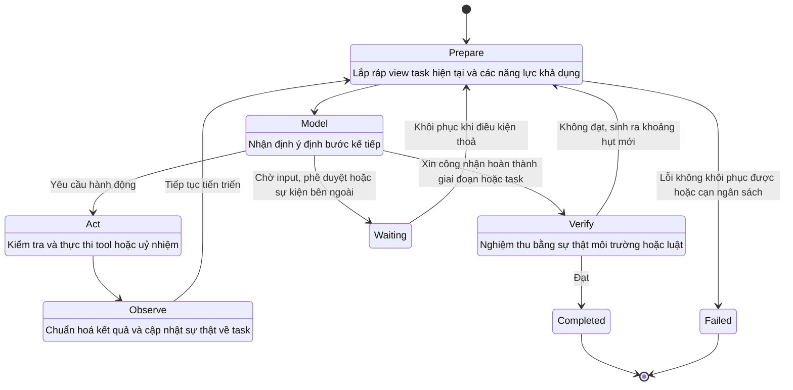
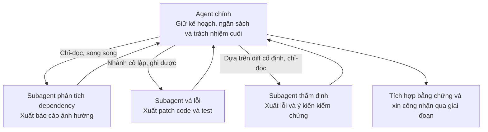
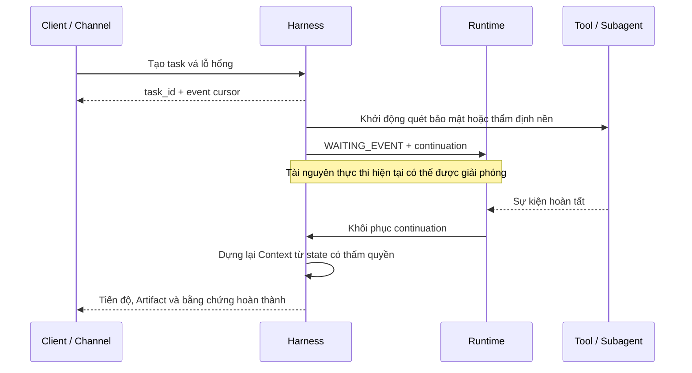
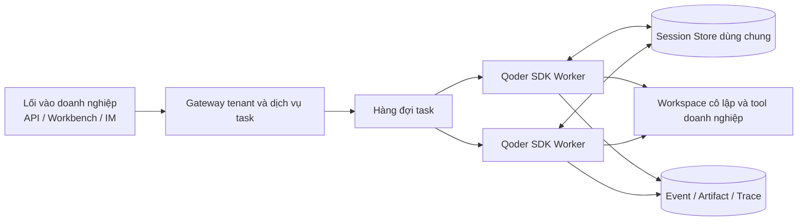

# Chương 4 — Task: điều phối, tiến trình dài và luân chuyển cộng tác

Chương trước đã bàn về các lối vào khác nhau khi doanh nghiệp xây Agent: tự xây Harness dựa trên Agent Framework high-code, tái sử dụng Harness đóng gói sản phẩm, dùng dịch vụ Managed Agents để bàn giao Agent, và xây nhanh Agent trên nền các năng lực dựng sẵn của sản phẩm cloud. Chương này đi tiếp xuống dưới theo trục "lối vào xây dựng", tập trung vào một vấn đề cụ thể hơn: **khi task không thể hoàn thành bằng một lần gọi model, Harness tổ chức những nhận định rời rạc của model thành một quá trình task tiến triển bền bỉ, gián đoạn rồi khôi phục được, kết thúc kiểm chứng được — ra sao.**

Một lần output của model chỉ là một nhận định rời rạc, trong khi việc giải một task cấp doanh nghiệp thường là một **quá trình liên tục**. Nó có thể cần hiểu môi trường trước, rồi lập kế hoạch, gọi liên tiếp nhiều tool, chờ phê duyệt trước những hành động then chốt, uỷ nhiệm một phần công việc cho sub-agent, trải qua thất bại và khôi phục, và cuối cùng còn phải dùng sự thật từ môi trường để chứng minh mục tiêu đã đạt. Trách nhiệm của **nhân lõi thực thi** trong Harness chính là tổ chức mỗi nhận định của model thành một quá trình task có state, kiểm soát được, khôi phục được.

Chương này tập trung vào hệ thống thực thi và orchestration của Harness: Agent Loop đẩy task tiến triển ra sao, Planning và Todo đưa mục tiêu ra bên ngoài thế nào, Subagent hình thành uỷ nhiệm có kiểm soát ra sao, task bất đồng bộ vượt qua ranh giới request, process và cửa sổ context thế nào, và làm sao đánh giá rằng Agent **thực sự hoàn thành** chứ không chỉ *dừng lại*. Việc tổ chức thông tin của Context, Memory và Workspace sẽ triển khai ở chương 5; còn tool, Sandbox, quyền hạn, Streaming, Trace và Evaluation là nội dung chính của chương 6.

Chương này dùng một case doanh nghiệp xuyên suốt. Case này vừa chứa thực thi tiến trình dài, vừa chứa uỷ nhiệm song song, chờ bất đồng bộ, con người can thiệp và kiểm chứng có tính xác định — đủ đại diện cho rất nhiều task kỹ thuật trong doanh nghiệp.

> **Agent vá lỗ hổng dịch vụ production và phát hành thay đổi:** sau khi nhận task về lỗ hổng phụ thuộc rủi ro cao trong dịch vụ thanh toán, Agent cần định vị code và instance đang chạy bị ảnh hưởng, lập phương án nâng cấp, phân bổ việc phân tích phụ thuộc, sửa code và thẩm định độc lập cho các bên thực thi khác nhau, sửa code và chạy test trong môi trường cô lập, sinh phiếu thay đổi; khi liên quan tới phát hành thì chờ người chịu trách nhiệm phê duyệt; cuối cùng dùng diff code, báo cáo test, kết quả quét bảo mật và trạng thái phát hành để kiểm chứng task đã hoàn thành hay chưa.

---

## 4.1 Agent Loop và state machine của task

### 4.1.1 Từ lời gọi model đến vòng lặp task

Agent Loop là phần nhân ổn định nhất của Harness. Nó không đòi hỏi model phải đưa ra câu trả lời hoàn chỉnh trong một lần, mà cho phép model lặp lại chu trình "nhận định — hành động — quan sát — nhận định tiếp" dựa trên mục tiêu hiện tại và phản hồi từ môi trường, cho tới khi task được kiểm chứng là hoàn thành, hoặc chuyển sang trạng thái chờ, thất bại hay bị huỷ.

Một Loop tối thiểu nhưng hoàn chỉnh có thể trừu tượng thành năm giai đoạn:



*   **Prepare** đọc state có thẩm quyền, xác định mục tiêu của lượt này, và yêu cầu Context Builder (chương 5) tạo input cho model.

*   **Model** gọi model; model nhận định bước kế tiếp là hành động, uỷ nhiệm, hỏi, chờ hay xin công nhận hoàn thành.

*   **Act** chuyển ý định của model cho Action Plane (chương 6), hoàn tất phần tham số, định danh, policy, phê duyệt và thực thi.

*   **Observe** chuyển kết quả từ tool, môi trường, subtask hoặc phản hồi người dùng thành Observation có cấu trúc, và cập nhật sự thật về task.

*   **Verify** **không** chấp nhận "tôi đã xong" làm căn cứ duy nhất, mà chạy bộ nghiệm thu tương ứng với task.

Duyệt file, chạy code, truy vấn hệ thống nghiệp vụ và điều phối Agent từ xa đều là những cách hiện thực khác nhau của Act; người dùng bổ sung yêu cầu, tool trả kết quả và task bất đồng bộ hoàn tất đều là những nguồn khác nhau của Observe. **Loop lõi giữ ổn định, còn năng lực cụ thể thì thêm vào qua các điểm mở rộng.**

### 4.1.2 Dẫn dắt task bằng state có thẩm quyền

Lịch sử message ghi lại những gì model và người dùng đã trao đổi, nhưng **không nên** trở thành nguồn duy nhất cho trạng thái task. Harness doanh nghiệp ít nhất phải duy trì một bản state có thẩm quyền, máy đọc được: mục tiêu, giai đoạn hiện tại, Plan và Todo, các sự thật đã xác nhận, các điểm chặn, subtask, Artifact, ngân sách còn lại, lý do đang chờ và căn cứ hoàn thành.

| State | Ngữ nghĩa | Bước kế tiếp được phép |
| --- | --- | --- |
| `CREATED` | Task đã được tạo nhưng chưa bắt đầu | Vào chạy hoặc huỷ |
| `RUNNING` | Đang chuẩn bị, suy luận hoặc hành động | Tiếp tục, tạm dừng, chờ, kiểm chứng, thất bại hoặc huỷ |
| `WAITING_INPUT` | Thiếu thông tin từ người dùng hoặc nghiệp vụ | Khôi phục sau khi nhận input, hoặc kết thúc do timeout |
| `WAITING_APPROVAL` | Hành động đã rõ nhưng cần phê duyệt | Phê duyệt, từ chối, sửa hoặc huỷ |
| `WAITING_EVENT` | Chờ tool, subtask hoặc hệ thống bên ngoài | Khôi phục khi nhận sự kiện, hoặc timeout theo policy |
| `PAUSED` | Người dùng hoặc hệ thống chủ động tạm dừng | Khôi phục, sửa quy tắc hoặc huỷ |
| `VERIFYING` | Đang kiểm chứng kết quả giai đoạn hoặc kết quả cuối | Đạt, sinh ra mục cần sửa, hoặc thất bại |
| `COMPLETED` | Điều kiện nghiệm thu đã thoả | Bàn giao kết quả và bằng chứng |
| `FAILED` | Không thể tiếp tục với chiến lược hiện tại | Mở lại thử lần nữa, chuyển người xử lý hoặc kết thúc |
| `CANCELLED` | Task bị chấm dứt tường minh | Dọn tài nguyên và giữ lại sự thật để audit |

`WAITING` không phải thất bại, `PAUSED` cũng không phải kết thúc. Chỉ khi những state này được làm tường minh thì Runtime ở tầng trên mới giải phóng được tài nguyên tính toán trong lúc chờ và khôi phục chính xác; giao diện tương tác mới nói được Agent đang chờ cái gì; hệ thống quan sát mới phân biệt được *thực thi chậm*, *phê duyệt chậm* và *tool chậm*.

Loop còn bắt buộc phải có **ranh giới chấm dứt từ bên ngoài**. Số bước, tổng thời lượng, token và chi phí, số lần gọi tool, số subtask chạy song song, số hành động rủi ro cao — tất cả đều nên đi vào ngân sách. Khi ngân sách gần chạm ngưỡng, Harness có thể yêu cầu model thu hẹp phạm vi, dừng uỷ nhiệm mới, ưu tiên hoàn tất phần bàn giao được, hoặc để người dùng chọn; khi ngân sách cạn, phải sinh ra một trạng thái cuối rõ ràng cùng danh sách việc chưa xong, **chứ không cắt ngang một cách lặng lẽ**.

### 4.1.3 Case: một task vá lỗ hổng tiến triển ra sao

Sau khi task vá lỗ hổng vào hệ thống, nó không nên chỉ sinh ra một chuỗi tin nhắn chat, mà phải hình thành một **đối tượng task được cập nhật liên tục**. Ví dụ, sau khi hoàn tất phân tích ảnh hưởng, state có thẩm quyền có thể biểu diễn như sau:

```yaml
task_id: remediation-2026-0917
goal: Vá CVE-XXXX trong payment-service và tạo thay đổi có thể phê duyệt
state: RUNNING
stage: implement_fix
facts:
  affected_module: payment-core
  current_version: 4.2.1
  target_version: 4.2.4
todos:
  - {id: t1, title: Xác nhận phạm vi ảnh hưởng, status: completed}
  - {id: t2, title: Sửa dependency và bổ sung test, status: in_progress}
  - {id: t3, title: Thẩm định độc lập thay đổi, status: pending}
artifacts:
  - impact-report.md
budgets:
  remaining_steps: 36
  remaining_minutes: 48

completion_evidence: [ ]


```

Thứ model nhìn thấy là **view task hiện tại được sinh ra từ bản state này**, chứ không phải buộc phải đoán tiến độ từ vài trăm message lịch sử. Khi quét bảo mật chưa pass, thì ngay cả khi model output "đã vá xong", state cũng chỉ được vào `VERIFYING`; chỉ khi bộ nghiệm thu bù đủ bằng chứng thì mới được chuyển sang `COMPLETED`.

---

## 4.2 Planning, Todo và mục tiêu theo giai đoạn

### 4.2.1 Biến kế hoạch thành một đối tượng kiểm soát bên ngoài

Giá trị của Planning không phải phô bày quá trình suy nghĩ ẩn của model, mà là **đưa cấu trúc task ra ngoài thành một đối tượng kiểm soát mà cả Harness lẫn người dùng đều đọc, sửa và kiểm chứng được**: cần đạt mục tiêu giai đoạn nào, có những phụ thuộc gì, bước nào đang chạy, và dùng bằng chứng nào để đánh giá hoàn thành.

Tuỳ độ phức tạp của task, Harness có thể dùng ba cách kiểm soát:

| Chế độ | Cách biểu diễn | Task phù hợp |
| --- | --- | --- |
| Todo nhẹ | Danh sách việc cần làm ngắn, có thứ tự | Mục tiêu rõ, ít bước, phản hồi nhanh |
| Plan Mode | Thăm dò chỉ-đọc, hình thành kế hoạch, xác nhận rồi mới thực thi | Diện ảnh hưởng lớn, cần thẩm định, môi trường chưa rõ |
| Planner–Executor | Planner duy trì giai đoạn và phụ thuộc, Executor thực thi từng mục | Task dài, nhiều phụ thuộc, chạy song song được hoặc cần vai trò chuyên môn |

**Kế hoạch bắt buộc phải cho phép sửa đổi.** Kết quả tool có thể lật ngược giả định, người dùng có thể đổi mục tiêu, và môi trường cũng có thể lộ ra ràng buộc mới. Mỗi lần lập lại kế hoạch đều phải nêu rõ sự thật đã kích hoạt việc đó và giữ lại các mục đã hoàn thành — **không được viết lại mục tiêu để che đi thất bại.** Còn Todo thì không cần ghi từng lời gọi tool nhỏ, chỉ ghi những việc làm thay đổi trạng thái bàn giao được của task, và giữ duy nhất một mục đang tiến hành hoặc một nhóm song song rõ ràng.

### 4.2.2 Ràng buộc việc thực thi bằng cổng kiểm soát theo giai đoạn

Task dài không nên đợi đến tận cuối mới kiểm chứng. Case vá lỗ hổng có thể chia thành năm giai đoạn:

| Giai đoạn | Sản phẩm chính | Cổng để vào giai đoạn kế tiếp |
| --- | --- | --- |
| Phân tích ảnh hưởng | Module bị ảnh hưởng, chuỗi phụ thuộc, danh sách instance đang chạy | Phạm vi ảnh hưởng truy nguyên được, sự thật về version đã được kiểm chứng |
| Lập kế hoạch vá | Phương án nâng cấp, rủi ro tương thích, phương án rollback | Kế hoạch được phê duyệt, quyền ghi được mở |
| Thực hiện thay đổi | Diff code, file khoá dependency, test bổ sung | Việc sửa chỉ xảy ra trong workspace đã được uỷ quyền |
| Kiểm chứng độc lập | Unit test, integration test, quét bảo mật, ý kiến thẩm định | Mọi kiểm tra bắt buộc đều pass, hoặc khoảng hụt được chấp nhận một cách tường minh |
| Chuẩn bị phát hành | Phiếu thay đổi, cửa sổ phát hành, đường rollback | Người chịu trách nhiệm phê duyệt; chương này **không** tự động phát hành lên production |

Cổng kiểm soát theo giai đoạn vừa giảm việc tiếp tục đổ công sức theo hướng sai, vừa tạo ra ranh giới ổn định cho việc nén Context, cho con người tiếp quản và cho việc nối tiếp xuyên cửa sổ. Một mô tả giai đoạn hiệu quả phải trả lời được *output là gì, bằng chứng nằm ở đâu, ai xác nhận* — chứ không chỉ viết chung chung kiểu "phân tích vấn đề", "xử lý code", "đảm bảo chất lượng".

### 4.2.3 Tách riêng thăm dò, lập kế hoạch và thực thi

Trong con đường Framework, đội ứng dụng có thể ghép thẳng năng lực lập kế hoạch vào Harness. Ví dụ AgentScope dưới đây bật Plan Mode và task list cho Agent vá lỗ hổng:

```java
HarnessAgent agent = HarnessAgent.builder()
    .name("remediation-agent")
    .model(model)
    .workspace(workspace)
    .enablePlanMode()
    .planFileDirectory("plans")
    .enableTaskList()
    .build();

```

Plan Mode chia quá trình thực thi thành "thăm dò chỉ-đọc → ghi kế hoạch → con người xác nhận → vào thực thi". Giai đoạn thăm dò chỉ mở các tool chỉ-đọc cùng các tool kế hoạch như `plan_enter`, `plan_write`, `plan_exit`, `todo_write`; `plan_exit` kích hoạt xác nhận của con người, và chỉ sau khi được duyệt mới vào giai đoạn được sửa workspace. Kế hoạch được ghi vào `plans/PLAN.md`, Todo lưu trong state của Agent — nên cả hai đều khôi phục được xuyên các lần gọi.

Cách hiện thực này cho thấy khác biệt giữa **Prompt và kiểm soát bằng Harness**: Prompt có thể yêu cầu model "lập kế hoạch trước rồi mới sửa", nhưng chỉ khi chế độ quyền hạn, whitelist tool, state bền vững và HITL cùng có hiệu lực, hệ thống mới thực sự có được ràng buộc "chưa duyệt kế hoạch thì không được ghi".

---

## 4.3 Subagent và uỷ nhiệm task

### 4.3.1 Khi nào việc uỷ nhiệm đáng làm

Giá trị của Subagent không phải là đóng gói một Agent thành nhiều vai, mà là giải quyết ba vấn đề cụ thể:

1.  **Cô lập context:** subtask chỉ nạp file, tool và lịch sử liên quan, tránh việc quá trình thăm dò chiếm hết cửa sổ của Agent chính.

2.  **Cô lập năng lực:** các subtask khác nhau dùng model, chỉ dẫn, Skill, tool và quyền hạn khác nhau.

3.  **Thực thi song song:** các việc truy hồi, hiện thực hoặc kiểm chứng không phụ thuộc nhau có thể tiến triển đồng thời, rút ngắn thời gian đồng hồ treo tường.

Khi task rất ngắn, các bước phụ thuộc nhau chặt chẽ, hoặc đối tượng dùng chung thay đổi thường xuyên, thì việc uỷ nhiệm lại làm tăng chi phí giao tiếp và hợp nhất. **Subagent chỉ có giá trị khi lợi ích từ cô lập, chuyên môn hoá hoặc song song vượt qua những chi phí đó.**

### 4.3.2 Thiết lập hợp đồng uỷ nhiệm rõ ràng

Agent chính chịu trách nhiệm về mục tiêu tổng thể, kế hoạch, ngân sách, phụ thuộc và kết quả cuối; **nó không được giao luôn cả trách nhiệm "task đã hoàn thành" cho bên khác.** Subagent nghiên cứu thì thu thập sự thật và phương án ứng viên; Subagent thực thi thì tạo ra thay đổi trong phạm vi giới hạn; Subagent thẩm định thì dùng một context tương đối độc lập để tìm khoảng hụt. Đây là **trách nhiệm ở runtime**, không nhất thiết là vai trò cố định vĩnh viễn.

Mỗi subtask đều nên mang theo một hợp đồng máy đọc được:

| Mục hợp đồng | Câu hỏi cần trả lời |
| --- | --- |
| Mục tiêu và ranh giới | Bàn giao cái gì; thư mục, hệ thống và hành động nào nằm trong phạm vi |
| Context đã biết | Sự thật nào đã xác nhận; quyết định nào không được tự ý thay đổi |
| Năng lực và quyền hạn | Model, Skill, Tool, môi trường và quyền hạn khả dụng là gì |
| Ngân sách | Thời gian, số bước, token, chi phí và mức song song tối đa là bao nhiêu |
| Output và bằng chứng | Kết quả dùng cấu trúc nào, bằng chứng và nguồn đính kèm ra sao |
| Ngữ nghĩa thất bại | Khi nào retry, trả kết quả một phần, leo thang hay chấm dứt |
| Điều kiện nghiệm thu | Agent cha dùng điều kiện gì để đánh giá kết quả dùng được |

**Delegation** là việc Agent cha **giữ lại trách nhiệm** và uỷ nhiệm ra ngoài một subtask có ranh giới; sau khi kết quả trả về, Agent cha vẫn là bên tích hợp và nghiệm thu. **Handoff** thì là việc quyền kiểm soát task **chuyển giao**: bên nhận trở thành người chịu trách nhiệm hiện tại, và nhận được mục tiêu, state cùng vị trí khôi phục cần thiết để đẩy task tiếp. Cả hai đều không thể hiện thực chỉ bằng một message ngôn ngữ tự nhiên; ít nhất phải có bản ghi về quan hệ task, state và sự thay đổi trách nhiệm.

### 4.3.3 Case: phân tích, sửa và thẩm định phối hợp ra sao



Việc phân tích và thăm dò codebase có thể chạy song song, nhưng việc sửa code phải dựa trên version mục tiêu đã được xác nhận; còn việc thẩm định bắt buộc phải đọc diff cố định và kết quả test, chứ không được chia sẻ những nhận định trung gian chưa commit với bên thực thi. Nếu nhiều bên thực thi cùng sửa một workspace, phải dùng nhánh cô lập, khoá ở mức đối tượng hoặc hợp nhất patch — **không thể trông cậy vào kiểu "mọi người cẩn thận đừng đụng nhau".**

AgentScope hỗ trợ khai báo sub-agent thành các đặc tả có version trong workspace. Ví dụ:

```markdown
---
description: Thẩm định độc lập patch vá lỗ hổng, kiểm tra tính tương thích, test và rủi ro rollback.
workspace:
  mode: isolated
steps: 8
tools: [read_file, grep_files]
---

Chỉ thẩm định phần diff đã sinh ra và bằng chứng test, không sửa code.
Xuất kết quả có cấu trúc theo ba nhóm: "vấn đề chặn", "vấn đề thường", "khoảng hụt bằng chứng".

```

Agent chính có thể gọi đồng bộ qua `agent_spawn`, cũng có thể đặt chạy nền và nhận về `task_id`. Sub-agent **mặc định không nên kế thừa toàn bộ context và quyền hạn của task cha**; việc task cha có quyền uỷ nhiệm không đồng nghĩa với việc sub-agent tự động có được mức uỷ quyền tương đương.

### 4.3.4 Hợp nhất kết quả và lan truyền thất bại

Task cha cần định nghĩa tường minh chính sách khi subtask thất bại: `FAIL_FAST` khi phân tích then chốt hỏng; `BEST_EFFORT` cho các thăm dò không then chốt; `RETRY_OR_REASSIGN` cho lỗi thoáng qua; và vào `ESCALATE` khi cần nghiệp vụ quyết định. Khi hợp nhất kết quả còn phải kiểm tra version input và thời điểm của bằng chứng, để tránh dùng kết luận rút ra từ code cũ hay trạng thái nghiệp vụ cũ.

**Sản phẩm của Subagent không phải một "câu trả lời" mà Agent chính có thể thuật lại thẳng, mà là một Observation mới.** Chỉ sau khi qua kiểm tra Schema, kiểm tra version và nghiệm thu của task cha, nó mới được đi vào state có thẩm quyền.

---

## 4.4 Task bất đồng bộ và tiến trình dài

### 4.4.1 Để task tồn tại độc lập với kết nối hiện tại

Task doanh nghiệp thường vượt quá vòng đời của một request HTTP, một process terminal hay một context model. Harness bắt buộc phải **tách định danh task khỏi kết nối hiện tại**: bên gọi sau khi gửi task sẽ nhận được một `task_id` ổn định, có thể tiêu thụ event liên tục, mà cũng có thể ngắt kết nối; khi task vào trạng thái chờ hoặc chạy nền, Runtime có thể giải phóng tài nguyên tính toán hiện tại; khi điều kiện thoả thì khôi phục từ state có thẩm quyền, chứ không dựa vào việc process gốc còn sống.



Task nền, sự kiện và việc khôi phục nên dùng chung một bộ hợp đồng: ID task ổn định, ID task cha, state hiện tại, người tạo và người thực thi, tham chiếu tới input và Artifact, số thứ tự event, ngữ nghĩa timeout – huỷ – idempotent, vị trí kết quả, phân loại lỗi, cùng phần Continuation cần cho việc khôi phục.

Trước khi tạm dừng, Harness nên ngừng tạo hành động mới, xử lý xong các thao tác gián đoạn được và lưu state mới nhất; khi khôi phục thì kiểm tra lại mục tiêu, điều kiện bên ngoài, tool đã thực sự chạy hay chưa, quyền hạn còn hiệu lực không, workspace có thay đổi không và ngân sách còn bao nhiêu. Việc huỷ cần lan truyền dọc theo quan hệ cha–con, nhưng **những tác dụng phụ bên ngoài đã xảy ra thì không thể giả vờ là không có** — phải giữ lại sự thật và thực hiện bù trừ khi cần.

Context Reset chỉ lo phần **ngữ nghĩa kiểm soát**: tạo ra một điểm nối nhất quán trước khi cửa sổ cũ kết thúc, và dựng lại view task hiện tại từ state có thẩm quyền trong cửa sổ mới. Continuation nên gồm mục tiêu, Plan hiện tại, các sự thật đã xác nhận, những lần thử thất bại, Artifact, các mục đang chờ, ngân sách còn lại và chế độ quyền hạn. Cách lưu trữ, nén và lắp ráp cụ thể của nó sẽ triển khai ở chương 5.

### 4.4.2 Nhúng một Harness đã chín vào dịch vụ doanh nghiệp

Coding Agent SDK phù hợp với những doanh nghiệp muốn tái sử dụng nhân thực thi đã chín, đồng thời giữ lại lối vào dịch vụ nghiệp vụ của mình. Ví dụ TypeScript dưới đây gửi task vá lỗ hổng qua Qoder Agent SDK, giới hạn tool khả dụng, và tiêu thụ message của model, lời gọi tool cùng kết quả cuối:

```ts
import { accessTokenFromEnv, query } from '@qoder-ai/qoder-agent-sdk';

for await (const message of query({
  prompt: 'Phân tích các lỗ hổng phụ thuộc rủi ro cao của payment-service, sửa code và bổ sung test; không được phát hành.',
  options: {
    auth: accessTokenFromEnv(),
    cwd: '/workspace/payment-service',
    allowedTools: ['Read', 'Write', 'Edit', 'Glob', 'Grep', 'Bash'],
    permissionMode: 'acceptEdits',
  },
})) {
  if (message.type === 'assistant') {
    for (const block of message.message.content) {
      if (block.type === 'text') publishText(block.text);
      if (block.type === 'tool_use') publishToolEvent(block.name);
    }
  }
  if (message.type === 'result') persistOutcome(message);
}

```

SDK cung cấp interface gọi và event ngay trong process ứng dụng, còn CLI Runtime ở tầng dưới lo việc lập kế hoạch, gọi model và thực thi tool. Dịch vụ doanh nghiệp vẫn phải bù ở vòng ngoài phần định danh tenant, hàng đợi task, index Session, lưu trữ Artifact, chính sách quyền hạn và nghiệm thu nghiệp vụ — **không thể đánh đồng một process SDK cục bộ với một dịch vụ online phân tán.**

Trong môi trường nhiều instance hoặc co giãn, Session nên được lưu vào kho dùng chung. Bên gọi ghi lại `session_id` trả về ở lần chạy đầu, các request sau khôi phục qua `resume`; instance nào cũng đọc được cùng một Session, thay vì phụ thuộc vào container ban đầu. Session Store bên ngoài giải quyết việc **nối tiếp phiên**; còn hàng đợi task, kiểm soát đồng thời và tính idempotent nghiệp vụ thì vẫn thuộc trách nhiệm của tầng dịch vụ doanh nghiệp.



### 4.4.3 Để nền tảng gánh task dài

Nếu doanh nghiệp không muốn tự bảo trì Agent Loop, việc nối tiếp Session và nền tảng thực thi, họ có thể chọn Qoder Cloud Agents. Qoder Cloud Agents lấy Agent, Environment, Session, Event làm các đối tượng cốt lõi: Agent cố định model và hành vi, Environment định nghĩa code và điều kiện chạy, Session gánh một task liên tục, Event lo input và output dạng stream. Phía ứng dụng lưu ánh xạ giữa task nghiệp vụ với Session, và tiêu thụ các event về trạng thái, tool và kết quả.

Con đường này giảm chi phí xây dựng nhân thực thi, nhưng **trách nhiệm nghiệp vụ thì không biến mất.** Doanh nghiệp vẫn phải định nghĩa ranh giới tool và dữ liệu, mục tiêu task, người phê duyệt, tiêu chí thành công và nghiệm thu cuối cùng. Chương 6 sẽ dùng chính case này để minh hoạ luồng event, phê duyệt và kết nối Sandbox của một Session managed.

---

## 4.5 Middleware và việc test nhân thực thi

### 4.5.1 Giữ cho Loop lõi ổn định

Một vấn đề tiến hoá thường gặp là: cứ thêm một năng lực nén, lập kế hoạch, quyền hạn, routing model hay quan sát thì lại thêm một nhóm nhánh điều kiện vào Loop. Ngắn hạn thì tiện, dài hạn sẽ khiến các chuyển trạng thái trở nên khó dự đoán. Cấu trúc vững hơn là **"nhân ổn định + năng lực cắm được"**: Loop lõi chỉ định nghĩa giai đoạn và chuyển trạng thái; còn Middleware, Hook hay Ability thì đọc Runtime Context ở những điểm vòng đời rõ ràng, rồi trả về quyết định cho qua, sửa, ngắt mạch hoặc thêm hành vi.

| Thời điểm mở rộng | Năng lực có thể thêm | Việc không nên làm |
| --- | --- | --- |
| Trước/sau khi tạo Task | Phân loại task, ngân sách khởi tạo, gắn version | Ngầm thay đổi mục tiêu của người dùng |
| Trước/sau Prepare | Nhắc kế hoạch, yêu cầu Context, routing model | Chỉ ghi state bền vững vào Prompt |
| Trước/sau khi gọi Model | Chính sách tham số, parse output, phát hiện không tiến triển | Ghi lại nội dung suy luận nhạy cảm lẽ ra không nên lưu |
| Trước/sau Action | Kiểm tra ngân sách, chuẩn hoá kết quả | Vòng qua Action Plane thống nhất ở chương 6 |
| Trước/sau khi State đổi | Kiểm tra state, Checkpoint, thông báo | Duy trì state có thẩm quyền ở nhiều nơi khác nhau |
| Trước/sau Verify | Chọn bộ nghiệm thu, sinh khoảng hụt, cổng chất lượng | Đánh dấu hoàn thành chỉ dựa trên lời tự thuật của model |

Bản thân phần mở rộng cũng cần có thứ tự, phạm vi đọc–ghi, quy tắc xung đột, ngữ nghĩa thất bại và khả năng quan sát. Tốt nhất là để phần mở rộng trả về một Decision hoặc Patch có cấu trúc, rồi Loop lõi commit một cách thống nhất, thay vì cho phép sửa tuỳ ý đối tượng dùng chung.

`HarnessAgent` của AgentScope dùng cách tổ hợp năng lực, chồng workspace, kho state, kế hoạch, Subagent, Memory, nén, Skill, Sandbox và Channel lên một runtime context thống nhất. Vì vậy con đường Framework có không gian tinh chỉnh nghiệp vụ lớn nhất — và cũng có nghĩa đội ứng dụng phải chịu trách nhiệm về việc tổ hợp năng lực, thứ tự vòng đời và hiệu quả cuối cùng.

### 4.5.2 Test hợp đồng cho phần có tính xác định

Test Harness không thể chỉ nhìn câu trả lời cuối. Nhân thực thi ít nhất cần bốn loại test có tính xác định:

*   **Test chuyển trạng thái:** mỗi state chỉ nhận các sự kiện hợp lệ; việc tạm dừng, huỷ và thất bại lan truyền đúng.

*   **Test thứ tự mở rộng:** Middleware chạy đúng thời điểm đã định, hành vi xung đột và ngắt mạch ổn định.

*   **Test khôi phục:** sau khi gián đoạn ở bất kỳ điểm an toàn nào, task dựng lại được và không lặp lại tác dụng phụ.

*   **Test ngân sách và ranh giới:** sau khi chạm ngưỡng số bước, thời gian, chi phí và rủi ro, Loop hội tụ đúng như thiết kế.

Ví dụ, test khôi phục của Agent vá lỗ hổng có thể ép gián đoạn ngay tại thời điểm "patch đã ghi nhưng kết quả test chưa trả về": sau khi khôi phục, nó phải **truy vấn task test ban đầu trước**, chứ không phải sửa file lần nữa hay khởi động lại việc phát hành. Output của model có thể thay bằng mẫu cố định, ghi–phát lại hoặc simulator, để kiểm chứng phần kiểm soát có tính xác định của Harness; còn hiệu quả đầu cuối với model thật thì thuộc phần Evaluation ở chương 6.

---

## 4.6 Độ tin cậy và kiểm chứng hoàn thành

### 4.6.1 Chọn chiến lược khôi phục theo loại thất bại

"Agent thất bại" không phải một chẩn đoán hành động được. Lỗi model hoặc mạng thoáng qua thì phù hợp với backoff có biên; lỗi tham số thì cần sửa; môi trường thiếu thì cần dựng lại; bị từ chối quyền thì nên chờ hoặc chấm dứt; thăm dò lặp lại thì cần lập kế hoạch lại; còn điều kiện nghiệp vụ chưa thoả thì phải nêu rõ khoảng hụt. **Retry mù quáng chỉ làm tăng chi phí và rủi ro.**

Các hành động có tác dụng phụ, trước khi retry, bắt buộc phải trả lời được câu hỏi "lần trước rốt cuộc nó đã xảy ra hay chưa". Với các thao tác như phát hành, gửi thông báo, ghi database, thì timeout có thể chỉ là mất phản hồi. Harness nên sinh khoá idempotent, ghi lại request cùng kết quả, và ưu tiên truy vấn trạng thái; **khi không chứng minh được là chưa thực thi thì không được lặp lại thẳng.** Các đường hạ cấp khi đổi model, tool hay môi trường cũng phải được ghi lại, vì năng lực, quyền hạn và chất lượng kết quả có thể đã thay đổi.

Phát hiện **không tiến triển** giúp phát hiện vấn đề sớm hơn so với việc chỉ đặt số bước tối đa. Các tín hiệu thường gặp gồm: gọi liên tiếp cùng một tool với tham số gần như y hệt, liên tục nhận cùng một lỗi, Plan không đổi trong thời gian dài, workspace không có sự thật mới, model quẩn quanh vài hành động. Sau khi phát hiện, có thể yêu cầu model lập lại kế hoạch dựa trên bằng chứng có cấu trúc trước, rồi dần dần thu hẹp task, đổi năng lực, tạo một bên thẩm định độc lập hoặc chuyển cho con người.

### 4.6.2 Để bằng chứng quyết định việc hoàn thành

**Model chỉ được đề nghị công nhận hoàn thành; chỉ Harness mới được commit trạng thái hoàn thành.** Cường độ kiểm chứng phải tương xứng với rủi ro:

| Mức | Cách kiểm chứng | Loại kết quả phù hợp |
| --- | --- | --- |
| Kiểm chứng cấu trúc | Schema, trường bắt buộc, định dạng và sự tồn tại của file | Sản phẩm có cấu trúc, rủi ro thấp |
| Kiểm chứng môi trường | Truy vấn hệ thống thật, kiểm tra diff file và kết quả thực thi | Task về tool và workspace |
| Kiểm chứng có tính xác định | Test, luật, kiểm tra tĩnh và kiểm tra nghiệp vụ | Điều kiện thành công mã hoá được |
| Kiểm chứng bằng model độc lập | Dùng một Context độc lập để kiểm tra chất lượng và chỗ bỏ sót | Phân tích mở và nội dung phức tạp |
| Nghiệm thu bởi con người | Người chịu trách nhiệm thẩm định, ký hoặc phê duyệt | Task tác động lớn, mang tính chủ quan hoặc liên quan tuân thủ |

Verifier nên trả về khoảng hụt có cấu trúc, bằng chứng thất bại và mức độ sửa được. **Kiểm chứng thất bại không phải là kết thúc, mà là một Observation mới:** Harness quyết định tiếp tục sửa, lập lại kế hoạch, chuyển giao hay thất bại. Verifier là cổng hoàn thành cho **một lần task**; còn việc đánh giá xuyên version rằng một Harness có tốt hơn hay không thì thuộc về Evaluation Harness ở chương 6.

### 4.6.3 Case: thế nào mới là vá lỗ hổng xong

Với case xuyên suốt, những sự thật sau phải đồng thời thành lập:

1.  Danh mục dependency chứng minh version bị ảnh hưởng đã được thay thế, và không bị kéo ngược vào qua phụ thuộc bắc cầu.

2.  Diff code chỉ nằm trong thư mục đã được uỷ quyền, và thay đổi khớp với kế hoạch đã được duyệt.

3.  Unit test, integration test và quét bảo mật đều có báo cáo địa chỉ hoá được, mọi mục bắt buộc đều pass.

4.  Thẩm định độc lập không còn vấn đề chặn nào chưa đóng.

5.  Phiếu thay đổi gồm phạm vi ảnh hưởng, phương án rollback và tham chiếu bằng chứng.

6.  Nếu mục tiêu chỉ dừng ở "tạo ra thay đổi có thể phê duyệt", hệ thống **không được** phán nhầm "chưa phát hành" thành "chưa hoàn thành"; còn nếu mục tiêu bao gồm cả phát hành, thì phải kiểm chứng thêm phần phê duyệt và trạng thái triển khai thật.

Vì vậy, kết quả cuối cùng không phải một câu "đã xong", mà là một **tập sự thật gắn với mục tiêu**:

```yaml
state: COMPLETED
outcome: change_ready_for_approval
evidence:
  dependency_check: artifacts/dependency-tree.json
  code_diff: artifacts/remediation.patch
  unit_tests: artifacts/unit-test.xml
  integration_tests: artifacts/integration-test.xml
  security_scan: artifacts/security-scan.sarif
  review: artifacts/review.json
  change_request: CR-18427
remaining_actions:
  - Người phụ trách dịch vụ phê duyệt và sắp xếp cửa sổ phát hành

```

Cấu trúc này có thể chuyển thẳng sang các bối cảnh khác: rà soát hợp đồng thì lấy độ phủ điều khoản, nguồn và chữ ký người chịu trách nhiệm làm bằng chứng; sửa dữ liệu thì lấy số dòng bị ảnh hưởng, kiểm tra mẫu và điểm rollback làm bằng chứng; ticket khách hàng thì lấy trạng thái hệ thống, bản ghi trao đổi và xác nhận của người dùng làm bằng chứng. **Thứ thay đổi là Verifier; thứ giữ nguyên là nguyên tắc "model đề nghị hoàn thành, Harness commit hoàn thành dựa trên sự thật".**

### 4.6.4 Tăng tốc hạ tầng quan sát, đánh giá và hoàn tất việc kiểm chứng Agent

Sản phẩm Agent trên cloud có thể cung cấp tín hiệu vận hành thống nhất cho việc kiểm chứng task dài, nhưng **không nên thay thế ngữ nghĩa hoàn thành nghiệp vụ.** Lấy Alibaba Cloud AgentCore làm ví dụ: phần tổng quan sản phẩm cho biết nó hỗ trợ quản lý Agent trong một nền tảng thống nhất, kết nối model, Skill và tool MCP, và quản lý credential cần thiết để truy cập hệ thống bên ngoài. Nền tảng còn cung cấp năng lực giám sát vận hành, Trace và đánh giá, đồng thời quản lý thống nhất các Agent từ những nguồn khác nhau, giúp doanh nghiệp quan sát quá trình thực thi và tín hiệu chất lượng trên cùng một mặt phẳng điều khiển.

Khi tích hợp AgentCore, doanh nghiệp vẫn phải để cơ chế quản lý Task nghiệp vụ duy trì định danh Task, version state, khoá idempotent, điều kiện phê duyệt và tham chiếu Artifact, rồi ánh xạ Agent cùng dữ liệu quan sát được của AgentCore sang hợp đồng task. Sau đó, một Verifier được uỷ quyền mới kết hợp test có tính xác định, trạng thái hệ thống nghiệp vụ thật và uỷ quyền của con người để đánh giá Outcome. Việc nền tảng quản lý thống nhất nhiều Agent **không có nghĩa** những Agent đó tự nhiên chia sẻ cùng ngữ nghĩa task cha–con hay cùng tiêu chí hoàn thành. Doanh nghiệp có thể tái sử dụng các năng lực sẵn có của AgentCore về lắp ráp tài nguyên, quan sát vận hành và đánh giá để giảm việc xây trùng; nhưng **trách nhiệm hoàn thành về mặt nghiệp vụ vẫn do ứng dụng doanh nghiệp định nghĩa và đảm nhiệm.**

---

## 4.7 Tóm tắt chương

Nhân thực thi của Harness tổ chức những nhận định rời rạc của model thành một quá trình task đáng tin cậy. Một Agent Loop ổn định đẩy task tiến triển theo Prepare, Model, Act, Observe, Verify; state tường minh cùng ngân sách đa chiều tạo ra ranh giới có tính xác định; Planning, Todo và cổng kiểm soát theo giai đoạn đưa việc kiểm soát task ra bên ngoài; Subagent hiện thực uỷ nhiệm có kiểm soát thông qua cô lập context, năng lực và trách nhiệm; task bất đồng bộ, Continuation và Session dùng chung giúp task vượt qua ranh giới kết nối, process và cửa sổ context; còn Middleware thì cho phép các năng lực tổ hợp và tiến hoá mà không phải viết lại Loop lõi.
