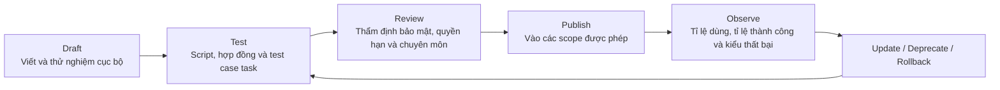

# Chương 5 - Thông tin: context, state và tài sản năng lực tái sử dụng

Mỗi lần một task tiến trình dài nhích thêm một lượt, Harness theo nghĩa rộng đều phải trả lời lại một câu hỏi tưởng chừng đơn giản nhưng thực ra quyết định chất lượng thực thi: **ngay lúc này model nên nhìn thấy gì.** Nhét toàn bộ hội thoại, tất cả file, mọi mô tả tool và kinh nghiệm dài hạn vào cùng một cửa sổ model không chỉ làm tăng chi phí và độ trễ, mà còn khiến những ràng buộc then chốt bị chìm lấp dưới thông tin trùng lặp và nội dung độ tin cậy thấp. Nhưng nếu chỉ giữ vài lượt tương tác gần nhất, ta lại đánh mất việc mục tiêu đã đổi, những sự thật đã xác nhận, tác dụng phụ bên ngoài, khoảng hụt nghiệm thu và vị trí khôi phục. Cửa sổ model thì hữu hạn, trong khi thế giới của task cứ phình ra - giữa hai thứ đó bắt buộc phải có một **cơ chế tổ chức thông tin độc lập**.

Vì vậy, Harness cần một hệ thống context và state riêng. Nó không phải việc nhồi thêm chữ cho model, mà là liên tục hoàn thành bốn việc: biên dịch thông tin đa nguồn thành Context của lượt này ra sao; nén và offload phần lịch sử không ngừng lớn lên thế nào; lưu sự thật về task ở ngoài cửa sổ model ra sao; và cung cấp Memory dài hạn, Knowledge doanh nghiệp cùng Skill tái sử dụng được cho model theo nhu cầu, dưới đúng quyền hạn, thế nào.

Chương này có ranh giới rõ với chương trước: **chương 4 định nghĩa task luân chuyển ra sao, chương này định nghĩa thông tin và trạng thái trong quá trình task được biểu diễn, lưu trữ và đi vào model ra sao.** Database vật lý, index, object storage và khôi phục xuyên bản sao sẽ triển khai ở phần "Vận hành"; chương này tập trung vào mô hình logic, pipeline dựng context và hợp đồng tài sản mà Harness dựa vào.

Chương này tiếp tục dùng case xuyên suốt "Agent vá lỗ hổng dịch vụ production và phát hành thay đổi". Khi vào chương này, thứ ta quan tâm không còn là task tiến triển ra sao, mà là **ở mỗi bước Agent nên nhìn thấy gì**: thông báo lỗ hổng ban đầu, quy tắc dự án, version dependency hiện tại và kế hoạch đi vào Context ra sao; log dài và báo cáo test rời khỏi cửa sổ model nhưng vẫn truy vấn được thế nào; kế hoạch, patch và bằng chứng lưu trong Workspace ra sao; và một lần vá thành công tích tụ thành Memory cùng Skill mà các task sau khám phá được nhưng không bị dùng sai - bằng cách nào.

---

## 5.1 Pipeline dựng Context

### Biên dịch động System Context

System Prompt của một Agent cấp production không nên chỉ là một chuỗi dài nằm trong repo. Phần System Context mà model thực sự nhận được ở mỗi lượt cần được sinh ra động theo version Agent, giai đoạn task hiện tại, định danh người dùng, quy tắc workspace, ngân sách còn lại, tool khả dụng và Skill đã chọn. Vai trò của nó gần với một lần **"biên dịch"**: nhiều nguồn được gộp theo độ ưu tiên, xung đột được xử lý, phần vượt ngân sách bị nén hoặc loại bỏ, và cuối cùng ta có view model thực thi được cho lượt này.

```text
System Context
├── Platform Policy        Ranh giới an toàn nền tảng, luật không được ghi đè
├── Agent Contract         Vai trò, mục tiêu, ranh giới năng lực và yêu cầu output
├── Tenant / Project Rule  Quy chế tenant, thoả thuận dự án và quy tắc workspace
├── Runtime Reminder       Giai đoạn hiện tại, ngân sách, mục đang chờ và chế độ thao tác
├── Selected Skill         Phương pháp, script và tài liệu tham chiếu cần cho lượt này
└── Tool Descriptors       Năng lực và Schema tham số được tiết lộ ở lượt này

Task Context
├── User Goal / Steering   Mục tiêu gốc và chỉnh hướng mới nhất
├── Plan / Todo            Giai đoạn hiện tại và các việc chưa giải quyết
├── Recent Interaction     Message và Observation gần nhất
├── Compacted History      Tóm tắt có cấu trúc của quá trình trước đó
├── Retrieved Memory       Kinh nghiệm lịch sử liên quan tới task hiện tại
├── Retrieved Knowledge    Sự thật doanh nghiệp kèm nguồn, quyền và tính cập nhật
└── Workspace References   Tham chiếu tới file, Artifact và kết quả lớn

```

Cách phân tầng này giải quyết vấn đề **trách nhiệm**. Policy nền tảng không được tài liệu dự án ghi đè; yêu cầu mới nhất của người dùng có thể đổi hướng task, nhưng không được phá ranh giới an toàn doanh nghiệp; sở thích lịch sử trong Memory không thay thế được sự thật nghiệp vụ hiện tại; và nội dung bên ngoài do tool trả về cũng không được tự động nâng cấp thành chỉ dẫn hệ thống. Nếu mọi thứ bị nối vào cùng một khối văn bản phẳng, Harness sẽ rất khó đánh giá xung đột đến từ đâu, và càng không thể gắn version cùng chạy hồi quy một cách độc lập.

### Luồng xử lý của Context Builder

Trước mỗi lần gọi model, Context Builder chạy một pipeline có tính xác định:

```mermaid
flowchart LR
    S[Đọc Task State<br/>Mục tiêu, giai đoạn, ngân sách] --> I[Phân giải định danh và scope]
    I --> C[Thu thập Context ứng viên<br/>Quy tắc, lịch sử, state, tài sản]
    C --> F[Lọc theo quyền và độ tin cậy]
    F --> R[Xếp hạng theo mức liên quan và loại bỏ trùng lặp]
    R --> B[Phân bổ ngân sách token]
    B --> M[Nén, cắt bớt và chuyển thành tham chiếu]
    M --> P[Biên dịch input cho model theo phân tầng]
    P --> L[Sinh Context Manifest]

```



Thông tin ứng viên ít nhất đến từ cấu hình Agent, Task State, Session, Workspace, Memory, Knowledge, Skill Registry và Tool Registry. Pipeline phải **lọc định danh và quyền hạn trước**, rồi mới xếp hạng theo mức liên quan - không được vì tiện cho việc xếp hạng mà đưa nội dung xuyên tenant cho bộ truy hồi hay cho model trước. Với nội dung bên ngoài, còn phải giữ lại nguồn và mức tin cậy, tránh việc tài liệu hay trang web truy hồi được nguỵ trang văn bản của chính nó thành chỉ dẫn ưu tiên cao.

### Độ ưu tiên và ngân sách token

Việc dựng Context không thể chỉ xếp theo độ tương đồng. Một hàm ưu tiên thực dụng thường cân nhắc đồng thời:

*   **Cường độ ràng buộc:** policy nền tảng và quy tắc nghiệp vụ tường minh cao hơn các gợi ý mang tính kinh nghiệm.

*   **Mức liên quan tới task:** có ảnh hưởng trực tiếp tới nhận định và hành động của giai đoạn hiện tại hay không.

*   **Hiệu lực theo thời gian:** sự thật môi trường hiện tại cao hơn kết luận lịch sử đã hết hạn.

*   **Độ tin cậy của nguồn:** sự thật từ hệ thống có thẩm quyền cao hơn bản tóm tắt chưa xác nhận của model.

*   **Phụ thuộc thực thi:** mô tả tool sắp gọi và điều kiện nghiệm thu nên được giữ lại ưu tiên.

*   **Lượng thông tin gia tăng:** nội dung trùng với phần đã chọn thì nên gộp hoặc bỏ.

*   **Chi phí token:** cùng giá trị thì ưu tiên cách diễn đạt gọn hơn, tham chiếu được.

Harness có thể chia cửa sổ khả dụng thành nhiều vùng ngân sách: ví dụ giữ một mức sàn cố định cho các luật không được ghi đè, mục tiêu hiện tại và state; cấp hạn mức động cho tương tác gần nhất, tri thức truy hồi, Skill và Schema tool; và chừa chỗ cho output của model cùng Observation kế tiếp. **Ngân sách không phải một tỉ lệ phần trăm tĩnh:** khi task vào giai đoạn dùng nhiều tool thì trọng số của định nghĩa tool và trạng thái môi trường tăng lên; khi vào giai đoạn tổng hợp cuối thì bằng chứng và điều kiện nghiệm thu quan trọng hơn.

### Quản lý input của model bằng Context Policy và Manifest

Mỗi lần gọi model đều nên sinh ra một **Context Manifest**, ghi lại model rốt cuộc đã nhìn thấy gì - chứ không chỉ lưu đoạn text đã nối cuối cùng. Manifest ít nhất gồm:

| Trường | Diễn giải |
| --- | --- |
| `source_type` / `source_id` | Loại nguồn và định danh ổn định |
| `scope` | Global, Tenant, Project, User, Session hay Task |
| `version` | Version của chỉ dẫn, tài liệu, Skill, Tool Schema hoặc bản tóm tắt |
| `trust_level` | Mức tin cậy: policy nền tảng, sự thật doanh nghiệp, input người dùng, nội dung bên ngoài… |
| `permission_basis` | Vì sao lượt này có quyền đọc nội dung đó |
| `selected_reason` | Trúng luật, giai đoạn hiện tại, liên quan qua truy hồi, hay được tham chiếu tường minh |
| `token_count` | Kích thước cửa sổ thực sự chiếm dụng |
| `transform` | Nguyên văn, tóm tắt, cắt bớt, loại bỏ trùng lặp hay chuyển thành tham chiếu |
| `content_hash` | Digest nội dung, phục vụ phát lại và phát hiện thay đổi |

Manifest tạo nền cho ba việc: khi phát triển thì giải thích vì sao model bỏ sót một thông tin nào đó; khi đánh giá thì so sánh khác biệt Context giữa hai version Agent; khi audit bảo mật thì xác nhận vì sao một nội dung nhạy cảm nào đó đã đi vào input của model. **Chỉ ghi lại text của Prompt thì không làm ổn định được những việc này**, vì cùng một đoạn văn bản có thể có nguồn, quyền và version hoàn toàn khác nhau.

Doanh nghiệp nên định nghĩa thống nhất phần phân tầng context, phạm vi truy hồi, phân bổ ngân sách, ngưỡng nén, việc tiết lộ tool và cách xử lý nội dung nhạy cảm thành một **Context Policy**, rồi gắn nó với một version Agent chạy được. Khi model, Prompt, Skill hay index Knowledge thay đổi, Context Policy vẫn quyết định chúng được tổ hợp ra sao. Có như vậy ta mới biến việc "tình cờ nhìn thấy gì đó trong một lần gọi" thành **hành vi kỹ thuật test được và phát lại được.**

Ở giai đoạn "thực hiện thay đổi" của task vá lỗ hổng, một Manifest rút gọn có thể trông như sau:

```yaml
model_call_id: call-083
context_policy: remediation-context@2.3
sources:
  - {type: platform_policy, id: prod-change-policy, version: 7, tokens: 620}
  - {type: agent_instruction, id: remediation-agent, version: 12, tokens: 480}
  - {type: task_state, id: remediation-2026-0917, version: 19, tokens: 910}
  - {type: workspace_rule, id: payment-service/AGENTS.md, version: a83c1e, tokens: 740}
  - {type: skill, id: dependency-remediation, version: 3.1, tokens: 530}
  - {type: artifact_ref, id: impact-report.md, transform: summary, tokens: 360}
omitted:
  - {id: raw-security-scan.sarif, reason: artifact_reference_only}
  - {id: unrelated-user-memory, reason: scope_mismatch}

```

Manifest này không lưu bản thân nội dung nhạy cảm, nhưng trả lời được lượt này đã dùng version nào, vì sao chọn, biến đổi ra sao và vì sao loại bỏ. Khi có lỗi, đội ngũ có thể kiểm tra trước xem "model có nhìn thấy đúng tài liệu không", rồi mới nhận định vấn đề nằm ở suy luận của model hay ở việc thực thi tool.

---

## 5.2 Vòng đời Context và việc nén

Khi task tiến triển, message, kết quả tool và nội dung file sẽ phình ra liên tục. Đặt trọn lịch sử vào cửa sổ mãi mãi sẽ đồng thời gây ra chi phí, độ trễ và sự suy giảm chú ý; còn cắt cụt phần sớm nhất một cách đơn giản thì dễ đánh mất mục tiêu ban đầu và các quyết định then chốt. Harness nên lưu lịch sử gốc trong state bên ngoài, và dựng theo giai đoạn hiện tại một:

```text
Active Context
├── Stable goal and constraints  Ổn định dài hạn, không được bỏ sót
├── Current task state           Giai đoạn hiện tại, Plan, Todo, ngân sách và điểm chặn
├── Recent verbatim turns        Tương tác gần nhất cần hiểu chính xác
├── Structured history summary   Biểu diễn nén của quá trình trước đó
├── Retrieved facts              Memory / Knowledge liên quan tới lượt này
└── Artifact references          Nội dung bên ngoài có thể đọc tiếp theo nhu cầu

```

Chữ "gần nhất" không chỉ định nghĩa theo thời gian. Việc người dùng sửa mục tiêu mới nhất, lỗi tool chưa giải quyết, hành động đang chờ phê duyệt và bằng chứng nghiệm thu thất bại - dù phát sinh sớm hơn - vẫn nên được coi là **trạng thái hoạt động**; còn những quá trình thăm dò đã hoàn tất và chứng minh được bằng Artifact thì có thể rời khỏi cửa sổ hoạt động.

### Commit, Compact, Rebuild và Validate

Nén hội thoại không phải là tóm tắt thông thường. Nó phải hỗ trợ việc tiếp tục thực thi ở lượt sau, nên ít nhất phải giữ lại:

*   Mục tiêu gốc, tiêu chí thành công và các ràng buộc bất biến;

*   Các sự thật đã xác nhận cùng nguồn của chúng, phân biệt rõ **sự thật, giả định và gợi ý của model**;

*   Các quyết định đã ra, lý do và những phương án đã bị loại;

*   Các hành động đã thực thi, kết quả tool và tác dụng phụ;

*   Plan, Todo, điểm chặn và bước kế tiếp hiện tại;

*   Artifact, đường dẫn workspace và ID đối tượng bên ngoài;

*   Sở thích người dùng, kết quả phê duyệt và chế độ quyền hạn;

*   Những lần thử thất bại cùng lý do để tránh lặp lại.

Bản tóm tắt nên dùng Schema có cấu trúc, mang theo phạm vi sự kiện đã phủ, version tạo ra và tham chiếu nguồn. Các sự thật rủi ro cao **không được** để model tự do khái quát; tốt nhất là trích xuất một cách xác định từ Task State, kết quả tool và bản ghi phê duyệt, rồi mới để model nén phần nội dung mang tính tường thuật.

Một lần truy vấn log, cào web, tìm kiếm code hay phân tích dữ liệu có thể trả về hàng vạn dòng. **Kết quả lớn không nên lặp lại trong Context mỗi lượt.** Harness có thể ghi kết quả gốc vào Workspace hoặc Artifact Store, chỉ giữ lại bản tóm tắt kết quả, phần đầu–cuối hoặc đoạn then chốt, loại nội dung, kích thước, tool đã sinh ra nó, phạm vi quyền và một tham chiếu để đọc tiếp.

Khi model cần chi tiết, nó lấy lại theo nhu cầu qua tool tìm kiếm, đọc theo khoảng hoặc phân trang. Tham chiếu bắt buộc phải ổn định và được bảo vệ bằng quyền; nếu chỉ đưa ra một URL tạm, thì khi khôi phục task nó có thể đã hết hạn. Nếu kết quả thay đổi theo thời gian, còn phải ghi lại version, thời điểm hoặc định danh snapshot lúc đọc, để về sau không trộn lẫn nội dung mới với suy luận cũ.

**Mọi sự thật có ảnh hưởng tới hành động về sau đều phải đi vào state có thẩm quyền trước, rồi mới được phép rời khỏi active context.** Điển hình gồm: phê duyệt, kết quả commit của tool, trạng thái Plan, Artifact, ID đối tượng bên ngoài, mức tiêu hao ngân sách và thay đổi của người dùng. Nếu không, chỉ một bản tóm tắt thiếu chính xác cũng có thể làm thay đổi trạng thái thật của task.

Vòng đời đầy đủ có thể quy thành bốn bước:

1.  **Commit:** đưa các sự thật có cấu trúc vào Task State, Workspace hoặc kho tài sản tương ứng.

2.  **Compact:** chuyển phần lịch sử tường thuật được thành bản tóm tắt, kèm nguồn và phạm vi phủ.

3.  **Rebuild:** dùng bản tóm tắt mới, state hiện tại và message gần nhất để dựng lại Context, đồng thời kiểm tra xem các ràng buộc then chốt còn nguyên không.

4.  **Validate:** kiểm tra tính toàn vẹn của mục tiêu, các mục chưa giải quyết, chế độ quyền hạn và bằng chứng then chốt, rồi dùng các test case nối tiếp để xác minh hành vi không trôi dạt rõ rệt.

Khi nén nhiều lần vẫn không đủ để duy trì một cửa sổ hữu dụng, hoặc task bước vào một giai đoạn lớn mới, ta có thể thực hiện **Context Reset**. Tiền đề của Reset là Continuation (như chương 4 mô tả) đã hình thành một điểm nối nhất quán. Chương này lo việc biểu đạt nó thành một gói thông tin nạp lại được:

```text
Continuation Package
├── Goal & Acceptance Criteria
├── Current Plan / Todo / Blockers
├── Structured Facts & Decisions
├── Workspace / Artifact Manifest
├── Active Async Tasks & Approvals
├── Relevant Memory / Knowledge References
├── Permission & Budget Snapshot
└── Next-step Brief

```

Cửa sổ mới không cần phát lại toàn bộ hội thoại, mà dựng lại từ Continuation Package, Task State có thẩm quyền và môi trường hiện tại. **Bàn giao qua file đặc biệt phù hợp với Agent workspace:** kế hoạch, tiến độ, phát hiện và kết quả test có thể được cả người lẫn Agent cùng kiểm tra, và cũng không biến mất chỉ vì một context model kết thúc.

Chất lượng nén không thể chỉ nhìn số token tiết kiệm được. Ít nhất phải đo đồng thời:

*   **Tỉ lệ giữ sự thật:** các sự thật, ràng buộc và quyết định then chốt có được giữ đầy đủ không.

*   **Tỉ lệ tiếp tục thành công:** sau khi nén hoặc Reset, có tiếp tục được mà không phải thăm dò lại nhiều không.

*   **Tỉ lệ mâu thuẫn:** bản tóm tắt có xung đột với sự thật từ tool, Task State hay chỉ dẫn mới nhất không.

*   **Tỉ lệ tham chiếu còn dùng được:** Artifact bên ngoài và tham chiếu phân trang còn truy cập được không.

*   **Cân đối chi phí–lợi ích:** cân bằng giữa số token giảm được với chi phí gọi nén thêm và số lượt đọc phát sinh.

Bộ nén, Schema tóm tắt và các ngưỡng đều nên được gắn version và đưa vào phạm vi hồi quy của version Agent.

### AgentScope: cho kết quả lớn rời khỏi cửa sổ mà không rời khỏi task

Trong con đường Framework, đội ứng dụng có thể định nghĩa ngưỡng nén và phần đuôi giữ lại theo bối cảnh, đồng thời offload các kết quả tool quá lớn ra Workspace. Cấu hình AgentScope dưới đây có nghĩa: khi lịch sử đạt 30 message thì nén, giữ lại 10 message gần nhất; các kết quả tool quá lớn không nhúng tiếp mà ghi ra file bên ngoài và để lại một tham chiếu trong Context.

```java
HarnessAgent agent = HarnessAgent.builder()
    .name("remediation-agent")
    .model(model)
    .workspace(workspace)
    .compaction(CompactionConfig.builder()
        .triggerMessages(30)
        .keepMessages(10)
        .build())
    .toolResultEviction(ToolResultEvictionConfig.defaults())
    .build();

```

Trong case vá lỗ hổng, kết quả quét bảo mật đầy đủ có thể lưu thành `evidence/security-scan.sarif`, còn Context hoạt động chỉ giữ số lượng lỗ hổng, tóm tắt các mục chặn và tham chiếu file. Khi Agent cần xem một lỗ hổng cụ thể, nó đọc Artifact gốc theo khoảng. Thứ tiết kiệm được ở đây không phải một lần độ dài input, mà là **mọi lượt về sau đều không còn phải mang theo cùng một khối kết quả lớn ấy nữa.**

---

## 5.3 Session, Task State và Workspace

### Phân biệt Call, Session và Task

Ba ranh giới này hay bị gộp thành "phiên", nhưng chúng giải quyết những vấn đề khác nhau:

| Đối tượng | Định nghĩa | Vòng đời | Nội dung điển hình |
| --- | --- | --- | --- |
| Call | Một request hoặc hành động khôi phục của ứng dụng tới Agent | Giây đến phút | Request ID, định danh hiện tại, credential tạm, input và con trỏ trả về |
| Session | Ranh giới tương tác liên tục giữa một người dùng hoặc bên gọi với Agent | Phút đến vài ngày | Người tham gia, Channel, message, sở thích và các task nhìn thấy được |
| Task | Đối tượng thực thi tồn tại liên tục xoay quanh một mục tiêu nghiệm thu được | Có thể xuyên Call, Session, process và node | Mục tiêu, state, kế hoạch, subtask, ngân sách, Artifact và bằng chứng hoàn thành |

Một Session có thể khởi phát nhiều Task; một Task dài cũng có thể được xem, can thiệp và khôi phục trong nhiều Session. **Gắn Task ID làm ID của luồng message sẽ giới hạn việc chạy nền, cộng tác nhiều người và nối tiếp xuyên kênh.** Harness nên giữ riêng hai thứ, và ghi lại quan hệ liên kết một cách tường minh.

### Dùng sự thật về state để hỗ trợ khôi phục

Trạng thái task có thể biểu diễn bằng ba cách bổ trợ cho nhau:

*   **Event Log** ghi lại *đã xảy ra chuyện gì*, phù hợp để truy vết nhân quả, audit và dựng lại.

*   **Snapshot** ghi lại trạng thái tổng hợp ở một thời điểm, phù hợp để đọc nhanh view hiện tại.

*   **Checkpoint** biểu thị vị trí có thể khôi phục thực thi một cách an toàn; ngoài Snapshot, nó còn phải chứa Continuation, tính idempotent và các phụ thuộc môi trường.

Ba thứ **không thay thế cho nhau**. Chỉ có Event Log thì chi phí khôi phục tăng theo độ dài task; chỉ có Snapshot thì không giải thích được state hình thành ra sao; còn gọi mọi lần lưu state là Checkpoint thì sẽ che mất sự thật rằng một số transaction của tool vẫn đang chạy và không phát lại an toàn được.

Harness nên định nghĩa Schema của state, quy tắc gộp từ event sang state, version cho concurrency lạc quan và ngữ nghĩa điểm an toàn; còn phần "Vận hành" mới quyết định những đối tượng đó nằm ở database, hệ thống log, object storage hay backend nào khác.

Harness cũng nên lập trình hướng tới một **interface state logic**, thay vì buộc năng lực khôi phục vào bộ nhớ cục bộ hay một database cụ thể:

*   `append_event`: append một event có version và quan hệ nhân quả;

*   `load_task_state` / `commit_task_patch`: đọc và commit state có thẩm quyền;

*   `save_snapshot` / `load_snapshot`: lưu và đọc view tổng hợp;

*   `put_artifact` / `get_artifact`: lưu và lấy đối tượng kèm metadata;

*   `create_checkpoint` / `resume_checkpoint`: lưu và khôi phục tại điểm an toàn;

*   `search_workspace` / `read_range`: cung cấp truy cập theo nhu cầu cho Context Builder.

Agent cục bộ có thể ánh xạ các interface này sang file và state trong process; còn Agent online phân tán thì ánh xạ sang dịch vụ state bên ngoài. Chỉ cần ngữ nghĩa logic nhất quán, con đường Framework, SDK và managed đều có thể kết nối vào cùng một nền tảng state của doanh nghiệp.

### Mô hình bộ nhớ làm việc bên ngoài của Workspace

Workspace cung cấp cho Agent một không gian làm việc bên ngoài: địa chỉ hoá được, kiểm tra được, sửa dần được. Nó có thể là một thư mục code, không gian tài liệu, thư mục phân tích dữ liệu, hệ thống file từ xa hay một view object storage có kiểm soát. Khác biệt chính so với Memory: **Workspace phục vụ quá trình làm việc tường minh của task hiện tại, nội dung thường người dùng xem và sửa trực tiếp được; còn Memory là kinh nghiệm và sự thật được giữ lại một cách chọn lọc xuyên task.**

```text
Workspace
├── inputs/       Input do người dùng cung cấp hoặc được task đồng bộ về
├── scratch/      Phân tích tạm, kết quả tìm kiếm và file trung gian
├── state/        Plan, Todo, Continuation và view task có cấu trúc
├── artifacts/    Sản phẩm bàn giao được và kết quả máy đọc được
├── evidence/     Bằng chứng test, truy vấn, phê duyệt và kiểm chứng
└── manifest      Nguồn, version, quyền, trạng thái và chính sách lưu giữ

```

Hình thức thư mục chỉ mang tính minh hoạ; cốt lõi là **phân biệt vòng đời và trách nhiệm**. Input nên giữ nguyên nguồn; Scratch có thể dọn sau khi task xong; file state do Harness quản lý; Artifact là kết quả có thể được bàn giao, phát hành hoặc đi vào hệ thống hạ nguồn; Evidence dùng để chứng minh hoàn thành. Không thể vì chúng cùng nằm trong một hệ thống file mà dùng chung một chính sách lưu giữ và quyền hạn.

### Vòng đời của file và Artifact

Với các đối tượng trong Workspace, Harness ít nhất phải ghi lại: ID ổn định, đường dẫn hoặc tham chiếu đối tượng, loại nội dung, người tạo, nguồn, version, phạm vi quyền, task sở hữu, trạng thái, digest kiểm tra và thời hạn lưu giữ.

Artifact có thể trải qua:

```text
Draft → Validating → Ready → Published / Rejected → Archived / Deleted

```

**Model ghi ra một file không có nghĩa sản phẩm đã hoàn thành.** Trước khi vào `Ready` phải qua kiểm tra định dạng, test hoặc nghiệm thu nghiệp vụ; còn để vào `Published` thì thường còn cần phê duyệt quyền và một hành động commit. Action Plane ở chương 6 lo phần hành động bên ngoài tương ứng với các chuyển trạng thái đó; chương này lo việc lưu đối tượng và sự thật về version.

### Case: đặt thế giới của task ở ngoài cửa sổ model

Trong quy ước Workspace của AgentScope, chỉ dẫn, bộ nhớ dài hạn, tri thức, Skill, Subagent, Plan và trạng thái task có thể tạo thành một cấu trúc file kiểm tra được. Kết hợp với case của chương này, ta có thể tổ chức như sau:

```text
.agentscope/workspace/
├── AGENTS.md                         # Quy tắc làm việc ở mức dự án
├── MEMORY.md                         # Kinh nghiệm dài hạn đã được sắp xếp
├── knowledge/KNOWLEDGE.md            # Lối vào tri thức doanh nghiệp
├── skills/dependency-remediation/    # Skill vá lỗ hổng
├── subagents/security-reviewer.md    # Đặc tả bên thẩm định độc lập
├── plans/PLAN.md                     # Kế hoạch vá hiện tại
├── tasks/remediation-2026-0917/
│   ├── STATE.yaml                    # Giai đoạn hiện tại và Todo
│   ├── CONTINUATION.md               # Bàn giao xuyên cửa sổ
│   ├── scratch/                      # Phân tích tạm
│   ├── artifacts/remediation.patch   # Sản phẩm thay đổi
│   └── evidence/security-scan.sarif  # Bằng chứng hoàn thành
└── sessions/                         # Lịch sử phiên và tóm tắt

```

Sản phẩm thật không nhất thiết dùng đúng cấu trúc thư mục này, nhưng **bắt buộc phải có cùng những ranh giới logic đó**. Nhờ vậy, ngay cả khi cửa sổ model bị reset, node thực thi bị thay, thì Worker mới vẫn khôi phục được qua Task State, Continuation và tham chiếu Artifact; người dùng cũng có thể thẩm định thẳng kế hoạch, diff và bằng chứng mà không phải đọc hết lịch sử hội thoại.

---

## 5.4 Memory và tri thức doanh nghiệp

### Bốn loại Memory

Memory không phải một database lịch sử phình ra vô hạn. Nó là phần thông tin mà Harness **ghi vào, truy hồi, cập nhật và quên đi một cách chọn lọc**, nhằm cải thiện các quyết định sau này. Theo chức năng, có thể chia thành bốn loại:

| Loại | Nội dung | Scope điển hình | Cách đi vào Context |
| --- | --- | --- | --- |
| Working Memory | Sự thật tạm, biến và mục chưa giải quyết của task hiện tại | Task / Session | Trực tiếp từ Task State hoặc Workspace |
| Episodic Memory | Mảnh kinh nghiệm từ task, hành động và kết quả trong quá khứ | User / Project / Tenant | Truy hồi theo độ tương đồng với task hiện tại và chất lượng kết quả |
| Semantic Memory | Sự thật ổn định, sở thích, thực thể và quan hệ | User / Project / Tenant | Truy hồi theo thực thể, chủ đề và quyền |
| Procedural Memory | Phương pháp, các bước và lưu ý đã được kiểm chứng | Project / Tenant / Global | Thường tích tụ thành Skill, rule hoặc policy |

Working Memory gắn chặt nhất với Task State ở mục 5.3, và không nhất thiết phải lưu lâu dài. Episodic Memory phải giữ lại điều kiện lúc đó và Outcome, tránh việc coi một lần thành công tình cờ thành quy luật phổ quát. Semantic Memory cần nguồn và thời điểm cập nhật. Còn Procedural Memory, nếu đã ổn định và tái sử dụng được, thì tốt nhất nên **nâng cấp thành Skill có quản trị version**, thay vì nằm mãi trong một khối văn bản tự do.

### Ghi vào và sử dụng Memory

Kiểu "cứ hết task là tự động tóm tắt rồi ghi vào Memory" rất dễ gây ô nhiễm. Trước khi ghi, Harness nên đánh giá:

1.  Thông tin này có tạo ra giá trị dự đoán được trong các task tương lai không?

2.  Nó là một sự thật đã được môi trường kiểm chứng, hay chỉ là suy đoán của model / lời nói nhất thời của người dùng?

3.  Nó thuộc về người dùng, dự án, tenant nào và chu kỳ lưu giữ nào?

4.  Nó có chứa dữ liệu nhạy cảm, bị hạn chế hoặc theo luật không được lưu lâu dài không?

5.  Nó đã tồn tại chưa - nên thêm mới, gộp, cập nhật hay đánh dấu xung đột?

6.  Nếu tương lai nó sai thì ai được sửa hoặc xoá, và các index phái sinh dọn ra sao?

Memory có giá trị cao nên chứa metadata ngoài phần nội dung: sự kiện nguồn, bằng chứng, độ tin cậy, điều kiện áp dụng, scope, người tạo, thời điểm kiểm chứng gần nhất, số lần dùng, phản hồi thành công hay thất bại, chính sách hết hạn và version.

Việc truy hồi Memory nên đồng thời cân nhắc mức liên quan ngữ nghĩa, khớp thực thể, thời gian, scope, độ tin cậy và hiệu quả trong quá khứ. **Được truy hồi ra không có nghĩa được ghi thẳng vào Context**; Context Builder còn phải lọc theo định danh hiện tại và mục đích task, rồi **gắn nhãn nó là kinh nghiệm lịch sử chứ không phải sự thật hiện tại.**

Khi thông tin mới xung đột với Memory cũ, Harness **không nên ghi đè lặng lẽ**. Có thể giữ nhiều version cùng nguồn, chọn giá trị hiện hành theo thời gian hoặc mức thẩm quyền, và xin xác nhận trong các bối cảnh tác động lớn. Những Memory lâu không dùng, lâu không được kiểm chứng, hoặc liên tục dẫn tới kết quả sai thì nên giảm trọng số, đưa vào rà soát hoặc cho quên đi.

Quên không chỉ là xoá vector. Nó phải xử lý đồng thời bản gốc, bản tóm tắt, index, cache, quan hệ thực thể phái sinh và cả những Skill hay mẫu đánh giá có thể đang tham chiếu tới Memory đó. Ngữ nghĩa xoá sẽ được nói thống nhất ở mục 5.6.

### Để Knowledge cung cấp sự thật, Memory cung cấp kinh nghiệm

**Knowledge doanh nghiệp** là các sự thật nghiệp vụ do tổ chức duy trì, có nguồn và có tính cập nhật - ví dụ quy chế, mô tả sản phẩm, tài liệu kỹ thuật, từ điển dữ liệu và dữ liệu kinh doanh. **Memory** là kinh nghiệm hoặc thông tin cá thể mà Agent tích luỹ chọn lọc từ task và tương tác người dùng. Cả hai đều có thể đi vào Context qua truy hồi, nhưng **trách nhiệm quản trị thì khác nhau**:

| Chiều | Knowledge | Memory |
| --- | --- | --- |
| Nguồn chính | Tài liệu có thẩm quyền, database, hệ thống tri thức của doanh nghiệp | Task của Agent, phản hồi người dùng, hành động và kết quả lịch sử |
| Trách nhiệm thẩm quyền | Chủ sở hữu nội dung và hệ thống nghiệp vụ | Harness, người dùng hoặc người phụ trách dự án |
| Cách cập nhật | Đồng bộ, phát hành, làm mới index và truy vấn dữ liệu | Ghi vào, gộp, đính chính, suy giảm và quên |
| Rủi ro khi dùng | Lỗi thời, rò rỉ quyền, xung đột nguồn | Ô nhiễm, cố định hoá sai lầm, lẫn lộn xuyên người dùng |
| Khi vào Context | Kèm nguồn, quyền, thời gian và version | Kèm nguồn, scope, độ tin cậy và điều kiện áp dụng |

Việc chia nhỏ, vector hoá và recall của một kho tri thức tổng quát không phải trọng tâm chương này. Thứ Harness quan tâm hơn là: task hiện tại có cần sự thật này không; bên gọi có quyền nhận nó không; nguồn còn hiệu lực không; khi nhiều nguồn xung đột thì trình bày ra sao; câu trả lời có cần trích dẫn bằng chứng không; và kết quả truy hồi có chứa chỉ dẫn không đáng tin cố làm thay đổi hành vi Agent hay không.

Interface tri thức hướng tới Harness nên trả về **bằng chứng có cấu trúc**, chứ không chỉ một đoạn text đã nối:

```text
Knowledge Evidence
├── content / structured value
├── source and stable identifier
├── version or effective time
├── owner and authority level
├── tenant / project / ACL scope
├── retrieval reason and score
├── freshness / expiration
└── citation or query trace

```

Với dữ liệu kinh doanh thời gian thực hoặc các sự thật cần nhất quán mạnh, hãy ưu tiên truy vấn tool có thẩm quyền thay vì dựa vào index offline; với tài liệu ổn định thì có thể dùng index truy hồi để định vị, rồi đọc nguồn gốc. **Mọi kết quả truy hồi, trước khi vào model, đều bắt buộc phải qua lọc quyền theo tenant và theo người dùng; quyền không được suy ra chỉ từ những nhãn ngôn ngữ tự nhiên trong vector store.**

### AgentScope: giữ kinh nghiệm bằng bộ nhớ hai tầng

Một cách hiện thực thực dụng là tách riêng **"dòng memory thô"** và **"memory dài hạn đã sắp xếp"**. AgentScope append các sự thật trích ra trong ngày vào `memory/YYYY-MM-DD.md`, rồi định kỳ gộp và loại bỏ trùng lặp vào `MEMORY.md`; cái trước giữ lại quá trình nguồn, cái sau đi vào System Context ở mỗi lượt theo policy. Trước khi nén hội thoại còn có thể flush các sự thật then chốt trước, tránh việc bản tóm tắt xoá luôn cả kinh nghiệm tái sử dụng được.

Trong task vá lỗ hổng, những nội dung dưới đây phù hợp để ghi vào những chỗ khác nhau:

| Thông tin | Nơi đến | Lý do |
| --- | --- | --- |
| Patch hiện tại, trạng thái test và các mục chờ phê duyệt | Task State / Workspace | Chỉ phục vụ task hiện tại, bắt buộc phải khôi phục chính xác |
| Một dependency nào đó có ràng buộc tương thích đặc thù trong payment-service | Ứng viên Project Memory | Lần nâng cấp sau có thể dùng lại, nhưng cần nguồn và thời điểm kiểm chứng |
| Quy chế nâng cấp dependency và phát hành đã được doanh nghiệp phê duyệt | Knowledge | Do chủ sở hữu quy chế duy trì, Agent không được tự sửa |
| Phân tích ảnh hưởng và các bước test đã được kiểm chứng | Ứng viên Skill | Phương pháp ổn định thì nên được test, gắn version và phát hành |
| Model từng đoán một version nào đó "không tương thích" nhưng chưa kiểm chứng | **Không** ghi vào Memory dài hạn | Suy đoán không được cố định hoá thành sự thật |

Sự phân biệt này ngăn được kiểu dùng sai Memory phổ biến nhất: coi trạng thái tạm của một task là kinh nghiệm dài hạn, coi bản tóm tắt của model là sự thật doanh nghiệp, hoặc đem một phương pháp chưa kiểm chứng phổ biến hoá ra mọi dự án.

---

## 5.5 Skill và việc tiết lộ năng lực tiệm tiến

### Mô hình tài sản năng lực của Skill

**Tool** nói cho Agent biết *nó làm được hành động gì*; **Skill** nói cho Agent biết *trong một loại task nào đó thì dùng một số hành động ra sao cho đúng*. Một Skill có thể gồm chỉ dẫn, script, template, ví dụ, checklist và tài liệu tham chiếu, đóng gói một phương pháp task đã được kiểm chứng - ví dụ chẩn đoán sự cố dịch vụ, rà soát hợp đồng, phân tích chất lượng dữ liệu hay kiểm tra trước khi phát hành.

Skill **không** đồng nghĩa với một đoạn Prompt, và cũng không phải bí danh của Tool. Nó thường gồm cả những bước model phải nhận định, đồng thời cũng có thể gọi script và tool có tính xác định; nó **không trực tiếp sở hữu thêm quyền** - chỉ khi người dùng, task và môi trường hiện tại cho phép, các năng lực liên quan mới được thực thi.

```text
Skill Package
├── manifest
│   ├── name / version / owner
│   ├── description / applicability
│   ├── required tools / permissions / environment
│   └── input / output / acceptance contract
├── instructions
├── scripts
├── templates
├── examples
├── references
└── tests / evaluation cases

```

### Khám phá và nạp theo nhu cầu

Khi doanh nghiệp tích luỹ hàng trăm Skill, việc tiêm tất cả vào mỗi lượt Context sẽ nhanh chóng ngốn hết cửa sổ, và còn khiến model chọn nhầm năng lực. Việc tiết lộ tiệm tiến có thể chia ba tầng:

1.  **Tầng khám phá:** model chỉ nhìn thấy tên, mô tả ngắn, điều kiện áp dụng và rủi ro chính.

2.  **Tầng lựa chọn:** Harness phân giải các Skill ứng viên theo task, quyền hạn và môi trường, rồi nạp Manifest đầy đủ.

3.  **Tầng thực thi:** chỉ khi thực sự cần một bước nào đó, mới đọc chỉ dẫn chi tiết, script, template và tài liệu tham chiếu.

Việc chọn Skill **không nên chỉ dựa vào khớp ngữ nghĩa của model.** Harness còn phải kiểm tra tính tương thích model, phụ thuộc tool, điều kiện môi trường, giấy phép tenant, phạm vi dữ liệu và trạng thái version. Nếu một Skill đòi quyền ghi hệ thống production, trong khi task hiện tại đang ở giai đoạn thăm dò chỉ-đọc, thì nó có thể được **khám phá ra**, nhưng **không được vào trạng thái thực thi được.**

**Ranh giới giữa bước có tính xác định và nhận định của model.**

Những bước trong Skill vốn ổn định, lặp lại, mã hoá được và có cái giá thất bại cao thì phù hợp để tích tụ thành script, tool hoặc rule - ví dụ chuyển đổi định dạng, kiểm tra cố định, truy vấn quyền và chạy test; còn phần cần hiểu mục tiêu mơ hồ, so sánh phương án, giải thích bất thường hoặc chỉnh hướng theo bằng chứng mới thì giữ lại làm chỉ dẫn cho model.

Ranh giới này giảm được cả chi phí lẫn phương sai: model lo nhận định ngữ nghĩa, còn các thành phần có tính xác định lo phần thực thi đã biểu đạt rõ ràng được. Nhưng **script không được giấu trong phần văn bản mô tả rồi chạy không kiểm soát** - chúng vẫn phải đi qua Action Plane, hợp đồng môi trường và quyền hạn ở chương 6.

### Case: tích tụ một lần vá thành công thành Skill

Một task thành công không có nghĩa nó đã trở thành năng lực tái sử dụng được. Đội ngũ nên trích các bước ổn định từ Trace trước, bỏ đi các ID task cụ thể, đường dẫn tạm và những nhận định dùng một lần, bổ sung test cho script và template, rồi mới hình thành Skill. Dưới đây là một `SKILL.md` rút gọn:

```markdown
---
name: dependency-remediation
description: Dùng khi codebase doanh nghiệp cần phân tích và vá lỗ hổng dependency bên thứ ba, tạo ra thay đổi có thể phê duyệt.
---

# Dependency Remediation

1. Đọc quy tắc dự án và thông báo lỗ hổng, xác nhận toạ độ, version bị ảnh hưởng và version đã vá.
2. Chạy `scripts/dependency-tree.sh`, lưu kết quả đầy đủ vào evidence/.
3. Sinh báo cáo ảnh hưởng và phương án rollback trước; chưa duyệt kế hoạch thì không được sửa file.
4. Chỉ nâng cấp dependency và bổ sung test cần thiết trong workspace cô lập.
5. Chạy `scripts/verify.sh`, không được bỏ qua các kiểm tra thất bại.
6. Xuất patch, test, kết quả quét bảo mật và các rủi ro chưa giải quyết; không được tự phát hành lên môi trường production.

```

Phần mô tả của Skill quyết định khi nào nó vào tập ứng viên; phần thân nói rõ các bước model phải nhận định; script đảm nhiệm các hành động có tính xác định; còn thư mục tham chiếu lưu quy chuẩn dự án và ma trận tương thích. Nội dung đầy đủ chỉ được nạp khi task thực sự cần; nếu người dùng hiện tại không có quyền ghi repo hoặc task đang ở Plan Mode, thì Skill vẫn **không thể vòng qua Action Plane để có được năng lực ghi.**

### Đưa Skill vào quy trình phát hành và hồi quy

Doanh nghiệp cần quản lý Skill như một tài sản phần mềm. Skill Registry ít nhất phải ghi lại chủ sở hữu, scope, version, phụ thuộc, yêu cầu quyền hạn, các Agent / Model hỗ trợ, kết quả test, ngày phát hành, trạng thái deprecated và hiệu quả sử dụng.



Việc đánh giá Skill không nên chỉ nhìn xem model có chọn nó hay không. Còn phải so sánh tỉ lệ thành công của task, số bước, lỗi tool, lượng sửa thủ công, chi phí và sự cố bảo mật trước và sau khi bật nó; với những Skill ít được dùng hoặc liên tục làm giảm hiệu quả, cần chỉnh mô tả, thu hẹp phạm vi áp dụng hoặc gỡ xuống.

Trace trên production **bắt buộc phải định vị được tới version Skill cụ thể.** Con trỏ `latest` phù hợp cho phát triển, không phù hợp cho thực thi production không truy nguyên được. Version Agent có thể khoá tập Skill được phép cùng khoảng version; các bản vá khẩn thì có hiệu lực qua version Agent mới, hot patch có kiểm soát hoặc một policy override tường minh, và phải kích hoạt các bộ hồi quy liên quan.

Skill Repository của AgentScope có thể nối tới thư mục dự án, Git hay Registry doanh nghiệp, giúp các tài sản năng lực trong con đường Framework được khám phá theo nhu cầu; còn cơ chế Skill của Qoder CLI / SDK thì tái sử dụng lối vào nạp của một Harness đã chín. Dù lối vào là gì, **quyền sở hữu, phụ thuộc, quyền hạn, đánh giá và version của Skill đều nên nằm trong khuôn khổ quản trị thống nhất của doanh nghiệp.**

---

## 5.6 Quản trị tài sản multi-tenant và chống thoái hoá

### Thiết lập ranh giới tài sản bằng scope và metadata

Context, Memory, Knowledge và Skill đều có thể được tái sử dụng xuyên task, nhưng **không được mặc định là nhìn thấy được trên phạm vi toàn cục.** Doanh nghiệp nên xây một mô hình scope nhất quán:

| Scope | Tài sản điển hình | Phạm vi nhìn thấy mặc định |
| --- | --- | --- |
| Global | Policy an toàn nền tảng, Skill nền tổng quát | Mọi Agent được uỷ quyền, thường chỉ-đọc |
| Tenant | Quy chế doanh nghiệp, Knowledge và Skill của tenant | Một doanh nghiệp hoặc tổ chức |
| Project | Quy tắc dự án, quy chuẩn code, Memory dự án | Thành viên dự án và các Agent liên quan |
| User | Sở thích cá nhân, kinh nghiệm lịch sử cá nhân | Chính người dùng đó và các task được uỷ nhiệm tường minh |
| Session | Sở thích tương tác hiện tại và input tạm | Session hiện tại |
| Task | Plan, Todo, Scratch, Artifact và bằng chứng | Task hiện tại và các task cha–con được uỷ quyền |

Việc truy hồi và dựng Context **bắt buộc phải xác định định danh bên gọi, tenant, dự án và task trước, rồi mới truy vấn trong các scope được phép.** Đừng recall xuyên scope trước rồi mới "nhắc model đừng làm rò rỉ" ở đầu ra - vì khi nội dung đã vào input của model thì sự cô lập đã thất bại rồi.

Mỗi tài sản đều nên mang theo metadata quản trị tối thiểu: nguồn, chủ sở hữu, scope, version, thời điểm tạo và cập nhật, quyền, mức nhạy cảm, chu kỳ lưu giữ, digest nội dung, quan hệ phái sinh và trạng thái. Memory còn cần độ tin cậy và điều kiện áp dụng; Knowledge cần thời điểm hiệu lực và nguồn có thẩm quyền; Skill cần phụ thuộc và baseline đánh giá; còn Context Summary cần phạm vi sự kiện đã phủ.

Metadata thống nhất giúp Harness dùng cùng một bộ Policy để quyết định "có đọc được không, có ghi được không, trích dẫn ra sao, khi nào hết hạn, xoá thế nào", và cũng giúp version Agent gắn chính xác với các version tài sản mà nó phụ thuộc.

### Chống ô nhiễm và hỗ trợ xoá thật sự

1.  **Ô nhiễm bộ nhớ:** suy đoán sai, quỹ đạo thất bại hoặc input độc hại bị ghi vào lâu dài và bị coi là kinh nghiệm trong các task sau.

2.  **Ô nhiễm chỉ dẫn:** văn bản trong tài liệu bên ngoài, kết quả tool hoặc Memory bị nâng nhầm thành quy tắc hành vi ưu tiên cao.

3.  **Ô nhiễm xuyên tenant:** index, cache, bản tóm tắt, Artifact hoặc dữ liệu đánh giá mang thông tin của một tenant sang tenant khác.

Việc phòng thủ phải phủ cả hai đầu ghi và đọc. Khi ghi thì nhận diện nguồn, kiểm chứng, phát hiện dữ liệu nhạy cảm, gắn scope và kiểm tra xung đột; khi đọc thì lọc theo định danh, gắn nhãn tin cậy, tách chỉ dẫn khỏi dữ liệu, tiết lộ tối thiểu và rà soát output. Memory rủi ro cao có thể vào vùng ứng viên trước, qua kiểm chứng bởi con người hoặc bằng luật rồi mới phát hành.

Doanh nghiệp phải truy được **chuỗi phái sinh** từ một ID tài sản ổn định: tài liệu gốc đã sinh ra những chunk, vector, bản tóm tắt và thực thể nào; một Memory nào đó có bị gộp vào một bản tổng kết cấp cao hơn không; một Skill nào đó có tham chiếu tới một template đã bị gỡ không. Khi người dùng yêu cầu xoá, khi hết chu kỳ lưu giữ dữ liệu, hoặc khi nguồn mất hiệu lực, hệ thống cần:

*   Cấm mọi lượt đọc mới và mọi lần tiêm vào Context;

*   Xoá hoặc cách ly nội dung gốc;

*   Dọn index, cache, bản tóm tắt và các dữ liệu phái sinh khác;

*   Cập nhật Manifest và Skill có tham chiếu tới tài sản đó;

*   Giữ lại phần bằng chứng audit ở mức tối thiểu mà luật cho phép;

*   Kích hoạt việc kiểm chứng hoặc phát hành lại các version Agent bị ảnh hưởng.

"Quên" đôi khi là suy giảm trọng số, đôi khi là xoá triệt để; hai thứ đó **bắt buộc phải được phân biệt trong policy.** Dữ liệu cần thu hồi không thể chỉ xử lý bằng cách hạ điểm truy hồi.

### Đưa thay đổi tài sản vào vòng lặp khép kín chống thoái hoá

Bất kỳ cập nhật nào với Context Policy, Memory, Knowledge và Skill đều có thể làm thay đổi hành vi Agent. Doanh nghiệp nên đưa việc thay đổi tài sản vào cùng chuỗi phát hành như code:

```text
Thay đổi tài sản
  → Kiểm tra cấu trúc và quyền
  → Phân tích Agent / test case bị ảnh hưởng
  → Phát lại offline và đánh giá bảo mật
  → Canary vào một version Agent mới
  → Giám sát Trace và Outcome
  → Giữ lại, sửa đổi hoặc rollback

```

Chống thoái hoá không chỉ là ngăn tỉ lệ thành công giảm, mà còn phải theo dõi chi phí, độ trễ, độ chính xác của trích dẫn, rò rỉ xuyên tenant, việc dùng Memory sai, việc chọn nhầm Skill và sự phình của context. Một tài sản có thể cải thiện loại task này nhưng lại làm hỏng loại task khác, nên **việc đánh giá bắt buộc phải phân tầng theo bối cảnh, tenant, rủi ro và độ phức tạp task.**

### Ba con đường xây dựng hiện thực context và state ra sao

Cùng một bộ năng lực logic, nhưng ranh giới trách nhiệm ở các con đường xây dựng lại khác nhau:

| Năng lực | AgentScope Framework | Qoder CLI / Agent SDK | Qoder Cloud Agents |
| --- | --- | --- | --- |
| Lắp ráp Context | Đội ứng dụng tổ hợp quy tắc, Middleware, Workspace và bộ truy hồi | Tái sử dụng Harness đã chín; ứng dụng cung cấp context nghiệp vụ qua chỉ dẫn, file dự án, Skill và option của SDK | Nền tảng đẩy Session tiến triển; doanh nghiệp cung cấp context qua cấu hình Agent, Environment và Event |
| Session / Task | Đội ngũ định nghĩa Schema state và interface lưu trữ, không gian tinh chỉnh lớn nhất | SDK cung cấp Session và Resume; doanh nghiệp bù dịch vụ task multi-tenant và Session Store bên ngoài | Nền tảng host Session và Event; doanh nghiệp lưu ánh xạ task nghiệp vụ và kết quả |
| Workspace / Artifact | Tuỳ biến hệ thống file cục bộ, dùng chung hoặc sandbox cùng vòng đời của chúng | Chạy theo `cwd` và workspace; doanh nghiệp đưa các Artifact quan trọng ra ngoài | Do Environment và môi trường thực thi managed gánh; ứng dụng truy cập qua event và tham chiếu kết quả |
| Memory / Knowledge | Tuỳ biến sâu việc ghi, truy hồi, bộ nhớ hai tầng và chính sách quyền | Dùng context dự án, Skill và tool bên ngoài để tiếp cận sự thật doanh nghiệp | Doanh nghiệp đưa dữ liệu có thẩm quyền và tool vào Agent managed; tài sản dài hạn vẫn do doanh nghiệp quản trị |
| Skill | Tự xây Repository, version và đánh giá hiệu quả | Tái sử dụng cơ chế nạp Skill của CLI / SDK | Cố định vào cấu hình Agent hoặc do tool và môi trường cung cấp, phát hành có kiểm soát theo version chạy được |

Con đường Framework để doanh nghiệp chịu trách nhiệm về việc chọn Context và tính đúng đắn của state, phù hợp với bối cảnh khác biệt nghiệp vụ lớn, yêu cầu quản trị tài sản cao. Con đường SDK tái sử dụng Harness đã chín, nhưng cô lập multi-tenant, kho dùng chung và nghiệm thu nghiệp vụ thì vẫn do doanh nghiệp bù. Còn Managed Agents host thêm phần Session và nền tảng thực thi, nhưng **không thay doanh nghiệp quyết định tri thức nào được nhìn thấy, memory nào được ghi, và Skill nào được dùng trong một tenant cụ thể.**

---

## 5.7 Tóm tắt chương

Mục tiêu của hệ thống context và state trong Harness là thiết lập một ranh giới đáng tin giữa cửa sổ model hữu hạn và thế giới task không ngừng phình ra. Context Builder biên dịch động policy nền tảng, chỉ dẫn Agent, trạng thái task, lịch sử, Memory, Knowledge, Skill và mô tả Tool theo định danh, độ tin cậy, mức liên quan và ngân sách token, đồng thời dùng Context Manifest để giữ khả năng giải thích. Nén, offload và Reset lo việc kiểm soát độ phình của cửa sổ, nhưng **mọi sự thật then chốt đều phải được lưu vào state có thẩm quyền trước.**

Session biểu đạt tính liên tục của tương tác, Task biểu đạt mục tiêu nghiệm thu được, Workspace đảm nhiệm bộ nhớ làm việc nằm ngoài cửa sổ model; Event Log, Snapshot và Checkpoint lần lượt ghi lại quá trình, view hiện tại và điểm khôi phục an toàn. Memory lưu kinh nghiệm đã chọn lọc, Knowledge cung cấp sự thật doanh nghiệp kèm nguồn và quyền, còn Skill thì biến các phương pháp hành động tái sử dụng được thành tài sản năng lực khám phá được, test được, phát hành được. **Tất cả những tài sản này đều phải có scope, version, chủ sở hữu, ngữ nghĩa lưu giữ và xoá rõ ràng, và phải được gắn với version Agent.**
