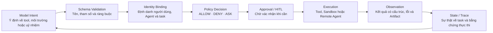
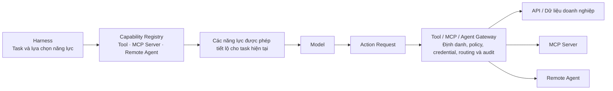
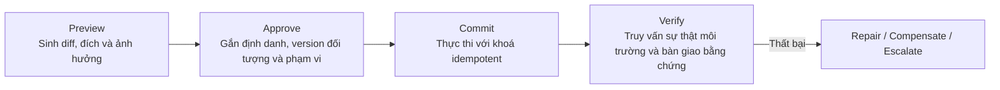
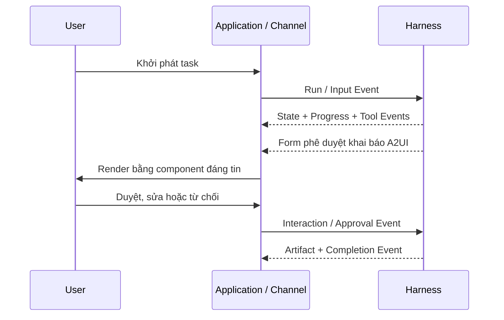
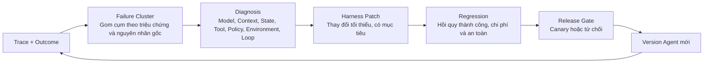

# Chương 6 - Hành động: thực thi có kiểm soát, phản hồi kiểm chứng và chuẩn bị bàn giao

Lời gọi tool mà model xuất ra chỉ là một **ý định hành động**. Nó không tự nhiên có được định danh của người dùng hiện tại, không đồng nghĩa với việc policy doanh nghiệp cho phép thực thi, và cũng không chứng minh được rằng hệ thống từ xa đã tạo ra kết quả như mong đợi. Thứ thực sự biến ý định thành hành động là Harness: nó chọn và tiết lộ năng lực, kiểm tra tham số, gắn định danh cùng credential, thực thi policy quyền hạn và phê duyệt, chạy trong môi trường cô lập, chuyển kết quả thành Observation, rồi giao quá trình task cho người dùng, hệ thống quan sát và hệ thống đánh giá.

Chương này gọi chung những năng lực đó là **hệ thống hành động và phản hồi** của Harness. Nó gồm hai chuỗi nối với nhau: **Action Plane** lo việc kết nối thế giới bên ngoài và giới hạn phạm vi ảnh hưởng; **Feedback Plane** lo việc phản hồi tiến độ, trạng thái, kết quả và tín hiệu chất lượng về cho người dùng và cho version Agent kế tiếp. Tool, MCP, A2A, Sandbox, HITL, AG-UI, A2UI, Trace và Evaluation đều có vị trí riêng trong kiến trúc này, **chứ không phải một nhóm tên giao thức và tên sản phẩm đặt ngang hàng nhau.**

Chương 4 đã định nghĩa *khi nào hành động và task tiến triển ra sao*; chương 5 định nghĩa *context và state mà hành động dựa vào*. Chương này trả lời tiếp: hành động được đăng ký, uỷ quyền và thực thi ra sao; người và ứng dụng can thiệp liên tục thế nào; và kết quả thực thi thật trở thành căn cứ cho việc tiến hoá Harness ra sao.

Chương này tiếp tục dùng case xuyên suốt "Agent vá lỗ hổng dịch vụ production và phát hành thay đổi". Hai chương trước đã để nó hoàn thành kế hoạch, patch và test; chương này tập trung quan sát **cây số cuối cùng**: Agent lấy được tool repository và quét bảo mật ra sao, code chạy trong môi trường cô lập thế nào, vì sao phiếu thay đổi có thể tạo tự động nhưng phát hành production thì phải chờ phê duyệt, người dùng xem tiếp task sau khi rớt mạng ra sao, và một lần thất bại đi từ Trace vào version Harness kế tiếp bằng cách nào.

---

## 6.1 Action Plane của Harness

### 6.1.1 Từ ý định của model đến sự thật trong môi trường

Một chuỗi hành động hoàn chỉnh không nên bắt đầu ở chỗ "gọi Tool", và cũng không nên kết thúc ở chỗ "trả về text":



Chuỗi này xác lập ba sự thật bắt buộc phải phân biệt:

1.  **Model nhìn thấy một tool nào đó** - nghĩa là mô tả Tool đã vào Context hiện tại.

2.  **Harness đã đăng ký một tool nào đó** - nghĩa là hệ thống biết cách gọi và parse nó.

3.  **Người dùng và task hiện tại đã được uỷ quyền thực thi** - chỉ khi đó, hành động cụ thể này mới được phép xảy ra.

Ba thứ đó không phải một. Doanh nghiệp có thể đăng ký rất nhiều năng lực trong Registry nhưng chỉ tiết lộ cho model hiện tại một vài năng lực liên quan; model có thể mô tả được một hành động rủi ro cao, nhưng vẫn cần Policy và phê duyệt quyết định có thực thi hay không. **Nếu "xuất hiện trong Tool Schema" tương đương với "được phép gọi", thì quyền tối thiểu, uỷ nhiệm theo người dùng và chế độ chỉ-đọc theo giai đoạn đều không thành lập được.**

### 6.1.2 Ràng buộc các loại năng lực khác nhau bằng một hợp đồng hành động thống nhất

Model có thể yêu cầu Tool qua Function Calling, mà cũng có thể đòi Shell, trình duyệt, Computer Use hay một Agent từ xa. Harness nên chuyển mọi cách biểu đạt khác nhau đó thành một **Action Request** thống nhất trước:

```text
Action Request
├── action_id / task_id / parent_event_id
├── capability_id / version
├── arguments and expected output schema
├── actor: user / service / agent identity
├── purpose and current task stage
├── requested environment and resource scope
├── side-effect / reversibility / risk classification
├── idempotency key and timeout
└── approval and audit requirements

```

Request thống nhất khiến ngân sách, quyền hạn, audit, retry và Trace không phải hiện thực lại cho từng cách kết nối. Phần mô tả tự do do model sinh ra chỉ được dùng làm input ứng viên cho `purpose`; còn **tên năng lực, kiểu tham số, phạm vi ảnh hưởng và định danh thì bắt buộc phải do code có tính xác định parse và kiểm tra.**

Bản thân Action cũng nên có vòng đời: `REQUESTED → VALIDATED → AUTHORIZED / WAITING_APPROVAL → RUNNING → SUCCEEDED / FAILED / CANCELLED`. Với các hệ thống bất đồng bộ bên ngoài, còn có thể có `ACCEPTED` hoặc `WAITING_RESULT`. Trạng thái task có liên quan tới trạng thái Action, nhưng **không được trộn làm một**: một Tool thất bại không nhất thiết làm cả Task thất bại; một Task bị huỷ cũng có thể phải đợi Action đã gửi đi trả về rồi mới bù trừ.

Action Result không nên chỉ có text model đọc được; ít nhất phải gồm:

*   Trạng thái thành công, thất bại, không rõ hay hoàn thành một phần;

*   Dữ liệu có cấu trúc và một Observation gọn hướng tới model;

*   Tham chiếu ổn định tới kết quả gốc, log hoặc Artifact;

*   Phân loại lỗi, khả năng retry và việc đã phát sinh tác dụng phụ hay chưa;

*   Định danh thực thi thật, môi trường, thời gian, version và chi phí;

*   Patch ứng viên cho Task State;

*   Bằng chứng môi trường để Verifier dùng được.

Harness commit State Patch một cách thống nhất, tránh việc mỗi Tool tuỳ ý sửa state có thẩm quyền của task. Kết quả lớn thì offload theo quy tắc ở chương 5; các trường nhạy cảm thì được ẩn danh riêng trước khi vào Context và trước khi vào event tương tác.

Mỗi version Agent đều phải nói rõ: tập năng lực khám phá được và thực thi được, Action Schema, cách truyền định danh, mức rủi ro, timeout và idempotent, yêu cầu môi trường, định dạng Observation và bằng chứng nghiệm thu. Runtime, Sandbox và Gateway có thể hiện thực khác nhau, nhưng **bắt buộc phải thực hiện đúng hợp đồng này.**

Đây cũng là ranh giới chung của con đường tự xây và con đường managed. Con đường AgentScope thì đội ứng dụng hiện thực Action Plane hoặc nối vào gateway doanh nghiệp; Qoder CLI / SDK tái sử dụng năng lực thực thi tool và quyền hạn đã chín; Qoder Cloud Agents thì thực thi tool trong Session managed và môi trường cô lập. Dù ai gánh, doanh nghiệp cũng phải biết **một hành động đã xảy ra dưới danh nghĩa ai, trong môi trường nào, theo policy gì**, và liên kết được nó tới Outcome cuối cùng.

### 6.1.3 Case: tạo phiếu thay đổi và thực hiện phát hành là hai Action khác nhau

Agent vá lỗ hổng đã sinh ra patch và báo cáo kiểm chứng. Lúc này, "tạo phiếu thay đổi" và "phát hành lên production" **không được** đóng gói thành một tool mơ hồ, vì định danh, rủi ro, khả năng đảo ngược và yêu cầu phê duyệt của chúng hoàn toàn khác nhau. Request tạo phiếu thay đổi có thể biểu diễn như sau:

```yaml
action_id: act-241
task_id: remediation-2026-0917
capability: change.create@v3
actor:
  user: u-1842
  agent: remediation-agent@12
purpose: Tạo thay đổi chờ phê duyệt cho bản vá lỗ hổng đã kiểm chứng
arguments:
  service: payment-service
  patch_ref: artifacts/remediation.patch
  evidence_refs:
    - evidence/unit-test.xml
    - evidence/security-scan.sarif
risk: medium
reversible: true
idempotency_key: remediation-2026-0917:create-change
policy_decision: ALLOW

```

Còn `production.deploy` thì phải trở thành một Action **mới**: nó tham chiếu tới phiếu thay đổi đã tạo và version đã được phê duyệt, mức rủi ro là cao, Policy trả về `ASK`, và nó vào `WAITING_APPROVAL`. Ngay cả khi hai hành động cuối cùng gọi tới cùng một nền tảng quản lý thay đổi, Harness vẫn uỷ quyền, audit, retry và kiểm chứng chúng riêng rẽ được. **Thiết kế Tool của doanh nghiệp nên ưu tiên phơi bày loại ngữ nghĩa nghiệp vụ như vậy, thay vì để model tự ghép lệnh production qua HTTP hay Shell tổng quát.**

---

## 6.2 Tool, MCP và Agent từ xa

### 6.2.1 Ranh giới trách nhiệm giữa Function Calling, MCP và A2A

Ba thứ này xử lý các tầng kết nối khác nhau:

*   **Function Calling** cho phép model biểu đạt dưới dạng có cấu trúc rằng "muốn gọi năng lực nào, cung cấp tham số gì". Nó là **interface ý định giữa model và Harness**.

*   **MCP** cho phép Agent Host khám phá và kết nối tới tool, resource cùng các năng lực bên ngoài theo một cách chuẩn hoá. Nó là **giao thức kết nối giữa Harness và bên cung cấp năng lực**.

*   **A2A** hướng tới các Agent từ xa có vòng lặp task, state và mức tự chủ riêng. Nó truyền task, message, state và Artifact, **chứ không chỉ thực thi một hàm**.

Giao thức sẽ không làm thay Harness phần uỷ quyền, cô lập tenant, kiểm chứng ngữ nghĩa nghiệp vụ và đánh giá hiệu quả. MCP Server mô tả được tool không có nghĩa bên gọi có quyền truy cập dữ liệu nền dưới; A2A Agent tuyên bố task xong thì bên uỷ nhiệm vẫn phải nghiệm thu theo hợp đồng.

### 6.2.2 Thiết kế Tool hướng tới Agent

Tool là đơn vị hành động mà Harness trao cho model. Model dùng đúng được hay không phụ thuộc vào việc Tool có cung cấp ngữ nghĩa rõ ràng, ổn định, ràng buộc được hay không - **chứ không chỉ là API có gọi được hay không.**

Một Tool phù hợp với Agent nên đạt được:

*   Tên và mô tả nói rõ mục đích nghiệp vụ, điều kiện áp dụng và cả những gì **không** nhằm tới.

*   Schema input dùng kiểu rõ ràng, enum, biên và ví dụ, tránh để model ghép request tuỳ ý.

*   Output phân biệt kết quả có cấu trúc, bản tóm tắt hướng tới model, và tham chiếu tới bằng chứng gốc.

*   Nói rõ có phải chỉ-đọc không, có tác dụng phụ không, đảo ngược được không, có hỗ trợ preview và idempotent không.

*   Lỗi dùng phân loại ổn định, cho Harness biết có retry được không, cần sửa tham số hay phải chuyển cho người.

*   Giữ phần xác thực và Secret ở phía thực thi, **không** đưa vào mô tả Tool hay Context của model.

Tool quá thô thì một lần gọi ảnh hưởng quá rộng, khiến việc phê duyệt và kiểm chứng đều khó chính xác; quá mịn thì model phải điều phối rất nhiều bước cấp thấp, làm tăng lỗi và chi phí. **Độ hạt hợp lý thường tương ứng với một hành động nghiệp vụ mô tả được, uỷ quyền được, quan sát được và kiểm chứng được.**

Ví dụ, Schema của `change.create` nên yêu cầu tên dịch vụ, tham chiếu patch, bằng chứng kiểm chứng và mô tả rollback, chứ không chỉ nhận một đoạn text tự do; giá trị trả về nên gồm `change_id` ổn định, version đối tượng, trạng thái phê duyệt được và lối vào truy vấn hệ thống. Nhờ vậy, model lo chọn và điền tham số nghiệp vụ, Harness lo kiểm tra có tính xác định, còn Verifier có thể truy vấn lại phiếu thay đổi thật thay vì phải parse một biên nhận bằng ngôn ngữ tự nhiên.

### 6.2.3 Registry, Gateway và tiết lộ tiệm tiến

Tool, MCP Server và Remote Agent đều nên đi vào một danh mục năng lực thống nhất hoặc liên kết được với nhau. **Registry** lo metadata năng lực, chủ sở hữu, version, tình trạng sức khoẻ, scope và phụ thuộc; **Gateway** lo lối vào giao thức, định danh, credential, routing, giới hạn tốc độ, audit và thực thi policy; còn **Harness** thì chọn năng lực ứng viên theo task và tiết lộ tiệm tiến cho model.



Khi số lượng năng lực ít và ranh giới tin cậy đơn giản, Harness có thể nối thẳng; còn khi nhiều Agent, framework và team cùng dùng chung một lượng lớn năng lực, thì Registry và Gateway giúp tránh việc credential và logic quản trị bị lặp lại trong mỗi bộ Harness. Chi tiết hiện thực gateway sẽ triển khai ở chương 9.

### 6.2.4 Ranh giới giữa Tool, MCP Server, Skill, Subagent và Remote Agent

| Đối tượng | Có Agent Loop độc lập không | Đóng gói chính | State và trách nhiệm | Cách dùng trong Harness |
| --- | --- | --- | --- | --- |
| Tool | Không | Một hành động thực thi được | Bên gọi lo việc tổ hợp và nghiệm thu | Sinh ra một Action Request |
| MCP Server | Không; bản thân giao thức không đòi hỏi | Một nhóm tool, resource và năng lực khác | Server lo hiện thực năng lực; Host lo chọn, uỷ quyền và tích hợp | Sau khi khám phá thì đăng ký thành Tool / Resource |
| Skill | Không | Phương pháp, script và tài liệu để hoàn thành một loại task | Agent hiện tại vẫn chịu trách nhiệm về Loop và kết quả | Nạp vào Context theo nhu cầu rồi gọi Tool |
| Subagent | Có; thường do cùng một Harness hoặc nền tảng gánh | Bên thực thi một subtask có ranh giới | Agent cha giữ trách nhiệm tổng thể | Delegation cục bộ, state cha–con liên kết trực tiếp được |
| Remote Agent | Có; triển khai và quản trị độc lập | Năng lực task bên ngoài chạy liên tục được | Agent từ xa chịu trách nhiệm về cam kết task của nó; bên uỷ nhiệm chịu trách nhiệm về việc áp dụng cuối cùng | Tạo task từ xa qua A2A hoặc Agent API |

Bảng này giúp tránh hai kiểu nhầm lẫn phổ biến. Đóng gói một API cố định thành "Agent" **không** tự nhiên mang lại năng lực lập kế hoạch và khôi phục; còn coi một Remote Agent phức tạp như một Tool đồng bộ thì sẽ đánh mất ngữ nghĩa trạng thái task, event bất đồng bộ và Artifact.

### 6.2.5 Kết nối với Agent từ xa

Chương 4 đã định nghĩa ngữ nghĩa orchestration của Delegation. Việc uỷ nhiệm xuyên hệ thống còn phải bổ sung **hợp đồng liên thông**:

*   Định danh, khai báo năng lực, version và ranh giới dịch vụ của Agent từ xa;

*   Mục tiêu task, input, tham chiếu context và giới hạn sử dụng dữ liệu;

*   Liên kết giữa `remote_task_id` và `task_id` cục bộ;

*   Ánh xạ trạng thái, tiến độ, message, Artifact và lỗi;

*   Ngữ nghĩa timeout, huỷ, idempotent, retry và callback;

*   Uỷ nhiệm credential, ranh giới tenant và quan hệ đại diện audit được;

*   Schema kết quả, bằng chứng và tiêu chí nghiệm thu cuối.

**Agent từ xa không nên nhận toàn bộ Context của Agent cha.** Bên uỷ nhiệm gửi lượng thông tin tối thiểu cần thiết, và truyền kèm các giới hạn sử dụng dữ liệu dưới dạng policy máy thực thi được. Message và Artifact mà bên nhận trả về đều là **input bên ngoài**, bắt buộc phải qua kiểm tra Schema, quyền hạn và an toàn nội dung - **không được vì nguồn là một Agent khác mà coi chúng là chỉ dẫn hệ thống đáng tin.**

Nếu năng lực là một hành động ngắn, tham số rõ, kết quả trả về ngay được thì ưu tiên Tool / Function Calling; nếu cần tái sử dụng năng lực tool hoặc dữ liệu xuyên Host thì dùng MCP; nếu năng lực có vòng lặp task riêng, cần state bất đồng bộ, tiến độ, message và Artifact thì dùng A2A hoặc Agent API tương đương. Doanh nghiệp có thể giữ giao thức riêng ở nội bộ, nhưng nên chuyển nó thành ngữ nghĩa Action và Event thống nhất ngay tại ranh giới Harness, để khác biệt giao thức không xâm nhập vào Loop lõi.

Trong case của chương này, việc đọc danh mục dependency phù hợp với một Tool cục bộ; việc kết nối tới nền tảng quét bảo mật doanh nghiệp có thể dùng MCP Server; còn việc uỷ nhiệm cho một Agent audit do đội bảo mật độc lập duy trì thì phù hợp với A2A hoặc Agent API doanh nghiệp. **Việc chọn giao thức do câu hỏi "năng lực có vòng lặp task riêng không, có cần state bất đồng bộ và Artifact không" quyết định - chứ không do giao thức đó mới hay đang thịnh hành.**

---

## 6.3 Môi trường thực thi và hợp đồng Sandbox

Agent không chỉ hành động qua API nghiệp vụ, mà còn có thể dùng trực tiếp File, Shell, Code Interpreter, Browser và Computer Use. Những năng lực này cho model một không gian thao tác tổng quát, đồng thời cũng mở rộng đáng kể tác dụng phụ và bề mặt tấn công. Harness cần **khai báo** Environment cần thiết cho task, còn Runtime và Sandbox thì lo việc thực sự tạo, cô lập và huỷ nó.

| Năng lực môi trường | Công dụng điển hình | Rủi ro chính | Kiểm soát bắt buộc |
| --- | --- | --- | --- |
| File | Đọc, tìm, sửa file trong workspace | Đọc vượt biên, ghi đè, path traversal, rò rỉ file nhạy cảm | Thư mục gốc, phạm vi đọc–ghi, version và changeset |
| Shell | Chạy lệnh, build, test và kiểm tra hệ thống | Code tuỳ ý, thoát process, lộ mạng và Secret | Policy lệnh, quyền user, cô lập tài nguyên và mạng |
| Code Interpreter | Xử lý dữ liệu, chạy code và sinh file | Dependency không kiểm soát, cạn tài nguyên, chạy input độc hại | Môi trường tạm, policy package, giới hạn CPU/bộ nhớ/thời gian |
| Browser | Truy hồi trang, thao tác form và hệ thống Web | Prompt Injection, chiếm phiên, submit nhầm | Policy tên miền, cô lập download, xác nhận thao tác, gắn nhãn tin cậy nội dung |
| Computer Use | Thao tác desktop và ứng dụng tổng quát | Diện ảnh hưởng khó dự đoán, nhìn nhầm, thao tác không đảo ngược | Phạm vi ứng dụng, cô lập màn hình/input, preview và xác nhận của con người |

Tool thường nén một thao tác phức tạp thành một hành động nghiệp vụ bị Schema ràng buộc, còn interface môi trường thì tổng quát và linh hoạt hơn. **Những hành động rủi ro cao mà một Tool hẹp làm được thì thường không nên ưu tiên mở Shell hay Computer Use tổng quát;** chỉ khi doanh nghiệp cần xử lý các ứng dụng đuôi dài và workspace phi cấu trúc, mới dùng Sandbox để giới hạn năng lực tổng quát trong một ranh giới chấp nhận được.

### 6.3.1 Khai báo và thực hiện đúng Environment Contract

Harness không nên giả định "máy này chắc chắn có thư mục X, dependency version Y hoặc truy cập được Internet", mà phải gửi lên một **Environment Contract**:

```text
Environment Contract
├── image / OS / architecture
├── filesystem mounts and read-write scope
├── network egress / ingress policy
├── secret references and delegated identity
├── required tools, packages and versions
├── CPU / memory / storage / GPU quotas
├── timeout, idle policy and concurrency
├── persistence / snapshot requirement
└── audit and cleanup policy

```

Runtime chọn môi trường cục bộ, dùng chung, managed hay tự host theo hợp đồng; Sandbox biến các yêu cầu logic thành cơ chế cô lập bằng process, container, máy ảo hoặc cách khác. Nếu môi trường không đáp ứng được, Action phải **thất bại trước khi thực thi** hoặc xin hạ cấp - chứ không để model rơi vào trạng thái bất định rồi tự đoán.

| Hình thái | Ưu điểm | Hạn chế | Bối cảnh phù hợp |
| --- | --- | --- | --- |
| Workspace cục bộ | Truy cập file và ứng dụng thật của người dùng, độ trễ tương tác thấp | Môi trường khác nhau nhiều, ảnh hưởng tới thiết bị người dùng, khó quản trị tập trung | Agent trong IDE, CLI, workspace cá nhân |
| Môi trường từ xa dùng chung | Tái sử dụng hạ tầng và cache | Rủi ro cao về cô lập tenant, xung đột đồng thời và dữ liệu sót lại | Phát triển nội bộ có kiểm soát và task rủi ro thấp |
| Môi trường cô lập managed | Tạo nhanh theo Session / Task, vòng đời rõ ràng | Cần đánh giá ranh giới dữ liệu, tuỳ biến image và kết nối mạng | Agent online, bất đồng bộ, theo lô |
| Sandbox doanh nghiệp tự host | Dữ liệu và việc chạy tool ở lại trong mạng doanh nghiệp | Doanh nghiệp đảm nhiệm dung lượng, vá lỗi và chất lượng cô lập | Tuân thủ chặt, dữ liệu nội bộ và tool mạng nội bộ |

Harness managed và Sandbox tự host có thể kết hợp: phần suy luận và orchestration task do nền tảng quản lý, còn việc thực thi tool thật thì ở lại môi trường doanh nghiệp. Điểm then chốt là giữa Session, Harness và Sandbox phải dùng hợp đồng event, state và định danh ổn định - **không được copy Secret dài hạn hay trọn bộ dữ liệu doanh nghiệp sang phía điều khiển managed.**

Môi trường có thể cô lập theo Agent, Session, Task hay Action. Hạt càng mịn thì rủi ro ô nhiễm và di chuyển ngang càng thấp, nhưng chi phí tạo và chi phí truyền state càng cao. Task online multi-tenant thường ít nhất phải cô lập theo Task hoặc Session; workspace dài hạn của cùng một người dùng có thể bền vững hoá, nhưng phải tách **base image dùng chung được** khỏi **lớp ghi riêng tư**.

Vòng đời môi trường gồm: tạo, chuẩn bị, mount input, chạy, snapshot, khôi phục, dọn dẹp và huỷ. Trước khi huỷ phải xác nhận Artifact và bằng chứng đã được chuyển đi, credential tạm đã bị thu hồi; khi khôi phục phải kiểm chứng xem image, dependency, version file và đối tượng bên ngoài còn khớp với Checkpoint hay không.

Qoder Cloud Agents mô tả cấu hình chạy bằng Environment: ở chế độ cloud, nó cung cấp môi trường cô lập managed cho từng Session; nó cũng hỗ trợ môi trường `self_hosted` để phía doanh nghiệp gánh việc chạy tool. AgentScope thì có thể thích ứng môi trường cục bộ, từ xa hay doanh nghiệp tự dựng thông qua FileSystem và Sandbox cắm được. Cách hiện thực sản phẩm khác nhau, nhưng thứ Harness dựa vào vẫn là cùng một Environment Contract.

### 6.3.2 Chỉ cho việc sửa code xảy ra trong workspace cô lập

Trong con đường Framework, đội ứng dụng có thể dùng Sandbox làm phần hiện thực hệ thống file của Harness, thay vì để model thao tác thẳng lên máy host. Ví dụ AgentScope dưới đây gắn một hệ thống file Docker cho mỗi Session; quy tắc dự án, Skill và file input được chiếu vào workspace cô lập, còn patch cùng kết quả test thì được lấy lại dưới dạng Artifact.

```java
HarnessAgent agent = HarnessAgent.builder()
    .name("remediation-agent")
    .model(model)
    .workspace(workspace)
    .filesystem(new DockerFilesystemSpec()
        .image("ubuntu:24.04"))
    .build();

agent.call(message, RuntimeContext.builder()
    .userId("u-1842")
    .sessionId("remediation-2026-0917")
    .build()).block();

```

Khi triển khai production còn phải cố định image theo digest, giới hạn mạng và tài nguyên, cấu hình snapshot cho workspace bền vững, và thêm execution lease khi khôi phục đồng thời trên nhiều bản sao. AgentScope cũng có thể nối `StateStore` và Sandbox Snapshot tới Redis, database và object storage, hoặc hoàn tất việc nối tiếp đa node qua một cấu hình lưu trữ phân tán thống nhất. **Ví dụ code minh hoạ interface của Harness, không có nghĩa cấu hình Docker mặc định đã đáp ứng yêu cầu cô lập production.**

Với case xuyên suốt, Sandbox cho phép sửa bản sao `payment-service` và chạy build, nhưng **không** cung cấp credential của cụm production; việc phát hành chỉ có thể khởi phát qua Tool `production.deploy` có kiểm soát. Ngay cả khi một file độc hại trong workspace dụ model chạy lệnh deploy, ranh giới mạng và Secret của Sandbox vẫn chặn nó vòng qua Action Plane của doanh nghiệp.

### 6.3.3 Secret, mạng và dữ liệu đi ra ngoài

**Secret không được xuất hiện trong System Prompt, Tool Schema, Task State hay các biến môi trường model nhìn thấy được.** Phía thực thi nên lấy credential ngắn hạn theo Action, định danh và mục đích, chỉ tiêm vào tool hoặc process đích, và ghi lại việc *sử dụng* chứ không ghi bản thân chuỗi bí mật.

Policy mạng nên mặc định giới hạn đích outbound, giao thức và lượng dữ liệu. Trang web trình duyệt truy cập, file tải về và giá trị tool trả về **bắt buộc phải được đánh dấu là nội dung không đáng tin**; dữ liệu nhạy cảm cao khi đi ra ngoài thì cần policy bổ sung hoặc phê duyệt. **Sandbox ngăn process vượt biên, Policy quyết định về mặt nghiệp vụ có được phép hay không - thiếu một trong hai đều không đủ.**

Việc lập lịch tài nguyên runtime, chuỗi cung ứng image, backend snapshot, chịu thảm hoạ và Sandbox ở quy mô sẽ được triển khai ở chương 7–9; sản phẩm Build của chương này là **các yêu cầu môi trường và cô lập kiểm chứng được, di chuyển được.**

---

## 6.4 Permission, HITL và kiểm soát an toàn

### 6.4.1 Để định danh, tài nguyên và rủi ro cùng tham gia vào quyết định

Harness cần ghi lại đồng thời ba loại thông tin: định danh người dùng hoặc service khởi phát task, version Agent phát ra hành động, và định danh Runtime thực sự thực thi Tool hay Sandbox Action. Một lần gọi có thể dùng service identity, cũng có thể truyền uỷ nhiệm của người dùng, nhưng **bắt buộc phải rõ việc truy cập dữ liệu và tác dụng phụ cuối cùng quy về ai.**

Quyết định quyền hạn ít nhất phải cân nhắc: chủ thể, tenant, mục đích task, năng lực, tham số, tài nguyên đích, môi trường, giai đoạn hiện tại, độ nhạy dữ liệu, phạm vi ảnh hưởng, khả năng đảo ngược, ngân sách và lịch sử phê duyệt. **Chỉ làm whitelist tĩnh theo tên Tool thì không phân biệt được "đọc một bản ghi test" với "export toàn bộ database production".**

Harness có thể quy kết quả policy thành ba loại:

*   **ALLOW:** với điều kiện hiện tại thì thực thi được ngay, và ghi lại căn cứ quyết định.

*   **DENY:** dù model diễn giải thế nào cũng không được thực thi; trả về Loop một lý do có cấu trúc và các phương án thay thế được phép.

*   **ASK:** hành động thực thi được, nhưng cần người hoặc hệ thống được chỉ định xác nhận.

**`ASK` không phải phương án đỡ mặc định.** Quá nhiều phê duyệt sẽ khiến người dùng bấm xác nhận một cách máy móc, và cũng làm Agent mất tính liên tục. Nên ưu tiên giảm rủi ro bằng Tool hẹp hơn, ràng buộc tham số, preview, phạm vi tài nguyên và Sandbox; chỉ xin con người tham gia khi mục đích hoặc hậu quả không thể được policy đánh giá đầy đủ.

| Ví dụ rủi ro | Policy mặc định đề xuất |
| --- | --- |
| Đọc file không nhạy cảm trong dự án hiện tại | ALLOW, ghi lại phạm vi |
| Truy vấn dữ liệu nghiệp vụ mà người dùng hiện tại có quyền xem | ALLOW, hoặc ASK dựa trên mức dữ liệu |
| Sửa file workspace nhưng chưa commit ra hệ thống bên ngoài | ALLOW, kèm Diff và khả năng hoàn tác |
| Gửi message ra ngoài, phát hành, thanh toán, xoá hoặc đổi dữ liệu production | ASK hoặc DENY, yêu cầu preview và nêu rõ ảnh hưởng |
| Truy cập dữ liệu xuyên tenant, vòng qua kiểm soát an toàn, xin Secret dài hạn | DENY |

### 6.4.2 Đưa HITL vào đúng chỗ thực sự cần nhận định

HITL có thể xuất hiện ở ba tầng:

1.  **Phê duyệt Plan:** xác nhận mục tiêu, phạm vi, phương án và diện ảnh hưởng trước khi vào thực thi.

2.  **Phê duyệt Action:** phê duyệt, từ chối hoặc sửa một lần gọi Tool, môi trường hay Remote Agent cụ thể.

3.  **Nghiệm thu kết quả:** ký duyệt cuối cùng cho các Artifact hoặc kết quả nghiệp vụ tác động lớn.

Yêu cầu phê duyệt nên gồm: Agent muốn làm gì, vì sao, dưới danh nghĩa ai, tác động lên đối tượng nào, ảnh hưởng dự kiến, tham số và diff, có đảo ngược được không, thất bại thì xử lý ra sao, và phạm vi phê duyệt là chỉ lần này, cả Task hiện tại, hay một lớp hành động giới hạn. Sau khi người dùng duyệt, **Harness vẫn phải kiểm tra lại version đối tượng và policy**, phòng khi môi trường đã thay đổi trong lúc chờ.

Các hành động không đảo ngược hoặc tác động lớn có thể thống nhất dùng mô hình **"Preview - Approve - Commit - Verify"**: Preview trình bày nội dung và ảnh hưởng gần với lần commit thật; Approve gắn với định danh, phạm vi và version đối tượng; Commit thực thi với khoá idempotent; Verify truy vấn trạng thái hệ thống thật. Các hành động không rollback được thì **bắt buộc phải nói rõ trong Preview**; còn nếu kiểm chứng thất bại thì vào Repair, Compensate hoặc Escalate - **chứ không coi một request đã gửi đi là đã thành công.**



### 6.4.3 Nối phê duyệt vào giao diện doanh nghiệp

Ở con đường SDK, ứng dụng doanh nghiệp có thể nối callback uỷ quyền tool của Harness vào giao diện phê duyệt của mình. Ví dụ Qoder Agent SDK dưới đây uỷ quyền trước cho `Read`; các tool khác thì xử lý theo quy tắc quyền hạn và policy lúc chạy. Những lời gọi cần phê duyệt sẽ được `canUseTool` chuyển cho ứng dụng, ứng dụng hiển thị task, tool và tham số liên quan, rồi trả kết quả duyệt hay từ chối về cho lần Tool Use hiện tại:

```ts
import { accessTokenFromEnv, query } from '@qoder-ai/qoder-agent-sdk';

for await (const message of query({
  prompt: 'Đọc báo cáo kiểm chứng và tạo phiếu thay đổi; bắt buộc phải hỏi trước khi ghi hoặc commit.',
  options: {
    auth: accessTokenFromEnv(),
    permissionMode: 'default',
    allowedTools: ['Read'],
    async canUseTool(toolName, input, context) {
      const approved = await showApprovalDialog({
        taskId: 'remediation-2026-0917', toolName, input,
      });
      if (!approved) {
        return {
          behavior: 'deny',
          message: 'Người dùng đã từ chối thao tác này; hãy giữ lại bản nháp và nêu rõ các mục chưa hoàn thành.',
          toolUseID: context.toolUseID,
        };
      }
      return { behavior: 'allow', updatedInput: input,
               toolUseID: context.toolUseID };
    },
  },
})) publish(message);

```

Callback chỉ là **lối vào tương tác**; backend doanh nghiệp vẫn phải đánh giá một lần nữa một cách có tính xác định dựa trên định danh đang đăng nhập, tenant, version tài nguyên và Policy. Với việc phát hành production, kết quả phê duyệt nên sinh ra một uỷ quyền **ngắn hạn, giới hạn đích**, chứ không phải chuyển cả Session sang chế độ cho qua vô điều kiện.

**Steering, Interrupt và Resume.**

Sự tham gia của con người không chỉ xảy ra tại điểm phê duyệt. Người dùng còn cần bổ sung thông tin trong lúc task chạy, đổi độ ưu tiên, thu hẹp phạm vi, tạm dừng hoặc huỷ. Harness nên biểu diễn Steering thành một **sự kiện task ưu tiên cao**, để state machine ở chương 4 xử lý tại một điểm an toàn; với việc ngắt khẩn cấp thì có thể huỷ các hành động gián đoạn được và chặn Action mới.

Trước khi khôi phục, Harness phải commit yêu cầu mới của người dùng vào Task State, đánh giá xem Plan, quyền hạn và task nền hiện có còn hiệu lực không, rồi mới dựng lại Context. **Việc chỉ append một message người dùng vào cuối một lịch sử dài có thể không phủ được kế hoạch cũ vốn đã vào hàng đợi thực thi.**

### 6.4.4 Guardrail và phòng chống Prompt Injection

Guardrail có thể đặt ở các khâu input, dựng Context, Action Request, kết quả Tool và output, nhưng **nó không nên là ranh giới an toàn duy nhất.** Với những giới hạn quyền hạn và tài nguyên chắc chắn mã hoá được, hãy dùng Policy và Sandbox; còn model hay bộ phân loại thì phù hợp để nhận diện rủi ro ngữ nghĩa phức tạp, nội dung nhạy cảm và ý định đáng ngờ, rồi đưa kết quả đó vào như một tín hiệu bổ sung.

Phòng tuyến then chốt với Prompt Injection là **phân biệt chỉ dẫn với dữ liệu**. Nội dung từ trang web, email, tài liệu, MCP Server, kết quả tool và Agent từ xa trả về đều thuộc input không đáng tin; chúng **không được** thay đổi policy nền tảng, phạm vi uỷ quyền hay Tool Set hiện tại. Harness nên giữ lại nguồn nội dung, hạn chế việc text bên ngoài đi vào tầng chỉ dẫn ưu tiên cao, uỷ quyền riêng cho việc truyền dữ liệu ra ngoài và các Action rủi ro cao, và khi cần thì cô lập giai đoạn đọc với giai đoạn thực thi.

Mô hình đe doạ đầy đủ, hệ định danh, bảo mật MCP, thoát Sandbox và audit tuân thủ sẽ được triển khai ở phần "Quản trị". Mục này đưa ra **các điểm kiểm soát thực thi bắt buộc phải nhúng vào Harness ngay ở giai đoạn Build.**

---

## 6.5 Streaming, Channel và giao thức tương tác

### 6.5.1 Luồng event hướng tới ngữ nghĩa task

Nếu một task dài chỉ trả về một đoạn text khi kết thúc, người dùng không thể biết Agent đang làm gì, có đang chờ phê duyệt không, có gặp điểm chặn không, và cũng không kịp chỉnh hướng. Harness nên sinh ra một nhóm **event ngữ nghĩa bên ngoài** tương ứng với event nội bộ và đã được ẩn danh:

| Loại event | Nội dung điển hình | Công dụng cho giao diện hoặc bên gọi |
| --- | --- | --- |
| Text | Text tăng dần, phần giải thích cuối | Hiển thị thời gian thực output model nhìn thấy được |
| Progress | Giai đoạn hiện tại, Todo, phần trăm hoặc cột mốc | Giải thích task đang tiến tới đâu |
| Tool | Ý định tool, trạng thái thực thi, kết quả gọn | Hiển thị hành động và thất bại, không lộ Secret |
| State | Running, Waiting, Paused, Completed… | Dẫn dắt giao diện và state machine nghiệp vụ ở tầng trên |
| Approval | Preview, rủi ro, tuỳ chọn và kết quả quyết định | Hiển thị control HITL |
| Artifact | File, báo cáo, Diff, link và version | Bàn giao kết quả kiểm tra được |
| Error | Phân loại lỗi, khả năng retry và bước kế tiếp | Khôi phục, chuyển người hoặc cảnh báo |
| Usage | Token, chi phí, ngân sách và tài nguyên | Hiển thị chi phí và kiểm soát ngân sách |

**Phần suy luận ẩn bên trong model không cần phơi bày qua Streaming.** Thứ người dùng thực sự cần là trạng thái task, phần giải thích nhìn thấy được, hành động, bằng chứng và các tuỳ chọn thao tác được.

### 6.5.2 Trách nhiệm của Channel

Channel là tầng thích ứng giữa Agent với Web, App, IDE, CLI, IM doanh nghiệp hay các lối vào khác. Nó không viết lại Harness, mà xử lý:

*   Ánh xạ định danh người dùng và tổ chức bên ngoài sang định danh nền tảng;

*   Ánh xạ luồng message sang Session, rồi chọn hoặc tạo Task;

*   Chuyển file đính kèm, reply, nút bấm và command thành event input thống nhất;

*   Chuyển event của Harness thành message, card và trạng thái mà kênh đó hỗ trợ;

*   Giữ task liên tục khi người dùng chuyển từ lối vào này sang lối vào khác;

*   Áp dụng giới hạn nội dung, tốc độ, ẩn danh và audit ở mức kênh.

Việc tách Session và Task đặc biệt quan trọng ở đây: một luồng IM có thể xem một Task chạy nền, còn Task tạo trong IDE cũng có thể tiếp tục được phê duyệt trên Web Console. **Channel không nên là nơi lưu state duy nhất.**

### 6.5.3 AG-UI và A2UI

**AG-UI** phù hợp để biểu đạt các event tương tác hai chiều, dạng stream giữa Agent và ứng dụng, giúp frontend không phải phụ thuộc vào đối tượng nội bộ của một Framework nào đó. Nó có thể mang ngữ nghĩa về vòng đời chạy, text, tool, trạng thái và ngắt. Khi dùng, doanh nghiệp vẫn phải quyết định việc ánh xạ event nội bộ sang event bên ngoài, ẩn danh trường, gắn định danh và con trỏ khôi phục.

**A2UI** phù hợp để Agent xuất ra giao diện dạng khai báo - ví dụ form, card, list và action. Client render bằng một danh mục component đáng tin cục bộ, **chứ không chạy code tuỳ ý do model sinh ra.** A2UI mô tả *giao diện là gì*, còn AG-UI xử lý *Agent và ứng dụng trao đổi event ra sao*; Payload A2UI có thể gửi qua AG-UI hoặc một phương tiện truyền khác - **hai thứ không thay thế cho nhau.**



### 6.5.4 Để luồng event nối tiếp được, giới hạn được và hiển thị theo định danh

Luồng event phải giả định rằng mạng sẽ đứt, client sẽ kết nối lại nhiều lần, và các bên tiêu thụ có tốc độ khác nhau. Mỗi event cần một số thứ tự đơn điệu hoặc một con trỏ khôi phục được; khi client kết nối lại thì nối tiếp từ vị trí xác nhận cuối, và server hỗ trợ loại bỏ trùng lặp. Bên tiêu thụ nhanh có thể nhận phần tăng dần theo thời gian thực; bên chậm có thể đọc snapshot trạng thái trước rồi bổ sung các event then chốt.

Với token text tần suất cao hay log tool hạt mịn, hệ thống có thể gộp, lấy mẫu hoặc chỉ gửi ở chế độ debug; còn các event về trạng thái, phê duyệt, Artifact và trạng thái cuối thì **không được bỏ vì backpressure**. Sau khi người dùng gửi Cancel hay Interrupt, Channel phải xác nhận sớm nhất có thể rằng yêu cầu đã vào state machine, và phân biệt rõ "đã nhận lệnh huỷ" với "Action ở tầng dưới đã dừng an toàn".

Cùng một Task hiển thị ở các Channel khác nhau có thể có nội dung khác nhau. Console phát triển xem được Tool và Trace chi tiết; ứng dụng hướng tới khách hàng chỉ hiển thị tiến độ nghiệp vụ; người phê duyệt xem được đối tượng bị ảnh hưởng, còn người quan sát thường chỉ thấy trạng thái chờ. **Trước khi phát event phải sinh view theo định danh người nhận và năng lực của Channel - không được broadcast nguyên xi Trace nội bộ.**

Giá trị của giao thức là giảm chi phí thích ứng, còn **hợp đồng ngữ nghĩa mới quyết định trải nghiệm có nhất quán hay không.** Doanh nghiệp nên ổn định mô hình Task, Event, Approval và Artifact trước, rồi mới chọn AG-UI, A2UI, WebSocket, SSE hay interface nền tảng message làm phương tiện chuyên chở cụ thể.

### 6.5.5 Dùng Session và Event để gánh task managed

Con đường Managed Agents để nền tảng gánh Agent Loop, phiên và nền tảng thực thi, còn ứng dụng lo việc tiêu thụ event và kết nối lại. Qoder Cloud Agents tổ chức lời gọi theo Agent, Environment, Session, Event. Dưới đây dùng hai terminal Bash cùng `curl` và `jq`; hai đoạn A và B trong code lần lượt copy sang terminal tương ứng. Agent và Environment code đã được tạo, các biến môi trường liên quan đã thiết lập, và hai terminal dùng cùng địa chỉ API cùng access token. Terminal A tạo Session và xác nhận SSE đã kết nối, rồi terminal B mới gửi task tới cùng Session đó:

```bash
# Terminal A: tạo Session và giữ kết nối SSE
set -euo pipefail
SESSION_ID=$(curl -fsS -X POST \
  "$QODER_API_BASE_URL/api/v1/cloud/sessions" \
  -H "Authorization: Bearer $QODER_ACCESS_TOKEN" \
  -H "Content-Type: application/json" \
  --data "$(jq -nc --arg agent "$AGENT_ID" --arg env "$ENV_ID" \
    '{agent: $agent, environment_id: $env}')" | jq -er '.id')
printf 'SESSION_ID=%s\n' "$SESSION_ID"

curl -fsS -i -N \
  "$QODER_API_BASE_URL/api/v1/cloud/sessions/$SESSION_ID/events/stream" \
  -H "Authorization: Bearer $QODER_ACCESS_TOKEN" \
  -H "Accept: text/event-stream"

# Phần dưới chạy ở terminal B, giữ nguyên kết nối của terminal A.
# Xác nhận A đã trả về HTTP 200 và Content-Type: text/event-stream rồi mới gửi.
# B dùng cùng QODER_API_BASE_URL và QODER_ACCESS_TOKEN.
SESSION_ID="sess_thay_bang_ID_day_du_ma_terminal_A_in_ra"
curl -fsS -X POST \
  "$QODER_API_BASE_URL/api/v1/cloud/sessions/$SESSION_ID/events" \
  -H "Authorization: Bearer $QODER_ACCESS_TOKEN" \
  -H "Content-Type: application/json" \
  --data '{"events":[{"type":"user.message","content":[{"type":"text","text":"Tạo thay đổi vá lỗ hổng có thể phê duyệt, không được phát hành trực tiếp"}]}]}'
```

Luồng event có thể trả về các event ngữ nghĩa như `session.status_running`, `agent.message`, `agent.tool_use`, `agent.tool_result` và `session.status_idle`. Client nên lưu ID của một event sau khi xử lý trọn vẹn thành công, dùng `Last-Event-ID` để nối tiếp khi rớt kết nối, bổ sung phần lịch sử qua List Events khi cần, và xử lý idempotent theo ID cho các event trọn vẹn. `WAITING_APPROVAL` là một trạng thái trừu tượng của cuốn sách này; khi QCA chờ xác nhận tool hoặc chờ kết quả từ client, nó trả về `session.status_idle` với `stop_reason.type` là `requires_action` - **phải đọc `stop_reason.event_ids` để xử lý các hành động đang chờ phản hồi, không được chỉ dựa vào `idle` mà đánh giá là đã hoàn thành.** Ứng dụng doanh nghiệp nên liên kết Session ID với Task, tenant và phiếu phê duyệt, và sinh view an toàn cho từng Channel.

Cloud Agents cung cấp phần thực thi managed cùng việc đánh giá Outcome và phản hồi để sửa; còn doanh nghiệp chịu trách nhiệm về tiêu chí nghiệm thu nghiệp vụ, nguồn bằng chứng và phê duyệt phát hành. Với các lời gọi tool dựng sẵn hoặc MCP cần xác nhận, ứng dụng gửi lại `user.tool_confirmation` về Session gốc và dùng `tool_use_id` để liên kết tới event đang chờ; còn với tool tuỳ biến phía client thì ứng dụng tự hoàn tất phê duyệt và thực thi rồi gửi lại `user.custom_tool_result`, liên kết bằng `custom_tool_use_id` tới request gốc. `production.deploy` vẫn phải thực thi qua tool và hệ thống phê duyệt của doanh nghiệp; **một `user.message` thông thường không thay thế được việc xác nhận tool hay phản hồi kết quả.**

---

## 6.6 Observability, Evaluation và vòng lặp khép kín hiệu quả

### 6.6.1 Dùng Trace đầu cuối để nối quyết định, hành động và kết quả

Chất lượng cuối cùng của Agent đến từ tổ hợp giữa model và Harness; vấn đề có thể phát sinh ở bất kỳ khâu nào: Context, kế hoạch, tool, quyền hạn, môi trường, state hay kiểm chứng. Vì vậy Trace **không thể chỉ ghi input và output của model.** Một Task Trace ít nhất phải liên kết:

```text
Task Trace
├── Agent Version / Model / Harness Version
├── Session / Task / Parent-child topology
├── Context Manifest and compaction decisions
├── Plan / Todo / state transitions
├── Model calls, latency, token and cost
├── Action Requests, policy and approvals
├── Tool / Environment / Remote Agent results
├── Workspace changes and Artifacts
├── Retry, downgrade and failure classification
├── Verifier results and completion evidence
└── Business Outcome and user feedback

```

Trace cần **quan hệ nhân quả**, chứ không chỉ là log xếp theo thời gian. Một quyết định của model đã dùng Context nào, sinh ra Action nào, Action lại cập nhật state nào và kích hoạt lần kiểm chứng nào - tất cả đều phải liên kết được. Nội dung nhạy cảm nguyên bản có thể mã hoá, ẩn danh hoặc chỉ giữ bản tóm tắt cùng tham chiếu, nhưng **metadata lõi và sự thật về quyết định thì không được thiếu.**

Ở giai đoạn Build, đội ứng dụng nên định nghĩa Span hoặc đơn vị quan sát tương đương cho từng giai đoạn Loop, từng Middleware, Tool, Subagent, Environment và Verifier, với các thuộc tính task, model, năng lực, quyền hạn, chi phí và lỗi thống nhất. Còn phải làm rõ:

*   Nội dung nào ghi mặc định, nội dung nào chỉ ghi ở chế độ debug;

*   Các trường nhạy cảm được phân loại, ẩn danh, mã hoá và kiểm soát thời hạn lưu ra sao;

*   Trace liên kết với version Agent và Context Manifest thế nào;

*   Outcome được ghi ngược về từ hệ thống nghiệp vụ hay phản hồi của con người nào;

*   Sau khi lấy mẫu thì giữ lại các task lỗi, rủi ro cao và đuôi dài tần suất thấp ra sao;

*   Trace Context được truyền giữa nhiều Agent, Runtime và hệ thống từ xa thế nào.

Việc thu thập online, tổng hợp chỉ số, SLO, cảnh báo và phân tích nguyên nhân gốc sẽ triển khai ở phần "Quản trị". Chương này nhấn mạnh: **nếu ở giai đoạn Build không có event, version và ID liên kết ổn định, thì về sau nền tảng không thể bù ra được một Agent Trace đáng tin.**

### 6.6.2 Phân biệt cổng hoàn thành một lần với đánh giá xuyên version

Cần phân biệt lại hai hệ thống:

| Hệ thống | Trách nhiệm cốt lõi | Input | Output |
| --- | --- | --- | --- |
| Agent Harness | Hoàn thành một task trong môi trường thật hoặc môi trường test | Mục tiêu, Context, năng lực, môi trường và policy | Quỹ đạo, Artifact, bằng chứng hoàn thành và Outcome |
| Evaluation Harness | Chạy, phát lại và so sánh các version Agent theo một cách nhất quán | Dataset, môi trường, ngân sách, bộ chấm điểm và version Agent cần đo | Chỉ số, gom cụm thất bại, khác biệt giữa version và khuyến nghị phát hành |

Evaluation Harness **bắt buộc phải cố định hoặc công bố** model, thiết lập suy luận, Harness, version tool, ngân sách, retry, môi trường và luật chấm điểm. Nếu không, chênh lệch điểm giữa hai version có thể đến từ điều kiện chạy, chứ không từ chính Harness Patch đang được đánh giá.

Verifier ở chương 4 là **cổng hoàn thành cho một lần task**, chạy bên trong Agent Harness; còn Evaluation thì đánh giá chất lượng trên nhiều mẫu và nhiều version. Verifier có thể trở thành nguồn dữ liệu cho Evaluation, và Evaluation cũng có thể phát hiện một loại Verifier nào đó quá lỏng hay quá chặt; nhưng **không nên nhúng thẳng một bộ đánh giá phát hành đắt đỏ vào mỗi task online.**

Với task rủi ro cao, Verifier quan tâm tới mức sàn bàn giao được; với một version Agent, Evaluation còn phải đánh giá mức cải thiện tương đối, phân bố thoái hoá và rủi ro đuôi dài. Phản hồi của con người cũng **không phải ground truth tự nhiên**: cần phân biệt sở thích người dùng, kết quả nghiệp vụ và sự tiện lợi thao tác, rồi kết hợp với bằng chứng môi trường để diễn giải.

**Ba tầng đối tượng đánh giá.**

| Tầng | Đối tượng đánh giá | Câu hỏi điển hình | Phương pháp phù hợp |
| --- | --- | --- | --- |
| Một bước | Một lần Context, một nhận định model hay một lời gọi Tool | Chọn tool có đúng không, tham số có đúng không, truy hồi có chứa bằng chứng then chốt không | Luật, Schema, gán nhãn và chấm điểm cục bộ bằng model |
| Quỹ đạo | Chuỗi state và hành động từ lúc task bắt đầu tới khi kết thúc | Có đi vòng, lặp, vượt quyền, uỷ nhiệm sai hay tiêu hao quá mức không | Luật quỹ đạo, so sánh chuỗi, thẩm định bởi chuyên gia hoặc model |
| Kết quả cuối | Artifact, trạng thái cuối của môi trường và Outcome nghiệp vụ | Mục tiêu có thực sự đạt không, chất lượng có chấp nhận được không | Test, truy vấn nghiệp vụ, nghiệm thu bởi con người, Evaluator độc lập |

Chỉ đánh giá kết quả cuối có thể che mất những quỹ đạo tốn kém hoặc rủi ro cao; chỉ đánh giá từng bước lại có thể phạt oan những thăm dò hữu ích. Doanh nghiệp cần đo đồng thời tỉ lệ thành công của task, chất lượng hoàn thành, tỉ lệ con người tiếp quản, lỗi tool, sự cố quyền hạn, độ trễ, chi phí và giá trị nghiệp vụ, rồi phân tầng theo loại task và mức rủi ro.

**Từ Trace tới Harness Patch.**

Vòng khép kín hiệu quả **không nên** đi thẳng từ một ca thất bại đơn lẻ tới việc sửa Prompt. Một quá trình vững hơn là:



Các Patch thường gặp nên tương ứng một-một với nguyên nhân gốc: thiếu sự thật thì chỉnh Context hoặc Knowledge; kinh nghiệm sai lặp đi lặp lại thì sửa Memory; không biết thực thi một phương pháp ổn định thì thêm hoặc sửa Skill; dùng sai tool thì cải thiện Tool Schema hoặc quyền hạn; không tiến triển thì chỉnh Loop, Plan hoặc model; môi trường không nhất quán thì sửa Environment Contract; phán nhầm hoàn thành thì tăng cường Verifier. **Chỉ khi đã xác định là bản thân năng lực model không đủ, mới ưu tiên đổi model hay đổi chính sách routing.**

Bộ hồi quy **bắt buộc phải chứa đồng thời** ca thất bại gốc, các ca bình thường lân cận và các ca đối kháng về an toàn, để một bản vá cục bộ không làm hỏng những task khác. Sau khi nâng cấp model, còn phải rà lại các logic bù trừ trong Harness cũ, xoá đi những rule đã hết tác dụng hoặc đang cản trở model mới.

### 6.6.3 Case: từ một lần phê duyệt sai tới việc sửa Harness

Giả sử Trace trên production cho thấy: sau khi tạo phiếu thay đổi, Agent vá lỗ hổng đã diễn giải nhầm việc người dùng từng đồng ý cho *sinh bản nháp* thành *cho phép phát hành production*. Bề mặt vấn đề là một lần vượt quyền, nhưng khi lần theo chuỗi nhân quả thì định vị được:

```text
Context Manifest
  └── Có chứa câu trả lời "được, tạo thay đổi đi" của người dùng
Model Decision
  └── Yêu cầu production.deploy
Policy Decision
  └── Chỉ khớp theo tên Tool, trả về ALLOW một cách sai lầm
Action
  └── Việc phát hành thất bại vì không có quyền với môi trường đích
Outcome
  └── Task không gây thay đổi production, nhưng kích hoạt sự cố vượt quyền rủi ro cao

```

Patch đúng **không phải** thêm một câu "hãy thận trọng khi phát hành" vào Prompt, mà là tách `change.create` khỏi `production.deploy`, để policy phát hành production kiểm tra loại phê duyệt, version đối tượng, môi trường đích và uỷ quyền ngắn hạn, đồng thời thêm một test hồi quy có tính xác định: **"bản nháp được duyệt không được suy ra thành phát hành được duyệt".** Sau đó, trong Evaluation Harness, chạy đồng thời mẫu thất bại gốc, mẫu tạo thay đổi bình thường, mẫu phát hành hợp lệ và mẫu đối kháng Prompt Injection, để xác nhận rằng bản vá an toàn không khiến mọi task rơi vào tình trạng phê duyệt vô nghĩa.

### 6.6.4 Bốn con đường xây dựng hình thành vòng phản hồi ra sao

| Con đường | Trọng tâm hiện thực trong case vá lỗ hổng | Trách nhiệm doanh nghiệp bắt buộc giữ lại |
| --- | --- | --- |
| Framework high-code | Tool / MCP tuỳ biến, Docker hoặc Sandbox doanh nghiệp, Permission Middleware, event và Trace; tinh chỉnh sâu theo nghiệp vụ được | Action Contract, chất lượng cô lập, policy, trường quan sát, Verifier và hiệu quả cuối cùng |
| Harness đóng gói sản phẩm | Tái sử dụng vòng lặp tool, chế độ quyền hạn và event; nối vào phê duyệt doanh nghiệp qua `canUseTool`, hỗ trợ khôi phục đa instance qua Session Store | Lối vào tenant, Tool nghiệp vụ, state dùng chung, backend phê duyệt, dòng chảy ngược của Artifact và Outcome |
| Xây Agent dựa trên model | Dùng Agent, Environment, Session, Event để host việc thực thi; nối vào Channel và hệ quan sát doanh nghiệp qua SSE; đánh giá kết quả qua Outcome và phản hồi để sửa trong số lượt giới hạn | Cấu hình Agent, ranh giới tool và dữ liệu doanh nghiệp, ánh xạ Task, tiêu chí nghiệm thu nghiệp vụ, nguồn bằng chứng, quy trình phê duyệt và đánh giá xuyên version |
| Xây nhanh Agent trên năng lực dựng sẵn của sản phẩm cloud | Tổ hợp định nghĩa Agent, kết nối model, Skill, tool MCP và credential ngay trong nền tảng; tái sử dụng Runtime, Sandbox, Channel và Trace dựng sẵn để chạy việc vá; rồi hình thành version mới qua đánh giá, cổng chấp nhận và canary của nền tảng | Định nghĩa Agent và quyền sở hữu version, phạm vi uỷ quyền năng lực và dữ liệu, ánh xạ Task nghiệp vụ, tiêu chí nghiệm thu Outcome, ngưỡng chấp nhận phát hành và đánh giá xuyên version |

Các nền tảng đánh giá và tối ưu như **AgentLoop** (quan sát và tối ưu Agent của Alibaba Cloud) nằm **bên trên** cả bốn con đường. Nó nhận Trace có version, Outcome, test case và bộ chấm điểm, rồi so sánh nhất quán các version Harness sinh ra từ Framework, SDK, Managed Agent hay năng lực dựng sẵn của sản phẩm cloud. **Con đường xây dựng quyết định ai đảm nhiệm thực thi; còn vòng lặp khép kín đánh giá thống nhất mới quyết định hệ thống có thực sự tốt lên hay không.**

---

## 6.7 Tóm tắt chương

Hệ thống hành động và phản hồi của Harness biến ý định của model thành sự thật có kiểm soát trong môi trường. Một Action Plane thống nhất đẩy hành động tiến theo Schema, định danh, Policy, phê duyệt, thực thi, Observation và Trace; Function Calling, MCP và A2A lần lượt nằm ở tầng ý định model, tầng kết nối tool và tầng cộng tác với Agent từ xa; còn Tool, Skill, Subagent và Remote Agent thì có mức tự chủ cùng ranh giới trách nhiệm khác nhau.

Environment Contract cho phép Harness khai báo các năng lực cần thiết, còn Runtime và Sandbox lo việc cô lập thật sự về file, process, mạng, Secret và tài nguyên; ALLOW, DENY, ASK cùng mô hình Preview - Approve - Commit - Verify kiểm soát các tác dụng phụ rủi ro cao; và Streaming, Channel, AG-UI cùng A2UI thì đưa trạng thái task, phê duyệt và Artifact tới người dùng theo một cách tương tác bền bỉ.
