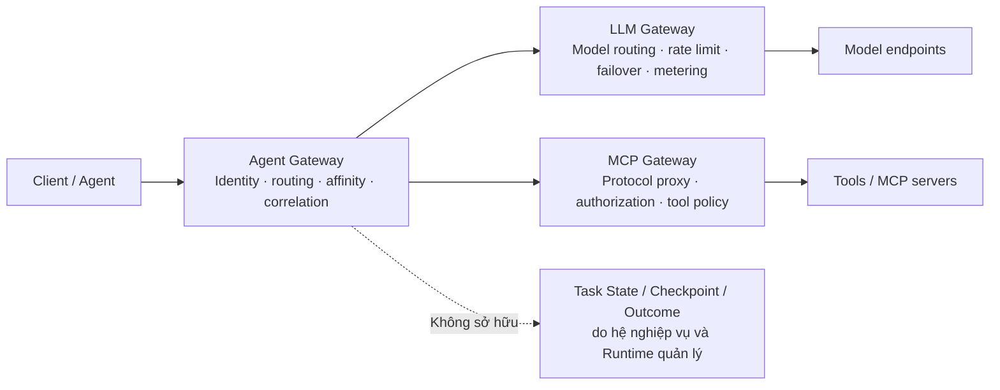
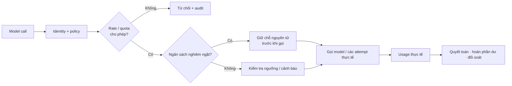
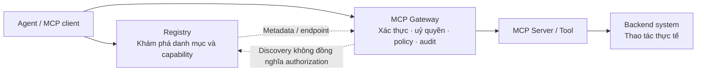
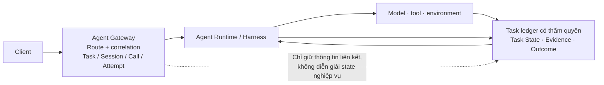
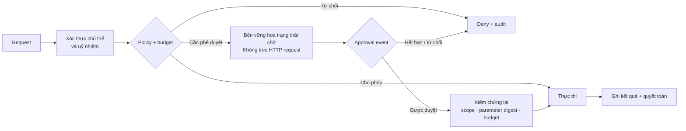
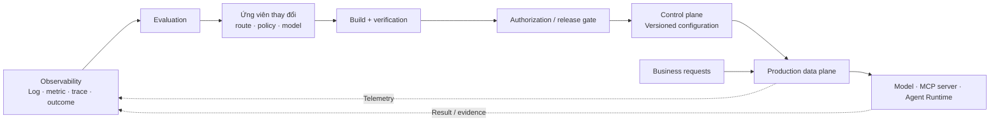

# Chương 9 - AI Gateway và quản trị traffic thống nhất

API Gateway và Service Mesh đã cung cấp cho việc giao tiếp giữa các dịch vụ các năng lực xác thực, routing, kiểm soát traffic và observability. Sự phổ biến của LLM (Large Language Model), MCP (Model Context Protocol) và Agent **không** làm những năng lực đó mất hiệu lực, mà đưa vào các ngữ nghĩa quản trị mới: phản hồi có thể trả về dạng stream liên tục, lượng dùng và chi phí phải hạch toán theo token, lời gọi tool có thể gây tác dụng phụ nghiệp vụ, và một task còn có thể trải qua nhiều lượt tương tác, nhiều phiên cùng các giai đoạn chờ và khôi phục.

**AI Gateway** thiết lập một điểm thực thi policy nhất quán trên đường truy cập tới model, tool và Agent, đồng thời phối hợp với hệ thống thực thi task. Chương này bàn theo đối tượng quản trị về ba ngữ nghĩa có thể tổ hợp: LLM Gateway, MCP Gateway và Agent Gateway; sau đó giới thiệu phần quản trị thống nhất và liên động với mặt phẳng điều khiển. Đây là **khung phân tích mà chương này dùng, không phải một bậc thang trưởng thành thống nhất của ngành**, và cũng không đòi hỏi doanh nghiệp phải xây lần lượt ba sản phẩm độc lập.

Chương này lấy Higress làm bản hiện thực tham chiếu chính, đồng thời đối chiếu với các hướng khác như model proxy, dịch vụ managed và inference gateway. Phần giải thích giao thức lấy MCP phiên bản 2026-07-28 làm baseline; phần hiện thực Higress lấy commit `f053bb08360d432a1226d4b61eb69871c74b9021` làm baseline kiểm chứng. Năng lực sản phẩm, yêu cầu giao thức và khuyến nghị kiến trúc được trình bày riêng rẽ; **các ví dụ cấu hình không được coi là Schema sản phẩm triển khai thẳng được.** Chương về giao tiếp bàn ngữ nghĩa tương tác và khôi phục của giao thức; chương này tập trung vào yêu cầu mà những ngữ nghĩa đó đặt ra với việc chấp nhận, chuyển tiếp, đo đếm và thực thi policy của gateway.

## 9.1 Ranh giới của AI Gateway: model, tool, Agent và lối vào quản trị traffic

### 9.1.1 Từ tích hợp model tới quản trị lời gọi

Khi một ứng dụng đơn lẻ tích hợp một model, việc nối thẳng qua SDK (Software Development Kit) thường đã đủ. Khi dịch vụ model, số đội sử dụng và số tool tăng lên, vấn đề tích hợp sẽ chuyển thành một vấn đề quản trị chung: **bên gọi là ai, credential do ai giữ, khi model hỏng thì được chuyển sang đâu, tool và tham số nào được dùng, chi phí quy về dự án nào, và việc từ chối cùng retry truy nguyên ra sao.**

Những vấn đề này phù hợp để xử lý tập trung tại lối vào lời gọi, nhưng **không phải mọi vấn đề của Agent đều thuộc về gateway.** Tiêu chí thành công của task, trạng thái nghiệp vụ, nội dung checkpoint và quy trình khôi phục phải do mô hình nghiệp vụ và hệ thống thực thi cùng định nghĩa; gateway chỉ bảo đảm tính nhất quán của việc chấp nhận, chuyển tiếp và ghi nhận - nó **không được** chỉ dựa vào việc request thành công mà khẳng định task đã hoàn thành, và cũng không thay được hệ thống thực thi trong việc bảo đảm khôi phục state.

### 9.1.2 Traffic AI thêm vào những ràng buộc nào

Traffic AI không phải toàn bộ là long connection hay có state. Thứ thực sự ảnh hưởng tới thiết kế gateway là: **cùng một lối vào phải đồng thời đảm nhiệm các request ngắn, phản hồi stream dài, context lớn và các lời gọi nhiều bước**, rồi chọn cách xử lý phù hợp cho từng loại.

| Đặc điểm traffic | Ảnh hưởng kỹ thuật | Năng lực gateway cần cung cấp |
| --- | --- | --- |
| Long connection và output dạng stream | Sau khi HTTP trả về thành công vẫn có thể xuất hiện lỗi trong stream; byte phản hồi đầu tiên chưa chắc là token hữu ích đầu tiên | Phân biệt timeout của kết nối, byte đầu, token đầu, khoảng nghỉ trong stream và tổng thời hạn; nhận diện lỗi trong stream |
| Request body và context lớn | Chi phí bộ nhớ khi buffer toàn bộ bị khuếch đại theo mức đồng thời; việc parse nội dung có thể thành nút thắt ở mặt phẳng dữ liệu | Giới hạn kích thước gói tin và event, parse tăng dần, kiểm soát buffer nội dung theo route |
| Tính phí theo token hoặc tài nguyên khác | Ước lượng lúc chấp nhận khác với lượng dùng thực lúc kết thúc; các lời gọi đồng thời có thể cùng tiêu số dư | Mô hình hoá riêng rate limit, quota và ngân sách nghiêm ngặt; hỗ trợ quyết toán và đối soát |
| Tương tác nhiều lượt và task tiến trình dài | Affinity giúp tái dùng cache nhưng không thay được việc bền vững hoá state và khôi phục | Liên kết định danh đáng tin, route affinity, quan sát phân tầng, phối hợp với hệ thống thực thi |

**SSE (Server-Sent Events) chỉ là một hình thức truyền, không trực tiếp đóng vai trò ranh giới của một event nghiệp vụ trọn vẹn.** Lát cắt byte mà mặt phẳng dữ liệu nhận được có thể chứa nửa event, cũng có thể chứa nhiều event; event SSE đầu tiên còn có thể chỉ là heartbeat hay metadata. Vì vậy, việc thống kê **TTFT (Time to First Token)** bắt buộc phải nói rõ điểm bắt đầu và kết thúc, **không thể đánh đồng với độ trễ byte đầu của HTTP.**

Tương tự, việc tái dùng **KV cache (Key-Value Cache)** là tối ưu hiệu năng suy luận, **không phải khôi phục trạng thái nghiệp vụ.** Routing các context tương tự về cùng một instance suy luận có thể giảm phần prefill lặp lại, nhưng cache miss thường chỉ nên biểu hiện thành thay đổi hiệu năng, **chứ không được gây mất Task nghiệp vụ.**

### 9.1.3 Ba ngữ nghĩa quản trị có thể tổ hợp



*Hình 9-1 - Ba ngữ nghĩa quản trị có thể tổ hợp. Đây là khung phân tích chương này dựng theo đối tượng quản trị, không biểu thị một lộ trình nâng cấp năng lực tuyến tính.*

| Ngữ nghĩa quản trị | Đối tượng quản trị trực tiếp | Vấn đề chính | Trách nhiệm KHÔNG gánh |
| --- | --- | --- | --- |
| LLM Gateway | Lời gọi model và các lần thử thực tế của nó | Chọn model hay endpoint nào, giới hạn tốc độ, chịu lỗi và đo đếm ra sao | Đánh giá output của model có thoả tiêu chí thành công nghiệp vụ hay không |
| MCP Gateway | Request MCP và lời gọi tool | Proxy giao thức ra sao, định danh hiện tại có được gọi tool và tham số chỉ định không | Đánh đồng "tool khám phá được" với "đã được uỷ quyền, khoẻ mạnh, thực thi được" |
| Agent Gateway | Việc tích hợp Agent và traffic gắn với task | Làm định danh, routing, affinity, kiểm soát đồng thời và liên kết xuyên lời gọi ra sao | Định nghĩa Task, State nghiệp vụ, Checkpoint hay ngữ nghĩa khôi phục |

Ba ngữ nghĩa có thể triển khai trên cùng một mặt phẳng dữ liệu, cũng có thể do các component khác nhau gánh. **Điểm then chốt của sự thống nhất không phải là mọi năng lực nằm trong cùng một process, mà là ánh xạ định danh nhất quán, ranh giới policy rõ ràng, bản ghi lời gọi liên kết được, và cùng một lời gọi thượng nguồn không bị tính phí trùng chỉ vì đi qua nhiều component.**

Đặt ba ngữ nghĩa vào một lần gọi trọn vẹn sẽ dễ hình dung hơn. Lấy "Agent chăm sóc khách hàng truy vấn đơn hàng và xin hoàn tiền" làm ví dụ: task trước hết vào qua lối vào Agent, gateway kiểm chứng định danh uỷ nhiệm của task và route nó tới runtime có tool đơn hàng cùng hoàn tiền theo nhãn năng lực; các lời gọi model mà task này sinh ra thì đi qua LLM Gateway để định tuyến model và hạ cấp khi lỗi; việc truy vấn đơn hàng thuộc lời gọi tool chỉ-đọc, MCP Gateway xác thực quyền tool rồi cho qua thẳng; việc xin hoàn tiền là thao tác liên quan tiền, nên gateway treo nó lại và đưa vào phê duyệt - sau khi được duyệt thì kiểm chứng lại phạm vi uỷ nhiệm, digest tham số và phần ngân sách đã giữ theo điều kiện chấp nhận mới, rồi mới thực thi lời gọi hoàn tiền; kết quả tool và lượng dùng sau đó ghi ngược về sổ cái task, để hệ thống nghiệp vụ đánh giá kết quả. Cả chuỗi có thể rút gọn thành: **lối vào Agent → routing model → xác thực quyền tool → chấp nhận lại sau phê duyệt → trả kết quả về.**

### 9.1.4 Ranh giới với hạ tầng sẵn có và hệ thống thực thi

| Component | Trách nhiệm chính | Quan hệ với AI Gateway |
| --- | --- | --- |
| API Gateway | Lối vào request, xác thực, routing và chính sách traffic chung | Có thể đảm nhiệm thích ứng giao thức AI và các plugin quản trị |
| Service Mesh | Định danh dịch vụ, mTLS và quản trị traffic giữa các dịch vụ | Cung cấp năng lực bảo mật và khám phá nền cho việc giao tiếp giữa các dịch vụ AI |
| Registry | Quản lý danh mục tài nguyên, endpoint, version và năng lực đã khai báo | Được gateway hoặc mặt phẳng điều khiển truy vấn, tích hợp; không vì tích hợp mà thành trách nhiệm nghiệp vụ của gateway |
| Harness / Orchestrator | Thực thi vòng lặp điều khiển, lập lịch bước và orchestration cộng tác | Truy cập model và tool qua gateway, và báo cáo thông tin liên kết thực thi |
| Agent Runtime | Vòng đời thực thi, quản lý tài nguyên, bền vững hoá checkpoint và khôi phục hạ tầng | Nhận traffic được route, chạy task theo hợp đồng khôi phục nghiệp vụ |
| Ứng dụng nghiệp vụ | Định nghĩa Task, tiêu chí thành công và sổ cái task | Giữ thẩm quyền nghiệp vụ, có thể uỷ quyền cho Verifier đánh giá Outcome |
| Verifier được uỷ quyền | Đánh giá Outcome dựa trên tiêu chí thành công, State và Evidence | Tiêu thụ kết quả thực thi và bằng chứng; **không** tự nhiên có quyền đánh giá chỉ vì chấm điểm hay quan sát |

Higress tổ chức các năng lực thích ứng giao thức, giới hạn tốc độ, thống kê thành các plugin WebAssembly (Wasm) chạy trên mặt phẳng dữ liệu Envoy, và quản lý cấu hình liên quan qua một mặt phẳng điều khiển dựa trên Istio. **Đây là một hướng hiện thực tái dùng được, chứ không phải kiến trúc mà mọi AI Gateway phải theo.** Model proxy cũng có thể cung cấp năng lực tương tự qua middleware ở tầng ứng dụng; còn dịch vụ managed thì có thể gánh luôn cả việc mua model, tài khoản và tính phí.

So sánh hệ sinh thái phải gắn với version cụ thể. Dự án Envoy AI Gateway trước đây nay mang tên **Agent Router**; bản v1.0.0 phát hành chính thức ngày 23 tháng 6 năm 2026 và được đánh dấu GA (General Availability); **sản phẩm ra v1.0 không có nghĩa mọi API của mặt phẳng điều khiển đã lên v1.** Các gateway sẵn có như Kong, APISIX cũng cung cấp năng lực liên quan tới AI; việc lựa chọn vẫn phải rơi vào version cụ thể, đường dữ liệu và ranh giới vận hành, chứ không chỉ so tên.

### 9.1.5 Quản trị tập trung không đồng nghĩa với tập trung mọi việc thực thi

Doanh nghiệp có thể thống nhất phần quản lý credential và lối vào model trước, rồi thiết lập việc quy kết lượng dùng và uỷ quyền tool, cuối cùng mới dần đưa vào thí nghiệm routing và hồi quy đánh giá. **Mỗi bước đều nên có mục tiêu nghiệm thu độc lập** - ví dụ credential đã không còn nằm rải rác ở client chưa, lượng dùng đã quy về dự án được chưa, việc từ chối đã có căn cứ truy nguyên chưa - **chứ không lấy số lượng plugin làm thước đo tiến độ.**

Mở rộng trên một gateway sẵn có thì tái dùng được chứng chỉ, định danh và hệ vận hành, nhưng long connection AI, buffer nội dung và việc giao thức liên tục thay đổi có thể ảnh hưởng tới các nghiệp vụ khác. Triển khai độc lập thì thuận cho việc cô lập dung lượng và phát hành, nhưng lại tăng gánh nặng hạ tầng. Cách dung hoà thường gặp là **dùng chung phần quản lý định danh và policy, còn mặt phẳng dữ liệu thì tách theo loại traffic.**

Bản thân gateway cũng phải được thiết kế như một hạ tầng trọng yếu. Đa bản sao giải quyết sự cố instance; state dùng chung có kiểm soát thì hỗ trợ quota xuyên instance; còn hành vi khi kho lưu trữ dùng chung, dịch vụ policy bên ngoài và dịch vụ kiểm tra nội dung gặp sự cố thì phải được định nghĩa từng mục. **Không thể vì gateway đa bản sao mà cho rằng các phụ thuộc của nó đã hết điểm chết đơn lẻ; cũng không thể vì state đã ghi vào Redis mà cho rằng mọi yêu cầu nhất quán tự nhiên thành lập.**

## 9.2 LLM Gateway: routing model, hạ cấp, chịu lỗi và kiểm soát chi phí

### 9.2.1 Đặt việc lựa chọn, độ tin cậy và chi phí trên cùng một đường

LLM Gateway phải phối hợp ba vấn đề trong một lần gọi: chọn model hay endpoint thoả yêu cầu, kiểm soát ảnh hưởng của thất bại và retry, và chịu trách nhiệm cho mọi mức tiêu hao thực tế. **Một model rẻ nhưng gây ra nhiều lần làm lại thì tổng chi phí task có thể còn cao hơn; việc tự động chịu lỗi nếu bỏ qua tính tương thích giao thức và ngữ nghĩa tính phí thì cũng có thể biến một sự cố khả dụng thành sự cố chất lượng hoặc chi phí.**



*Hình 9-2 - Chấp nhận lời gọi model và quyết toán ngân sách. Kiểm tra ngưỡng và ngân sách nghiêm ngặt là hai cam kết khác nhau; cái sau đòi hỏi giữ chỗ nguyên tử TRƯỚC khi gọi, chứ không chỉ trừ đi sau khi có phản hồi.*

### 9.2.2 Interface thống nhất và sự khác biệt năng lực

`/v1/chat/completions` kiểu OpenAI và `/v1/messages` kiểu Anthropic là những hợp đồng tích hợp phổ biến. Gateway có thể chuyển đổi request và response qua adapter, nhưng các trường như tool call, input hình ảnh, nội dung suy luận, lượng dùng cache và lý do dừng **không phải lúc nào cũng ánh xạ được mà không mất mát.** Một interface thống nhất trước hết nên **khai báo tập con năng lực mà nó hỗ trợ**, rồi thoả thuận cách trả lỗi cho các tham số không hỗ trợ - **chứ không im lặng bỏ qua khác biệt.**

`ai-proxy` của Higress hỗ trợ nhiều dịch vụ model và cách thích ứng giao thức. Bảng đăng ký provider trong commit tham chiếu gồm dịch vụ của các hãng, engine self-host, adapter tổng quát và dịch vụ tổng hợp - vì vậy **số lượng kiểu không thể giải thích thẳng thành số hãng model độc lập**; cần kiểm chứng theo provider và trường thực sự cần cho việc tích hợp.

Giá trị khác của một hợp đồng thống nhất là để các module đo đếm, giới hạn tốc độ và thống kê tái dùng được ngữ nghĩa trường rõ ràng. Hợp đồng này vẫn phải ghi lại version adapter, provider và model thực tế, alias model được request và nguồn usage gốc, tránh việc sau khi chuyển đổi giao thức thì không đối soát được. **Việc client nhìn thấy cùng một tên model không có nghĩa nền tảng được thay năng lực thực tế của nó mà không kiểm chứng.**

### 9.2.3 Chọn model và chọn endpoint phải tách riêng

| Cách routing | Đối tượng quyết định | Điều kiện áp dụng | Ràng buộc chính |
| --- | --- | --- | --- |
| Ánh xạ tĩnh và trọng số | Alias model, version hay dịch vụ | Cần quan hệ canary và chính–phụ ổn định, giải thích được | Thay đổi ánh xạ bắt buộc phải hồi quy về năng lực và chất lượng |
| Routing theo chi phí | Các model ứng viên thoả ngưỡng năng lực | Đã có ngưỡng chất lượng kiểm chứng được và thước đo giá | Không chỉ nhìn giá một lần gọi, còn phải tính chi phí retry và làm lại |
| Routing ngữ nghĩa | Các model năng lực khác nhau | Bộ phân loại request đã qua đánh giá và có đường lui rõ ràng | Phân loại sai sẽ đổi chất lượng output; bản thân việc phân loại cũng tốn chi phí |
| Chọn endpoint suy luận | Các instance của cùng model hay dịch vụ tương thích | Lấy được tín hiệu về hàng đợi, request đang bay hoặc cache | Cần cân nhắc tính cập nhật của tín hiệu, tính cục bộ của cache và cân bằng tải |

`InferencePool` của Gateway API Inference Extension đã có API v1 ổn định, dùng để mô tả các tài nguyên lối vào như tập backend suy luận; còn **EPP (Endpoint Picker)** thì lập lịch theo cách hiện thực cụ thể của nó. Độ dài hàng đợi, mức chiếm KV cache và nhận biết prefix cache thuộc về tín hiệu lập lịch do bản hiện thực hay plugin cung cấp - **không phải thuật toán bắt buộc của mọi bản v1, và cũng không đồng nghĩa với việc tự động chọn model theo ngữ nghĩa task.**

Ở v1.6.0, dự án tập trung hơn vào API, kiểm chứng tính tuân thủ và EPP nhẹ; còn các bản hiện thực EPP đầy đủ thì chuyển sang llm-d. Khi bàn về cơ chế lập lịch cụ thể, **hãy gắn với version của bản hiện thực; không được gộp tính ổn định của API, độ chín của bản hiện thực mở rộng và hiệu quả thuật toán thành một kết luận.**

Bản hiện thực tham chiếu `ai-load-balancer` của Higress cung cấp thông tin request đang bay toàn cục, liên kết prefix và cách chọn dựa trên chỉ số vận hành. Điểm đáng học ở nó là kết hợp thông tin dùng chung xuyên instance gateway với việc chọn đích ở mặt phẳng dữ liệu. Nhưng **liên kết prefix mà gateway ghi lại chỉ là tín hiệu cho thấy cache có thể dùng được, không chứng minh được engine suy luận vẫn còn giữ cache đó**; sau khi cache bị đuổi, instance restart hay version model đổi thì đều phải cho phép lệch khớp và chọn lại.

### 9.2.4 Độ tin cậy: đánh giá có retry được không trước, rồi mới chọn đích retry

**Phân loại lỗi phải đi trước retry.** Phản hồi rate limit cần xử lý kết hợp thời điểm reset, quota tài khoản và chính sách endpoint thay thế; lỗi server chỉ phù hợp retry khi ngữ nghĩa lời gọi cho phép; lỗi xác thực thì thường nên chấm dứt và sửa credential. Việc vượt quá context cũng **không nên** được "giải quyết" đơn giản bằng cắt bớt lịch sử, vì điều đó làm thay đổi input của task - hãy để ứng dụng hoặc Harness quyết định là nén context, chuyển sang một model long-context tương thích, hay báo lỗi rõ ràng.

Một khi phản hồi stream đã đẩy tới client, gateway thường **không** phát lại trong suốt cả đoạn kết quả được. Quan trọng hơn: **"chưa nhận được response body" không đồng nghĩa với "thượng nguồn chưa thực thi"** - request có thể đã bị tính phí, thậm chí đã gây ra một số tác dụng phụ. Việc cho phép retry phải cân nhắc đồng thời tính idempotent của interface, sự bất định trong việc thực thi ở thượng nguồn và giao thức phía client, **chứ không chỉ dựa vào mã trạng thái HTTP hay việc đã nhận được gói đầu hay chưa.**

Mỗi lần thử thực tế đều nên có một định danh `attempt` độc lập, và chịu ràng buộc bởi số lần tối đa, tổng thời hạn và hạn mức chi phí. Trước khi chuyển sang provider khác còn phải kiểm tra tính tương thích của tool, output có cấu trúc, vùng dữ liệu và năng lực model. **Một đường dự phòng chưa được kiểm chứng thì nên trả về một thất bại giải thích được, thay vì nhân danh "tự động hạ cấp" mà thay đổi hợp đồng nghiệp vụ.**

Việc loại bỏ credential hay endpoint là một cơ chế khác. Sau khi thất bại liên tiếp chạm ngưỡng, có thể tạm dừng chọn đích đó và khôi phục qua thời gian nguội hoặc health check; **việc thăm dò model thật có thể phát sinh phí, nên phải giới hạn tần suất và tránh để đa bản sao khuếch đại trùng lặp.**

**Việc chồng nhiều tầng khôi phục là chỗ dễ mất kiểm soát nhất của loại cơ chế này.** Nếu client SDK thử tối đa 3 lần cho một lời gọi logic, và gateway lại retry tối đa 3 lần cho mỗi lần chuyển tiếp, thì một lời gọi mà người dùng nhìn thấy có thể tới thượng nguồn tối đa **9 lần**; còn phía nhà cung cấp có gửi lại nữa hay không thì không kiểm soát được. Mỗi tầng đều nghĩ giới hạn của mình là 3, nhưng đầu cuối lại không có ràng buộc 3 nào cả - số lần retry, áp lực đồng thời và chi phí sẽ khuếch đại theo kiểu **tích số.**

| Tầng | Điều kiện được phép retry | Ngân sách phải giữ hoặc truyền đi |
| --- | --- | --- |
| SDK / bên gọi | Lời gọi idempotent, hoặc xác nhận chưa gửi thực thi | Tổng thời hạn, trần số lần thử ở mức nghiệp vụ và trần chi phí |
| Gateway | Chưa đẩy phản hồi tới client, và ngữ nghĩa lời gọi cho phép | Hạn mức thử cho mỗi lần chuyển tiếp và thời hạn tuyệt đối |
| Thượng nguồn / nhà cung cấp | Không kiểm soát được | Xử lý theo giả định "có thể đã thực thi, có thể đã tính phí" |

Vì vậy **ngân sách thử bắt buộc phải truyền xuyên tầng**, chứ không phải mỗi tầng tự diễn giải một giá trị timeout: tổng thời hạn nên là **thời gian tuyệt đối**, và khi gateway chuyển tiếp thì chỉ giữ lại phần dư cần thiết cho truyền tải và xử lý; hạn mức thử còn lại có thể do bên gọi đưa ra, và gateway trừ nguyên tử theo `call_id`, hết thì trả về lỗi cạn ngân sách rõ ràng **thay vì thử thêm một lần nữa.** Mỗi lần thử thực tế đều phải liên kết bằng `call_id` và `attempt_id` ổn định, để việc quan sát xuyên tầng tái dựng được nhiều lần thử thành một lời gọi logic; việc retry, loại bỏ endpoint và chuyển model cũng phải ghi riêng - nếu không, một sự cố sẽ bị nhiều tầng khôi phục khuếch đại nhiều lần mà không quy kết được.

### 9.2.5 Timeout và parse stream: làm rõ ranh giới đo

Timeout kết nối ràng buộc việc thiết lập kết nối; timeout byte đầu dùng để nhận diện thượng nguồn im lặng quá lâu; TTFT mô tả thời gian chờ trước khi việc sinh nội dung hữu ích bắt đầu; timeout nghỉ trong stream ràng buộc khoảng cách giữa các event liên tiếp; còn tổng thời hạn thì kiểm soát mức chiếm tài nguyên của cả lời gọi. Chúng có thể cùng tồn tại nhưng **không thay thế cho nhau.** Ví dụ, một stream liên tục gửi heartbeat có thể mãi không chạm timeout nghỉ mà vẫn chưa hề xuất ra nội dung hữu ích nào.

Việc parse SSE cần ghép lại event xuyên các lát byte, và đặt trần cho độ dài một event, buffer tích luỹ và thời gian parse. Chế độ đo đếm nhẹ có thể chỉ lưu số đếm và một ít state parse mà không lưu trọn hỏi–đáp; còn việc viết lại nội dung và audit thì cần buffer thêm. **Câu "không buffer toàn văn" không có nghĩa là hoàn toàn không tốn bộ nhớ**; hãy đo mức chiếm thực tế ở mức đồng thời mục tiêu.

Một số giao thức model đòi hỏi yêu cầu usage dạng stream một cách tường minh, ví dụ các interface hỗ trợ `stream_options.include_usage`. Gateway chỉ nên tiêm trường đó cho các adapter có hỗ trợ, và phải nhận diện được đuôi stream bình thường, gián đoạn bất thường và việc huỷ. **Thiếu usage không được ghi thành tiêu hao bằng không; client huỷ cũng không chứng minh được thượng nguồn đã dừng sinh.** Những bản ghi đó cần giữ trạng thái ước lượng hoặc chưa quyết toán, để sau này đối soát với hoá đơn nhà cung cấp hoặc bản ghi thực thi.

### 9.2.6 Ngữ nghĩa ngân sách: rate, quota và trần nghiêm ngặt không phải một thứ

| Cơ chế | Mục tiêu kiểm soát | Cách hiện thực thường gặp | Cam kết được gì |
| --- | --- | --- | --- |
| Giới hạn tốc độ request | Số request trong một đơn vị thời gian | QPS (Queries per Second) hay token bucket | Kiểm soát tốc độ chấp nhận, **không** trực tiếp kiểm soát tổng chi phí token |
| Giới hạn token theo cửa sổ thời gian | Lượng dùng tích luỹ trong một khoảng thời gian | Kiểm tra trước request, cộng dồn token thực sau khi kết thúc | Kiểm soát mức tăng lượng dùng; vẫn có cửa sổ vượt do phần đang bay và đồng thời |
| Quota dạng số dư | Hạn mức khả dụng của một chủ thể | Xem số dư khi chấp nhận, trừ sau khi kết thúc | Kiểm soát hạn mức gần thời gian thực, **không** tự nhiên là ngân sách đồng thời nghiêm ngặt |
| Ngân sách nghiêm ngặt | Không vượt hạn mức đã uỷ quyền | Mức tiêu hao tối đa chứng minh được, giữ chỗ nguyên tử, quyết toán và hoàn lại | Bảo đảm trần khi cả ranh giới tính phí lẫn ràng buộc thực thi đều thành lập |

**"Kiểm tra trước request, trừ sau phản hồi" một mình không bảo đảm được trần cứng.** Giả sử số dư là 100, và hai request có mức tiêu hao tối đa 80 mỗi cái cùng lúc qua được bước kiểm tra số dư, thì tiêu hao cuối cùng có thể lên tới 160. Việc trừ nguyên tử sau phản hồi tránh được thất thoát sổ sách, nhưng **không huỷ được phần tiêu hao đã xảy ra.**

Ngân sách nghiêm ngặt cần thoả các bất biến sau tại thời điểm chấp nhận:

```text
Hạn mức khả dụng = Hạn mức đã uỷ quyền − Tiêu hao đã quyết toán − Phần đang giữ chỗ
Điều kiện chấp nhận = Mức tính phí tối đa của lần này ≤ Hạn mức khả dụng
```

Việc kiểm tra và giữ chỗ **bắt buộc phải hoàn tất trong cùng một thao tác nguyên tử hoặc một transaction nhất quán tương đương.** Sau khi lời gọi kết thúc thì quyết toán idempotent theo tiêu hao thực và giải phóng phần giữ chỗ dư. Nếu tiêu hao thực có thể vượt phần giữ chỗ, nghĩa là cái gọi là "giá trị tối đa" không đáng tin - khi đó chỉ được tuyên bố là **vượt có biên** hay **ngân sách mềm**, chứ không được tiếp tục cam kết trần nghiêm ngặt.

Phần giữ chỗ phải phủ input, output tối đa bị ràng buộc và các khoản tính phí khác của interface đó; **retry cũng phải chiếm hạn mức riêng.** Với các request bị gián đoạn stream hoặc chưa rõ kết quả thực thi, **không được** hoàn tiền vô điều kiện chỉ vì lease hết hạn - hãy xác nhận việc thực thi đã kết thúc, hoặc chờ đối soát theo quy tắc bảo thủ. **Chỉ giới hạn mức đồng thời chỉ thu hẹp được phạm vi vượt chi; chỉ khi mức tiêu hao xấu nhất của các lời gọi đang bay cũng bị ràng buộc thì mới có thể hình thành trần nghiêm ngặt.**

Ngân sách nhiều tầng cũng cần tính nhất quán. Khi hạn mức của tổ chức, team, dự án và task cùng có hiệu lực, việc chấp nhận phải kiểm chứng hạn mức khả dụng ở các tầng liên quan, và tránh chỉ giữ chỗ một tầng rồi tầng khác thất bại để lại bản ghi treo. Quota token và ngân sách tiền cũng nên tách riêng: **cùng một số token ở các model, kiểu cache hit và version giá khác nhau có thể sinh ra chi phí khác nhau.**

### 9.2.7 Phạm vi dùng được và ngữ nghĩa sự cố của bản hiện thực Higress

Trong commit tham chiếu, `ai-token-ratelimit` kiểm tra cửa sổ ở giai đoạn request và cộng dồn token thực sau khi phản hồi kết thúc; `ai-quota` kiểm tra số dư theo consumer và trừ sau khi phản hồi kết thúc. **Cả hai đều không thể chỉ dựa vào cơ chế kiểm tra sẵn có và trừ sau mà tuyên bố là ngân sách đồng thời nghiêm ngặt.**

Hành vi phân nhánh của hai plugin này khi Redis gặp sự cố cũng **không nhất quán**, và không thể khái quát thành một ngữ nghĩa thất bại thống nhất; trước khi triển khai, phải kiểm chứng từng mục với version đã chọn về lỗi đọc, lỗi ghi, timeout và việc đối soát sau khi khôi phục - phần giải thích các nhánh xem mục Ghi chú hiện thực của chương này.

Thông tin thiết kế mà một chính sách ngân sách cần biểu đạt (phạm vi sổ cái, khoá giữ chỗ, quyết toán và đối soát…) cũng nằm ở mục Ghi chú hiện thực; **nó không phải trường của plugin Higress và không thể gửi thẳng cho mặt phẳng điều khiển của nó.**

Khi triển khai, hãy ánh xạ những yêu cầu trên vào Schema thật và các test case của component đã chọn; nếu plugin hiện có chỉ hỗ trợ kiểm soát theo ngưỡng thì **hãy khai báo trung thực ranh giới đó**, hoặc giao phần ngân sách nghiêm ngặt cho một dịch vụ ngân sách có năng lực nhất quán.

### 9.2.8 Cache và lựa chọn phương án: tối ưu tổng chi phí, không phải số token một lần gọi

Cache ngữ nghĩa có thể giảm phần sinh ở thượng nguồn do các câu hỏi lặp lại kích hoạt, nhưng **cache hit không có nghĩa cả request tốn 0 chi phí** - việc tính vector, truy hồi và duy trì cache vẫn tốn kém. Khoá cache còn **bắt buộc phải phân biệt tenant, phạm vi quyền, version model, system prompt và version tri thức**, không được để sự tương tự ngữ nghĩa vòng qua việc cô lập dữ liệu. Với các lời gọi tool có tác dụng phụ thì **không nên** phát lại đơn giản kết quả cache; với các task nhạy thời gian hoặc mang tính sáng tạo thì phải làm rõ ranh giới áp dụng và chính sách hết hiệu lực.

Các hướng model proxy, dịch vụ tổng hợp managed và plugin gateway có trọng tâm khác nhau. Hướng proxy mà LiteLLM là đại diện thuận cho việc tích hợp trong hệ sinh thái ứng dụng; các dịch vụ như Portkey cung cấp mức kiểm soát và quan sát managed khác nhau; OpenRouter tổng hợp việc truy cập model; còn Higress thì nhấn mạnh việc kết hợp với quản trị lối vào sẵn có và khả năng mở rộng ở mặt phẳng dữ liệu. **Lựa chọn phải kiểm chứng độ phủ giao thức thực tế, việc dữ liệu ra khỏi biên, thước đo chi phí, dung lượng và hành vi khi sự cố - không suy từ hình thái triển khai ra "năng lực đầy đủ" hay "hiệu năng cao hơn".**

Độ ổn định routing, tỉ lệ cache hit, khả năng khôi phục sau lỗi và lượng làm lại task cần được đánh giá cùng nhau. **Một chiến lược đơn giản, giải thích được và lui được thường dễ tạo ra một baseline production đáng tin hơn một cơ chế tự động chuyển đổi thiếu căn cứ đo đạc.**

## 9.3 MCP Gateway: proxy giao thức tool, khám phá tài nguyên và cô lập quyền hạn

### 9.3.1 Nối được tool rồi, vẫn cần kiểm soát quyền thực thi

MCP dùng JSON-RPC (JSON Remote Procedure Call) để biểu đạt tương tác giữa client và server, cung cấp các năng lực tool, resource và prompt. Nó hạ chi phí tích hợp, **nhưng không tự động giải quyết các vấn đề uỷ quyền doanh nghiệp, quản lý credential, sức khoẻ của tool hay tác dụng phụ nghiệp vụ.**

Một tool xuất hiện trong danh sách chỉ nói lên rằng server đã thông báo nó; còn bên gọi có quyền thực thi không, hệ thống phụ thuộc có khả dụng không, lời gọi này có thành công không - vẫn phải đánh giá độc lập. Vì vậy MCP Gateway nên quản trị **tách bạch** phần proxy giao thức, tích hợp danh mục tài nguyên, uỷ quyền và kết quả thực thi thực tế.



*Hình 9-3 - Tách bạch việc khám phá, uỷ quyền và thực thi trong MCP. Registry cung cấp thông tin danh mục, gateway thực thi policy ở lối vào, còn tool và hệ thống backend lo thao tác thực tế; ba thứ không thay thế cho nhau.*

### 9.3.2 Baseline version và phạm vi tương thích

Các version MCP khác nhau có sự khác biệt về handshake, phiên, subscription và cơ chế task. Bản 2025-03-26 đưa vào Streamable HTTP; bản 2025-11-25 đưa vào Tasks ở dạng thử nghiệm; bản 2026-07-28 dùng metadata theo từng request cùng `server/discover`, và chuyển Tasks sang một extension tuỳ chọn. Mạch tiến hoá đầy đủ của giao thức xem chương giao tiếp phân tán; mục này chỉ giữ lại những khác biệt mà bản hiện thực gateway bắt buộc phải kiểm chứng.

Endpoint Legacy dùng handshake `initialize` và endpoint Modern dùng metadata theo từng request cần cách proxy khác nhau. Gateway phải khai báo tập version hỗ trợ, hướng bridge và tập con năng lực, rồi kiểm chứng riêng phần khám phá, gọi, subscription và extension task. **Hỗ trợ việc gọi tool lõi không đồng nghĩa với hỗ trợ mọi extension; giao thức phi trạng thái cũng không đồng nghĩa với backend nghiệp vụ phi trạng thái.**

### 9.3.3 Metadata theo từng request: mô tả giao thức không phải chứng minh định danh của bên gọi

Việc chấp nhận một request MCP có thể hiểu theo bốn bước: **xác thực - kiểm tra giao thức - uỷ quyền - chuyển tiếp.** Xác thực trả lời "ai đang gọi", do credential độc lập với giao thức hoàn tất việc ánh xạ chủ thể; kiểm tra giao thức thì theo version mà kiểm tra header mirror, method và ràng buộc gói tin; uỷ quyền thì quyết định cho qua hay không dựa trên chủ thể, tool và tham số; chuyển tiếp thì dựng lại request thượng nguồn theo policy đã khai báo. **Metadata theo từng request của giao thức Modern chỉ phục vụ bước hai và bốn** - chúng mô tả hình thái giao thức và năng lực của request, **không thay thế được việc đánh giá định danh và quyền hạn ở bước một và ba.**

| Năng lực hoặc phần tử | Phạm vi gateway hỗ trợ | Giải thích và ràng buộc |
| --- | --- | --- |
| Nhận diện thế hệ giao thức | Cả Legacy và Modern đều tích hợp được | Nhận diện theo khai báo endpoint và cấu hình; hướng bridge phải khai báo tường minh |
| Khám phá năng lực | `initialize` (Legacy) và `server/discover` (Modern) | Là input cho routing và danh sách hiển thị; **không** đại diện cho uỷ quyền, sức khoẻ hay khả năng thực thi |
| Gọi tool | Cả hai thế hệ đều hỗ trợ | Chuyển tiếp sau khi xác thực quyền; request Modern thì kiểm tra mirror tên theo method |
| Subscription thay đổi | `subscriptions/listen` (Modern) | Mặc định tắt, bật tường minh theo route |
| Extension task | Extension `tasks` (Modern) | Mặc định tắt, chỉ bật khi cả hai bên hỗ trợ tường minh |
| Bridge giao thức | Chỉ từ Modern hạ nguồn tới Legacy thượng nguồn (commit tham chiếu) | Đường ngược lại không được khai báo là hỗ trợ |

Các yêu cầu ở mức trường của metadata theo request (trường nào bắt buộc, trường nào khuyến nghị, header mirror nào áp cho method nào) cùng ví dụ gói tin đầy đủ thuộc về chi tiết hiện thực, xem mục Ghi chú hiện thực. Gateway chỉ cần nắm một ranh giới: **mô tả giao thức không phải chứng minh định danh của bên gọi.**

Gateway **không được** bắt buộc mirror tên cho những method không cần tên, và cũng không được diễn giải mọi trường tên thành `params.name`; header có thể hỗ trợ phân loại nhẹ và routing, nhưng **trước khi thực thi vẫn phải kiểm chứng rằng nó khớp với phần thân**, tránh để việc xác thực theo header và việc thực thi lại đối diện hai đối tượng khác nhau.

`server/discover` cung cấp version và năng lực mà endpoint hiện đang thông báo; **nó không chứng minh các phụ thuộc khoẻ mạnh, đã được uỷ quyền hay nhất định sẽ thành công.** Việc khai báo năng lực, kiểm tra quyền và quan sát kết quả phải giữ riêng rẽ.

Chính sách version và deprecation cũng cần được hiểu chính xác: cửa sổ deprecation của các tính năng quy chuẩn lõi **không đồng nghĩa với việc bản hiện thực phải chấp nhận mọi version cũ lâu dài**; tập version thực sự hỗ trợ phải được khai báo rõ, còn ngoại lệ về bảo mật thì có quy tắc riêng.

### 9.3.4 Phân công giữa Registry, plugin proxy và cấu hình service discovery

Registry thuộc về trách nhiệm quản lý tài nguyên và dữ liệu; nó duy trì endpoint dịch vụ, version, năng lực đã khai báo, chủ sở hữu và thông tin vòng đời. Mặt phẳng điều khiển hay gateway có thể truy vấn nó để sinh route và danh sách hiển thị, nhưng **bản thân danh mục không cấp quyền thực thi cho Task hiện tại, và cũng không thay thế việc kiểm tra uỷ quyền ở resource server.**

Trong commit tham chiếu của Higress, `mcp-server` cung cấp năng lực host tool, chuyển đổi REST sang MCP và proxy MCP; plugin `mcp-router` thì có thể xử lý việc route lời gọi tool theo tiền tố `server/tool`. **Sự thật này không được mở rộng thành việc nó tự hiện thực toàn bộ năng lực tổng hợp tool, uỷ quyền hay quản lý đăng ký.** `McpBridge` là tài nguyên cấu hình service discovery, **không được gọi lẫn với plugin chuyển đổi giao thức.**

Health check cũng nên phân tầng. Kết nối thành công trả lời "endpoint tới được"; khám phá giao thức trả lời "có thông báo được năng lực tương thích không"; chỉ một phép thăm dò nghiệp vụ có kiểm soát mới có thể kiểm chứng phần phụ thuộc của tool. Với các tool ghi, thanh toán… thì **không nên** thực thi tác dụng phụ thật chỉ để health check; hãy dùng đường thăm dò chuyên biệt hoặc chỉ-đọc, và ghi riêng trạng thái quyền hạn cùng phụ thuộc.

### 9.3.5 Ranh giới an toàn: từ chối mặc định và điều kiện triển khai không vòng qua được

Việc uỷ quyền tool thường phải biểu đạt quan hệ giữa bên gọi, dịch vụ đích, tool và tham số. ACL (Access Control List) có thể bắt đầu từ whitelist ở mức dịch vụ, rồi chi tiết hoá tới các tool và tham số rủi ro cao; còn việc kiểm tra Schema input chỉ bảo đảm kiểu và cấu trúc hợp lệ, **không chứng minh việc uỷ quyền nghiệp vụ đã thành lập.**

Lọc `tools/list` giúp giảm việc model chọn nhầm tool không có quyền, nhưng `tools/call` **vẫn bắt buộc phải xác thực lại.** Quyền hạn phải là **giao** của quyền vốn có của bên gọi, quyền của workload, phạm vi uỷ nhiệm của task và giới hạn phía tài nguyên; **không được mở rộng bởi định danh mà model tự khai, bởi mô tả tool hay bởi `clientInfo`.**

Gateway chỉ có điều kiện trở thành một điểm thực thi policy **không vòng qua được** khi: credential không được phát xuống, mạng outbound bị kiểm soát, service discovery và phân giải tên miền đã hội tụ, đường nối thẳng bị cấm, và các đường vòng đều bị audit. **Nếu Agent vẫn giữ credential nối thẳng và lối ra mạng, thì gateway chỉ là một lối vào tập trung, không được tuyên bố là "tự nhiên không vòng qua được".**

Việc xác thực của proxy cũng phải tôn trọng audience và quan hệ uỷ nhiệm của token. Các HTTP resource server áp dụng quy chuẩn uỷ quyền MCP phải kiểm chứng audience, quyền và vòng đời của token; credential thượng nguồn phải đến từ một cơ chế quản lý hoặc uỷ nhiệm credential rõ ràng, **không được tuỳ tiện chuyển tiếp thành token hạ nguồn do gateway phát.** Khoá dài hạn nên do một hạ tầng quản lý bí mật có kiểm soát cung cấp, tránh để lọt vào cấu hình client, log dạng plaintext và repository.

Kiểm tra Origin, kiểm tra Content-Type và Accept, giới hạn kích thước gói tin, kiểm tra cấu trúc JSON-RPC và ràng buộc địa chỉ outbound cùng tạo thành ranh giới lối vào. Trong đó, các yêu cầu của giao thức phải thực thi theo version, còn giới hạn kích thước gói tin do bản hiện thực tự đặt thêm thì **phải ghi rõ nguồn cấu hình**. Việc một bản hiện thực dùng giới hạn 1 MiB **không** có nghĩa quy chuẩn MCP quy định trần đó cho mọi endpoint.

### 9.3.6 Bridge giao thức: hướng hỗ trợ và tập con năng lực phải khai báo tường minh

Bridge xuyên thế hệ không phải chỉ đổi header HTTP. Khi Modern hạ nguồn gọi Legacy thượng nguồn, proxy phải xử lý việc khởi tạo, ánh xạ message, định danh phiên và ngữ nghĩa phản hồi thượng nguồn. `mcp-server` trong commit tham chiếu của Higress hỗ trợ tường minh hướng này, và cô lập phần handshake Legacy thượng nguồn trong một lần trao đổi duy nhất; còn đường ngược từ Legacy hạ nguồn tới thượng nguồn chỉ-Modern thì không được khai báo là hỗ trợ - nên trong hình chỉ vẽ bridge một chiều.

Cô lập trong một lần trao đổi giúp gateway không phải giữ phiên giao thức thượng nguồn lâu dài, nhưng cũng đưa vào chi phí handshake lặp lại và hạn chế việc proxy trong suốt các năng lực xuyên request. **Hỗ trợ khám phá và gọi tool không đồng nghĩa với hỗ trợ mọi subscription, request chủ động từ server hay extension Tasks.** Policy giao thức, hướng bridge và phạm vi năng lực phải là **cấu hình tường minh và mục nghiệm thu**, chứ không thể dựa vào thăm dò ngầm và retry để che đi sự không tương thích.

Request outbound phải được dựng lại theo RPC thượng nguồn; mặc định **không** chuyển tiếp Cookie hạ nguồn, định danh phiên, header routing nội bộ và các header tham số không áp dụng được. Thông tin xác thực chỉ được sinh ra hoặc uỷ nhiệm theo policy rõ ràng; log thì tránh ghi địa chỉ và header có chứa khoá. **Thứ proxy giữ lại là ngữ nghĩa giao thức đã được kiểm chứng, chứ không phải các chi tiết tuỳ ý của gói tin hạ nguồn.**

### 9.3.7 Case thực tế: REST-to-MCP và quản trị ở mức tham số

Khi phơi một REST API sẵn có thành tool MCP, tầng adapter phải định nghĩa mô tả tool, Schema input, cách dựng request và cách cắt gọt kết quả. Lấy truy vấn địa chỉ làm ví dụ: bên gọi chỉ cần cung cấp địa chỉ có cấu trúc và thành phố tuỳ chọn; credential phía server thì được tiêm từ cấu hình có kiểm soát; còn phản hồi có thể cắt gọn còn kinh độ – vĩ độ và thông tin hành chính cần thiết, để giảm context không liên quan.

Template request **bắt buộc phải encode tham số đúng cách**, và giới hạn host, path cùng đích outbound có thể biến đổi, tránh biến một tool dạng template thành lối vào cho **SSRF (Server-Side Request Forgery)**. Với tool database, việc dùng tiền tố chuỗi để đánh giá "SQL chỉ-đọc" là **không đáng tin**; hãy kết hợp tài khoản database bị giới hạn, interface truy vấn được hỗ trợ và quyền hạn ở phía tài nguyên.

| Bối cảnh tool | Kiểm tra Schema | Policy nghiệp vụ còn phải ràng buộc thêm |
| --- | --- | --- |
| Truy vấn dữ liệu | Kiểu trường, tham số phân trang | Phạm vi database hay dataset, quyền theo dòng, các thao tác được thực thi |
| Thanh toán | Định dạng số tiền, cấu trúc bên nhận | Ngưỡng số tiền, phạm vi bên nhận, phê duyệt và khoá idempotent |
| Quản lý cụm | Tham số cluster, namespace, tài nguyên | Môi trường được phép, loại tài nguyên, động từ thao tác và uỷ quyền tạm thời |
| Đọc file | Định dạng path hay định danh file | Thư mục được phép, quy thuộc tenant, symlink và phân cấp dữ liệu |

Ngôn ngữ tự nhiên có thể giúp quản trị viên biểu đạt ý định quản trị, ví dụ "môi trường production chỉ cho phép truy vấn"; nhưng **nó phải được chuyển thành policy có cấu trúc trước**, rồi qua kiểm tra xung đột, xem trước ảnh hưởng, kiểm chứng hồi quy và phát hành có uỷ quyền mới được thực thi. Lúc chạy **không nên** phụ thuộc tạm thời vào việc model tự do diễn giải quyền hạn; cùng một định danh, tài nguyên và tham số phải cho ra một đánh giá nhất quán, giải thích được.

Output của tool vẫn thuộc loại dữ liệu phải xử lý theo nguồn và rủi ro, **không được vì đã đi qua gateway mà tự động nâng thành chỉ dẫn có độ tin cậy cao.** Kiểm tra nội dung có thể cung cấp tín hiệu rủi ro, nhưng việc phòng chống prompt injection còn dựa vào cô lập quyền hạn, ràng buộc tham số, cách Harness xử lý kết quả tool và quyền tối thiểu ở phía tài nguyên - **một plugin kiểm tra đơn lẻ không bao sân được.**

### 9.3.8 Lối vào tập trung là một tầng của phòng thủ chiều sâu

Khi số tool ít và ranh giới rõ ràng, có thể hoàn tất việc tích hợp và kiểm soát quyền ngay trong ứng dụng hoặc framework. Khi nhiều Harness, nhiều team và nhiều tool dùng chung một nền tảng, lối vào tập trung giúp giảm việc sao chép policy và hội tụ credential. Cái giá là **gateway trở thành một mục tiêu bảo mật giá trị cao**, cần bảo vệ cấu hình, bí mật, interface quản trị và dữ liệu audit.

Framework, gateway và resource server đều phải giữ lại những kiểm tra cần thiết của mình. Framework hiểu ý định task hiện tại; gateway thực thi policy thống nhất xuyên framework; resource server giới hạn thao tác cuối cùng. **Ba bên phối hợp tạo ra phòng thủ chiều sâu, chứ không phải để một tầng nào đó tuyên bố cả chuỗi gọi đã tuyệt đối an toàn.**

## 9.4 Agent Gateway: routing lối vào, liên kết task, tenant và quota

### 9.4.1 Quản trị lối vào cho task tiến trình dài

Một Agent Task có thể gồm nhiều Session, nhiều lượt gọi model và tool, và cũng có thể vào trạng thái chờ rồi khôi phục vì phê duyệt, bổ sung thông tin từ con người hay sự cố hạ tầng. Chi phí phân tán qua các giai đoạn đó, nên chỉ số của một request đơn lẻ khó giải thích được hiệu suất tổng thể; việc retry liên tục và vòng lặp mất kiểm soát còn có thể chiếm mất ngân sách và mức đồng thời của cùng tenant.

Vai trò của Agent Gateway là đưa định danh đáng tin và thông tin liên kết task vào policy lối vào, cung cấp một interface thống nhất cho routing, quota và quan sát xuyên request. Nó có thể từ chối lời gọi mới, báo cáo áp lực ngân sách, chuyển request tới một Runtime đã khai báo có năng lực tương ứng - nhưng **Task tạm dừng, lưu state và khôi phục ra sao thì phải do mô hình task nghiệp vụ và hệ thống thực thi quyết định.**



*Hình 9-4 - Sổ cái Task và ranh giới trách nhiệm thực thi. Thông tin liên kết task có thể đi xuyên gateway, nhưng trạng thái nghiệp vụ và ngữ nghĩa khôi phục KHÔNG vì thế mà chuyển sang gateway.*

### 9.4.2 Các đối tượng liên kết task và nguồn trách nhiệm

Theo cách dùng task, state và đối tượng thực thi của phần Xây dựng, mục này chỉ liệt kê các định danh mà gateway cần liên kết cùng nguồn thẩm quyền của chúng.

| Đối tượng | Trả lời câu hỏi gì | Nguồn thẩm quyền hoặc trách nhiệm |
| --- | --- | --- |
| Task | Cần hoàn thành gì, tiêu chí thành công là gì, hiện đang ở giai đoạn nghiệp vụ nào | Mô hình task của ứng dụng nghiệp vụ; có thể biểu đạt việc phân rã qua quan hệ cha–con |
| Session | Đoạn tương tác hay context thực thi nào thuộc cùng một phiên | Ứng dụng hoặc hệ thống thực thi sở hữu phiên; một Task có thể xuyên nhiều Session |
| Turn | Lượt tương tác hay vòng lặp điều khiển nào trong phiên đó | Harness định nghĩa và ghi lại ranh giới |
| Call / Attempt | Lời gọi logic nào, lần thực thi thực tế nào đã sinh ra lượng dùng | Hệ thống gọi và điểm thực thi thực tế cung cấp bản ghi liên kết |
| State | Các sự thật nghiệp vụ đã hoàn thành, việc chờ xử lý và luật chuyển trạng thái | Mô hình Task / State nghiệp vụ |
| Checkpoint | Khi khôi phục thì cần state, version và tham chiếu nào | Mô hình nghiệp vụ định nghĩa nội dung và hợp đồng khôi phục; Runtime lo phần bền vững hoá và khôi phục hạ tầng tương ứng |
| Outcome | Có đạt tiêu chí thành công nghiệp vụ hay không | Ứng dụng nghiệp vụ hoặc Verifier được uỷ quyền đánh giá dựa trên State và Evidence |

Việc bền vững hoá state, checkpoint và đối chiếu tác dụng phụ do mô hình nghiệp vụ, Harness và Runtime cùng hoàn tất; cơ chế cụ thể xem các chương về lưu trữ trạng thái và môi trường vận hành. Gateway cần giữ lại thông tin liên kết, để sự cố ở lối vào và việc retry không làm mất quan hệ giữa lời gọi với task.

Gateway có thể lưu khoá affinity routing, ánh xạ định danh task, số đếm đang bay, phần ngân sách giữ chỗ và thông tin liên kết quan sát. Ngay cả khi một bản hiện thực nào đó vì nhu cầu routing mà cache một tham chiếu thực thi mờ, **nó cũng không được diễn giải State nghiệp vụ, định nghĩa cấu trúc Checkpoint hay quyết định khôi phục từ bước nghiệp vụ nào.** Việc instance lối vào restart **không được** trở thành nguyên nhân làm mất sự thật về task.

### 9.4.3 Routing Agent: chọn năng lực lối vào, chứ không đánh giá kết quả thực thi

Routing Agent có thể chọn đích dựa trên tenant, loại workload, nhãn năng lực, tool khả dụng, yêu cầu môi trường và sức khoẻ runtime. Nhãn năng lực trong danh mục chỉ cung cấp tập ứng viên; vẫn phải kiểm chứng tính tương thích version, uỷ quyền và môi trường đích. Affinity có thể hiện thực bằng consistent hashing hay tra bảng theo khoá liên kết Session/Runtime đáng tin, **nhưng hành vi sau khi affinity thất bại thì phải do hệ thống thực thi đưa ra hợp đồng.**

Ví dụ, request phiên của một Coding Agent có thể cần quay về đúng runtime truy cập được workspace; khi đích không khả dụng, gateway có thể trả về "tạm chưa route được" hoặc chuyển sang một lối vào khôi phục được hỗ trợ, **chứ không được tuỳ tiện chuyển request sang một runtime rỗng rồi tuyên bố "đã chạy tiếp".** Một lần 429 cũng không nhất thiết nghĩa là workspace đã mất; tính liên tục thực sự phụ thuộc vào việc bền vững hoá workspace, checkpoint và ranh giới retry.

**ACP (Agent Client Protocol)** chủ yếu phục vụ tương tác giữa các client như editor, IDE (Integrated Development Environment) với coding agent; tính tới ngày kiểm chứng, ACP v2 vẫn ở trạng thái Draft. **A2A (Agent2Agent Protocol)** hướng tới giao tiếp giữa các Agent và cộng tác task; bản v1.0.0 của nó đã phát hành chính thức. **Phạm vi áp dụng và mức độ chín của hai thứ khác nhau, không nên gộp thành "một loại giao thức chưa định hình".**

Khi lối vào dịch chuyển từ data center về máy của lập trình viên, việc route task có thêm lựa chọn mới. Trong ngành đã xuất hiện cách tách "nghĩ" khỏi "làm": model tiên phong chỉ lo đọc mục tiêu, phân rã và thẩm định, còn phần thực thi cụ thể có biên thì giao tường minh cho một model rẻ hơn nhiều - tổng chi phí có thể chênh nhau cả một bậc độ lớn. Dự án mã nguồn mở **HiRoute** biến cách phân công này thành một cơ chế sản phẩm, và đẩy thêm một bước: **bên thực thi không chỉ là một model rẻ hơn, mà có thể là một work Agent hoàn chỉnh khác.**

Những cách làm kiểu này thường vẫn dừng ở việc đổi model trong cùng một Harness; còn đích uỷ nhiệm của HiRoute chính là **bản thân work Agent**: Codex, DeepSeek Harness, Claude Code… đều có thể được cùng một Agent chính gọi lên, mỗi cái mang theo phần quản lý context, chuỗi tool, chế độ quyền hạn và phần đăng nhập native của riêng nó. Nhờ đó, một task refactor backend có thể giao cho plan của Codex, còn một loạt sửa nhỏ mang tính cơ học có thể giao cho một plan dùng DeepSeek model chi phí thấp - cả hai đều do cùng một Agent chính phát ra riêng rẽ; người dùng vẫn ở trong giao diện làm việc quen thuộc, còn work Agent được chọn thì do HiRoute khởi động, cô lập và quản lý, **không phải di trú tài khoản, cấu hình gốc giữ nguyên.**

Những lựa chọn đó đều rơi vào **"plan"**: mỗi plan đã phát hành có một tên gọi ổn định cùng mục đích, khai báo work Agent thực thi, các model ứng viên và thiết lập suy nghĩ native. Agent chính truy vấn theo mục đích và gửi đi tường minh theo từng task - **routing không dựa vào việc model tự phân loại, nên điểm rơi dự đoán được và rà soát được;** task có định danh độc lập, có thể chờ, lấy kết quả, tiếp tục hay huỷ, và giữ nguyên version plan lúc tiếp nhận để những thay đổi cấu hình về sau không âm thầm đổi phần việc đang chạy. Nhờ vậy, "việc gì giao cho ai" đi từ chỗ phải chuyển tay từng lần thành một **tuyến route truy vấn được, uỷ nhiệm được, tái lập được.**

| Chiều | Lựa chọn trong HiRoute |
| --- | --- |
| Agent thực thi (Harness) | Codex, DeepSeek Harness… là các work Agent khác nhau, mỗi cái giữ chuỗi tool và đăng nhập native |
| Phân công model | Mỗi plan tự khai báo model ứng viên và thiết lập suy nghĩ native, không ảnh hưởng tới model của chính Agent chính |
| Mục đích và định danh | Plan có tên gọi ổn định cùng mục đích; chọn theo mục đích, không dựa vào model tự phân loại |
| Vòng đời task | Gửi, chờ, lấy kết quả, tiếp tục, huỷ; task/run có định danh độc lập, gửi lại là idempotent |

Gateway có thể hiểu các trường định danh, routing và liên kết của những giao thức này, nhưng nên **giữ một tầng adapter mỏng.** Trạng thái task hay thông báo hoàn thành trong giao thức là thông tin liên thông, **không tự nhiên đồng nghĩa với Outcome cuối cùng của Task nghiệp vụ**; việc ánh xạ từ đối tượng giao thức sang task nghiệp vụ cần ứng dụng thoả thuận rõ ràng.

### 9.4.4 Cô lập tenant: định danh, quy thuộc tài chính và tài nguyên thực thi là ba chiều khác nhau

Quota nên gắn với **chủ thể đã được xác thực** và **quy thuộc tài chính rõ ràng**, chứ không phải IP client hay số kết nối. Người, workload, instance Agent và Task mô tả các định danh hoặc quan hệ thực thi khác nhau; còn tổ chức, team, dự án thì mô tả quy thuộc tài chính - hai thứ là **hai chiều trực giao.** Một Agent có thể phục vụ nhiều dự án, một dự án cũng có thể dùng nhiều Agent; **không được gộp chúng thành một phân cấp đơn nhất cố định.**

Cô lập đồng thời cũng phải phân biệt **request đang bay ở lối vào** với **task đang hoạt động trong Runtime.** Sau khi request HTTP kết thúc, task bất đồng bộ có thể vẫn đang chạy; chỉ Runtime hay hệ lập lịch tương ứng mới đánh giá chính xác được khe thực thi đã giải phóng chưa. Gateway có thể giới hạn mức đồng thời và tốc độ phát ở lối vào; còn mức đồng thời của task thì phải phối hợp với sổ cái của hệ thống thực thi.

Hàng đợi công bằng có trọng số, khe theo tenant và độ ưu tiên có thể kìm việc task dài chiếm hết tài nguyên. **Mượn dung lượng rảnh không có nghĩa thu hồi ngay được các thao tác đã thực thi hay chi phí đã phát sinh;** chính sách preempt phải nói rõ hành vi huỷ, checkpoint và bù trừ. Khi ngân sách gần chạm ngưỡng, nền tảng có thể phát tín hiệu để Harness - theo mô hình task - dừng thêm bước mới, lưu tiến độ hoặc xin uỷ quyền thêm.

### 9.4.5 Từ phân tích Session mở rộng sang sổ cái Task phân tầng

Tổng hợp theo Session phù hợp để trả lời "một đoạn tương tác tốn bao nhiêu"; còn sổ cái Task mới phù hợp để trả lời "một task tiến trình dài từ lúc phát ra tới lúc kết thúc tốn bao nhiêu, đã khôi phục mấy lần, kết quả là gì". Chương này dùng chuỗi quy kết sau:

```text
task_id → session_id → turn_id → model/tool call → attempt_id
```

Đây là một **đường drill-down phân tích**, không bắt buộc mọi hệ thống phải dùng cùng một cây lưu trữ. Cộng tác multi-agent có thể gom qua các quan hệ cha–con rõ ràng như `parent_task_id`; còn khi một Session gánh nhiều task nghiệp vụ, nhiều Turn song song hay các lời gọi dùng chung thì cần bảng liên kết và quy tắc phân bổ rõ ràng, **không được quy kết trùng một cách tuỳ tiện.**

`task_id` phải đến từ ứng dụng nghiệp vụ; `session_id` và `turn_id` phải đến từ context thực thi có thẩm quyền của chúng; còn gateway thì có thể sinh định danh request hay attempt. Khi lối vào nhận header liên kết từ client, nó phải **gắn với chủ thể đã xác thực và kiểm chứng phạm vi tenant**, phòng việc nguỵ tạo định danh Task hay dự án để chuyển chi phí, làm bẩn sổ cái của người khác. Khi thiếu liên kết đáng tin thì có thể ghi là "chờ quy kết", **nhưng không được tự bịa ra một Task nghiệp vụ.**

| Tầng sổ cái | Nội dung quan sát chính | Trả lời được câu hỏi gì |
| --- | --- | --- |
| Attempt | Endpoint thực tế, model tính phí, nguồn lượng dùng, trạng thái, lỗi và thời lượng | Lần retry nào đã tốn chi phí, có tồn tại kết quả thực thi chưa rõ không |
| Call / Turn | Nhiều lần thử, tương tác tool, thay đổi context | Lượt này vì sao chậm, chi phí tập trung ở những lời gọi nào |
| Session | Lượng dùng tích luỹ, phân bố chờ và thất bại của một đoạn tương tác | Đoạn phiên này có xuất hiện lời gọi lặp hay context phình không |
| Task | Gom xuyên phiên, các giai đoạn khôi phục, chi phí tool và tài nguyên vận hành, tham chiếu Outcome | Tổng chi phí, hiệu suất hoàn thành và chi phí khôi phục của task tiến trình dài ra sao |

**Bản ghi của gateway chỉ là một phần của sổ cái lời gọi, không được đóng vai sổ cái task đầy đủ.** Chi phí tài nguyên Runtime, các đường thực thi có kiểm soát đi vòng qua gateway, thời gian chờ phê duyệt và các sự kiện khôi phục nghiệp vụ phải do các hệ thống chịu trách nhiệm tương ứng bổ sung. Trace giúp liên kết đường gọi, nhưng việc lấy mẫu, thiếu span và phân đoạn xuyên khôi phục khiến nó **không tự động trở thành sổ cái có thẩm quyền về tài chính hay về Task.**

Việc tính chi phí còn phải phân biệt usage gốc của nhà cung cấp, ước lượng của nền tảng, version giá, chiết khấu cho input cache, và việc quy đổi tiền tệ hay credits nội bộ. Ý định gọi tool mà model trả về chỉ là output của model, **không đại diện cho việc tool đã thực thi**; chi phí thực của tool phải quyết toán theo bản ghi thực thi và liên kết với bản ghi model qua định danh lời gọi.

### 9.4.6 Vị trí của Higress: cung cấp nền đo đếm và log

`ai-quota` và `ai-statistics` của Higress có thể lần lượt cung cấp kiểm soát hạn mức theo consumer, lượng dùng model và log liên kết phiên. Chúng giúp thiết lập một thước đo lời gọi thống nhất, nhưng **không thể chỉ dựa vào một header Session mà có được sổ cái Task xuyên khôi phục, và cũng không tự nhiên sở hữu Outcome nghiệp vụ.**

Log production nên mặc định ghi tham chiếu định danh, liên kết Task / Session / Turn, định danh Call / Attempt, model thực tế, nguồn lượng dùng, trạng thái, độ trễ và version policy. Các trường nội dung như câu hỏi, câu trả lời và tham số tool thì bật theo rủi ro và nhu cầu, kèm giới hạn độ dài, lấy mẫu, ẩn danh, kiểm soát truy cập và chu kỳ lưu giữ. **Việc ghi `tool_calls` mà model sinh ra và việc ghi kết quả thực thi thật của tool phải dùng hai loại event phân biệt được.**

Dịch vụ phân tích có thể phơi năng lực liệt kê Task, xem chi tiết Session và drill-down lời gọi qua API, CLI (Command-Line Interface) hay Skill. Những interface truy vấn này thuộc về dịch vụ quan sát và phân tích, **không nhất thiết vì thế mà trở thành trách nhiệm dựng sẵn của mặt phẳng điều khiển gateway.** Agent phân tích có thể định vị thay đổi chi phí và hình thành giả thuyết tối ưu, nhưng **kết luận phải quay về bản ghi gốc để rà soát**, và phải phân biệt tương quan với nguyên nhân đã kiểm chứng.

### 9.4.7 Đánh giá kết quả và các đánh đổi thiết kế

**Tỉ lệ request thành công của gateway và tỉ lệ hoàn thành task nghiệp vụ được thống kê riêng.** Ứng dụng nghiệp vụ hoặc component nghiệm thu được uỷ quyền cung cấp Outcome dựa trên tiêu chí thành công, Task State và Evidence; gateway chỉ liên kết tới kết quả đó. Các task thiếu Outcome hoặc chưa quyết toán chi phí thì phải giữ trạng thái tương ứng. Quy trình nghiệm thu được nói ở phần Xây dựng và chương cộng tác; trọng tâm phía gateway là **tránh tính HTTP thành công, phiên kết thúc hay lời model tự nhận là đã xong vào thành công nghiệp vụ.**

## 9.5 Quản trị thống nhất: định danh, quyền hạn, ngân sách, audit và phê duyệt

### 9.5.1 Thống nhất định danh, policy và quy tắc liên kết

Mô hình chung về định danh thống nhất và phê duyệt xem phần Quản trị; mục này chỉ nói chúng ràng buộc việc chuyển tiếp thực tế ra sao. Nếu lối vào model, tool và Agent mỗi bên tự định nghĩa định danh và chiều chi phí, thì cùng một bên gọi có thể chịu những ràng buộc uỷ quyền và quota không nhất quán trên các đường khác nhau. **Dùng chung ánh xạ chủ thể, ngữ nghĩa policy và định danh liên kết, trong khi vẫn cho phép sổ cái lời gọi, sổ cái tài chính và sổ cái Task nghiệp vụ giữ ranh giới thẩm quyền riêng - đó là yêu cầu cơ bản của phía chuyển tiếp đối với việc quản trị thống nhất.**



*Hình 9-5 - Quy trình quản trị có từ chối và phê duyệt bất đồng bộ. Phê duyệt là một trạng thái nghiệp vụ được bền vững hoá, KHÔNG phải một bước đồng bộ treo vô hạn request HTTP trong gateway.*

### 9.5.2 Ánh xạ từ định danh tới chuyển tiếp: chủ thể, uỷ nhiệm và credential

| Khâu chuyển tiếp | Input cần có | Kiểm tra và hành động của gateway |
| --- | --- | --- |
| Ánh xạ chủ thể | Kết quả xác thực (OAuth, mTLS, API Key…) | Ánh xạ thành chủ thể policy ổn định cùng quy thuộc tài chính; xoá các header định danh nội bộ mà client nguỵ tạo |
| Kiểm chứng uỷ nhiệm | Phạm vi, thời hạn và audience của phần uỷ nhiệm task | Lấy giao với quyền vốn có của bên gọi; **không** mở rộng theo lời tự khai của giao thức hay client |
| Xử lý credential | Tham chiếu và mục đích của credential thượng nguồn | Chỉ sinh hoặc uỷ nhiệm theo policy tường minh; mặc định **không** chuyển tiếp credential hạ nguồn |
| Ghi nhận | Chủ thể, uỷ nhiệm và căn cứ đánh giá | Ghi vào audit và sổ cái, hỗ trợ thu hồi, đối soát và truy nguyên |

Thiết kế chung về loại định danh, vòng đời credential và mô hình uỷ nhiệm xem phần Quản trị; với việc chuyển tiếp thì chỉ có một ràng buộc cứng: **phần uỷ nhiệm Task phải kiểm chứng được, thu hồi được, phạm vi rõ ràng, và không được vượt quá quyền vốn có của bên uỷ nhiệm** - nhưng cũng không đòi hỏi mỗi Task phải phát một token riêng.

`consumer` trong Higress là một trừu tượng chủ thể policy. Các plugin xác thực có thể ánh xạ những credential khác nhau thành consumer, và các plugin quota cùng thống kê về sau dùng chung định danh đó. **Lối vào bắt buộc phải xoá hoặc ghi đè các header chủ thể nội bộ mà client nguỵ tạo**, và định nghĩa ranh giới tin cậy cho việc truyền qua các proxy - **không được tin thẳng các trường như `x-mse-consumer` đến từ bên ngoài.**

### 9.5.3 Thực thi policy: nhánh từ chối và nhánh kết quả quan trọng ngang nhau

Cách mô hình hoá quyền hạn (RBAC, ABAC…) xem phần Quản trị; với việc chuyển tiếp, gateway **bắt buộc phải hoàn tất xác thực, phân quyền và chấp nhận ngân sách trước khi cho qua**, và ghi lại rule đã trúng, version cùng lý do từ chối cho mỗi lần đánh giá, tránh biến ma trận quyền hạn thành một hộp đen không giải thích được.

Các request không qua được xác thực, uỷ quyền hay chấp nhận ngân sách thì phải chấm dứt và ghi lại đánh giá. Request cần phê duyệt thì đi vào một workflow phê duyệt chuyên biệt; request không cần phê duyệt thì có thể thực thi sau khi hoàn tất phần giữ chỗ ngân sách cần thiết. **Audit vừa ghi căn cứ chấp nhận, vừa ghi kết quả thực thi thực tế - không được lấy "log cho qua" thay cho "log thực thi thành công".**

Ngân sách dùng theo ngữ nghĩa phân tầng ở mục 9.2. Ngưỡng mềm có thể kích hoạt cảnh báo; trần nghiêm ngặt thì cần giữ chỗ nguyên tử và mức tiêu hao tối đa kiểm chứng được. Phê duyệt có thể uỷ quyền thêm hạn mức hoặc thay đổi ngân sách, **nhưng bản thân thay đổi đó phải chịu quản trị và đi vào sổ cái;** không được chỉ gắn một nhãn whitelist cho lời gọi rồi bỏ qua quyết toán hay giấu đi chi phí.

### 9.5.4 Phê duyệt ràng buộc việc chuyển tiếp ra sao: treo, chấp nhận lại và timeout

Cách tổ chức và mô hình hoá phê duyệt xem phần Quản trị. Rơi vào đường chuyển tiếp thì ràng buộc chỉ có một: **request chưa được duyệt thì không được chuyển thành thực thi thực tế.** Trong lúc treo, gateway không giữ kết nối HTTP lâu; phần chờ và thông báo do phía nghiệp vụ gánh. Bản ghi phê duyệt phải chứa bên gọi, tool cùng version, digest tham số, rủi ro và thời hạn hiệu lực, để đối chiếu lại trước khi thực thi.

| Trạng thái phê duyệt | Cách xử lý phía chuyển tiếp | Nội dung bắt buộc ghi lại |
| --- | --- | --- |
| Chờ duyệt | Không thực thi thao tác rủi ro cao; kết nối có thể kết thúc, phần chờ do phía nghiệp vụ gánh | Đối tượng xin duyệt, digest tham số, rủi ro và thời điểm hết hạn |
| Được duyệt | Kiểm chứng lại định danh, uỷ nhiệm, digest tham số và ngân sách rồi mới chuyển tiếp | Người duyệt, phạm vi duyệt và thời hạn |
| Bị từ chối | Chấm dứt, **không** ngầm thay tool hay tham số | Căn cứ từ chối |
| Timeout hoặc thu hồi | Chấm dứt, giữ trạng thái chưa thực thi; **không** tự hạ cấp thành chỉ-đọc | Sự thật timeout hoặc thu hồi |
| Kết quả thực thi chưa rõ | Không retry mù quáng; giao cho nghiệp vụ truy vấn, đối soát hoặc bù trừ | Sự thật đã gửi đi và khoá idempotent |

**Được duyệt không có nghĩa về sau nhất định được cho qua.** Trong lúc chờ, định danh có thể hết hạn, tham số có thể đổi, ngân sách có thể bị lời gọi khác chiếm - nên **trước khi thực thi bắt buộc phải chấp nhận lại.** Bản ghi phê duyệt phải gắn với tool, version, digest tham số và context task; callback phải được xác thực và chống replay; callback trùng cùng việc retry lời gọi **không được** sinh ra tác dụng phụ trùng lặp.

Cũng **không được** diễn giải "phê duyệt timeout" thành "đổi sang thực thi chỉ-đọc". Việc đó làm thay đổi ý nghĩa của request gốc và có thể gây lộ dữ liệu ngoài ý muốn; nếu cần một phương án chỉ-đọc thay thế thì phải tạo ra một request mới, nhìn thấy được và được uỷ quyền lại. Với các thao tác bên ngoài không hỗ trợ idempotent, kết quả thực thi chưa rõ sau timeout **bắt buộc phải giao cho quy trình truy vấn hoặc bù trừ nghiệp vụ**, chứ gateway không được retry mù quáng.

### 9.5.5 Phân biệt tài liệu audit với Evidence nghiệp vụ

Audit có cấu trúc có thể ghi lại ai, lúc nào, đã xin thao tác gì, trúng rule nào, phê duyệt quyết định ra sao, kết quả thực thi thực tế là gì. Nó cung cấp tài liệu truy nguyên cho việc hậu kiểm, **nhưng không tự nhiên tạo thành Evidence mà việc đánh giá nghiệp vụ cần.** Nguồn nào, mức bảo đảm toàn vẹn nào và nội dung nào được dùng để đánh giá task thành công thì phải do tiêu chí thành công và Verifier làm rõ.

Một event audit tổng quát có thể dùng cấu trúc logic sau. **Các trường ở đây là ví dụ minh hoạ của chương này, không phải Schema output cố định của một plugin nào.**

```json
{
  "event_type": "tool_execution_result",
  "subject_ref": "subject-17",
  "task_id": "task-42",
  "call_id": "call-8",
  "attempt_id": "attempt-1",
  "policy_version": "policy-v3",
  "approval_ref": "approval-9",
  "decision": "allow",
  "execution_status": "succeeded",
  "usage_status": "pending_reconciliation"
}
```

Trong ví dụ, "thực thi thành công" chỉ mô tả lời gọi tool, **không phải Outcome của Task**; còn lượng dùng chờ đối soát cũng không được lược bỏ chỉ vì thực thi đã thành công. Log mặc định nên lấy metadata làm chính; prompt, completion, tham số tool và kết quả thì ghi theo nhu cầu. Cần cắt bớt, ẩn danh, cô lập quyền và quản trị lưu giữ đối với nội dung, đồng thời ngăn khoá bí mật, địa chỉ có chữ ký và dữ liệu nhạy cảm đầy đủ lọt vào log.

**DLP (Data Loss Prevention)** và kiểm tra an toàn nội dung có thể hiện thực ở ứng dụng, gateway hay một dịch vụ chuyên biệt. Kiểm tra tập trung ở lối vào thì tiện phủ nhiều bên gọi, nhưng khiến vị trí đó tiếp xúc plaintext; ở phía ứng dụng thì gần ngữ nghĩa nghiệp vụ hơn, nhưng phải phòng việc cấu hình sót. **Khi bộ kiểm tra hỏng thì cho qua, từ chối hay chuyển người xử lý - điều đó phải được định nghĩa trước theo rủi ro, chứ không phải quyết định tạm bợ lúc sự cố.**

### 9.5.6 Hiện thực dạng tổ hợp và quy kết tài chính

Các plugin xác thực, rate limit, quota, thống kê và proxy của Higress có thể ghép thành một pipeline quản trị. Khi triển khai, phải kiểm chứng thứ tự thực thi thực tế ở giai đoạn request và response, các thuộc tính dùng chung và tính tương thích version - **chứ không lấy một nhóm con số ưu tiên làm hợp đồng cố định xuyên version.** Đặc biệt phải xác nhận rằng xác thực và ngân sách diễn ra **trước** khi chuyển tiếp thực sự, lượng dùng cuối cùng được quyết toán đúng vòng đời, và nội dung nhạy cảm không bị ghi log sớm do thứ tự plugin hỏng.

Nền của **FinOps cho AI** là chủ thể, lượng dùng và giá **đối chiếu được.** Ánh xạ tổ chức, team, dự án cần giữ lại thời hạn hiệu lực lịch sử; model thực tế, loại token cache, version giá, tiền tệ và kỳ kế toán cùng quyết định chi phí. Sổ chấp nhận thời gian thực và báo cáo tài chính có thể lệch nhau về thời gian, nhưng **phải có quy tắc đối soát rõ ràng - không được tuyên bố hai thứ "tự nhiên nhất quán".**

Policy quản lý tập trung, còn việc thực thi thì phân tán ở các lối vào và phía tài nguyên, phát hành qua mặt phẳng điều khiển. Quản trị viên phải thấy được rule đã trúng, thời điểm reset và một kênh khiếu nại phù hợp, nhưng **không được để lộ thông tin của tenant khác hay các chi tiết policy nội bộ nhạy cảm cho bên gọi.** Tính giải thích được phải được thiết kế song song với nguyên tắc tiết lộ tối thiểu.

## 9.6 Liên động mặt phẳng điều khiển: Gateway, endpoint thực thi, Observability và Evaluation

### 9.6.1 Từ dữ liệu vận hành tới phát hành có kiểm soát

Mặt phẳng dữ liệu thực thi các policy đã phát hành; hệ quan sát ghi lại sự thật vận hành; hệ đánh giá sinh ra điểm số và chẩn đoán. Tối ưu liên tục cần nối các khâu đó, nhưng **Evaluation không tự nhiên có quyền phát hành, và cũng không được sửa trực tiếp routing hay ngân sách production.** Đường đi đầy đủ phải là: quan sát hình thành đề xuất ứng viên → đề xuất đi vào xây dựng và kiểm chứng → rồi qua uỷ quyền quản trị, cổng phát hành và canary mới vào mặt phẳng điều khiển.



*Hình 9-6 - Đánh giá vào production sau khi được kiểm chứng và uỷ quyền. Thay đổi ứng viên, việc phát cấu hình, request nghiệp vụ và dòng quan sát chảy ngược là những chuỗi khác hướng, khác quyền.*

### 9.6.2 Phân công giữa mặt phẳng điều khiển, Registry và endpoint thực thi

Mặt phẳng điều khiển quản lý cấu hình khai báo, version và trạng thái phát hành; mặt phẳng dữ liệu xử lý request theo cấu hình đang hiệu lực. Registry và service discovery cung cấp thông tin endpoint và danh mục; tín hiệu sức khoẻ giúp sàng lọc đích khả dụng. **Dịch vụ model, MCP Server và Agent Runtime là ba vai khác nhau**: cái đầu cung cấp interface suy luận, cái giữa cung cấp năng lực giao thức như tool, cái cuối quản lý vòng đời thực thi của Agent - **không được gọi chung là một loại Runtime.**

Higress phát route, cluster và cấu hình mở rộng tới Envoy qua một mặt phẳng điều khiển dựa trên Istio. Trong API khám phá động của Envoy (xDS), **LDS (Listener Discovery Service)** và **RDS (Route Discovery Service)** mô tả lối vào và route; **CDS (Cluster Discovery Service)** và **EDS (Endpoint Discovery Service)** mô tả cluster đích và endpoint.

Các plugin liên quan tới AI có thể được quản lý qua **CRD (Custom Resource Definition)** và phân phối dưới dạng artifact **OCI (Open Container Initiative)**. Hot update giảm nhu cầu restart mặt phẳng dữ liệu, **nhưng không có nghĩa thay đổi là vô hại**: khởi tạo plugin, tương thích cấu hình, các request stream đang bay và thay đổi phụ thuộc vẫn cần test.

Cấu hình production nên đồng thời ghi version policy, digest artifact plugin, version tài nguyên đích và đợt phát hành. Ánh xạ model và route cơ bản có thể quản lý riêng, nhưng khi giữa chúng có phụ thuộc thì vẫn phải kiểm chứng chung - **không được cam kết rằng mọi version đều rollback độc lập được.** Môi trường xuyên cụm còn cần nắm được instance nào đã xác nhận cấu hình, instance nào vẫn ở version cũ, và cách xử lý khi thất bại một phần.

### 9.6.3 Observability: đo sự thật và giữ lại phần bất định

Các chỉ số truyền thống về tốc độ request, tỉ lệ lỗi và thời lượng vẫn cần thiết, nhưng **không đủ để giải thích workload sinh tạo.** Cần bổ sung thông tin về lượng dùng model, độ trễ sinh, lỗi trong stream, phần ngân sách giữ chỗ và liên kết task.

| Loại dữ liệu | Nội dung khuyến nghị | Ngộ nhận thường gặp |
| --- | --- | --- |
| Lượng dùng và chi phí | Token input, output, cache; nguồn ước lượng hay thực tế, version giá và trạng thái quyết toán | Coi thiếu usage là bằng 0, hoặc coi credits như một đơn vị tiền tệ thống nhất |
| Độ trễ | Thiết lập kết nối, byte đầu, TTFT, nghỉ trong stream, tổng thời lượng | Lấy gói đầu HTTP thay cho token hữu ích đầu tiên |
| Độ tin cậy | Trạng thái HTTP, lỗi trong stream, huỷ, retry, kết quả chưa rõ | Chỉ dùng HTTP 200 để đánh giá thành công |
| Quản trị | Policy đã trúng, từ chối, phê duyệt, giữ chỗ và quyết toán ngân sách | Chỉ ghi phần cho qua, không ghi kết quả cuối cùng |
| Liên kết | Task, Session, Turn, Call, Attempt và tham chiếu Trace | Coi một Trace hay một Session là một Task trọn vẹn |

Các chiều của chỉ số cần kiểm soát cardinality. Model, route và các chiều dịch vụ có kiểm soát thì phù hợp để tổng hợp chỉ số; còn Task, Session và định danh lời gọi thì thường phù hợp hơn với log, event hay Trace - **ghi mọi định danh động thành label của metric có thể làm hệ giám sát cạn tài nguyên.** Độ trễ trung bình cũng phải tính từ counter hay histogram đã kiểm chứng và quan sát cùng các phân vị, **không sao chép những tên metric hay công thức chưa kiểm chứng.**

Semantic convention cho Generative AI của OpenTelemetry cung cấp các thuộc tính tham chiếu như `gen_ai.*`, nhưng bộ convention liên quan **về tổng thể vẫn ở trạng thái Development.** Khi áp dụng, hãy cố định version, phân biệt các thuộc tính chung đã ổn định với các trường sinh tạo còn đang tiến hoá, và giữ lại ánh xạ để di trú version - **không nên gọi nó là một chuẩn thống nhất đã ổn định hoàn toàn.**

Log nội dung có thể hỗ trợ việc rà soát, **nhưng không bảo đảm phát lại được cả task.** Trạng thái hệ thống bên ngoài, tác dụng phụ của tool, version tài nguyên và các event bị thiếu đều có thể ảnh hưởng tới việc phát lại; nếu cần thí nghiệm lặp lại được thì hãy cố định input và phụ thuộc trong một môi trường có kiểm soát, và **cấm diễn lại không có bảo vệ đối với các tác dụng phụ trên production.**

### 9.6.4 Kết quả đánh giá được dùng cho việc thay đổi gateway ra sao

Việc hồi quy policy gateway cần phủ tính tương thích giao thức, chất lượng output, chi phí, độ trễ và các đường sự cố. Khi so sánh model hay route, hãy dùng cùng input task và tiêu chí thành công, và liên kết với model thực tế, version policy cùng kết quả nghiệp vụ đã xác nhận. **Điểm số do model chấm có thể hỗ trợ chẩn đoán, nhưng không tự động thay được Outcome nghiệp vụ.**

Việc dựng dataset, phương pháp đánh giá và hiệu chỉnh sai số được triển khai ở các chương Quản trị và Tối ưu. Phía gateway chịu trách nhiệm cung cấp bản ghi lời gọi rà soát được, và để các policy ứng viên đi vào quy trình kiểm chứng và phát hành.

### 9.6.5 Chuỗi đầy đủ để một thay đổi ứng viên vào production

| Giai đoạn | Sản phẩm | Điều kiện để sang giai đoạn kế tiếp |
| --- | --- | --- |
| Quan sát và chẩn đoán | Vấn đề về chi phí, chất lượng hay độ tin cậy cùng bản ghi rà soát được | Nguồn dữ liệu, thước đo thống kê và phần bất định đã rõ |
| Đề xuất ứng viên | Thay đổi về ánh xạ model, route, prompt, tool hay ngân sách | Phạm vi thay đổi, lợi ích kỳ vọng và ràng buộc đã rõ |
| Xây dựng và kiểm chứng | Cấu hình hay artifact đã cố định version, kết quả hồi quy và bảo mật | Test về giao thức, chất lượng, uỷ quyền, chi phí và sự cố đều đạt |
| Uỷ quyền quản trị và cổng phát hành | Bản ghi phát hành được duyệt cùng người chịu trách nhiệm hoặc rule uỷ quyền trước | Có đủ quyền, kiểm tra phụ thuộc đạt, phương án rollback hiệu lực |
| Canary và phát hành qua mặt phẳng điều khiển | Cấu hình có hiệu lực theo đợt, xác nhận của instance và nhóm thí nghiệm | Chỉ số giám sát đạt; bất thường thì tạm dừng hoặc rollback |
| Phản hồi vận hành | Quan sát mới, mẫu bất thường và kết quả nghiệp vụ | Dòng dữ liệu chảy ngược về dataset và vòng tối ưu ứng viên kế tiếp |

Chuỗi này áp dụng cho ánh xạ model, routing ngữ nghĩa, Schema tool, chính sách ngân sách và các cấu hình khác có thể làm thay đổi hành vi lời gọi. Thí nghiệm online phải dùng khoá phân nhóm ổn định và đã được uỷ quyền; khi task tiến trình dài chạy xuyên phiên thì phải tránh vô tình trộn các policy không tương thích trong cùng một task. Các loại tối ưu hành vi Agent khác thì theo quy trình tương ứng ở phần Xây dựng, Quản trị và Tối ưu.

Tự động hoá có thể rút ngắn thời gian phê duyệt và phát hành, **nhưng không xoá được ranh giới uỷ quyền.** Việc chỉnh tham số rủi ro thấp có thể tự động trong phạm vi, biên độ và tập tài nguyên đã được duyệt trước, nhưng vẫn phải lưu version, kết quả kiểm chứng và bản ghi rollback; **thay đổi vượt phạm vi thì bắt buộc phải xin uỷ quyền lại.** Chính sách cache cũng có thể ảnh hưởng tới việc cô lập dữ liệu và độ tươi - **không được chỉ vì cái tên "ngưỡng cache" mà cho rằng nó rủi ro thấp.**

### 9.6.6 Phân biệt tự thích ứng lúc chạy với thay đổi policy quản trị

AdaptiveScore của `ai-load-balancer` trong Higress, ở commit tham chiếu, dùng EWMA (Exponentially Weighted Moving Average) của độ trễ gói đầu và tổng độ trễ, số request đang bay cùng các tín hiệu liên quan tới thất bại để chọn đích, và có các cơ chế như lấy mẫu ứng viên, nguội sau thất bại; khi thông tin dùng chung qua Redis (tuỳ chọn) không khả dụng thì các đường liên quan lui về chấm điểm cục bộ.

**Đây là việc chọn endpoint online BÊN TRONG một policy routing đã được phát hành, không phải việc Evaluation trực tiếp có quyền phát hành lên production.** Thuật toán chỉ làm việc trong tập ứng viên và các ràng buộc đã được uỷ quyền, **không được tự mở rộng phạm vi model, vùng dữ liệu, quyền tool hay ngân sách.** Hiệu quả của nó phải đo dưới workload mục tiêu; **không thể từ việc "có chấm điểm tự thích ứng" mà suy ra chất lượng hay chi phí nhất định cải thiện.**

### 9.6.7 Để vòng lặp khép kín kiểm chứng được, dừng được, rollback được

Một vòng lặp khép kín đáng tin vừa phải thu thập lợi ích, vừa phải ghi lại thất bại và các trạng thái chưa rõ. Khi hệ quan sát không khả dụng, việc có tiếp tục thực thi hay không phụ thuộc vào rủi ro và yêu cầu audit; khi hệ ngân sách hay uỷ quyền không khả dụng, hành vi phải do một policy đã định nghĩa quyết định. **Các phụ thuộc khác nhau không được dùng chung một khẩu hiệu hạ cấp chưa kiểm chứng.**

Mặt phẳng điều khiển cần phơi tiến độ lan truyền cấu hình; mặt phẳng dữ liệu cần báo cáo version thực tế; còn đánh giá thì cần nhận diện được mẫu nào đã dùng nhóm policy nào. **Rollback không chỉ là khôi phục văn bản cấu hình**, mà còn phải tính tới các tác dụng phụ tool đã thực thi, hạn mức chưa quyết toán và các task vẫn đang chạy. Gateway có thể rollback policy lối vào; còn hệ thống nghiệp vụ vẫn phải xử lý những kết quả nghiệp vụ mà thay đổi đó đã gây ra.

Dữ liệu vận hành hình thành đề xuất tối ưu; việc kiểm chứng và uỷ quyền quyết định có phát hành hay không; mặt phẳng điều khiển ghi version và theo dõi tình trạng hiệu lực thực tế. Một chuỗi như vậy khiến mỗi lần thay đổi gateway đều có căn cứ rà soát được, và dừng hoặc rollback được khi hiệu quả không đạt kỳ vọng.

## 9.7 Tóm tắt chương

AI Gateway cung cấp một lối vào quản trị thống nhất cho traffic của model, tool và Agent. **LLM Gateway** tập trung vào giao thức, routing, độ tin cậy và đo đếm; **MCP Gateway** tập trung vào proxy giao thức, tích hợp danh mục tài nguyên và uỷ quyền tool; **Agent Gateway** tập trung vào định danh lối vào, quota, affinity và liên kết xuyên lời gọi. Ba ngữ nghĩa có thể tổ hợp, nhưng **không thứ nào vì thế mà có được quyền sở hữu thẩm quyền đối với Task nghiệp vụ, State, Checkpoint, ngữ nghĩa khôi phục hay Outcome.**

Quản trị chi phí đáng tin cần phân biệt giới hạn theo cửa sổ thời gian, quota số dư và ngân sách nghiêm ngặt - cái sau phụ thuộc vào mức tiêu hao tối đa chứng minh được, giữ chỗ nguyên tử và quyết toán idempotent. Phân tích task đáng tin cần mở rộng từ Session sang chuỗi quy kết Task - Session - Turn - Call - Attempt, và thừa nhận rằng **log gateway cùng Trace chỉ là một trong các nguồn dữ liệu của sổ cái task.** Quản trị bảo mật đáng tin cần giữ các kiểm tra độc lập giữa khám phá, uỷ quyền, phê duyệt và thực thi thực tế, và lấy việc kiểm soát credential cùng mạng làm tiền đề để lối vào không vòng qua được.

Tối ưu liên tục thì dựa vào một chuỗi thay đổi có kiểm soát: Evaluation sinh ra điểm số, chẩn đoán và đề xuất ứng viên; xây dựng và kiểm chứng xác nhận hiệu quả; uỷ quyền quản trị cùng cổng phát hành quyết định có vào production hay không; còn mặt phẳng điều khiển và mặt phẳng dữ liệu lo việc phân phối và thực thi. Ứng dụng nghiệp vụ hoặc Verifier được uỷ quyền đánh giá Outcome dựa trên tiêu chí thành công, State và Evidence. **Thiết kế rõ những ranh giới đó quan trọng hơn việc dồn thêm nhiều tính năng vào gateway.**

## 9.8 Ghi chú hiện thực của chương

Mục này thu thập các chi tiết nhạy version, đối chiếu thẳng được với bản hiện thực, dùng để hỗ trợ các kết luận ở phần chính; nó **không** thuộc mạch kiến trúc chính. Ví dụ trường lấy MCP 2026-07-28 làm chuẩn; hành vi plugin lấy commit `f053bb08360d432a1226d4b61eb69871c74b9021` làm baseline kiểm chứng; **trước khi triển khai phải kiểm chứng lại theo artifact thực tế.**

### 9.8.1 Metadata theo từng request của MCP

Request RPC dạng Modern **bắt buộc** mang theo version giao thức và năng lực client trong `params._meta`; đối tượng năng lực có thể rỗng; còn thông tin client là trường **khuyến nghị**, không phải bắt buộc. Truyền tải HTTP có yêu cầu mirror riêng.

| Trường | Yêu cầu và ý nghĩa |
| --- | --- |
| `io.modelcontextprotocol/protocolVersion` | Trường bắt buộc trong metadata của request, khai báo version giao thức |
| `io.modelcontextprotocol/clientCapabilities` | Trường bắt buộc trong metadata của request, cho phép là object rỗng |
| `io.modelcontextprotocol/clientInfo` | Khuyến nghị cung cấp tên và version client; **không phải credential xác thực** |
| `MCP-Protocol-Version` | Header HTTP, phải khớp version giao thức trong phần thân |
| `Mcp-Method` | Header của request RPC, phải khớp method JSON-RPC |
| `Mcp-Name` | Bắt buộc với các request có tên mà quy chuẩn chỉ định như `tools/call`, `resources/read`, `prompts/get`; lần lượt mirror tên tool, URI resource hay tên prompt |

Một lời gọi tool dạng Modern có thể gồm các header HTTP và phần thân message như sau. Ví dụ chỉ trình bày các trường liên quan tới giao thức; request production vẫn cần phần xác thực độc lập, bảo mật truyền tải và policy triển khai.

```http
MCP-Protocol-Version: 2026-07-28
Mcp-Method: tools/call
Mcp-Name: get_weather
Content-Type: application/json
Accept: application/json, text/event-stream
```
```json
{
  "jsonrpc": "2.0",
  "id": 1,
  "method": "tools/call",
  "params": {
    "_meta": {
      "io.modelcontextprotocol/protocolVersion": "2026-07-28",
      "io.modelcontextprotocol/clientCapabilities": {},
      "io.modelcontextprotocol/clientInfo": {
        "name": "example-client",
        "version": "1.0.0"
      }
    },
    "name": "get_weather",
    "arguments": {"location": "Hangzhou"}
  }
}
```

Gateway phải kiểm tra quan hệ mirror theo đúng method tương ứng; **không được** bắt buộc `Mcp-Name` cho những method không cần tên, và cũng không được diễn giải mọi trường tên thành `params.name`. Header có thể hỗ trợ phân loại nhẹ và routing, nhưng trước khi thực thi vẫn phải kiểm chứng rằng nó khớp với phần thân, tránh để việc xác thực theo header và mặt thực thi đối diện hai đối tượng khác nhau.

Chính sách deprecation của giao thức cũng phải hiểu chính xác: từ khi một tính năng quy chuẩn lõi bị đánh dấu Deprecated cho tới khi bị gỡ, thường có cửa sổ ít nhất mười hai tháng; **điều đó không có nghĩa mọi dịch vụ phải chấp nhận mọi version hay Schema cũ trong mười hai tháng**, và ngoại lệ về bảo mật cùng vòng đời SDK có quy tắc riêng. Bản hiện thực phải khai báo tập version thực sự hỗ trợ, **chứ không suy từ cửa sổ deprecation ra "tương thích vô hạn".**

### 9.8.2 Các nhánh sự cố của plugin ngân sách trong Higress

Trong `ai-token-ratelimit`, các đường lỗi đọc liên quan cho phép request đi tiếp; còn `ai-quota` thì từ chối khi đọc bất đồng bộ lỗi, thiếu số dư hoặc số dư không dương - nhưng **một số nhánh lỗi gọi đồng bộ và nhánh trừ thất bại thì không tạo thành một bảo đảm thống nhất kiểu "mọi sự cố Redis đều từ chối đáng tin".** Khi triển khai, phải test với version đã chọn về lỗi đọc, lỗi ghi, timeout và việc đối soát sau khôi phục, **chứ không dùng một nhãn "sự cố thì cho qua" hay "sự cố thì từ chối" để phủ mọi nhánh.**

Phần dưới đây trình bày **thông tin thiết kế mà một chính sách ngân sách cần biểu đạt**; nó **không phải trường của plugin Higress** và không gửi thẳng cho mặt phẳng điều khiển của nó được.

```yaml
budget_design:
  accounting_scope: organization / team / project
  subject_mapping: authenticated_subject
  admission_mode: reserve_worst_case_cost
  reservation_key: call_id / attempt_id
  settlement: idempotent_actual_usage
  unknown_usage: retain_reservation_and_reconcile
  retry: reserve_each_attempt
```
