# Chương 13 - Observability của Agent

## 13.1 Vì sao Agent cần observability

Ứng dụng AI-native đang tiến hoá từ những hệ hỏi–đáp đơn giản lấy lời gọi model làm trung tâm, thành hệ thống Agent có thể hiểu mục tiêu, lập kế hoạch các bước, gọi tool và liên tục thay đổi trạng thái bên ngoài. Kết quả cuối cùng của một task thường do orchestration Agent, lời gọi suy luận model, việc xử lý context, truy hồi tri thức, thực thi tool cùng môi trường vận hành tầng dưới **cùng quyết định.** Lệch ở bất kỳ khâu nào cũng có thể biểu hiện thành phản hồi chậm, chi phí tăng, task thất bại, hoặc **output trông có vẻ hợp lý nhưng thực tế không dùng được.**

Vì vậy, việc chạy production của ứng dụng AI-native không thể chỉ trả lời "dịch vụ có khả dụng không", mà còn phải trả lời **"Agent thực sự đã thực thi gì", "vấn đề phát sinh ở bước nào", "kết quả bất thường do lời gọi model hay tool nào gây ra"**, và "hiện tượng ở tầng ứng dụng có liên quan tới inference engine hay môi trường thực thi không". Đó chính là những vấn đề cốt lõi mà observability cho AI phải giải quyết.

### 13.1.1 Định nghĩa và ranh giới của observability cho AI

**Observability** là khả năng hiểu trạng thái bên trong và hành vi thực thi của ứng dụng AI-native thông qua dữ liệu vận hành như metric, log, Trace và event. Trên nền observability truyền thống, nó đưa vào các ngữ nghĩa Agent, model, tool, context và task, giúp nền tảng quan sát **tái dựng được quá trình thực thi của task AI và giải thích được kết quả bất thường.**

Chương này chủ yếu bàn về observability cho AI ở **giai đoạn chạy production**, phạm vi phủ ứng dụng Agent cùng các dịch vụ model, AI Gateway, inference engine và sandbox thực thi mà nó phụ thuộc, trọng tâm là **quá trình nhìn thấy được, định vị bất thường, cùng việc quy kết hiệu năng và chi phí.** Nó **không** đồng nghĩa với việc giám sát huấn luyện model, và cũng khác với AIOps (dùng AI để phân tích dữ liệu vận hành truyền thống).

Hiện tại, OpenTelemetry đã đưa lời gọi model, thao tác Agent, metric và event vào [semantic convention cho Generative AI](https://github.com/open-telemetry/semantic-conventions-genai/blob/main/docs/gen-ai/README.md), **nhưng quy chuẩn liên quan vẫn đang tiến hoá.** Một nền tảng observability cho AI vừa cần tương thích với chuẩn mở, vừa cần có năng lực mở rộng ngữ nghĩa.

### 13.1.2 Thách thức quan sát của ứng dụng AI-native

So với ứng dụng truyền thống, cái khó khi quan sát ứng dụng AI-native không chỉ đến từ bản thân việc thu thập dữ liệu, mà còn từ **tính bất định của hành vi, tính động của quá trình thực thi, tính dị chủng của hệ sinh thái công nghệ và tính nhạy cảm của dữ liệu quan sát.** Những đặc điểm này xuyên qua nhiều tầng: Agent, model, tool và hạ tầng, khiến hệ observability phải đồng thời giải các vấn đề về độ phủ bối cảnh, thống nhất ngữ nghĩa và liên kết xuyên tầng - chủ yếu thể hiện ở các mặt sau:

*   **Bất thường và chất lượng task khó định nghĩa.** Ngay cả khi input giống nhau, model vẫn có thể sinh phản hồi khác nhau, và Agent cũng có thể chọn tool hay đường thực thi khác nhau. Vấn đề của Agent còn có thể biểu hiện thành lập kế hoạch sai, truy hồi vô ích, dùng sai tool, hoặc task **bề ngoài đã hoàn thành nhưng kết quả không đúng kỳ vọng.** Vì vậy **"request thành công" không đồng nghĩa với "task thành công".**

*   **Đường thực thi động khó tái dựng trọn vẹn.** Một task có thể gồm nhiều lượt gọi model, thực thi tool song song, cộng tác sub-agent và callback bất đồng bộ; các bước thực thi cùng số lượng của chúng **chưa xác định hoàn toàn trước khi chạy.** Chỉ dựa vào topology dịch vụ cố định hay một chuỗi gọi đơn tầng thì khó biểu đạt được quan hệ trước-sau và quan hệ nhân quả giữa các bước.

*   **Khả năng nhìn thấy các phụ thuộc bên ngoài bị hạn chế.** Dịch vụ model managed, tool bên thứ ba cùng các dịch vụ truy hồi và kho tri thức bên ngoài thường chỉ phơi ra thông tin request và response hạn chế. Khi có vấn đề, phải kết hợp dữ liệu telemetry của AI Gateway, inference engine, dịch vụ tool và môi trường vận hành thì mới nhận định tiếp được nguồn gốc.

*   **Context xuyên bước và xuyên phiên khó liên kết.** Một lời gọi model đơn lẻ có thể không có gì bất thường, nhưng đặt vào cả phiên hay cả task thì nó có thể là một lời gọi trùng, một retry vô ích hay một vòng lặp bất thường. Dữ liệu quan sát vừa phải ghi từng bước, vừa phải duy trì liên kết giữa request, lượt, phiên và task.

*   **Bối cảnh dị chủng khó quản lý và biểu đạt thống nhất.** Các ứng dụng AI và Agent có thể dùng ngôn ngữ phát triển, framework Agent, SDK model và giao thức tool khác nhau, và chạy dưới dạng dịch vụ truyền thống, container, Coding Agent, client desktop, Agent managed, task Serverless hay process sandbox. Interface quan sát và độ hạt dữ liệu mà từng bối cảnh phơi ra được **không giống nhau**; làm sao quản lý thống nhất và thiết lập một ngữ nghĩa chung tương thích với nhiều cách thu thập là thách thức quan trọng khi triển khai observability cho AI.

*   **Khó cân bằng giữa tính đầy đủ, chi phí và an toàn của việc quan sát.** Prompt, phản hồi model, tham số tool, tài liệu truy hồi và kết quả thực thi có chi phí lưu trữ và xử lý khá cao, và cũng có thể chứa dữ liệu người dùng, dữ liệu nghiệp vụ hay credential truy cập. Hệ observability phải cân bằng giữa tính đầy đủ của thông tin, chi phí thu thập và an toàn dữ liệu.

### 13.1.3 Các chiều cốt lõi và đối tượng quan sát của observability cho AI

Observability cho AI cần làm rõ hai câu hỏi cơ bản: một là **"xem cái gì"** - đánh giá trạng thái vận hành của Agent qua những chiều nào; hai là **"xem ở đâu"** - cần phủ những đối tượng quan sát nào.

Các chiều quan sát chủ yếu gồm:

*   **Biểu hiện vận hành:** quan tâm task có hoàn thành không và output có đúng kỳ vọng không.

*   **Độ ổn định và hiệu năng:** quan tâm lỗi, timeout, retry, vòng lặp bất thường và độ trễ thực thi.

*   **Chi phí và hiệu suất:** quan tâm mức tiêu thụ token, chi phí gọi model và tool, cùng hiệu suất sử dụng tài nguyên.

*   **Audit hành vi:** quan tâm các thao tác then chốt có được ghi đầy đủ không, và có truy nguyên được chủ thể, quá trình cùng kết quả của chúng không.

Đối tượng quan sát, theo tầng vận hành, có thể chia thành:

*   **Tầng task và tương tác:** gồm request người dùng, lượt message, phiên và task.

*   **Tầng thực thi Agent:** gồm Agent, workflow, lời gọi model, truy hồi và lời gọi tool cùng các bước thực thi khác.

*   **Tầng hạ tầng AI:** gồm AI Gateway, inference engine, sandbox thực thi, cùng các Pod và tài nguyên GPU liên quan.

Các chiều và đối tượng nêu trên phải được liên kết qua dữ liệu quan sát như metric, log, Trace và event, để vấn đề có thể định vị dần từ kết quả task xuống tới bước thực thi cụ thể hay trạng thái hạ tầng.

## 13.2 Tích hợp quan sát cho ứng dụng AI-native

### 13.2.1 Kiến trúc thu thập dữ liệu quan sát cho AI

Stack công nghệ, môi trường vận hành và hình thái triển khai của ứng dụng AI-native khác nhau khá nhiều, nên rất khó dựa vào một loại probe duy nhất để phủ mọi đối tượng. Agent tự phát triển có thể đặt điểm đo ngay trong code và framework; Coding Agent và Agent đa dụng thì thường chỉ tận dụng được Hook, plugin, log phiên hay database cục bộ; AI Gateway và inference engine thường cung cấp metric và access log phía server; còn tool, sandbox thực thi, Pod và GPU thì phải kết hợp event runtime, thu thập ở node và eBPF mới có được sự thật về việc thực thi. Vì vậy, một kiến trúc thu thập thống nhất **không đòi hỏi mọi đối tượng phải dùng cùng một cách tích hợp**, mà cho phép nhiều lối vào thu thập cùng tồn tại, rồi **thống nhất giao thức truyền, ngữ nghĩa thực thi và định danh liên kết trong quá trình tụ họp.**

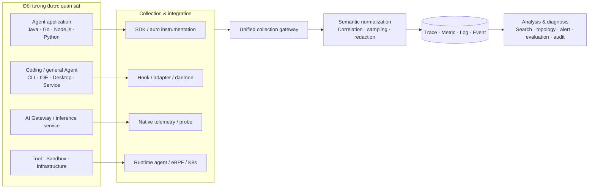

Kiến trúc tổng thể có thể chia thành bốn tầng:

*   **Tầng đối tượng được quan sát.** Phủ ứng dụng Agent high-code, Coding Agent và Agent đa dụng, AI Gateway, dịch vụ inference, MCP và dịch vụ tool, sandbox thực thi, cùng Pod, container, host và GPU gánh những component đó. Thông tin mà mỗi đối tượng cung cấp là khác nhau: phía ứng dụng hiểu rõ nhất mục đích task và ngữ nghĩa thực thi; phía server cung cấp được trạng thái xử lý request và lập lịch tài nguyên; còn thu thập ở runtime thì dùng để **chứng minh những hành vi thực sự đã xảy ra ở mức process, file, mạng và tài nguyên.**

*   **Tầng thu thập – tích hợp.** Chọn theo năng lực của đối tượng: đặt điểm đo tường minh trong ứng dụng, tự động instrument bằng framework hay SDK model, probe ở mức process, Hook và adapter, Daemon độc lập, telemetry native phía server, parse log, Kubernetes receiver, node Agent hay eBPF. Nhiều cách có thể dùng kết hợp - ví dụ để việc instrument ứng dụng ghi ngữ nghĩa AGENT, LLM và TOOL, rồi để eBPF bù phần truy cập model, lời gọi tool bên ngoài, request mạng và hành vi process mà ứng dụng chưa bắt được. Khi thu thập kết hợp, **phải loại bỏ trùng lặp theo ID lời gọi native, ranh giới thời gian và nguồn dữ liệu**, tránh tạo Span trùng hay cộng dồn token hai lần cho cùng một thao tác.

*   **Tầng xử lý thống nhất.** Gateway thu thập thống nhất được triển khai ở phía server của nền tảng observability, làm lối vào dữ liệu duy nhất cho mọi đầu thu thập; nó nhận dữ liệu telemetry do probe ứng dụng, adapter Hook, Daemon và component thu thập hạ tầng gửi lên qua các giao thức chuẩn của ngành như OTLP. Gateway cùng pipeline xử lý phía sau lo việc thích ứng giao thức, xử lý theo lô, chuẩn hoá ngữ nghĩa, bổ sung thuộc tính, lấy mẫu, lọc và ẩn danh, rồi route dữ liệu tới hệ lưu trữ tương ứng. Với dữ liệu sinh ra từ các framework và dịch vụ khác nhau, **phải thống nhất ý nghĩa của các trường Agent, model, tool, sandbox và tài nguyên**, đồng thời giữ lại nguồn dữ liệu cùng các thông tin cần thiết như giá trị thực tế hay giá trị ước lượng, để tạo nền dữ liệu nhất quán cho việc truy vấn và phân tích về sau.

*   **Tầng lưu trữ và phân tích.** Trace, Metrics, log và event có thể đi vào các hệ lưu trữ phù hợp riêng, rồi liên kết truy vấn qua định danh chung, **chứ không cần ép hết vào một mô hình dữ liệu duy nhất.** Phần phân tích ở tầng trên hướng tới các bối cảnh như tái dựng một lần chạy, giám sát ổn định và hiệu năng, phân tích token và chi phí, đánh giá hiệu quả task, audit hành vi, topology động và chẩn đoán xuyên tầng. Nội dung gốc và metric tổng hợp có thể dùng chu kỳ lưu và phạm vi truy cập khác nhau, để giữ cân bằng giữa năng lực chẩn đoán với khối lượng dữ liệu và rủi ro riêng tư.

Các loại telemetry khác nhau đóng vai trò bổ trợ nhau trong kiến trúc này:

*   **Trace** ghi lại quan hệ nhân quả trong một request hay một lần Agent chạy tích cực, xâu lối vào ứng dụng, orchestration Agent, lời gọi model, truy hồi, lời gọi tool, AI Gateway, dịch vụ inference và thực thi sandbox lại với nhau. Với các script hay lệnh chạy trong sandbox, Trace còn nên tiếp tục liên kết tới các process con, thao tác file, truy cập mạng và lời gọi dịch vụ hạ nguồn có giá trị chẩn đoán, **tránh để chuỗi quan sát dừng ở kết quả bề mặt "lệnh chạy thành công".**

*   **Metrics** dùng để quan sát liên tục các xu hướng tổng hợp như lượng request, tỉ lệ lỗi, thời lượng, token, chi phí, hàng đợi, mức dùng tài nguyên và sức khoẻ của chuỗi thu thập. **Label của metric nên dùng các chiều kiểm soát được như model, loại tool, dịch vụ, môi trường và kết quả; không nên dùng trực tiếp các trường cardinality cao như Session ID, Trace ID, tool-call ID.**

*   **Log và event** lưu các chi tiết như tóm tắt message, stack lỗi, đánh giá policy, việc process thoát, hoạt động file và mạng, vòng đời sandbox cùng các thay đổi ở mặt phẳng điều khiển. Với những hành vi runtime số lượng lớn, hạt mịn, không phù hợp để tạo Span cho từng cái, có thể giữ lại dưới dạng event hay log, rồi drill-down trong view Trace qua Trace ID, Span ID, tool-call ID, định danh instance sandbox và process.

Dưới kiến trúc tổng thể này, các mục sau lần lượt nói về việc đặt điểm đo và instrument cho ứng dụng high-code, việc thu thập bằng Hook và Daemon cho Coding Agent cùng Agent đa dụng, và việc quan sát runtime không xâm lấn dựa trên eBPF. Khi triển khai thực tế, **có thể tổ hợp các cách này theo mức độ cải tạo được của ứng dụng, chứ không cần chọn duy nhất một trong ba.**

### 13.2.2 Đặt điểm đo và instrument cho ứng dụng high-code

Ứng dụng high-code là các ứng dụng tự phát triển mà ta sửa được code, cách khởi động hay cấu hình workload, cùng các ứng dụng Agent xây trên LangChain, LangGraph, AgentScope… So với các bối cảnh chỉ quan sát được từ bên ngoài qua process, mạng hay log, ứng dụng high-code có thể **chủ động tạo Span ở lối vào nghiệp vụ và các ranh giới thực thi**, nên tái dựng được request người dùng, việc lập kế hoạch của Agent, suy luận model, truy hồi và thực thi tool thành một quỹ đạo task có quan hệ cha–con.

Lấy một task Agent làm ví dụ, nên hình thành phân cấp cơ bản **"`ENTRY → AGENT/WORKFLOW → STEP → LLM/RETRIEVAL/TOOL`"**. Span lối vào ghi phiên, người dùng và context task; Span Agent hay workflow biểu thị một lần orchestration; Step biểu thị các giai đoạn lập kế hoạch, thực thi, phản tư; còn Span lá thì lần lượt biểu thị lời gọi model, truy hồi hay tool. Ngoài thời điểm bắt đầu, kết thúc và trạng thái, mỗi Span còn nên ghi theo nhu cầu các thuộc tính như model và nhà cung cấp, lượng token, tên tool, tóm tắt tham số, tóm tắt kết quả, retry, timeout, số thứ tự giai đoạn, lý do kết thúc… Các trường cần dùng xuyên bước như khoá nghiệp vụ, tenant, kênh và nhóm thí nghiệm thì có thể ghi vào Baggage ở lối vào rồi lan truyền theo context; còn các trường chỉ thuộc về một thao tác thì viết lên Span tương ứng, **tránh copy dữ liệu cardinality cao hay nhạy cảm một cách bừa bãi lên cả chuỗi.**

Ứng dụng Python thường có ba cách tích hợp. Ba cách này **không phải các hình thái sản phẩm loại trừ nhau**, mà là những lựa chọn khác nhau đi từ "ngữ nghĩa mạnh nhất, cải tạo nhiều hơn" tới "tích hợp thống nhất, cải tạo ít hơn".

#### Cách một: đặt điểm đo thủ công qua LoongSuite GenAI Utils

Với các Agent tự phát triển, các framework mà probe chưa hỗ trợ, hoặc những ứng dụng cần biểu đạt chính xác mục tiêu task, giai đoạn lập kế hoạch và kết quả nghiệp vụ, khuyến nghị đặt điểm đo thủ công bằng OpenTelemetry SDK native. **LoongSuite GenAI Utils** mã nguồn mở là một lớp bọc trên OpenTelemetry SDK: nó đóng gói ngữ nghĩa thống nhất về tên Span, thuộc tính, metric và event cho các bối cảnh mô hình lớn và Agent, nên ứng dụng không phải tự thoả thuận trường từ một Span OpenTelemetry thông thường. `ExtendedTelemetryHandler` của nó cung cấp trực tiếp các thao tác Entry, Agent, ReAct Step, LLM, Tool, Embedding, Retrieval, Rerank và Memory, đồng thời lo việc tạo, kết thúc, ghi lỗi và thống kê metric cho các Span tương ứng. Định vị component, cách cài đặt và mô tả interface xem [tài liệu LoongSuite GenAI Utils](https://github.com/alibaba/loongsuite-python/blob/main/util/opentelemetry-util-genai/README-loongsuite.rst).

LoongSuite GenAI Utils **mặc định không thu thập phần thân message như Prompt hay phản hồi model**; chỉ sau khi hoàn tất việc đánh giá phân loại dữ liệu, ẩn danh, quyền hạn và thời hạn lưu thì mới nên bật việc thu thập nội dung message hay GenAI Event theo nhu cầu. Như vậy vừa giữ được thông tin quan sát có cấu trúc về model, token, thời lượng, trạng thái, vừa giảm rủi ro rò rỉ nội dung nhạy cảm và telemetry phình mất kiểm soát.

Dưới đây lấy Python làm ví dụ, trình bày cách đặt điểm đo cho quan hệ lồng nhau giữa Entry, Agent, ReAct Step, LLM và Tool trong một task hoàn chỉnh. Khối `with` vừa định nghĩa ranh giới thực thi, vừa bảo đảm kết thúc đúng cả khi chạy bình thường lẫn khi ném ngoại lệ; trước khi thoát khỏi context, hãy ghi phản hồi model, lượng token, tham số tool và kết quả trở lại Invocation - Utils sẽ chuyển chúng thành các thuộc tính và metric GenAI thống nhất.

```python
from opentelemetry.util.genai.extended_handler import (
    get_extended_telemetry_handler,
)
from opentelemetry.util.genai.extended_types import (
    EntryInvocation,
    ExecuteToolInvocation,
    InvokeAgentInvocation,
    ReactStepInvocation,
)
from opentelemetry.util.genai.types import (
    InputMessage,
    LLMInvocation,
    OutputMessage,
    Text,
)


def run_task(request):
    # Lấy Handler sau khi Provider đã khởi tạo xong, tránh bind vào Provider mặc định lúc import module
    handler = get_extended_telemetry_handler()

    entry = EntryInvocation(
        session_id=request.session_id,
        user_id=request.user_id,
    )
    with handler.entry(entry):
        # Các trường quyết định tên Span và Baggage phải truyền vào lúc tạo Invocation
        agent = InvokeAgentInvocation(
            provider="dashscope",
            agent_name="order-agent",
            input_messages=[
                InputMessage(
                    role="user",
                    parts=[Text(content=request.text)],
                )
            ],
        )
        with handler.invoke_agent(agent):
            step = ReactStepInvocation(round=1)
            with handler.react_step(step) as current_step:
                llm = LLMInvocation(
                    provider="dashscope",
                    request_model="qwen-plus",
                    input_messages=[
                        InputMessage(
                            role="user",
                            parts=[Text(content=request.text)],
                        )
                    ],
                )
                with handler.llm(llm) as current_llm:
                    response = call_model(request.text)
                    # Các trường kết quả được ghi lại vào Invocation trước khi thoát context
                    current_llm.output_messages = [
                        OutputMessage(
                            role="assistant",
                            parts=[Text(content=response.text)],
                            finish_reason=response.finish_reason,
                        )
                    ]
                    current_llm.input_tokens = response.input_tokens
                    current_llm.output_tokens = response.output_tokens

                tool = ExecuteToolInvocation(
                    tool_name="query_order",
                    tool_call_arguments={"order_id": request.order_id},
                )
                with handler.execute_tool(tool) as current_tool:
                    result = query_order(request.order_id)
                    current_tool.tool_call_result = result

                current_step.finish_reason = "completed"
            return result
```

Việc viết trực tiếp context manager qua Utils phù hợp với phần code orchestration lõi có số lượng hữu hạn và ngữ nghĩa rõ ràng. Với các hàm nghiệp vụ lặp đi lặp lại, có thể đóng gói `handler.react_step()`, `handler.execute_tool()`… thành decorator - ví dụ dùng `@observe_step(round=1)` để đánh dấu một vòng lập kế hoạch, dùng `@observe_tool("query_order")` để bọc một hàm tool. **Decorator không phải một bộ giao thức đặt điểm đo khác**; bên trong nó vẫn gọi LoongSuite GenAI Utils, chỉ là thống nhất phần tạo Invocation, tóm tắt tham số, giá trị trả về và xử lý ngoại lệ. Nó phù hợp với những phương thức mà ranh giới hàm về cơ bản trùng với ranh giới quan sát; còn với generator, phản hồi dạng stream và task chạy nền thì **không được kết thúc Span ngay khi hàm trả về iterator**, mà phải giữ context Utils cho tới khi stream kết thúc, bị huỷ hoặc thất bại.

Ứng dụng web có thể gọi `handler.entry()` trong middleware WSGI/ASGI, trích `session_id`, `user_id` và thông tin lối vào nghiệp vụ từ header request, thông tin định danh hay request body, để tạo một node gốc thống nhất cho các lời gọi Agent, model và tool về sau. `EntryInvocation` sẽ ghi `session_id`, `user_id` vào Baggage, và có thể kết hợp BaggageSpanProcessor để lan truyền những thuộc tính đó xuống các Span con trong chuỗi; các trường tenant, kênh hay nhóm thí nghiệm khác cũng có thể lan truyền bằng cơ chế nhuộm thuộc tính nghiệp vụ.

Ứng dụng xây trên framework Agent còn có thể nối LoongSuite GenAI Utils vào callback của framework: vào context Handler tương ứng ở các event bắt đầu của Agent, Chain, LLM, Retriever và Tool; rồi bổ sung kết quả và thoát context ở event kết thúc hay lỗi. Cơ chế callback phù hợp khi framework đã cung cấp event vòng đời ổn định nhưng phần tự động instrument chưa phủ tới, hoặc khi cần gắn thêm trường nghiệp vụ. Khi hiện thực, **phải lưu quan hệ Invocation và context theo `run_id` cùng `parent_run_id` mà framework cung cấp, chứ không chỉ liên kết theo thread ID**, để tương thích với lời gọi bất đồng bộ, nhánh song song và sub-agent. Với lời gọi model dạng stream, còn phải ghi thời điểm token đầu tiên khi block phản hồi hữu ích đầu tiên tới, và ghi lượng dùng đầy đủ, lý do kết thúc cùng tóm tắt output sau khi stream kết thúc.

Đặt điểm đo thủ công và tự động instrument bằng framework **có thể kết hợp, nhưng bắt buộc phải tránh mô hình hoá trùng.** Nếu probe đã sinh Span cho cùng một lời gọi model, truy hồi hay tool, thì phần đặt điểm đo thủ công nên chủ yếu bù thêm Entry, Agent, Step và kết quả nghiệp vụ, hoặc thêm thuộc tính cần thiết lên Span hiện tại - **không nên tạo thêm một Span LLM hay Tool có ngữ nghĩa trùng.** Như vậy vừa giữ được chi phí tích hợp thấp của tự động instrument, vừa dùng LoongSuite GenAI Utils để dựng được phân cấp thực thi nghiệp vụ trọn vẹn.

#### Cách hai: tự động instrument lúc khởi động process

Tự động instrument ở mức process áp dụng được cho nhiều ngôn ngữ như Java, Go, Node.js, Python. Khi ứng dụng dùng các Web, HTTP, database, SDK model hay framework Agent mà probe đã hỗ trợ, có thể dùng probe của ngôn ngữ tương ứng để giảm việc sửa code nghiệp vụ. Dưới đây vẫn lấy Python làm ví dụ: [LoongSuite Python](https://github.com/alibaba/loongsuite-python) mã nguồn mở là một bản phân phối xây trên OpenTelemetry Python, tăng cường hỗ trợ cho các framework AI Agent thông dụng. Sau khi ứng dụng cài `loongsuite-distro`, có thể dùng `loongsuite-bootstrap` để cài các Instrumentation khớp, rồi dùng `loongsuite-instrument` để khởi động ứng dụng. Probe sẽ khởi tạo Provider và các Instrumentation đã cài **trước khi module nghiệp vụ được nạp**, bọc các phương thức của những component được hỗ trợ, tự động tạo Span, tiêm và trích context rồi export telemetry. Các cách khởi động khác nhau như Uvicorn, Gunicorn, uWSGI, gevent thì phải kiểm chứng riêng thứ tự khởi tạo và tính tương thích khi chạy.

```shell
pip install loongsuite-distro opentelemetry-exporter-otlp
loongsuite-bootstrap -a install --latest --auto-detect
export OTEL_SERVICE_NAME=order-agent
export OTEL_EXPORTER_OTLP_ENDPOINT=http://otel-collector:4317
export OTEL_EXPORTER_OTLP_PROTOCOL=grpc
loongsuite-instrument --traces_exporter otlp python app.py
```

Chữ "thủ công" ở cách này là chỉ việc **cài đặt thủ công và sửa lệnh khởi động**; còn phần đặt điểm đo cho component bên trong ứng dụng thì vẫn tự động. Ưu thế là ít sửa code, phủ thống nhất được lối vào và lối ra HTTP, truy cập database cùng các SDK model và framework Agent được hỗ trợ, và tự duy trì được quan hệ gọi cơ bản. Hạn chế là phạm vi phủ bị ràng buộc bởi version probe, version dependency, thứ tự import và mô hình khởi động. Tự động instrument thường nhận diện được **"đã gọi phương thức model hay framework nào"**, nhưng **không thể từ một lời gọi kỹ thuật mà suy ra "vì sao gọi", "hiện đang ở giai đoạn nghiệp vụ nào", "kết quả có đạt mục tiêu nghiệp vụ không".** Vì vậy trong thực tiễn production thường dùng cách lai: **"probe thu thập phụ thuộc chung + LoongSuite GenAI Utils bù ngữ nghĩa nghiệp vụ".**

Tự động instrument cho framework về bản chất cũng là plugin của probe. Plugin có thể bọc các phương thức công khai ổn định mà không sửa mã nguồn framework, hoặc nối vào callback native của framework, rồi chuyển các đối tượng framework thành Span GenAI thống nhất. Khi plugin sẵn có chưa phủ framework tự phát triển, có thể viết mở rộng dựa trên `BaseInstrumentor` của OpenTelemetry, bọc các lối vào ổn định của model client hay tool executor; **phải khai báo khoảng version dependency, và xử lý các đường đồng bộ, bất đồng bộ, stream, ngoại lệ và huỷ.**

#### Cách ba: tự động tiêm probe trong K8s

Với một lượng lớn ứng dụng triển khai trên Kubernetes, có thể triển khai Operator hay component tích hợp tương đương trong cụm, rồi bật việc quan sát qua label hay annotation của workload. Component sẽ chuẩn bị và tiêm probe cùng cấu hình cho các workload thoả điều kiện ngay ở giai đoạn tạo Pod, giúp đội ngũ không phải sửa từng image hay lệnh khởi động. Operator có thể giao probe tương ứng theo ngôn ngữ của workload - ví dụ giao LoongSuite Python cho ứng dụng Python, và cấu hình các component tự động instrument tương ứng cho ứng dụng Java, Go, Node.js. [OpenTelemetry Operator](https://opentelemetry.io/docs/platforms/kubernetes/operator/automatic/) trình bày một hiện thực tổng quát dựa trên cơ chế admission của Kubernetes để tiêm tự động. Còn component thương mại hoá [ack-onepilot](https://help.aliyun.com/zh/ack/product-overview/ack-onepilot) của Alibaba Cloud thì cung cấp năng lực tích hợp và quản lý probe thương mại tương ứng cho các bối cảnh Kubernetes như ACK, ACS.

Việc tự động tiêm ở mức cụm giải quyết vấn đề **giao probe và quản trị cấu hình**; còn sau khi tiêm thì việc thu thập dữ liệu thực tế vẫn do probe trong process cùng các plugin của nó hoàn tất. Vì vậy nó có **cùng ranh giới tương thích framework như cách hai, và cũng không thay thế được việc đặt điểm đo cho ngữ nghĩa nghiệp vụ.** Nó phù hợp với môi trường Kubernetes có nhiều ứng dụng, image do nhiều team bảo trì, và muốn nâng cấp cùng bật/tắt probe một cách thống nhất; còn với các ứng dụng không chạy container, các task có vòng đời khởi động rất ngắn, runtime bị hạn chế, hay các workload không cho phép tiêm init container, thì nên chuyển sang cài ở mức process, đặt điểm đo thủ công bằng LoongSuite GenAI Utils hoặc cách thu thập khác. Trước khi lên production còn phải kiểm chứng thời gian khởi tạo và hạn mức tài nguyên, và kiểm tra tính tương thích giữa version probe với dependency qua các workload canary.

Phạm vi phủ và điều kiện áp dụng của ba cách có thể khái quát như sau:

| Cách tích hợp | Phạm vi phủ chính | Ngữ nghĩa biểu đạt được | Điều kiện áp dụng và ranh giới |
| --- | --- | --- | --- |
| Đặt điểm đo thủ công bằng LoongSuite GenAI Utils | Qua Utils, decorator, middleware và callback framework, phủ lối vào ứng dụng, task, Agent, giai đoạn thực thi, model, truy hồi, memory và lời gọi tool | Mạnh nhất; cung cấp ngữ nghĩa GenAI thống nhất, và ghi được mục tiêu, giai đoạn, kết quả nghiệp vụ cùng thông tin mà framework không phơi ra | Phải sửa và bảo trì code; bắt buộc xử lý đúng context, ngoại lệ, vòng đời bất đồng bộ và stream |
| Tự động instrument bằng probe Python ở mức process | Các Web/HTTP/database/SDK model/framework Agent được hỗ trợ | Tự động lấy được thuộc tính kỹ thuật và một phần ngữ nghĩa GenAI; ngữ nghĩa nghiệp vụ hạn chế | Sửa được dependency và cách khởi động; mức phủ tuỳ tính tương thích version giữa probe và component |
| Tự động tiêm ở mức cụm K8s | Giao và bật hàng loạt các năng lực probe Python nêu trên cho workload Kubernetes | Giống probe ở mức process; có thể chồng thêm phần đặt điểm đo tường minh của ứng dụng | Cần component cụm, label workload và quyền tương ứng; phải đánh giá thời lượng và tài nguyên của init container |

Việc lựa chọn thực tế **không nên chỉ theo đuổi "zero code".** Với ứng dụng mà framework được hỗ trợ tốt và chủ yếu giám sát hiệu năng kỹ thuật, có thể dùng probe tự động instrument của ngôn ngữ tương ứng trước - ví dụ ứng dụng Python dùng LoongSuite Python. Với ứng dụng cần tái dựng quá trình quyết định của Agent, phân biệt giai đoạn thực thi hay phân tích theo kết quả nghiệp vụ, thì nên thêm phần đặt điểm đo thủ công qua SDK hay thư viện ngữ nghĩa GenAI tương ứng - ứng dụng Python có thể dùng LoongSuite GenAI Utils. Với ứng dụng ở quy mô lớn trong Kubernetes thì để Operator giao probe đa ngôn ngữ một cách thống nhất; môi trường thương mại hoá cũng có thể dùng component tích hợp như ack-onepilot, rồi bù ngữ nghĩa nghiệp vụ ở một số ít ranh giới then chốt. Dù dùng cách nào, cũng **phải bảo đảm trong process chỉ có một TracerProvider và một chuỗi export có hiệu lực**, tránh instrument trùng cho cùng một lời gọi, và **đặt chính sách thu thập theo nhu cầu, cắt bớt, ẩn danh, lấy mẫu cùng kiểm soát truy cập** cho Prompt, phản hồi model, tham số tool và nội dung truy hồi.

### 13.2.3 Thu thập dữ liệu quan sát cho Coding Agent và Agent đa dụng

[LoongSuite Pilot](https://github.com/alibaba/loongsuite-pilot) đã hỗ trợ thu thập dữ liệu quan sát cho các Coding Agent và Agent đa dụng như Qwen Code CLI, dòng Qoder (Qoder IDE, Qoder CN, Qoder for JetBrains, Qoder CLI, Qoder Work, Qoder Work CN), Qwen Work CN, Claude Code, Codex, Cursor, Cursor CLI, Grok Build, Kiro CLI, OpenCode, MiMo Code, Pi Coding Agent, DeepSeek Harness, OpenClaw, Hermes Agent, WorkBuddy và Wukong.

Những Agent này thường chạy dưới dạng CLI, extension IDE, client desktop hay dịch vụ độc lập; bên sử dụng thường chỉ cấu hình được môi trường chạy và interface mở rộng, khó sửa được phần hiện thực bên trong. Các callback, Hook, transcript, log và database mà từng Agent phơi ra lại khác nhau về định dạng, độ chính xác thời gian và định danh lời gọi, nên việc thu thập phải **tái dựng những nguồn đó thành các bản ghi thực thi liên kết được.**

Tiếp nối kiến trúc thu thập ở 13.2.1, Pilot dùng cách phối hợp giữa **adapter phía Agent** và **Daemon độc lập**: adapter lấy bằng chứng thực thi native; Daemon lo việc đọc tăng dần, bù xuyên nguồn, chuẩn hoá ngữ nghĩa và xuất ra. Tầng adapter xử lý khác biệt giữa các Agent, còn pipeline chung thì tái dùng năng lực liên kết context, lọc nội dung và báo cáo tới nhiều đích.

#### Lối vào thu thập và nguồn dữ liệu

Lối vào thu thập nên chọn theo năng lực mà Agent thực sự phơi ra. Callback native cung cấp ranh giới thao tác; Hook vòng đời ghi lại hoạt động hoặc kích hoạt việc parse; bản ghi cục bộ bù phần message, lượng dùng và định danh lời gọi. **Ba loại nguồn có thể dùng kết hợp.**

| **Lối vào thu thập** | **Bằng chứng chính** | **Cách dùng và ranh giới** |
| --- | --- | --- |
| Callback của plugin hay extension native | Request và response của model, lúc tool bắt đầu và kết thúc, trạng thái thực thi | Thu thập event có cấu trúc tại các điểm mở rộng được hỗ trợ; phạm vi phủ tuỳ version Agent và API plugin |
| Hook vòng đời | Input người dùng, hoạt động tool, thông báo kết thúc sub-agent và lượt | Ghi event trực tiếp, hoặc ghi một marker đánh thức rồi parse transcript; **không được giả định mọi Hook đều chứa lượng dùng model** |
| Transcript, log hay database cục bộ | Message, ID lời gọi native, model, token, bản ghi thời gian bền vững hoá | Đọc tăng dần theo offset file, con trỏ bản ghi hay snapshot; phải xử lý việc ghi trễ, xoay vòng và thay đổi định dạng |

Phần tích hợp của Pilot thể hiện đúng cách kết hợp này: Hook của [Qwen Code CLI](https://github.com/alibaba/loongsuite-pilot/blob/f6632f28d06ff2e158c20e7f1c1c73c1ceae48c0/assets/hooks/qwen-code-cli-hook-processor.mjs) và [Claude Code](https://github.com/alibaba/loongsuite-pilot/blob/f6632f28d06ff2e158c20e7f1c1c73c1ceae48c0/assets/hooks/claude-code-hook-processor.mjs) có thể parse transcript lúc Stop; [Codex](https://github.com/alibaba/loongsuite-pilot/blob/f6632f28d06ff2e158c20e7f1c1c73c1ceae48c0/src/inputs/codex-transcript/codex-transcript-input.ts) thì được Hook đánh thức rồi Daemon đọc transcript; [OpenClaw](https://github.com/alibaba/loongsuite-pilot/blob/f6632f28d06ff2e158c20e7f1c1c73c1ceae48c0/assets/plugins/openclaw/plugin.mjs) ghi hoạt động model và tool qua callback của plugin; còn [Qoder](https://github.com/alibaba/loongsuite-pilot/blob/f6632f28d06ff2e158c20e7f1c1c73c1ceae48c0/src/inputs/qoder-trace/token-enricher.ts) thì hợp nhất phiên, database hay bản ghi intercept để bù thông tin về model, token và thời gian.

Việc hợp nhất nhiều nguồn phải **xác định nguồn thẩm quyền theo từng trường**, ưu tiên ghép cặp bằng ID request, response và tool-call native. **Thời gian gần nhau chỉ được dùng làm bằng chứng phụ có ràng buộc.** Khi Hook và transcript cùng quan sát một thao tác, phải gộp lại xử lý, tránh mô hình hoá trùng hay cộng dồn lượng dùng hai lần; còn các thông tin thiếu, ước lượng hoặc không khớp được thì **phải đánh dấu rõ ràng, không được bù bằng giá trị 0 hay giá trị đoán.**

#### Phối hợp giữa Hook và Daemon độc lập

Adapter trích thông tin cần thiết trong process Agent hay trong môi trường người dùng của nó rồi ghi xuống cục bộ, và giao phần báo cáo qua mạng, retry cùng xử lý xuyên nguồn cho Daemon. Khi thực sự phải parse transcript ngay trong Hook, **phải giới hạn thời gian thực thi và quy mô dữ liệu, tránh để việc thu thập thất bại ảnh hưởng tới kết quả nghiệp vụ của Agent.**

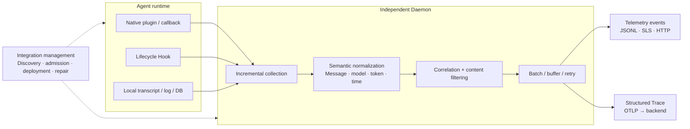

*Hình 13.2.3-1 - Kiến trúc thu thập dữ liệu quan sát cho Coding Agent và Agent đa dụng (nguồn: vẽ theo bản hiện thực của LoongSuite Pilot)*

Daemon phát hiện Agent theo thư mục, cấu hình, lệnh hay process; triển khai adapter theo cấu hình chấp nhận thu thập; rồi kết hợp việc lắng nghe và quét định kỳ để đọc bản ghi tăng dần, bổ sung context về thư mục làm việc, repository Git, người dùng và dịch vụ. **Thông báo từ Hook chỉ có nghĩa là có hoạt động hay có thay đổi dữ liệu; bên đọc vẫn phải xác nhận bản ghi đã trọn vẹn, không được dựa vào đó mà kết luận thẳng rằng một lời gọi đã kết thúc.**

Việc quản lý tích hợp và phản hồi trạng thái **nên biểu đạt tách rời**: cái trước lo các Hook được quản lý, cấu hình plugin và việc sửa lỗi triển khai, và khi tắt thu thập hay gỡ cài thì dọn theo vòng đời tích hợp; cái sau thì quan sát riêng việc Agent có được phát hiện không, plugin có nạp được không, input có sinh ra event không, output có báo cáo thành công không. **Việc chấp nhận thu thập chỉ kiểm soát có bật thu thập hay không, không thay thế quyền hạn nghiệp vụ hay chính sách an toàn của Agent.**

#### Khôi phục chuỗi thực thi từ các telemetry event

Các nguồn khác nhau trước hết được chuẩn hoá thành **Telemetry Event**, rồi mới dựng Trace; **telemetry event ở đây không đồng nghĩa với Event mà hệ nghiệp vụ định nghĩa.** Pilot ghi các hoạt động như input người dùng, `llm.request`, `llm.response`, `tool.call`, `tool.result`, giữ lại định danh liên kết native, thời điểm event nguồn, thời điểm quan sát, model và lượng dùng. Phần `other` và `agent.input` của input người dùng là output tương thích ngược; việc chuyển thành Trace sẽ loại bỏ các bản sao tương thích để tránh mô hình hoá trùng - các trường cụ thể xem [Schema event output](https://github.com/alibaba/loongsuite-pilot/blob/f6632f28d06ff2e158c20e7f1c1c73c1ceae48c0/docs/zh-CN/output-event-schema.md).

Định nghĩa Session, Trace và Span cùng ranh giới của một lần chạy tích cực xem 13.3.1; ngữ nghĩa thực thi xem 13.3.2. Trọng tâm ở phía thu thập là **ghép cặp request với response, lời gọi với kết quả theo định danh ổn định.** Hình 13.2.3-2 trình bày một ví dụ ánh xạ của LoongSuite, trong đó các phân cấp ENTRY, AGENT, STEP… **không đại diện cho một cấu trúc cố định mà OpenTelemetry bắt buộc**; chỉ tạo STEP khi nhận diện được ranh giới vòng lặp một cách đáng tin.

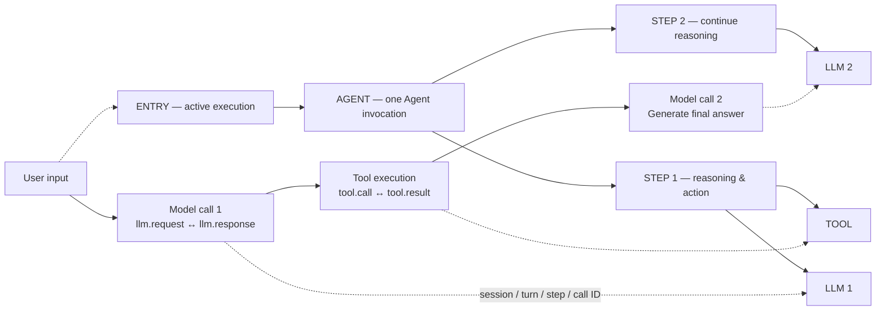

*Hình 13.2.3-2 - Ví dụ ánh xạ từ telemetry event sang Trace (nguồn: vẽ theo mô hình event và luồng chuyển đổi của LoongSuite Pilot)*

**Tool-call do model sinh ra chỉ là ý định gọi; việc thực thi tool thực tế phải được xác nhận bởi callback thực thi khớp hoặc bản ghi kết quả.** Các lời gọi song song được ghép cặp riêng theo tool-call ID; sub-agent thì liên kết tới Agent hay TOOL đã phát khởi nó qua một định danh lời gọi cha rõ ràng - **khi không liên kết được một cách đáng tin thì giữ lại thông tin thiếu, không lồng nhau một cách gượng ép theo thứ tự thời gian.**

Việc kết thúc một lượt phải dựa trên **bằng chứng chấm dứt ở mức lần chạy, không được đánh đồng với việc một lần gọi model kết thúc.** Pilot dùng bản ghi hoàn thành hay gián đoạn trong transcript cho Codex, và dùng Hook kết thúc ở mức lần chạy cho OpenClaw; sau khi model kết thúc vẫn có thể có việc thực thi tool, retry hay hoạt động sub-agent. Việc chờ xuyên request và khôi phục thì theo ranh giới ở 13.3.1. **Kết thúc thực thi hay Trace thành công chỉ mô tả trạng thái kỹ thuật; Outcome nghiệp vụ phải do ứng dụng nghiệp vụ hoặc Verifier được uỷ quyền đánh giá theo tiêu chí thành công và bằng chứng nghiệm thu.**

Thời lượng LLM nên cố gắng dùng thời điểm bắt đầu request native và thời điểm stream kết thúc trọn vẹn; TTFT thì ghi riêng thời gian từ lúc request tới output hữu ích đầu tiên. Khi chỉ có thời gian từ transcript, **phải nói rõ nó biểu thị bản ghi phản hồi, output nhìn thấy đầu tiên hay thời điểm bền vững hoá - không được diễn giải thời lượng dựng lại thành thời lượng suy luận chính xác.** TOOL thì dùng ranh giới bắt đầu–kết thúc thực thi thực tế; **thời điểm thu thập và thời điểm thông báo Stop không thay thế được một cách vô điều kiện.**

#### Thước đo token và liên kết context

Token ưu tiên dùng lượng dùng thực tế mà dịch vụ model hay Agent phơi ra, giữ lại phân loại nhà cung cấp, model và cache. Tổng token input của Pilot đã bao gồm phần đọc cache và ghi cache, nên khi tổng hợp **không được cộng lại lần nữa.** Nhiều mảnh của cùng một phản hồi hay nhiều nguồn khác nhau **chỉ được cộng dồn một lần**; snapshot luỹ kế thì phải quy đổi thành lượng tăng thêm; còn lượng dùng bị thiếu thì **không được ghi thành 0.**

**Task nghiệp vụ** gánh định danh task xuyên giai đoạn, và có thể trải qua nhiều Session native cùng nhiều lần chạy tích cực. Bộ thu thập phải giữ lại định danh Task mà hệ nghiệp vụ cung cấp cùng ánh xạ của nó tới Session và turn native; khi thiếu liên kết thì **đánh dấu rõ, không tự suy diễn từ văn bản phiên hay từ sự gần nhau về thời gian.** Các trường cardinality cao như Task, người dùng và Session thì giữ trong log và Trace để drill-down; còn label của metric thì dùng các chiều kiểm soát được như ứng dụng, loại Agent, model và kết quả.

Việc liên kết context còn phải nối tới request ứng dụng đã kích hoạt Agent cùng các lời gọi hạ nguồn của tool. Với các Trace được dựng lại sau, **context liên kết bắt buộc phải được bên gọi, Agent hay phía tool lưu lại NGAY LÚC THỰC THI; một Trace ID sinh ra sau đó không tự động bù lại được quan hệ với các lời gọi từ xa đã hoàn tất.** Session nghiệp vụ và Session native của Agent cũng phải phân biệt: ghép cặp theo định danh native trước, rồi mới ánh xạ định danh nghiệp vụ.

#### Độ tin cậy và chất lượng thu thập

Việc thu thập tăng dần cần bền vững hoá con trỏ thu thập và trạng thái loại bỏ trùng lặp, dùng để khôi phục tiến độ đọc; **những state này không đồng nghĩa với Checkpoint - bản state nhất quán mà Task nghiệp vụ lưu tại điểm an toàn.** Con trỏ chỉ tiến tới ranh giới của bản ghi đã trọn vẹn và đã xử lý xong, và phải xử lý việc restart, cắt cụt, xoay vòng, bản ghi dở ở cuối và thư mục tạm thời không truy cập được. Lỗi đọc tạm thời thì giữ nguyên state; còn lần tích hợp đầu tiên thì phải nói rõ là bỏ qua lịch sử hay phát lại; các Hook chạy đồng thời thì có thể tránh ghi đè bằng file riêng và publish nguyên tử.

**Khôi phục việc đọc và giao nhận tới đầu xa là hai loại bảo đảm khác nhau.** [Input thông thường](https://github.com/alibaba/loongsuite-pilot/blob/f6632f28d06ff2e158c20e7f1c1c73c1ceae48c0/src/inputs/base/base-input.ts) của Pilot lưu trạng thái input sau khi phát event, **không đợi xác nhận ghi từ đầu xa**; vì vậy **con trỏ đã lưu không có nghĩa backend đã nhận được dữ liệu, và cũng không được dựa vào đó để cam kết không mất – không trùng đầu cuối.** Khi cần bảo đảm giao nhận mạnh hơn, phải thiết kế riêng hàng đợi chờ gửi bền vững, xác nhận giao nhận và cơ chế idempotent phía backend.

Phải cấu hình phạm vi thu thập nội dung message của Agent, và thực hiện lọc, ẩn danh cùng cắt bớt cần thiết với code, tham số tool, kết quả và credential, đồng thời đặt quyền truy cập và thời hạn lưu ở phía lưu trữ. [Cấu hình mặc định](https://github.com/alibaba/loongsuite-pilot/blob/f6632f28d06ff2e158c20e7f1c1c73c1ceae48c0/src/normalization/agent-config.ts) của Pilot bật việc thu thập nội dung message; khi tích hợp production **vẫn phải chọn phạm vi thu thập một cách tường minh, không được coi giá trị mặc định là khuyến nghị lưu trọn message vô điều kiện.** [Bộ lọc nội dung](https://github.com/alibaba/loongsuite-pilot/blob/f6632f28d06ff2e158c20e7f1c1c73c1ceae48c0/src/normalization/agent-content-policy.ts) có hiệu lực trước khi xuất; còn nội dung đa phương thức thì dùng tham chiếu tài nguyên có kiểm soát, và quản lý phạm vi đọc cục bộ cùng quyền truy cập từ xa.

Việc nghiệm thu nên xuất phát từ các thao tác Agent thật, đối chiếu bản ghi gốc, telemetry event và Trace cuối cùng; phủ các tình huống tương tác nhiều lượt, tool song song, huỷ, lỗi, sub-agent, khôi phục sau restart và tắt thu thập nội dung. Trọng tâm là kiểm tra việc ghép cặp lời gọi, ranh giới thời gian, loại bỏ trùng lặp token và kết quả ghi vào backend; đồng thời giám sát độ trễ, tồn đọng và số lần thất bại của việc thu thập, để tạo căn cứ chất lượng dữ liệu nhận định được cho việc quy kết, phân tích chi phí và audit về sau.

### 13.2.4 Quan sát runtime không xâm lấn dựa trên eBPF

Hình thái ứng dụng Agent rất đa dạng, năng lực SDK và mở rộng chênh nhau lớn, khiến việc đặt điểm đo ở tầng ứng dụng có chi phí thích ứng cao và hiệu suất phủ thấp. Ngược lại, các hành vi then chốt như gọi model và thực thi tool của Agent **đều đi qua những interface kernel ổn định**, tạo nền cho việc quan sát thống nhất. Dựa trên eBPF, [AgentSight](https://github.com/alibaba/anolisa/tree/main/src/agentsight) có thể thu thập dữ liệu runtime trên các đường đó một cách không xâm lấn, rồi kết hợp parse giao thức và probe ở user space để tái dựng các thông tin then chốt như lời gọi model, lời gọi tool.

Hai nhóm hành vi then chốt của Agent - gọi model và gọi tool - khi rơi xuống tầng hệ thống đều biểu hiện thành các event mà eBPF thu được. Gọi model ứng với một request mạng và một response mạng: phía request mang system prompt, input người dùng, lịch sử hội thoại và định nghĩa tool khả dụng; phía response mang quá trình suy nghĩ của model, output cuối, ý định gọi tool và lượng token dùng. Kết hợp với thời điểm tới của từng event tăng dần trong phản hồi stream, ta còn tính thêm được TTFT (độ trễ token đầu), TPOT (khoảng cách giữa các token output) và thời lượng đầu cuối của một lần gọi. Còn gọi tool thì ứng với ba loại event: process, file và mạng. Việc tạo và thoát process tái dựng được cây process đầy đủ cùng tham số dòng lệnh; việc đọc ghi file phản ánh những thay đổi mà tool gây ra với code và cấu hình; còn event mạng thì phủ các truy cập ra ngoài do chính tool phát khởi. Các event trên đều mang theo định danh process và timestamp kernel, nên có thể **ghép theo quan hệ process và trình tự thời gian, để đối ứng ý định gọi tool mà model xuất ra với những hành vi hệ thống thực sự xảy ra sau đó**, tái dựng thành một quỹ đạo hành vi Agent trọn vẹn. Quan hệ giữa hai nhóm hành vi và các event eBPF thu được như hình dưới.

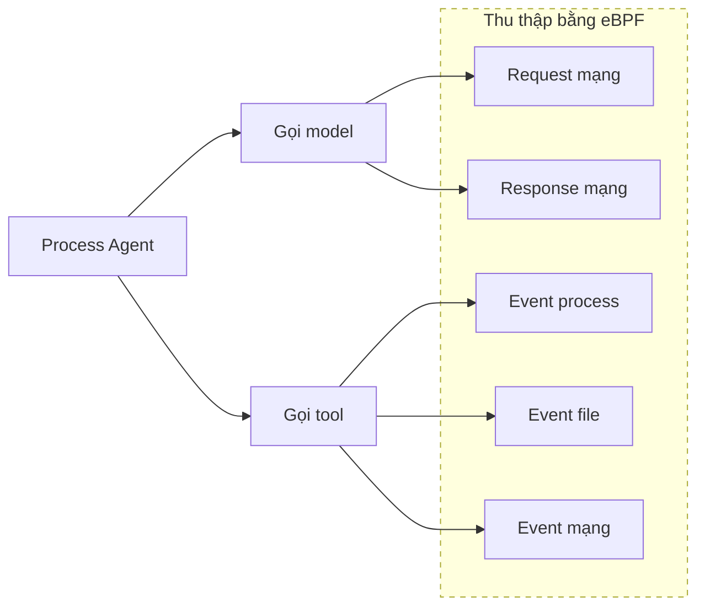

Từ event của probe tới dữ liệu quan sát dùng được, ở giữa phải đi qua một chuỗi cố định. Sau khi các event mà probe ở kernel space thu được đưa lên user space theo lô, trước hết là **parse event**: khôi phục dòng byte mạng thành gói tin có cấu trúc theo HTTP/1.1 hay HTTP/2, và khôi phục các event process, file, mạng thành bản ghi có cấu trúc; kế đến là **liên kết event**: ghép request với response thành một lượt đi-về trọn vẹn theo kết nối, và xâu các event process thành một cây theo quan hệ cha–con. Cuối cùng xuất ra hai phần dữ liệu: một là **cây event process**, ghi lại lệnh và sản phẩm của từng lần thực thi tool; hai là **quỹ đạo Agent theo đơn vị phiên**, ghi theo trình tự thời gian các lời gọi model và lần thực thi tool trong task đó. Chuỗi xử lý như hình dưới.

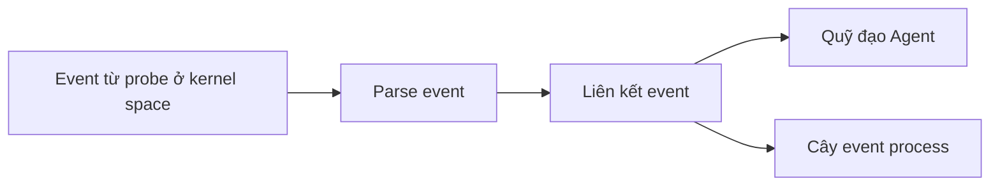

## 13.3 Phân tích quan sát toàn chuỗi của Agent

Một lần chạy của Agent thường không phải một request model đơn lẻ, mà gồm nhiều bước: hiểu task, sinh kế hoạch, suy luận model, truy hồi tri thức, gọi tool và sinh kết quả. Với ứng dụng multi-agent, một task còn có thể gồm cả việc uỷ nhiệm task, thực thi song song và tổng hợp kết quả. **Chỉ quan sát phản hồi cuối hay một interface model đơn lẻ thì không đánh giá được Agent thực sự đã thực thi những bước nào, và cũng khó giải thích được nguyên nhân task thất bại, phản hồi chậm hay chi phí tăng.**

Mục tiêu của quan sát toàn chuỗi cho Agent là **thiết lập một bản ghi thực thi trọn vẹn và truy vấn được quanh một lần chạy thực tế**, liên kết kết quả task với các bước trung gian, lỗi, độ trễ và mức tiêu hao tài nguyên. Nó **không đòi hỏi lưu mọi input/output một cách bừa bãi**, mà là dùng ranh giới chuỗi và ngữ nghĩa thực thi thống nhất để giữ lại đủ thông tin quan sát nhằm tái dựng quá trình chạy, so sánh biểu hiện giữa các lần chạy và định vị vấn đề.

### 13.3.1 Mô hình quan sát và ranh giới của chuỗi thực thi Agent

Agent có thể trải qua nhiều lượt tương tác trong một phiên, và mỗi lượt lại có thể gồm nhiều lần suy luận model, gọi tool, cộng tác sub-agent và chờ bất đồng bộ. Nếu không phân biệt phạm vi liên kết phiên, ranh giới của một lần chạy tích cực và các thao tác cụ thể, thì rất dễ **ghi cả một phiên dài thành một chuỗi kéo dài quá mức, hoặc chẻ nhiều lần chạy vốn liên quan nhau thành những request hoàn toàn độc lập.** Vì vậy, quan sát toàn chuỗi cho Agent có thể dùng **Session, Trace và Span** để thiết lập một mô hình quan sát chung.

*   **Session** biểu thị **phạm vi liên kết của một đoạn phiên liên tục**, dùng để gom dữ liệu quan sát mà người dùng và Agent sinh ra qua nhiều lượt tương tác. Nó có thể trải qua nhiều request, nhiều Trace, thậm chí những khoảng thời gian khá dài. Session chủ yếu trả lời "những tương tác này có thuộc cùng một đoạn phiên không", **chứ không trực tiếp biểu thị một lần chạy liên tục - nên không nên ghi cả Session thành một Trace dài không kết thúc.**

*   **Trace** ghi lại **quá trình chạy tích cực do một input bên ngoài kích hoạt**, dùng để tái dựng thứ tự, lồng nhau, song song và nhân quả giữa các thao tác. Input bên ngoài có thể là message người dùng, kết quả phê duyệt, callback hay event khôi phục bất đồng bộ; khi Agent trả kết quả, chuyển sang chờ xuyên request, hoặc dừng vì lỗi và gián đoạn, thì Trace hiện tại kết thúc. Trong các tương tác đồng bộ thường gặp, một lượt tương tác thường ứng với một Trace. Nếu việc thực thi vượt qua một ranh giới vận hành rõ ràng thông qua hàng đợi bền vững, callback hay chờ dài, thì **khi khôi phục phải tạo Trace mới**, và giữ context cùng liên hệ nhân quả qua cùng định danh Session, quan hệ trước-sau hay Trace Link.

*   **Span** là đơn vị thực thi cơ bản trong Trace, biểu thị một thao tác quan sát được với thời điểm bắt đầu, kết thúc và kết quả rõ ràng. Nhiều Span tạo thành một cây gọi trọn vẹn qua quan hệ cha–con và quan hệ thời gian: Span lồng nhau biểu thị quan hệ gọi thực tế; còn các Span chồng thời gian dưới cùng một node cha thì có thể biểu thị thực thi song song. Span chủ yếu trả lời "đã thực thi gì, mất bao lâu, kết quả ra sao, và do ai gọi".

Session cung cấp phạm vi liên kết xuyên nhiều lượt tương tác; Trace và Span biểu đạt quá trình thực thi thực tế. Ba thứ có quan hệ phân cấp **logic**, **không có nghĩa Session phải được tạo thành một Span.** Khi hiện thực, thường dùng một định danh Session ổn định để liên kết nhiều Trace, rồi để Trace ID, Span ID và parent Span ID ghi quan hệ thực thi cụ thể; còn nếu cần biểu đạt trước-sau hay quan hệ khôi phục thì có thể bổ sung số thứ tự Trace, định danh Trace trước đó hay Trace Link, **chứ không phải trừu tượng thêm một lớp đối tượng công cộng.**

Phân cấp logic điển hình như sau:

```plaintext
Session
├── Trace 1
│   ├── Span
│   ├── Span
│   └── Span
└── Trace 2
    ├── Span
    └── Span
```

Lấy ví dụ Agent xin người dùng bổ sung thông tin trong lúc thực thi: request ban đầu của người dùng kích hoạt Trace A; Agent xử lý một số việc rồi hỏi người dùng, và kết thúc Trace đó khi chuyển sang chờ xuyên request. Sau khi người dùng trả lời, input bên ngoài mới kích hoạt Trace B. Hai Trace dùng cùng định danh Session, và qua quan hệ trước-sau thể hiện rằng lần chạy sau là sự tiếp nối của lần chạy trước. Việc phê duyệt HITL khôi phục xuyên request cũng áp dụng cách tương tự.

```plaintext
Session S1
├── Trace A: Người dùng nêu yêu cầu, Agent chạy rồi chuyển sang chờ input
└── Trace B: Người dùng bổ sung thông tin, Agent khôi phục và trả kết quả cuối
```

Các lần retry nội bộ, fallback model hay retry tool **nếu chưa kết thúc lần chạy tích cực hiện tại thì nên giữ trong cùng một Trace**, và ghi riêng từng lần gọi thực tế. Output dạng stream cũng thuộc cùng một Trace; Trace nên phủ từ lúc bắt đầu xử lý tới khi phản hồi stream được tiêu thụ xong hoặc bị gián đoạn. Với AskUserQuestion hay HITL, nếu việc chờ diễn ra trong cùng một process và quyền kiểm soát thực thi chưa được giải phóng thì có thể tiếp tục dùng Trace hiện tại; còn nếu đã trả về request, đã bền vững hoá state hay đã vào chờ dài thì phải kết thúc Trace hiện tại và tạo Trace mới khi input bên ngoài kích hoạt lại Agent.

Việc chia Span nên ưu tiên phủ các thao tác **thực sự ảnh hưởng tới kết quả, độ trễ và chi phí.** Span quá thô thì không định vị được vấn đề; Span quá mịn thì lại đưa vào nhiễu và chi phí thu thập, lưu trữ. Một Span hợp lý phải có ranh giới thao tác rõ ràng, thời điểm bắt đầu–kết thúc, trạng thái thực thi cùng quan hệ thượng–hạ nguồn; còn cụ thể cần ghi những thao tác Agent nào thì sẽ nói ở phần ngữ nghĩa thực thi tiếp theo.

### 13.3.2 Ngữ nghĩa thực thi của Agent

**Chỉ có quan hệ gọi thì chưa đủ để hiểu quá trình chạy của Agent.** Các framework Agent khác nhau có thể dùng những thuật ngữ khác nhau như Chain, Node, Step, Action hay Task để mô tả những thao tác tương tự; nếu thiếu ngữ nghĩa thống nhất thì cùng một loại hành vi sẽ vào nền tảng quan sát dưới những cái tên khác nhau, khó truy vấn và tổng hợp xuyên ứng dụng. Ngữ nghĩa thực thi của Agent cần mô tả **những thao tác thực sự xảy ra trong chuỗi, và vai trò của từng thao tác trong cả task.**

| Ngữ nghĩa | Thao tác biểu đạt | Ranh giới và quan hệ quan sát |
| --- | --- | --- |
| `ENTRY` | Toàn bộ việc xử lý một request bên ngoài hay một lượt tương tác người dùng của ứng dụng AI | Nối lối vào giao thức với quá trình thực thi Agent. Một Session có thể chứa nhiều ENTRY; **không nên ghi cả một phiên dài thành một ENTRY chạy liên tục.** |
| `AGENT` | Một lần gọi Agent thực tế, phủ việc nhận input, lập kế hoạch, gọi model hay tool và sinh kết quả | Nhiều lần gọi cùng một Agent phải ghi riêng; sub-agent cũng phải là một lời gọi độc lập và liên kết tới bên phát khởi nó. |
| `WORKFLOW` | Một quá trình orchestration gồm nhiều node, nhánh hay sub-flow | Dùng để biểu đạt cấu trúc tổng thể được tổ chức theo một quy trình đã định; tầng dưới có thể chứa Agent, các bước và lời gọi tool. |
| `STEP` | Một vòng lặp suy luận và hành động trong vòng ReAct | Thường gồm một lần suy luận model và các lời gọi tool mà nó kích hoạt. **Chỉ ghi khi framework nhận diện được vòng ReAct một cách đáng tin; không được gọi chung mọi node workflow thông thường hay mọi thao tác nội bộ tuỳ ý là STEP.** |
| `LLM` | Một request thật sự gửi tới model | Việc suy luận lại sau khi chạy tool, fallback model và các lần retry thực sự phát ra đều phải ghi riêng; lời gọi dạng stream phải bao quát toàn bộ quá trình tiêu thụ phản hồi. |
| `RETRIEVAL` | Recall thông tin bên ngoài từ kho tri thức, hệ tìm kiếm hay nguồn dữ liệu khác | Tập trung ghi mục tiêu truy vấn, nguồn dữ liệu, khái quát kết quả trả về, thời lượng và trạng thái. Nếu việc truy hồi do LLM tự phát khởi dưới dạng tool, thì thao tác truy hồi thực tế phải nằm dưới TOOL tương ứng. |
| `MEMORY` | Truy vấn, tạo, cập nhật, gộp hay xoá memory của Agent | Chỉ ghi các thao tác đọc–ghi và quản lý memory tường minh; **không được coi việc model đọc context đã lắp ráp sẵn là MEMORY.** Nếu do một memory tool phát khởi thì phải nằm dưới TOOL tương ứng. |
| `TOOL` | Một lần thực thi tool thực sự xảy ra | **Không biểu thị ý định gọi do model sinh ra.** Mỗi lần thực thi tool phải ghi độc lập; phải phân biệt thời gian chờ phê duyệt với thời gian thực thi tool thật, tránh tính thời gian chờ người vào thời lượng tool. |
| `GUARDRAIL` | Việc kiểm tra luật, phát hiện rủi ro và quyết định policy quanh một đối tượng rõ ràng | Phải ghi đối tượng bị kiểm tra, giai đoạn thực thi, kết quả đánh giá cùng cách xử lý (cho qua, chặn, ẩn danh hay viết lại), và liên kết tới thao tác LLM, TOOL hay AGENT mà nó bảo vệ. |
| `COMPACTION` | Việc tóm tắt, cắt bớt, thay thế hay offload context phiên | Phải ghi lý do kích hoạt cùng thay đổi quy mô trước–sau khi nén. Nếu sinh bản tóm tắt bằng model thì lời gọi LLM đó phải nằm dưới COMPACTION; **Trace chỉ giữ sự thật nén và tham chiếu kết quả, không lưu lặp lại toàn bộ lịch sử đã bị thay thế.** |
| `HITL` | Các tương tác cần con người tham gia như phê duyệt tool, bổ sung thông tin, rà soát | Phải phân biệt các trạng thái chờ, khôi phục, từ chối và chấm dứt. Khi chờ xuyên request thì phải kết thúc Trace hiện tại, tạo Trace mới khi khôi phục, và liên kết quá trình trước–sau qua định danh Session cùng quan hệ Trace trước đó. |
| `INTERRUPT` | Agent, model hay tool bị dừng trước khi hoàn tất bình thường | Phải giữ lại bên phát khởi việc gián đoạn, lý do, vị trí xảy ra và các kết quả hữu ích đã sinh ra. Việc người dùng ngắt như dự kiến không nhất thiết là lỗi hệ thống, **nhưng cũng không được đánh dấu là hoàn thành bình thường.** |

Lấy một Agent ReAct tổng quát làm ví dụ, các ngữ nghĩa trên có thể tạo thành cấu trúc sau trong một Trace điển hình:

```plaintext
ENTRY  Một request bên ngoài hay một lượt tương tác người dùng
└── AGENT  Một lần chạy của Agent chính
    ├── RETRIEVAL / MEMORY  Thao tác do quy trình cố định kích hoạt (tuỳ chọn)
    ├── STEP  Vòng ReAct thứ 1 (tuỳ chọn)
    │   ├── GUARDRAIL  Kiểm tra input của LLM (tuỳ chọn)
    │   ├── LLM  Sinh suy luận và hành động của vòng này
    │   ├── GUARDRAIL  Kiểm tra output của LLM hay ý định gọi tool (tuỳ chọn)
    │   ├── GUARDRAIL  Kiểm tra tham số và quyền của Tool (tuỳ chọn)
    │   ├── TOOL  Tool truy hồi hay memory (tuỳ chọn)
    │   │   └── RETRIEVAL / MEMORY  Thao tác truy hồi hay memory thực tế
    │   ├── TOOL  Tool khác (tuỳ chọn)
    │   │   └── AGENT  Sub-agent do tool phân phát khởi động (tuỳ chọn)
    │   └── GUARDRAIL  Kiểm tra kết quả của Tool (tuỳ chọn)
    ├── STEP  Vòng ReAct thứ 2 (tuỳ chọn)
    │   ├── LLM  Tiếp tục ra quyết định hay sinh kết quả dựa trên quan sát vòng trước
    │   └── GUARDRAIL  Kiểm tra output cuối của LLM hay Agent (tuỳ chọn)
    ├── COMPACTION  Nén context (tuỳ chọn)
    │   └── LLM  Sinh bản tóm tắt context (tuỳ chọn)
```

Cấu trúc này **chỉ dùng để minh hoạ** quá trình thực thi điển hình "suy luận - hành động - quan sát - suy luận tiếp" trong một Agent ReAct tổng quát, **không phải template cố định mà mọi Trace Agent phải theo.** Với Agent dựa trên Workflow, cấu trúc Trace phải do chính nội dung orchestration quyết định, ghi theo thứ tự node thực tế, nhánh điều kiện, thực thi song song, vòng lặp và quan hệ sub-flow. Tuy topology của các Workflow khác nhau có thể chênh lệch nhiều, nhưng các thao tác thực tế bên trong thường vẫn ánh xạ được sang các node ngữ nghĩa thực thi như AGENT, WORKFLOW, STEP, LLM, TOOL, RETRIEVAL, MEMORY, GUARDRAIL - nhờ đó hỗ trợ truy vấn và phân tích nhất quán xuyên framework.

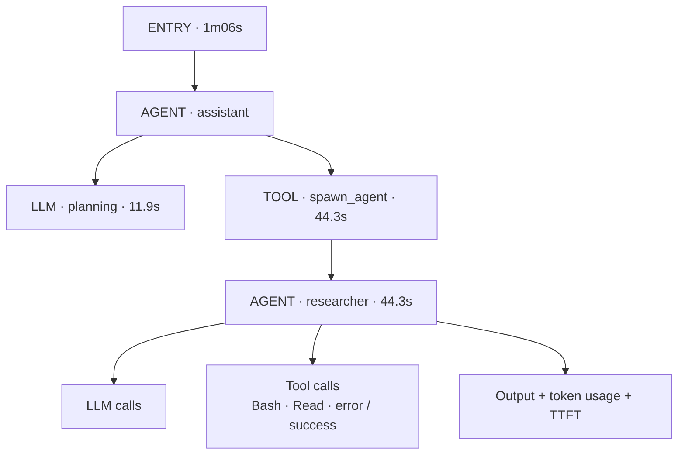

*Ví dụ cây gọi trong Trace thực thi Agent*

Hình này cho thấy cách các ngữ nghĩa thực thi hiện ra trong một Trace thực tế: bắt đầu từ lối vào Entry, tầng dưới ghi các thao tác gọi model, thực thi tool và kiểm tra Guardrail; khi Agent chính phân phát sub-agent qua tool thì sub-agent cùng các lời gọi model và tool sau đó của nó tiếp tục triển khai theo đúng quan hệ gọi thật. Mỗi node còn có thể liên kết thêm thông tin như thời lượng, model, token, TTFT, input/output và trạng thái thực thi, nhờ đó drill-down từ tổng quan request xuống tới từng bước cụ thể, định vị được chỗ tốn thời gian chính và vị trí bất thường.

**Cấu trúc cha–con của Trace phải phản ánh quan hệ gọi thật, chứ không phải ghép gượng để có một cây cố định.** Ví dụ, sub-agent nếu do một tool phân phát khởi động thì phải nằm dưới node TOOL tương ứng; còn các lời gọi tool song song thì phải hiện ra thành nhiều thao tác song song dưới cùng một node cha. Guardrail nên nằm sát thao tác được bảo vệ và nêu rõ đối tượng kiểm tra cùng giai đoạn thực thi; thường nó nằm cùng STEP với LLM hay TOOL và xếp theo thứ tự thực tế; nếu call stack thật trong bản hiện thực có lồng nhau thì cũng có thể ghi thành node con của thao tác tương ứng.

Với các đơn vị ngữ nghĩa trên, nên dùng thông tin chung nhất quán để mô tả tên, loại thao tác, trạng thái thực thi, thời điểm bắt đầu–kết thúc, tóm tắt input/output và lỗi, rồi bổ sung thuộc tính cần thiết theo từng loại thao tác model, truy hồi, tool. **Thiết kế ngữ nghĩa nên ưu tiên ghi những sự thật mà hệ thống quan sát và kiểm chứng trực tiếp được** - gồm kế hoạch tường minh, việc chọn tool, thay đổi trạng thái và kết quả thực thi - **chứ không lấy quá trình tư duy nội bộ của model (vốn không lấy được ổn định) làm trường bắt buộc.** Khi liên quan tới Prompt, phản hồi model và tham số tool, hãy dùng tóm tắt, ẩn danh hay thu thập theo nhu cầu dựa trên giá trị chẩn đoán.

### 13.3.3 Quan sát lỗi, độ trễ và độ ổn định vận hành

Lỗi của Agent không chỉ gồm ngoại lệ interface và dịch vụ không khả dụng, mà còn gồm **những thất bại nghiệp vụ chưa được xử lý đúng trong quá trình thực thi.** Để định vị chính xác, cần phân biệt các loại khác nhau: lỗi gọi model, truy hồi thất bại, lỗi thực thi tool, kiểm tra tham số thất bại, bị từ chối quyền, timeout và chấm dứt bởi con người; đồng thời ghi lại bước mà lỗi xuất hiện lần đầu cùng tình hình lan truyền sau đó. Với trường hợp tool trả về thất bại nhưng Agent vẫn chạy tiếp, còn phải **giữ đồng thời trạng thái thất bại của bước tool và trạng thái cuối của cả task.**

Quan sát độ trễ cần triển khai ở hai tầng: **tổng thể request và từng bước thực thi.** Độ trễ đầu cuối của request phản ánh thời gian chờ thực tế của người dùng; còn thời lượng từng bước thì dùng để giải thích thời gian đã đi đâu. Với một lần thực thi điển hình, có thể quan sát riêng thời lượng của các giai đoạn orchestration Agent, gọi model, truy hồi tri thức, thực thi tool và tổng hợp kết quả; với lời gọi model dạng stream thì còn có thể quan tâm độ trễ tới output hữu ích đầu tiên. Qua thời lượng từng bước cùng thứ tự gọi, ta nhận diện được đường then chốt cùng các nguồn gây trễ như chờ tuần tự, tool chậm và lời gọi trùng.

Vấn đề ổn định **không nhất thiết biểu hiện thành một request thất bại**, mà cũng có thể là tỉ lệ lỗi, tỉ lệ timeout hay đuôi dài độ trễ tăng dai dẳng. Loại vấn đề này thường phải phát hiện xu hướng hay bất thường qua metric tổng hợp trước, rồi mới drill-down xuống Trace của request tương ứng để xem vị trí lỗi cụ thể và thời lượng từng bước.

Về lỗi, độ trễ và độ ổn định vận hành, nên tập trung vào các chỉ số sau:

| Nhóm chỉ số | Chỉ số trọng tâm | Ý nghĩa quan sát |
| --- | --- | --- |
| Lượng request | Số request và tốc độ request | Phản ánh quy mô truy cập và xu hướng thay đổi traffic của ứng dụng Agent. |
| Lỗi và timeout | Tỉ lệ lỗi của request, tỉ lệ lỗi theo từng loại thao tác, tỉ lệ timeout, tỉ trọng theo loại lỗi và phân bố vị trí thất bại lần đầu | Nhận định vấn đề tập trung ở khâu orchestration Agent, model, truy hồi, tool hay policy an toàn. **Ở đây chỉ thống kê các lỗi thực thi quan sát trực tiếp được, không đưa việc task có hoàn thành đúng hay không vào chỉ số này.** |
| Độ trễ đầu cuối | P50, P95 và P99 của tổng thời lượng request, cùng độ trễ tới output đầu tiên mà người dùng nhìn thấy | Cái trước phản ánh tổng thời gian chờ của một request; cái sau phản ánh cảm nhận của người dùng trong tương tác stream. **Output đầu tiên người dùng thấy và phản hồi đầu tiên của model phải thống kê riêng.** |
| Độ trễ từng bước | P50, P95 và P99 thời lượng của các thao tác Agent, LLM, RETRIEVAL, MEMORY, TOOL, GUARDRAIL và COMPACTION | Nhận diện đường then chốt, bước chậm, chờ tuần tự và đuôi dài độ trễ. |
| Hiệu năng model | Thời lượng gọi model, TTFT (độ trễ token đầu), TPOT (độ trễ trung bình mỗi token output) và tốc độ xuất token | Phân biệt các vấn đề hiệu năng khác nhau: gọi model chậm tổng thể, trả token đầu chậm hay sinh liên tục chậm. |

Qua những chỉ số này, ta nhận diện được các vấn đề ổn định như lỗi, timeout, đuôi dài độ trễ và bất thường hiệu năng model ở ba tầng: tổng thể request, từng bước thực thi và việc sinh của model.

### 13.3.4 Quan sát mức tiêu thụ token, chi phí gọi và hiệu suất vận hành

Gọi model là một trong những nguồn chi phí chính khi chạy Agent, và phí của nó thường thay đổi động theo loại model cùng lượng token. Vì vậy, việc quan sát token cần ghi riêng token input, output và cache, rồi liên kết tới lời gọi model cùng quá trình thực thi Agent tương ứng. Khi dịch vụ model trả về được lượng dùng chính xác thì lấy dữ liệu phía server làm chuẩn; còn khi không lấy trực tiếp được thì có thể ước lượng dựa trên luật tách token, **nhưng phải ghi rõ thước đo ước lượng và phân biệt với dữ liệu tính phí thực tế**, tránh ảnh hưởng tới việc hạch toán chi phí.

Việc phân tích chi phí **không thể chỉ dừng ở một lần gọi model.** Một lượt tương tác có thể gọi nhiều model hay nhiều sub-agent, nên phải tổng hợp lượng dùng và phí của các lời gọi model lên tầng Trace, Agent và Session; còn khi hệ nghiệp vụ cung cấp được định danh task ổn định thì có thể tổng hợp tiếp lên tầng task. Việc tính chi phí phải giữ lại các căn cứ như model, nhà cung cấp, loại token, version bảng giá và tiền tệ, để tính lại và audit được.

Hiệu suất vận hành phản ánh **Agent đã bỏ ra bao nhiêu lời gọi và tài nguyên để thu được một kết quả hữu ích.** Ngoài tổng token và tổng chi phí, còn có thể quan sát số lần gọi model, số lần gọi tool, tình hình dùng cache, tỉ trọng bước vô ích và số bước trung bình trước khi hoàn thành task. **Chỉ khi kết hợp chi phí với kết quả task mới phân biệt được một task đắt hợp lý với một sự lãng phí chi phí do gọi lặp, retry bất thường hay đường đi kém hiệu quả gây ra.**

Về mức tiêu thụ token, chi phí gọi và hiệu suất vận hành, nên tập trung vào các chỉ số sau:

| Nhóm chỉ số | Chỉ số trọng tâm | Ý nghĩa quan sát |
| --- | --- | --- |
| Lượng token | Token input, token output, tổng token của từng lần gọi LLM và từng Trace, cùng token suy luận khi lấy được | Nhận định token chủ yếu tiêu ở context input, ở suy luận hay ở output cuối; nhận diện giá trị bất thường đơn lẻ và đuôi dài phân bố. |
| Token cache | Token đọc cache, token ghi cache, cùng tỉ lệ cache hit | Đánh giá Prompt cache có thực sự giảm được khối lượng tính toán và chi phí gọi cho phần input lặp lại hay không. Tỉ lệ cache hit có thể tính theo tỉ trọng token đọc cache trên token input; **thước đo cache của các nhà cung cấp không hoàn toàn giống nhau, phải thống kê theo đúng ngữ nghĩa trả về.** |
| Chi phí gọi model | Chi phí token input, output, cache và suy luận; chi phí một lần gọi LLM và tỉ trọng chi phí theo từng model | Nhận diện model đắt, loại token đắt và ảnh hưởng của chiến lược chọn model tới chi phí. |
| Hiệu suất thực thi | Số bước, số lời gọi LLM, số lời gọi tool và số token của mỗi Trace, cùng tỉ trọng bước lặp | Nhận định đường thực thi của Agent có quá dài hay có lời gọi trùng không, dùng để phát hiện sự phình thực thi và orchestration kém hiệu quả. |

Các chiều của chỉ số nên ưu tiên các trường cardinality thấp như ứng dụng, Agent, loại thao tác, model, nhà cung cấp, loại tool, kết quả thực thi và môi trường. **Các nội dung cardinality cao như Session ID, Trace ID, user ID và Prompt động thì không nên làm label của metric**, mà giữ trong Trace hay log để drill-down.

### 13.3.5 Quan sát hiệu quả task và chất lượng output

Ứng dụng truyền thống thường đánh giá request thành công hay không qua status code và ngoại lệ; nhưng **một request Agent trả về thành công về mặt kỹ thuật không có nghĩa mục tiêu người dùng đã đạt.** Model có thể sinh câu trả lời sai hoặc thiếu; kết quả truy hồi có thể không liên quan tới câu hỏi; tool tuy gọi thành công nhưng không tạo ra kết quả nghiệp vụ như mong đợi. Vì vậy, **hiệu quả task và chất lượng output không suy trực tiếp ra được từ các chỉ số vận hành cơ bản**, mà cần thực hiện thêm việc kiểm tra bằng luật, đánh giá bằng model hay đánh giá của con người trên nền dữ liệu mà Trace thu được.

Khi quan sát, có thể đánh giá Agent ở ba tầng: **đánh giá kết quả cuối** quan tâm output có đúng, đủ và thoả yêu cầu người dùng không; **đánh giá bước then chốt** quan tâm nội dung truy hồi, việc chọn tool, tham số gọi và việc routing sub-agent có hợp lý không; **đánh giá quỹ đạo thực thi** quan tâm cả đường quyết định và hành động có hỗ trợ được kết quả cuối không, và có thao tác lệch mục tiêu hay không cần thiết không. **Kết quả đánh giá phải được liên kết tới Session, Trace hay Span cụ thể**, để vấn đề chất lượng truy ngược được về quá trình thực thi thật, **chứ không chỉ lưu một điểm tổng tách rời khỏi chuỗi vận hành.**

Các bộ đánh giá tổng quát thường gặp gồm:

| Bộ đánh giá | Nội dung đánh giá chính | Đối tượng áp dụng |
| --- | --- | --- |
| Tính đúng đắn | Sự thật, kết luận hay kết quả thao tác trong output có khớp với đáp án tham chiếu, sự thật đã biết hay kết quả kiểm tra không | Câu trả lời cuối, kết quả có cấu trúc và sản phẩm task |
| Mức liên quan | Output có trả lời trực tiếp yêu cầu người dùng không, nội dung truy hồi có liên quan tới câu hỏi hiện tại không | Câu trả lời cuối và kết quả truy hồi |
| Tính đầy đủ | Có phủ các câu hỏi then chốt, điều kiện ràng buộc và các bước cần thiết trong yêu cầu không | Câu trả lời cuối và kết quả task |
| Tính có căn cứ | Các sự thật và kết luận trong output có được nội dung truy hồi, kết quả tool hay context đã cho hỗ trợ không | Agent kiểu RAG, tìm kiếm và phân tích dữ liệu |
| Tuân thủ chỉ dẫn | Định dạng output, ràng buộc hành vi, yêu cầu vai trò và chỉ dẫn người dùng có được thoả không | Câu trả lời cuối và hành vi Agent |
| Chất lượng truy hồi | Nội dung recall có liên quan, đủ và tạo được căn cứ hữu hiệu cho câu trả lời sau đó không | Span RETRIEVAL và nội dung nó trả về |
| Tính đúng đắn của lời gọi tool | Việc chọn tool, thời điểm gọi và tham số có phù hợp mục tiêu người dùng cùng context hiện tại không | Span TOOL và quyết định từng bước |
| Chất lượng quỹ đạo | Đường thực thi tổng thể của Agent có hợp lý không, có bỏ sót, lệch hướng hay bước thừa không | Trace đầy đủ và quá trình cộng tác multi-agent |
| An toàn và tuân thủ | Output hay thao tác có vi phạm chính sách an toàn, ranh giới quyền hạn và yêu cầu tuân thủ không | Output cuối, lời gọi model và thao tác tool |

Các bộ đánh giá khác nhau có thể dùng cách hiện thực khác nhau. Với các bối cảnh có đáp án, định dạng hay trạng thái nghiệp vụ rõ ràng, nên ưu tiên dùng luật có tính xác định và kiểm tra của hệ nghiệp vụ; với chất lượng ngữ nghĩa khó đánh giá trực tiếp bằng code thì có thể dùng LLM-as-a-Judge; còn với kết quả rủi ro cao hay mang tính chủ quan mạnh thì cần kết hợp chuyên gia rà soát, phản hồi người dùng và gán nhãn thủ công. Bản ghi đánh giá ít nhất phải giữ tên và version bộ đánh giá, đối tượng được đánh giá, điểm hay hạng, lý do nhận định cùng bằng chứng, và liên kết với Trace hay Span được đánh giá. Môi trường production có thể đánh giá thời gian thực hoặc theo mẫu; còn môi trường offline thì có thể tái dùng Trace lịch sử và mẫu đã gán nhãn để phân tích tập trung.

Cần lưu ý, **các bộ đánh giá tổng quát chỉ cung cấp tín hiệu chất lượng nền, không thay thế được việc đánh giá hiệu quả hướng tới mục tiêu nghiệp vụ cụ thể.** Việc Agent có thực sự hoàn thành task không, tạo ra bao nhiêu giá trị nghiệp vụ, có cho phép đường đi thay thế không, và mức ảnh hưởng của từng loại lỗi ra sao - tất cả đều gắn chặt với quy trình nghiệp vụ, dữ liệu và yêu cầu rủi ro. Xây dựng loại hệ đánh giá này thường phải chuẩn bị mẫu đại diện, định nghĩa tiêu chuẩn đánh giá và đáp án chuẩn, hiệu chỉnh bộ đánh giá bằng model, và liên tục lặp lại cùng phản hồi của chuyên gia - **cần đầu tư khá nhiều nguồn lực kỹ thuật và chuyên gia nghiệp vụ.** Cuốn sách sẽ giới thiệu chi tiết phương pháp và thực tiễn đánh giá Agent ở phần Tối ưu; mục này chỉ nói ngắn gọn về vị trí và cách làm cơ bản của nó trong hệ observability.

## 13.4 Audit Agent

### 13.4.1 Định nghĩa và ranh giới của audit Agent

**Audit Agent** là năng lực ghi nhận, kiểm tra và truy nguyên liên tục đối với định danh, uỷ quyền, hành vi thực thi và tác động bên ngoài của Agent, xây trên nền dữ liệu quan sát. Thứ nó phải trả lời không chỉ là một đoạn output model nào đó "trông có an toàn không", mà là: **ai, dưới quyền hạn nào, đã qua Agent nào phát ra task gì; Agent đã gọi những model, dữ liệu và tool nào; đã thực sự ảnh hưởng tới những đối tượng nào; có vượt qua ý định người dùng, policy tổ chức hay ranh giới tuân thủ không; và kết luận có rà soát lại được không.**

Audit Agent liên quan tới observability, đánh giá và Guardrail, nhưng trách nhiệm khác nhau. Observability thiên về tái dựng "đã xảy ra gì, vấn đề ở đâu"; đánh giá thiên về đo "hiệu quả task có đạt kỳ vọng không"; audit thiên về đánh giá **"hành vi có tuân thủ không, trách nhiệm quy về đâu, bằng chứng có đầy đủ không"**; còn Guardrail thì thực thi các kiểm soát cho phép, từ chối, ẩn danh, phê duyệt và giới hạn quyền trước hoặc trong lúc thực thi. **Audit hậu kiểm có thể phát hiện rủi ro và thúc đẩy cải tiến policy, nhưng không huỷ được những thay đổi file, request ra ngoài hay rò rỉ dữ liệu đã xảy ra.**

### 13.4.2 Sự thật audit và chuỗi bằng chứng rà soát được

Một hành vi của Agent thường trải qua nhiều khâu: **"chủ thể và uỷ quyền → mục tiêu và chỉ dẫn → gọi model → truy hồi hay memory → gọi tool → tác dụng phụ hệ thống → lan truyền kết quả".** Chỉ ghi lại Prompt, câu trả lời cuối hay tên tool - bất kỳ một trong số đó - **đều không đủ để tạo thành một audit hoàn chỉnh.** Chuỗi bằng chứng tối thiểu thường phải gồm:

*   **Chủ thể và phạm vi:** người dùng, Agent, sub-agent, định danh service cùng các định danh tenant, ứng dụng, phiên, task, Trace và lượt message.

*   **Ý định và uỷ quyền:** mục tiêu người dùng, nguồn chỉ dẫn, tool khả dụng, phạm vi quyền, phê duyệt của con người cùng version policy đang hiệu lực lúc đó.

*   **Sự thật thực thi:** request và response của model, thao tác truy hồi và memory, tham số cùng kết quả tool, và các tác dụng phụ thực tế như process, file, mạng, việc dùng credential.

*   **Kết quả và bằng chứng:** trạng thái thao tác, đối tượng bị ảnh hưởng, vị trí trúng rủi ro, tham chiếu event gốc, timestamp, version luật phát hiện hay model.

Việc đặt điểm đo phía ứng dụng biểu đạt được ngữ nghĩa nghiệp vụ của task, message và tool; còn telemetry của môi trường vận hành thì kiểm chứng được những tác dụng phụ thực sự xảy ra ở tầng process, file và mạng. Hai bên phải được liên kết qua các định danh ổn định về phiên, Trace, lời gọi tool và quan hệ process, **nhưng không được coi thẳng "model đưa ra ý định gọi" thành "tool đã thực thi thành công".** [OpenTelemetry GenAI Agent Spans](https://github.com/open-telemetry/semantic-conventions-genai/blob/main/docs/gen-ai/gen-ai-agent-spans.md) đang hình thành ngữ nghĩa dùng chung cho các thao tác Agent, workflow, tool và memory, **nhưng hiện vẫn ở trạng thái Development, và cũng không đồng nghĩa với một quy chuẩn audit đầy đủ.**

Trong đó, eBPF bổ sung cho audit Agent phần **bằng chứng runtime về những gì "thực sự đã xảy ra".** Khi không sửa được phần hiện thực của Agent hay framework, probe ở phía kernel có thể thu thập không xâm lấn các event tạo và thoát process, dòng lệnh, đọc ghi file và kết nối mạng, rồi dựa vào quan hệ process, kết nối và timestamp để **liên kết ý định gọi tool với các tác dụng phụ hệ thống xảy ra sau đó.** Điều này vừa kiểm chứng được lệnh có thật sự chạy không, file có thật sự bị sửa không, dữ liệu có được gửi ra ngoài không, vừa tạo một lối vào sự thật tương đối thống nhất cho các Agent dị chủng hay đóng nguồn. Nhưng eBPF thường **thiếu mục tiêu người dùng, uỷ quyền nghiệp vụ, nguồn Prompt và context ứng dụng**, và khả năng nhìn thấy traffic đã mã hoá cùng một số giao thức ở user space cũng hạn chế; vì vậy nó phải **đối chứng cùng việc đặt điểm đo ứng dụng, Hook, log AI Gateway và bản ghi policy - không được chỉ dựa vào nó mà kết luận là vượt quyền hay bị tấn công.**

Sự thật gốc nên dùng cách **ghi thêm (append-only)** và giữ định danh ổn định; còn kết luận phát hiện thì hình thành bản ghi phái sinh bằng cách tham chiếu bằng chứng, tránh sửa lại event gốc chỉ để chỉnh kết luận. Đồng thời, Prompt, phản hồi model và kết quả tool thường chứa thông tin cá nhân, dữ liệu nghiệp vụ hay credential, nên **bản thân dữ liệu audit cũng là tài sản nhạy cảm cao.** [Hướng dẫn của OpenTelemetry về việc thu thập input/output](https://github.com/open-telemetry/semantic-conventions-genai/blob/main/docs/gen-ai/gen-ai-spans.md#capturing-instructions-inputs-and-outputs) khuyến nghị coi loại nội dung nhạy cảm, khối lượng lớn này là **một lựa chọn tường minh.** Môi trường production cần kết hợp thu thập tối thiểu, ẩn danh, lưu trữ độc lập, kiểm soát truy cập, mã hoá, cô lập tenant và quản lý thời hạn lưu; **audit đầy đủ không đồng nghĩa với việc lưu toàn bộ nội dung không giới hạn, và cũng không lấy việc ghi lại quá trình suy luận riêng tư mà model không phơi ra làm tiền đề.**

### 13.4.3 Phát hiện trong audit, hướng theo rủi ro

Rủi ro của Agent đến từ sự chồng lên nhau giữa **quyết định phi xác định** và **quyền thay đổi trạng thái bên ngoài.** Luật audit nên tổ chức quanh ranh giới tin cậy, phạm vi uỷ quyền và hậu quả thực tế, **chứ không chỉ đi tìm từ khoá nguy hiểm.** Các bối cảnh điển hình gồm:

*   **Dòng chảy dữ liệu nhạy cảm:** Secret, thông tin cá nhân, code hay dữ liệu nghiệp vụ có đi vào context model, xuất hiện trong output model, được ghi vào memory hay sản phẩm, hoặc bị tool gửi tới một đích chưa được uỷ quyền không.

*   **Prompt injection và chiếm mục tiêu:** các chỉ dẫn không đáng tin đến từ trang web, file, kết quả truy hồi hay giá trị trả về của tool có bị Agent tiếp nhận không, và có làm thay đổi kế hoạch, gọi tool hay sinh tác dụng phụ vượt quyền không.

*   **Dùng sai tool và thao tác nguy hiểm:** Agent có chạy lệnh rủi ro cao, sửa file nhạy cảm, truy cập đích mạng bất thường, xoá hay ghi đè dữ liệu hàng loạt không, và thao tác đó có được uỷ quyền tường minh cùng xác nhận của con người không.

*   **Lạm dụng định danh và quyền hạn:** quan hệ uỷ nhiệm giữa người dùng, Agent, sub-agent và dịch vụ tool có rõ ràng không, có mở rộng quyền, dùng sai credential dùng chung, vòng qua phê duyệt hay mất chủ thể chịu trách nhiệm không.

*   **Ô nhiễm context và chuỗi cung ứng:** memory ngắn – dài hạn, kho tri thức, Skill, mô tả tool MCP, cấu hình và dependency có bị ô nhiễm và tiếp tục ảnh hưởng hành vi trong các phiên sau không.

[OWASP Top 10 for Agentic Applications 2026](https://genai.owasp.org/resource/owasp-top-10-for-agentic-applications-for-2026/) liệt kê chiếm mục tiêu, dùng sai tool, lạm dụng định danh và quyền hạn, rủi ro chuỗi cung ứng, thực thi code ngoài ý muốn, ô nhiễm memory và lỗi dây chuyền là những rủi ro quan trọng. Nó **phù hợp làm điểm xuất phát cho threat modeling, chứ không phải một tiêu chuẩn chứng nhận hay một danh sách vét cạn.** Khi triển khai, vẫn phải kết hợp nghiệp vụ cụ thể để định nghĩa "được làm gì, cần phê duyệt gì, tuyệt đối không được làm gì" - vì cùng một lệnh hay cùng một lần truy cập dữ liệu, dưới những chủ thể, môi trường và uỷ quyền task khác nhau, có thể ứng với những mức rủi ro hoàn toàn khác nhau.

### 13.4.4 Từ tín hiệu ứng viên tới sự kiện xử lý được

Để cân bằng giữa độ bao phủ và khả năng xử lý, audit Agent có thể dùng chuỗi phân tầng **"sự thật gốc → tín hiệu ứng viên → thẩm định theo context → sự kiện đã xác nhận".** Các luật có tính xác định, việc nhận diện thông tin nhạy cảm, khớp policy và phát hiện bất thường sẽ sinh ứng viên trên các event cục bộ trước; sau đó, hệ thống kéo lại context theo phiên, task, chủ thể và đối tượng rủi ro, kiểm tra nguồn chỉ dẫn, phạm vi uỷ quyền, tool có thực sự chạy không, đã sinh ra tác dụng phụ gì và ảnh hưởng có lan ra không - rồi mới quyết định có hình thành một sự kiện rủi ro cần xử lý hay không.

Kết quả thẩm định ít nhất phải phân biệt ba trạng thái: **bằng chứng đủ để xác nhận rủi ro; bằng chứng đủ để khẳng định chuỗi rủi ro không thành lập hoặc hành vi vẫn trong phạm vi uỷ quyền; và thiếu bằng chứng then chốt, tạm thời chưa đánh giá được.** **Trạng thái thứ ba không được coi là kết luận an toàn.** Mức nghiêm trọng và độ tin cậy cũng nên ghi riêng: một sự kiện ảnh hưởng rất lớn nhưng bằng chứng chưa đủ, và một sự kiện bằng chứng đầy đủ nhưng ảnh hưởng hạn chế, **không nên vào cùng một hàng đợi ưu tiên.**

Model có thể dùng để hiểu context dài, khái quát chuỗi hành vi và hỗ trợ giảm nhiễu, **nhưng không nên là nguồn bằng chứng duy nhất.** Bản thân tài liệu audit đưa vào model cũng có thể chứa prompt injection, nên phải **cô lập dữ liệu với chỉ dẫn, giới hạn tool mà model dùng được, dùng output có cấu trúc, và giữ lại version luật, tham chiếu bằng chứng cùng phần giải thích đánh giá.** Phần giải thích do model sinh ra cũng thuộc loại output cần kiểm chứng, **không thay thế được sự thật gốc, luật tính lại được và việc rà soát của con người.**

### 13.4.5 Điều tra, xử lý và vòng lặp khép kín kiểm soát

Sản phẩm bàn giao của một hệ audit chất lượng **không phải một danh sách cảnh báo cứ dài mãi ra**, mà là một **hàng đợi công việc rủi ro điều tra được, phân công được và kiểm chứng được.** Rủi ro nên xếp theo mức nghiêm trọng, độ tin cậy, tài sản bị ảnh hưởng, phạm vi lan truyền, xu hướng xảy ra và tầm quan trọng nghiệp vụ; người điều tra vừa có thể phát lại toàn bộ hành vi từ timeline Session, vừa có thể truy ngược phạm vi ảnh hưởng từ các thực thể như Secret, người dùng, Agent, tool, host hay địa chỉ đích, và định vị được tới message, lời gọi tool cùng event hệ thống cụ thể.

Sau khi xác nhận rủi ro, cần đi vào một quy trình ứng phó sự cố có người phụ trách, trạng thái, hành động xử lý, bằng chứng và lý do đóng. Việc xử lý có thể gồm xoay vòng credential, thu hồi quyền, cô lập phiên, sửa việc ghép context, chỉnh whitelist tool, thêm phê duyệt của con người hay cập nhật luật phát hiện. Sau khi đóng, còn phải kiểm chứng xem credential cũ có còn được dùng không, hành vi cùng loại có tái diễn không, policy có thực sự hiệu lực không; và liên tục đánh giá chất lượng audit qua tỉ lệ dương tính giả, âm tính giả, thời gian xác nhận trung bình, thời gian đóng trung bình và tỉ lệ tái diễn.

Kết luận audit có thể quay lại nuôi Guardrail, **nhưng việc phát hiện và việc chặn phải được mô hình hoá tách rời.** Những policy phù hợp để chặn thời gian thực thì bắt buộc phải có tính xác định, độ trễ thấp, giải thích được, phát lại được, và có khả năng chạy shadow, phát hành canary cùng rollback nhanh; còn những kết luận thiếu context hoặc phụ thuộc vào đánh giá ngữ nghĩa mở thì phù hợp hơn để đi vào điều tra bất đồng bộ và xác nhận bởi con người. [OWASP Agent Control Standard](https://genai.owasp.org/resource/agent-control-standard-acs/) đề xuất dùng các runtime hook chuẩn hoá để nối khả năng truy vết với việc thực thi policy, **nhưng chuẩn này vẫn đang tiến hoá.** Vòng khép kín cuối cùng nên là **"quan sát sự thật → đánh giá audit → điều tra và xử lý → cập nhật policy → kiểm chứng thực thi"**, chứ không phải biến mọi tín hiệu đáng ngờ thành một lệnh chặn đồng bộ.

## 13.5 Observability cho hạ tầng AI

### 13.5.1 Observability cho AI Gateway

Việc tích hợp quan sát bên trong ứng dụng Agent thường do từng đội R&D nghiệp vụ thực hiện, nên dễ chịu ảnh hưởng bởi stack công nghệ, framework Agent, nhịp phát hành và mức độ đầy đủ của việc đặt điểm đo - vì vậy độ phủ và chất lượng dữ liệu quan sát giữa các ứng dụng có thể chênh lệch. Trong bối cảnh doanh nghiệp, người ta thường dùng **AI Gateway** để proxy thống nhất việc các ứng dụng nội bộ truy cập dịch vụ model, MCP Server và tool bên ngoài, đồng thời quản lý tập trung credential dịch vụ, định danh gọi, quyền truy cập, quota và policy an toàn. Vì traffic tập trung đi qua tầng này, AI Gateway có thể cung cấp **một lối vào quan sát tương đối thống nhất và ổn định**, bù cho việc thu thập ở phía ứng dụng chưa đầy đủ hay ngữ nghĩa không nhất quán.

AI Gateway có thể thiết lập các năng lực quan sát bổ trợ nhau qua Metrics, Trace và log:

*   **Metrics** dùng để phát hiện xu hướng tổng thể, thay đổi hiệu năng và bất thường. Phía truy cập model có thể thống kê lượng request, tỉ lệ lỗi, tỉ lệ timeout, phân vị độ trễ, thời lượng xử lý của gateway, thời gian chờ thượng nguồn, độ trễ chunk phản hồi đầu tiên, tốc độ output stream, lượng token, tỉ lệ cache hit, chi phí gọi, cùng phân bố traffic theo model, nhà cung cấp và route. Phía truy cập MCP/Tool thì có thể thống kê lượng request, tỉ lệ lỗi, tỉ lệ timeout và thời lượng theo từng MCP Server, phương thức giao thức và tool. Metric nên dùng các chiều tương đối ổn định như ứng dụng, tenant, model, nhà cung cấp, MCP Server, tool và kết quả thực thi.

*   **Trace** dùng để tái dựng đường xử lý thực tế của một request, ghi lại các khâu xác thực–uỷ quyền, kiểm tra policy, chọn route, đánh giá cache và gọi thượng nguồn sau khi request vào gateway; đồng thời thể hiện được các quá trình thực tế như chuyển model, retry, Fallback hay failover backend MCP. Nếu Agent đã truyền context Trace vào, gateway nên tạo Span xử lý **trong cùng một Trace** và tiếp tục lan truyền tới inference engine hay MCP Server, để liên kết chuỗi giữa Agent, AI Gateway, inference engine và việc thực thi tool.

*   **Log** dùng để ghi các event chi tiết như truy cập request, quyết định routing, xác thực–uỷ quyền, rate limit và quota, policy an toàn, ngoại lệ giao thức và lỗi thượng nguồn. Log có cấu trúc có thể chứa định danh gọi, model được request và model thực tế, phương thức MCP và tool đích, đích route, trạng thái thực thi, kết quả đánh giá, lý do lỗi, thời lượng, token và chi phí; và liên kết với Trace qua Trace ID hay request ID.

Ba loại dữ liệu quan sát lần lượt dùng để **phát hiện bất thường, định vị đường đi và giải thích chi tiết**, rồi liên kết với nhau qua định danh đối tượng và ngữ nghĩa nhất quán.

Với việc truy cập model, AI Gateway nên thiết lập năng lực quan sát trọng tâm ở các góc độ sau:

| Hướng quan sát | Nội dung quan sát trọng tâm | Vấn đề phân tích chính |
| --- | --- | --- |
| Trạng thái request và dịch vụ | Số request, tốc độ request, tỉ lệ lỗi ở tầng giao thức, tỉ lệ timeout, phân bố request stream và không stream, cùng trạng thái instance gateway và connection pool | Đánh giá bất thường đến từ chính gateway, từ request của client hay từ dịch vụ model thượng nguồn. **Lời gọi giao thức thành công chỉ nghĩa là request hoàn tất bình thường, không đồng nghĩa với việc task Agent đã hoàn thành.** |
| Phân đoạn hiệu năng | Tổng thời lượng request theo góc nhìn gateway, thời lượng xử lý của gateway, thời gian kết nối và chờ thượng nguồn, độ trễ chunk phản hồi đầu tiên, thời lượng phản hồi stream và tốc độ output | Phân biệt thời gian tiêu ở khâu xử lý của gateway, ở truyền tải mạng hay ở phản hồi của model thượng nguồn. **Thứ gateway quan sát được là biểu hiện phản hồi bên ngoài, không thay thế được việc phân tích hàng đợi, Prefill và Decode bên trong inference engine.** |
| Routing model | Model được request và model thực tế, nhà cung cấp, endpoint thượng nguồn, luật route cùng lý do trúng, và kết quả thực thi của load balancing, retry, Fallback và circuit breaker | Giải thích request cuối cùng đã truy cập model nào, chiến lược route có hiệu lực như dự kiến không, và việc chuyển model có đưa vào lỗi, độ trễ hay thay đổi chi phí không. |
| Lượng dùng và chi phí | Token input, output và cache; tình hình cache hit, chi phí gọi model, cùng việc tổng hợp theo ứng dụng, tenant, định danh gọi, model và nhà cung cấp | Nhận diện bên tiêu thụ tài nguyên chính, model đắt và lượng dùng bất thường, làm căn cứ cho quản lý ngân sách và quota. **Lượng dùng thực tế, lượng ước lượng và lượng tính phí phải dùng các thước đo khác nhau.** |
| Định danh gọi và kết quả policy truy cập | Các định danh gọi như tenant, ứng dụng, Agent và người dùng, cùng kết quả xác thực, kết quả uỷ quyền, quyền truy cập model đích, tình hình trúng policy rate limit và quota | Phân tích ai đã phát lời gọi, truy cập model nào, và vì sao request được cho phép, bị giới hạn hay bị từ chối. **Các định danh nhạy cảm không nên dùng trực tiếp làm label metric cardinality cao.** |
| Thực thi policy an toàn | Kiểm tra an toàn input và output, nhận diện dữ liệu nhạy cảm, đánh giá policy nội dung, cùng kết quả xử lý như cho qua, chặn, ẩn danh hay viết lại | Nhận định rủi ro tập trung ở loại ứng dụng, model và bên gọi nào, và kiểm chứng policy an toàn có thực sự được thực thi không. **Dữ liệu quan sát nên ưu tiên ghi loại rủi ro, đánh giá và cách xử lý, tránh mặc định lưu trọn nội dung nhạy cảm.** |
| Liên kết Trace | Context Trace do phía Agent truyền vào, Span xử lý của gateway, định danh request thượng nguồn và context lan truyền tới dịch vụ inference | Nối Agent, AI Gateway và inference engine, hỗ trợ drill-down từ request Agent xuống route cụ thể, lời gọi thượng nguồn và hạ tầng. |

Khi AI Gateway đồng thời gánh vai trò MCP/Tool Gateway, đối tượng quan sát mở rộng từ chỉ request model sang cả tương tác giao thức MCP và truy cập tool. **MCP không chỉ gồm lời gọi tool**, mà còn có thể gồm khởi tạo, thoả thuận năng lực, khám phá tool, đọc resource, lấy Prompt và thông báo - **vì vậy không được quy mọi traffic MCP thành TOOL.** Có thể quan tâm thêm các nội dung sau:

| Hướng quan sát | Nội dung quan sát trọng tâm | Vấn đề phân tích chính |
| --- | --- | --- |
| Trạng thái giao thức và request | Kết quả khởi tạo và thoả thuận năng lực, trạng thái và thời lượng của request khám phá tool, version giao thức, cách truyền tải, context kết nối hay request, trạng thái kênh stream, thay đổi danh sách tool và lỗi giao thức | Phân biệt lỗi nghiệp vụ của tool với các vấn đề về khám phá tool MCP, truyền tải kết nối, tương thích version và xử lý message. |
| Truy cập tool và resource | Phương thức MCP, Server đích, tên tool hay resource, trạng thái lời gọi, lỗi, timeout, huỷ, thời lượng, tóm tắt tham số và quy mô kết quả | Phân tích tool cụ thể có được truy cập đúng không, phần tốn thời gian chính nằm ở gateway hay backend, và lỗi tập trung ở Server hay tool nào. **Tham số và kết quả phải được tóm tắt, ẩn danh hay thu thập theo nhu cầu theo mức nhạy cảm.** |
| Routing và sức khoẻ backend | MCP Server và instance thực sự được route tới, luật route, trạng thái sức khoẻ backend, kết quả load balancing và failover | Định vị vị trí thực thi thực tế của các tool trùng tên hay dịch vụ nhiều instance, và nhận định thất bại có đến từ routing hay từ instance backend không. |
| Kết quả uỷ quyền và thực thi policy | Định danh bên gọi, ánh xạ định danh Agent và người dùng, Server và tool đích, đánh giá uỷ quyền, policy đã trúng, lý do từ chối, cùng kết quả rate limit, quota và phê duyệt của con người | Phân tích chủ thể nào đã truy cập tool nào, request vì sao được cho phép hay bị từ chối, và các thao tác rủi ro cao hoặc có tác dụng phụ ra bên ngoài có qua uỷ quyền và phê duyệt không. |
| Liên kết Trace | Span TOOL của Agent, Span proxy của gateway, định danh request MCP cùng context Trace của MCP Server và hệ hạ nguồn | Thiết lập quan hệ gọi trọn vẹn **"quyết định của Agent - quản trị của gateway - thực thi tool"**, tránh ghi ngữ nghĩa tool phía ứng dụng và quá trình proxy của gateway thành hai chuỗi tách rời. |

Cùng một lời gọi model hay tool có thể sinh bản ghi quan sát riêng ở cả phía Agent lẫn phía gateway, nhưng **ý nghĩa của hai bản ghi là khác nhau.** Span Agent mô tả ngữ nghĩa và context của thao tác đó trong việc thực thi task; còn Span gateway mô tả quá trình proxy, xác thực, policy và routing. Bằng việc lan truyền context Trace một cách thống nhất, dữ liệu hai tầng được xâu lại với nhau. Từ đó, giá trị đặc thù của observability cho AI Gateway chủ yếu thể hiện ở **độ phủ thống nhất xuyên ứng dụng, phân tích định danh gọi và quyền hạn, giải thích quyết định routing, kiểm chứng policy quản trị, cùng việc định vị hiệu năng và lỗi ở thượng nguồn model và tool.**

### 13.5.2 Observability cho inference engine

Inference engine nằm giữa chuỗi gọi model và tài nguyên GPU. Với các dịch vụ inference online dùng framework như vLLM, SGLang, **chỉ quan sát thời lượng request HTTP hay mức dùng GPU đều không đủ**: cái trước không giải thích được thời gian tiêu ở hàng đợi, Prefill hay Decode; cái sau cũng không trả lời được lô request nào, độ dài input nào hay lần lập lịch nào đã gây ra dao động. Một hệ observability đầy đủ cho inference engine phải đồng thời phủ **chỉ số ở mức model, chỉ số tài nguyên Pod và GPU, chuỗi gọi của từng request, cùng hiện trường lập lịch đồng thời bên trong engine**, và liên kết những thông tin đó qua các định danh request ID, Trace ID, model, instance và Pod.

#### Quan sát phân tầng từ model, instance tới request

Chỉ số ở mức model dùng để đánh giá dịch vụ có đạt mục tiêu nghiệp vụ không, tập trung vào bốn nhóm tín hiệu sau:

*   **Traffic và độ tin cậy:** QPS, lượng request, tỉ lệ thành công, số lỗi và lý do kết thúc. Chúng dùng để nhận diện traffic tăng đột biến, dịch vụ bất thường, cùng các trường hợp request kết thúc do bị huỷ chủ động hay do chạm độ dài output tối đa.

*   **Trải nghiệm người dùng:** thời lượng đầu cuối (E2E Latency), độ trễ token đầu (TTFT) và độ trễ mỗi token sau đó (TPOT). TTFT chủ yếu phản ánh ảnh hưởng của hàng đợi và Prefill tới "bao lâu thì bắt đầu trả lời"; còn TPOT thì gần với tốc độ sinh ở giai đoạn Decode hơn. Với request dạng stream, **phải quan tâm đồng thời TTFT và TPOT, không thể chỉ dùng tổng thời lượng để đánh giá trải nghiệm tương tác.**

*   **Thông lượng và hình thái tải:** thông lượng token input, output; thông lượng token trên một GPU; cùng giá trị trung bình, phân vị và phân bố độ dài token Prompt/Generation. **Cùng số request không có nghĩa cùng mức tải**: Prompt dài sẽ khuếch đại chi phí Prefill, còn output dài thì chiếm khe Decode liên tục - vì vậy chiều token mô tả áp lực suy luận tốt hơn QPS đơn thuần.

*   **Lập lịch và cache:** các trạng thái lập lịch Waiting, Running, Swapped; thời gian chờ hàng đợi; thời lượng Prefill/Decode; mức dùng và tỉ lệ hit của KV Cache. Chúng phản ánh trực tiếp việc Continuous Batching đã bão hoà chưa, có tồn đọng request không, và prefix cache có thực sự giảm được tính toán lặp không.

Cùng nhóm chỉ số đó còn nên drill-down xuống chiều Pod hay instance inference để nhận định tải có cân bằng không. Ví dụ, nếu TTFT tổng thể của model tăng mà chỉ một Pod có Queue Time, số request Waiting và mức dùng KV Cache bất thường, thì thường nghĩa là **routing bị lệch hoặc dung lượng một instance không đủ**; còn nếu mọi Pod cùng xấu đi thì nhiều khả năng do traffic vượt dung lượng tổng thể, phân bố độ dài request thay đổi hoặc do điều chỉnh cấu hình. Liên kết thêm mức dùng GPU, SM Active, Tensor Active, mức chiếm VRAM và hoạt động băng thông VRAM sẽ phân biệt được các tình huống **"request đang xếp hàng nhưng GPU vẫn còn dư", "đơn vị tính toán đã bão hoà"** và **"VRAM hay truy xuất bộ nhớ trở thành nút thắt".** [Tài liệu về dashboard giám sát dịch vụ inference LLM](https://help.aliyun.com/zh/ack/cloud-native-ai-suite/user-guide/configure-monitoring-for-llm-inference-services) của Alibaba Cloud ACK đưa ra các chỉ số ở mức model, mức Pod và mức GPU cùng phạm vi áp dụng của chúng.

Trong trang thực thể ví dụ `sgl-512` mà chương này dùng, vùng tổng hợp 15 phút gần nhất hiển thị 596 request, khoảng 7K Input Tokens, 88,89K Output Tokens và 96,05K Total Tokens; bên dưới là các nhóm Requests và Latency với Total Requests, Num Requests Running, Waiting Requests, E2E Request Latency, TTFT và TPOT. Bố cục này đặt các chỉ số lượng dùng, trạng thái đồng thời và trải nghiệm người dùng trong cùng một khoảng thời gian, phù hợp để **nhận định tải có thay đổi không trước, rồi mới quyết định drill-down xuống tầng lập lịch, chuỗi gọi hay tài nguyên.** Tài liệu production **không nên lấy giá trị ví dụ ở một thời điểm nào đó làm baseline**; ngưỡng cảnh báo vẫn phải xây riêng theo model, quy cách phần cứng, độ dài input/output và SLO.

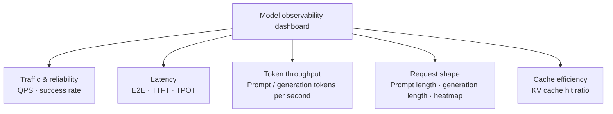

Dashboard ở mức model trong hình đảm nhận cùng trách nhiệm nhận định tầng một như trang thực thể: tổng hợp lượng request, tỉ lệ thành công, thông lượng token, TTFT, TPOT, độ dài input/output và tỉ lệ KV Cache hit theo chiều model thống nhất; còn khi cần định vị lệch tải thì chuyển sang panel Pod-Level và GPU Stats.

**Các chỉ số phải được diễn giải liên hợp, chứ không phải đặt ngưỡng cho từng cái.** Thời lượng đầu cuối của một request có thể chẻ xấp xỉ thành **"chờ hàng đợi + Prefill + Decode + chi phí framework và mạng".** Nếu E2E và TTFT cùng tăng trong khi TPOT về cơ bản ổn định thì nên kiểm tra trước số request Waiting, Queue Time, độ dài Prompt và Prefill. Nếu TTFT bình thường mà TPOT tăng thì nên tập trung kiểm tra xem giai đoạn Decode có bị Prefill cùng lô làm nhiễu không, mức đồng thời có quá cao không, và tính toán GPU hay băng thông VRAM đã bão hoà chưa. Còn nếu thông lượng giảm và tỉ lệ KV Cache hit cũng giảm theo thì còn phải kiểm tra prefix của request có thay đổi không, dung lượng cache có đủ không, hay traffic có bị phân bổ lại sang instance nguội không.

#### Dùng chuỗi gọi để tái dựng một request suy luận

Chỉ số nói được **"khi nào, model hay instance nào bất thường"**; còn chuỗi gọi thì lo trả lời **"request nào, chậm ở giai đoạn nào".** Sau khi probe Python tích hợp vào vLLM/SGLang, ta xem được trong Trace các phân cấp Span từ lối vào HTTP tới việc xử lý suy luận rồi tới request model ở tầng dưới - ví dụ `/v1/chat/completions`, `vllm.chat.completion.stream` và `llm_request`. Thuộc tính ở mức request có thể ghi thời lượng đầu cuối, thời gian hàng đợi, thời gian lập lịch, thời điểm token đầu và request ID; khi thoả yêu cầu an toàn dữ liệu và đã bật cấu hình thu thập tương ứng, còn có thể kết hợp Prompt, Completion, tên model cùng số token input/output để giải thích đặc trưng tải. Span và thuộc tính cụ thể thì theo framework, version và cấu hình thu thập thực tế - xem [tài liệu observability cho inference engine vLLM/SGLang](https://help.aliyun.com/zh/cms/cloudmonitor-2-0/observe-the-vllm-and-sglang-inference-engine) của Alibaba Cloud.

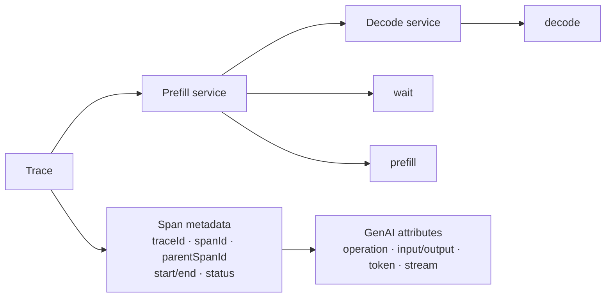

Trace này có tổng thời lượng khoảng 193,39 ms, trải qua hai ứng dụng Prefill và Decode. Cây Span bên trái trước hết cho biết vị trí cấu trúc và thời lượng từng giai đoạn của request: phía Prefill lần lượt gồm `POST /v1/chat/completions`, `chat qwen3-0.6b`, `llm_request`, `wait` và `prefill`, trong đó Span `chat` được chọn có input 60 token, thời lượng khoảng 11,88 ms; bên dưới nó `wait` khoảng 16 μs, `prefill` khoảng 9,38 ms. Còn Span HTTP phía Decode khoảng 177,18 ms. Từ đó có thể nhận định trước rằng request này gần như không phải xếp hàng, việc tính toán Prefill cũng không phải phần tốn thời gian chính, mà **thời gian dài chủ yếu rơi vào phía Decode.**

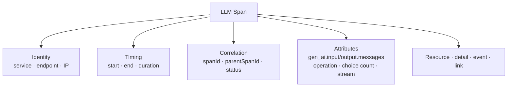

Phần Attributes bên phải bổ sung cho biểu đồ thác nước ngữ nghĩa **"lần gọi này cụ thể đã làm gì".** Ở Span `chat qwen3-0.6b` được chọn trong hình, có thể thấy các trường then chốt sau:

*   `gen_ai.operation.name=chat`: đánh dấu Span này là một thao tác sinh hội thoại, để nền tảng phân biệt được các workload suy luận khác nhau như Chat, Completion, Embedding, Rerank.

*   `gen_ai.request.is_stream=false`: cho biết lời gọi này là request không stream. Với request stream thì TTFT và quá trình xuất từng token có giá trị phân tích hơn; còn request không stream thì phù hợp hơn để quan sát cùng E2E và tổng thời lượng phản hồi.

*   `gen_ai.request.choice.count=1`: ghi số kết quả ứng viên mà một request kỳ vọng hay trả về. **Số ứng viên thay đổi sẽ ảnh hưởng tới khối lượng sinh thực tế, nên không được bỏ qua khi phân tích thời lượng và lượng token.**

*   `gen_ai.input.messages` và `gen_ai.output.messages`: lưu ngữ nghĩa có cấu trúc của message input, output, dùng để giải thích quy mô context, thành phần vai trò và hình thái trả về của các request bất thường. **Nhóm trường này có thể chứa input người dùng, câu trả lời model hay dữ liệu nghiệp vụ; môi trường production phải quyết định có thu thập hay không theo nguyên tắc tối thiểu cần thiết, kèm ẩn danh, kiểm soát quyền và thời hạn lưu.**

*   `call.kind=internal`, `call.type=local`: cho biết đây là lời gọi cục bộ bên trong process của dịch vụ inference, chứ không phải một ranh giới client hay server từ xa mới; chúng giúp tái dựng đúng quan hệ topology của Span.

*   `ali.trace.flag=arms`: đánh dấu Span này do chuỗi quan sát thu thập, dùng để nhận diện nguồn dữ liệu và xử lý chuỗi.

Chọn `llm_request` trong cùng cây Span, ta còn xem được các thuộc tính thiên về hiệu năng engine hơn, gồm `gen_ai.latency.e2e`, `gen_ai.latency.time_in_queue`, `gen_ai.latency.time_in_tokenize`, `gen_ai.latency.time_in_model_prefill`, `gen_ai.latency.time_in_model_decode`, `gen_ai.latency.time_in_detokenize` và `gen_ai.latency.time_to_first_token`, cùng `gen_ai.pd_role`, request ID, tên model, số token Prompt/Completion và số token input trúng cache. Khi phân tích, **phải kết hợp Attributes với trục thời gian bên trái**: trục thời gian dùng để nhận diện chậm ở Wait, Prefill hay Decode; còn Attributes dùng để giải thích ngữ nghĩa tải như model, token, cache và vai trò P/D. Chỉ khi gộp cả hai, mới thu hẹp được "một Span nào đó rất chậm" thành một giả thuyết về lập lịch hay tài nguyên kiểm chứng được.

Khi phân tích chuỗi, có thể lọc ra các request bất thường theo thời lượng cao hay TTFT cao trước, rồi so sánh token Prompt, token Generation, thời gian hàng đợi và thời lượng từng giai đoạn engine giữa mẫu bình thường và mẫu bất thường. Cần lưu ý, **một Trace đơn lẻ trình bày trải nghiệm của chính request đó, nhưng chưa chắc chứa hết nguyên nhân khiến nó chậm**: khi dùng Continuous Batching, các request khác vào cùng lô tại cùng thời điểm sẽ chia sẻ tài nguyên tính toán và cache, và một Prefill dài hay một đợt tăng đồng thời đều có thể kéo chậm request hiện tại. Vì vậy, **Trace ở mức request còn phải được liên kết với phân tích đồng thời trong cùng cửa sổ thời gian.**

#### Dùng phân tích đồng thời để giải thích ảnh hưởng qua lại của Continuous Batching

Suy luận mô hình lớn thường dùng **Continuous Batching**: mỗi khi engine hoàn tất một vòng lặp thì lại kiểm tra hàng đợi, các request đã xong thì rời đi và giải phóng KV Cache, còn các request đang chờ thì lập tức bù vào khe trống. Chiến lược này nâng mức dùng GPU và thông lượng, **nhưng cũng khiến các request ảnh hưởng lẫn nhau lúc chạy.** TPOT của một request nào đó tăng lên có thể không phải vì output của chính nó dài hơn, mà vì có một Prefill khối lượng rất lớn chen vào cùng lô; một request nằm lâu ở Wait cũng có thể là do mức đồng thời tăng đột biến khiến mọi khe thực thi bị chiếm hết.

Phân tích đồng thời lấy thời gian làm trục hoành, vẽ các giai đoạn Wait, Prefill và Decode của mỗi request thành các khối thời gian. Kẻ một đường dọc tại một thời điểm, thì mọi request mà nó cắt qua chính là **snapshot thực thi trong engine lúc đó**; theo chiều ngang thì quan sát được thời lượng từng giai đoạn của một request, còn theo chiều dọc thì quan sát được quan hệ chồng lấn của nó với các request cùng lô. Khi dùng, nên nhảy từ thời điểm của một Trace bất thường hoặc chọn cùng cửa sổ thời gian, rồi xem mức đồng thời trước và sau khi request đó vào engine, sự chồng lấn giai đoạn và độ dài token của các request khác.

**Tình huống một: Prefill lớn chặn Decode cùng lô.** Trong các triển khai chưa tách Prefill/Decode, hai giai đoạn dùng chung tài nguyên tính toán. Như hình dưới, mức đồng thời tối đa của engine là 8, nên các request chạy đồng thời tạo thành tối đa 8 làn. Khi một request có số token Prompt lớn hơn hẳn đi vào Prefill, khoảng cách giữa các vòng lặp Decode cùng lô có thể bị kéo dài, biểu hiện thành TPOT của những request đó cùng tăng trong khoảng thời gian ấy. Nếu chỉ nhìn một Trace đơn lẻ thì dễ phán nhầm thành bản thân việc sinh của model chậm đi; còn view đồng thời thì cho thấy trực tiếp sự chồng lấn giữa Prefill lớn với nhiều Decode.

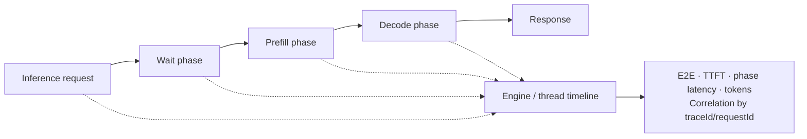

Sau khi định vị, có thể đánh giá theo nghiệp vụ và năng lực engine để giới hạn độ dài input tối đa, phân luồng riêng cho Prompt dài, chỉnh tham số lập lịch, giảm mức đồng thời trên một instance, hoặc dùng phương án tách Prefill/Decode. **Việc có điều chỉnh hay không không thể chỉ dựa vào một request chậm**, mà phải kết hợp phân vị TPOT, thông lượng và mức dùng GPU để kiểm chứng xem đó có phải nút thắt ổn định không.

**Tình huống hai: đồng thời tăng đột biến gây xếp hàng.** Khi `time_in_queue` hay giai đoạn Wait trong Trace dài lên rõ rệt, nên xem view đồng thời trong cùng khoảng thời gian. Chuỗi request trong hình dưới trước hết phơi ra một giai đoạn chờ khá dài.

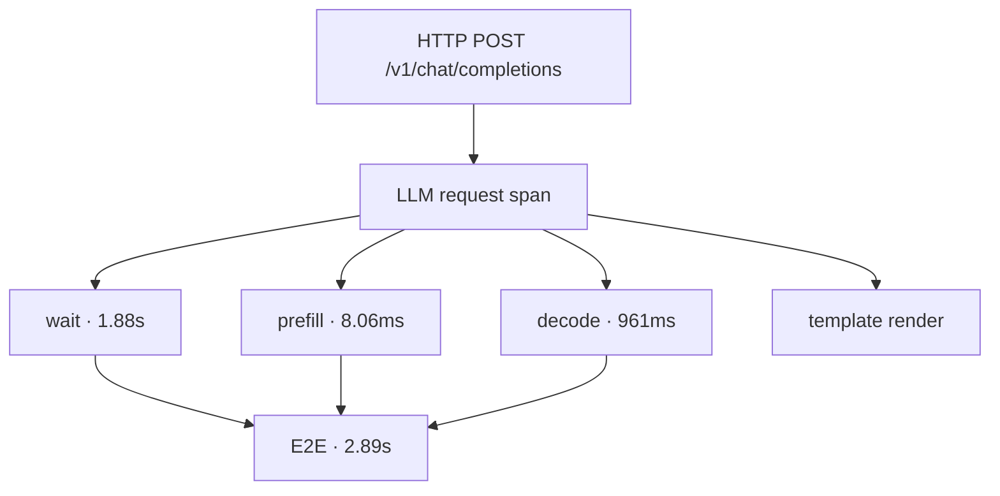

View đồng thời cho thấy số request trong khoảng đó đột ngột tăng, các khe chạy bị chiếm hết, và request mới chỉ còn cách chờ trong hàng đợi. Lúc này thường sẽ thấy số Waiting, Queue Time và TTFT cùng tăng, còn TPOT sau khi vào Decode thì chưa chắc xấu đi rõ rệt.

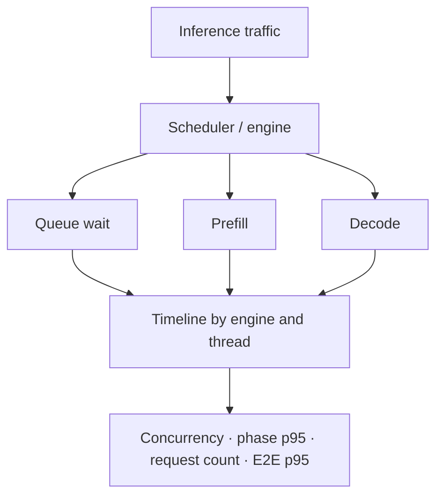

Với loại vấn đề này, nên xác nhận trước đó là đỉnh nhất thời hay là thiếu dung lượng kéo dài, rồi mới quyết định dùng hàng đợi–rate limit, co giãn đàn hồi, tăng bản sao, tối ưu routing hay chỉnh mức đồng thời tối đa. **Tăng mù quáng mức đồng thời trên một instance có thể nén phần tài nguyên khả dụng cho từng request, khiến TTFT, TPOT và độ trễ đuôi xấu đi thêm.**

Trong bối cảnh tách Prefill/Decode, hai giai đoạn do các Worker khác nhau gánh, nên phân tích đồng thời có thể hiển thị Prefill và Decode ở hai panel riêng và liên kết cùng một request bằng đường nét đứt. Nhờ vậy vừa nhận định được request đang xếp hàng ở phía Prefill, đang truyền xuyên giai đoạn, hay bị chặn ở phía Decode; vừa đánh giá riêng được dung lượng của hai pool tài nguyên có khớp nhau không.

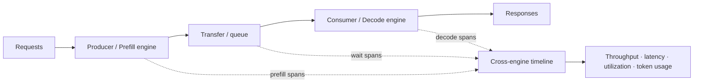

#### Vòng khép kín xử lý sự cố: từ phát hiện bất thường tới kiểm chứng tối ưu

Vấn đề của inference engine có thể thu hẹp theo trình tự sau:

1.  **Dùng chỉ số để phát hiện bất thường.** Từ xu hướng và phân vị của E2E, TTFT, TPOT, tỉ lệ lỗi và thông lượng token, xác nhận thời gian, model và instance bị ảnh hưởng; đồng thời quan sát xem phân bố độ dài Prompt/Generation có thay đổi không.

2.  **Dùng Trace để tìm request chậm.** Xem các thuộc tính hàng đợi, lập lịch và token đầu, quy bất thường về Wait, Prefill, Decode hay chi phí framework/mạng, và giữ lại request ID cùng cửa sổ thời gian chính xác.

3.  **Dùng phân tích đồng thời để tái dựng hiện trường.** Quan sát sự chồng lấn giữa request bất thường với các request khác tại cùng thời điểm, nhận định xem đó là Prefill lớn nhiễu Decode, traffic đột biến gây xếp hàng, output dài chiếm khe liên tục, hay dung lượng hai phía P/D không khớp.

4.  **Dùng chỉ số Pod/GPU để kiểm chứng nguyên nhân gốc.** Kiểm tra load balancing, KV Cache, VRAM, đơn vị tính toán và hoạt động truy xuất bộ nhớ, tránh phán nhầm lệch routing thành thiếu dung lượng tổng thể, hay phán nhầm thay đổi độ dài input thành lỗi GPU.

5.  **Triển khai tối ưu rồi so sánh kiểm chứng.** Sau khi chỉnh co giãn, trần đồng thời, batching, routing, cache hay tỉ lệ tài nguyên P/D, **phải so sánh TTFT, TPOT, thông lượng và độ trễ đuôi dưới cùng traffic và cùng phân bố độ dài token**, để xác nhận việc tối ưu không đẩy nút thắt sang giai đoạn khác.

Kiểu phân tích liên hợp **"chỉ số - chuỗi - đồng thời - tài nguyên"** này nối chất lượng dịch vụ vĩ mô, đường nhân quả của từng request và sự tranh chấp tài nguyên giữa các request cùng lô lại với nhau, khiến observability cho inference engine đi từ chỗ trình bày dữ liệu vận hành tới chỗ **trở thành căn cứ cho việc quy hoạch dung lượng, tối ưu hiệu năng và định vị sự cố.** Phạm vi tích hợp và các trường sẽ tiến hoá theo probe Python cùng version vLLM/SGLang, nên trước khi tích hợp production phải theo tài liệu tương thích hiện hành. Prompt, Completion và nội dung suy nghĩ của model cũng có thể chứa dữ liệu nhạy cảm, nên **phải cấu hình việc thu thập, ẩn danh, kiểm soát truy cập và thời hạn lưu theo nguyên tắc tối thiểu cần thiết.**

### 13.5.3 Observability cho tool và sandbox thực thi

Gọi tool là ranh giới then chốt nơi Agent chuyển ý định quyết định thành hành vi thực thi thực tế; còn với code, lệnh hay thao tác tự động cần chạy cô lập thì sandbox thực thi gánh tiếp quá trình chạy của chúng. **Tool call trong output model chỉ biểu thị Agent dự định gọi một năng lực nào đó, không chứng minh được tool đã thực thi**; sau khi kiểm tra tham số, kiểm tra quyền, phê duyệt của con người hay bị policy chặn, lời gọi đó có thể bị từ chối, huỷ hay viết lại. Vì vậy, việc quan sát ở tầng này phải đồng thời ghi **"Agent dự định làm gì"** và **"hệ thống thực sự đã xảy ra gì"**, rồi liên kết hai loại thông tin qua các định danh ổn định.

**Không phải mọi tool đều chạy trong sandbox.** Tool có thể do hàm trong ứng dụng, MCP Server, API từ xa hay process cục bộ cung cấp, và cũng có thể chạy trong container, micro-VM hay môi trường cô lập khác. Với tool từ xa, ranh giới quan sát thường kéo dài tới dịch vụ tool cùng các phụ thuộc hạ nguồn của nó; còn với các tool cần chạy code, lệnh Shell, xử lý file hay thao tác trình duyệt thì nên tiếp tục phủ việc lập lịch sandbox, vòng đời instance, thực thi process, tiêu hao tài nguyên, cùng các ảnh hưởng thực tế mà process gây ra như thay đổi file, truy cập mạng và lời gọi hệ hạ nguồn.

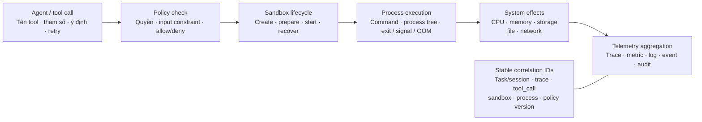

Với tool và sandbox thực thi, cần quan sát trọng tâm các nội dung sau:

*   **Sự thật về lời gọi tool.** Ghi tên tool, bên cung cấp hay MCP Server, tool-call ID, tóm tắt tham số, thời điểm bắt đầu và kết thúc lời gọi, retry, timeout, huỷ, kết quả trả về và lỗi. **Ý định gọi mà phía ứng dụng ghi và việc thực thi thực tế mà phía tool quan sát được phải giữ riêng; không được chỉ dựa vào output model mà tạo ra một Span TOOL "thực thi thành công".**

*   **Vòng đời sandbox.** Ghi các giai đoạn yêu cầu lập lịch, tạo instance, chuẩn bị image hay runtime, khởi tạo, trúng pre-warm hay cold start, ngủ, khôi phục và huỷ, cùng thời lượng từng giai đoạn. Thông tin về loại instance, version image hay template, quy cách CPU và bộ nhớ, node chạy, Pod, container, tenant và trạng thái tái dùng sẽ giúp phân biệt **việc bản thân tool chạy chậm với việc chờ do sandbox xếp hàng, chuẩn bị image hay cold start.**

*   **Thực thi lệnh và process.** Ghi tóm tắt chương trình hay lệnh thực sự chạy, thư mục làm việc, quan hệ process và process con, thời điểm bắt đầu–kết thúc, exit code, tín hiệu chấm dứt, cùng các lý do chấm dứt như timeout, huỷ chủ động, crash và OOM. Với stdout và stderr thì nên ghi kích thước, trạng thái cắt bớt, tóm tắt hay tham chiếu có kiểm soát, **tránh viết thẳng lượng lớn output hay nội dung nhạy cảm vào thuộc tính Trace.**

*   **Sử dụng tài nguyên và hiệu năng vận hành.** Quan tâm thời gian dùng CPU và mức sử dụng, đỉnh bộ nhớ và working set, dung lượng lưu trữ và I/O, traffic mạng, số process và file descriptor; đồng thời liên kết dữ liệu tài nguyên tới instance sandbox và cửa sổ thời gian thực thi cụ thể. Nếu tool dùng GPU hay tài nguyên tăng tốc khác thì còn phải ghi việc cấp thiết bị, mức dùng VRAM và mức sử dụng. Quan sát tài nguyên không chỉ để phát hiện nút thắt hiệu năng, mà còn để **giải thích việc thoát bất thường, tranh chấp tài nguyên và chi phí của một lần gọi tool.**

*   **Tác dụng phụ về file, mạng và hệ thống.** Ghi việc tạo, đọc, ghi, xoá và đổi quyền của các file quan trọng, cùng địa chỉ mạng đích, domain, cổng, giao thức, trạng thái phản hồi và quy mô truyền. Lời gọi tool mà Agent phát ra có thể chỉ là "chạy một script hay một lệnh nào đó"; **chỉ ghi nội dung lệnh và exit code thì không phản ánh được những thao tác mà script thực sự thực hiện bên trong**, nên còn phải truy vết hành vi thực tế của nó từ các tầng cây process, hệ thống file, mạng và dịch vụ hạ nguồn. **Trọng tâm quan sát không phải lưu vô tội vạ mọi system call, mà là nhận diện các ảnh hưởng bên ngoài liên quan tới lần thực thi tool này** - ví dụ đã sửa những file workspace nào, truy cập những dịch vụ bên ngoài nào, có sinh process con bất thường hay kết nối mạng vượt biên không.

*   **Kết quả policy và cô lập.** Ghi việc kiểm tra quyền trước và sau khi thực thi, policy truy cập mạng và file, quota tài nguyên, giới hạn lệnh, kiểm tra an toàn nội dung cùng kết quả phê duyệt của con người, gồm cả policy đã trúng, version luật, hành động xử lý và lý do từ chối. **Thứ quan sát ở đây là kết quả thực thi policy thực tế, không phải việc định nghĩa hệ kiểm soát truy cập;** mục tiêu là giải thích vì sao tool được cho phép, bị giới hạn hay bị chặn, và tạo bằng chứng cho audit bảo mật.

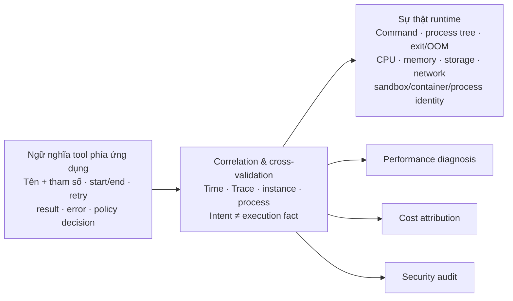

Dữ liệu quan sát phía tool và phía sandbox có ý nghĩa khác nhau. Span Agent hay Span tool mô tả mục đích lời gọi, tham số, kết quả cùng vị trí của thao tác đó trong task; còn dữ liệu runtime của sandbox thì **chứng minh lệnh có thật sự chạy không, đã tạo những process nào, tiêu bao nhiêu tài nguyên, và sinh ra những tác dụng phụ file và mạng nào.** Hai bên phải được liên kết qua context Trace, tool-call ID, ID instance sandbox, định danh container hay Pod và process ID, để tạo thành chuỗi bằng chứng **từ ý định gọi tới sự thật thực thi.** Với các hành vi có giá trị chẩn đoán độc lập như lời gọi dịch vụ bên ngoài, process con then chốt, thay đổi file quan trọng, có thể biểu đạt thành Span con của Span thực thi lệnh; còn các hành vi runtime số lượng lớn, hạt mịn thì ghi thành Span Event hay log liên kết, rồi truy vấn theo nhu cầu trong view Trace. Định danh Session và task có thể dùng để gom xuyên nhiều Trace, **nhưng không thay thế được việc liên kết Trace với process cần cho một lần thực thi cụ thể.**

Tool và sandbox thường cần tổ hợp nhiều phương tiện telemetry:

*   **Metrics** dùng để phát hiện xu hướng tổng thể và vấn đề dung lượng; trọng tâm gồm lượng request tool, tỉ lệ lỗi, tỉ lệ timeout, tỉ lệ huỷ và thời lượng thực thi; lượng tạo sandbox, số instance khả dụng, thời gian xếp hàng, thời lượng tạo, tỉ lệ cold start và tỉ lệ tái dùng; cùng các chỉ số tài nguyên và ổn định như CPU, bộ nhớ, lưu trữ, mạng, OOM và thoát bất thường. Label metric nên chọn các chiều kiểm soát được như loại tool, runtime sandbox, version image, quy cách tài nguyên và kết quả; **tránh dùng các trường cardinality cao như Trace ID, tool-call ID hay ID instance sandbox.**

*   **Trace** dùng để tái dựng đường đi của một lời gọi; phải liên kết từ Span TOOL của Agent tiếp tục tới gateway tool hay MCP Server, việc lập lịch sandbox, việc tạo instance và thực thi lệnh, rồi phủ tiếp các process con then chốt, thao tác file, truy cập mạng và lời gọi dịch vụ hạ nguồn phái sinh từ lệnh đó. Nhờ vậy, dù Agent chỉ cảm nhận được một lần chạy script, ta vẫn **truy vết được theo Trace những hành vi thực tế mà script sinh ra và ảnh hưởng của chúng.** Các giai đoạn vòng đời khác nhau có thể tạo Span độc lập; còn lệnh song song và process con thì phải biểu đạt theo đúng quan hệ cha–con hay link thật. Khi policy từ chối xảy ra **trước** khi thực thi thật thì phải ghi Span hay event đánh giá, **nhưng không được nguỵ tạo một Span thực thi lệnh.**

*   **Log và event** dùng để lưu chi tiết như trạng thái lệnh, việc process thoát, chuẩn bị image, truy cập file, kết nối mạng, đánh giá policy và thay đổi vòng đời sandbox; rồi liên kết với Trace qua Trace ID, tool-call ID, ID instance và process ID. Event mặt phẳng điều khiển, event container runtime và bản ghi audit hệ điều hành **phải giữ thời gian gốc của chúng, tránh dùng thời điểm thu thập thay cho thời điểm xảy ra thật.**

Việc thu thập dữ liệu có thể đến từ điểm đo trong SDK tool hay MCP Server, event của mặt phẳng điều khiển sandbox và container runtime, Sidecar, node Agent và eBPF. Điểm đo trong ứng dụng dễ lấy được tên tool, tham số và mục đích gọi nhất; còn thu thập ở runtime thì dễ lấy được sự thật về process, file, mạng và tài nguyên hơn. Với các sandbox không sửa được, cô lập mạnh hoặc vòng đời rất ngắn, Sidecar và eBPF có thể bù phần quan sát không xâm lấn. **Thu thập ngoài luồng không tự hiểu được ngữ nghĩa nghiệp vụ của Agent, nên vẫn phải dựa vào context Trace và định danh ổn định để liên kết với Span TOOL phía ứng dụng.**

Sau khi hoàn tất các liên kết trên, việc quan sát tool và sandbox có thể hỗ trợ ba loại chẩn đoán điển hình: khi **gọi tool chậm** thì phân biệt thời gian rơi vào phê duyệt, lập lịch, cold start, thực thi process hay phụ thuộc từ xa; khi **thực thi tool thất bại** thì phân biệt lỗi tham số, bị policy từ chối, tạo instance thất bại, exit code khác 0, bị tín hiệu chấm dứt, OOM, timeout và bất thường mạng; còn khi **có vấn đề về chi phí hay bảo mật** thì nhận diện tiếp các lời gọi trùng, vòng lặp bất thường, quy cách tài nguyên không hợp lý, việc sửa file ngoài ý muốn và truy cập mạng vượt biên. **Mục tiêu cuối cùng là dùng sự thật runtime để kiểm chứng kết quả thực thi của Agent, đồng thời hỗ trợ cả việc phân tích hiệu năng, quy kết chi phí và audit bảo mật.**
