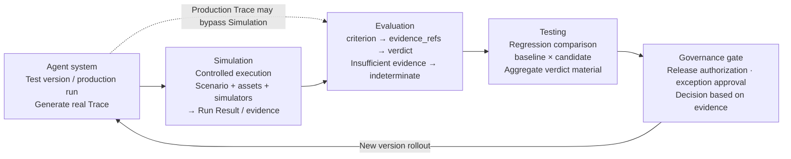
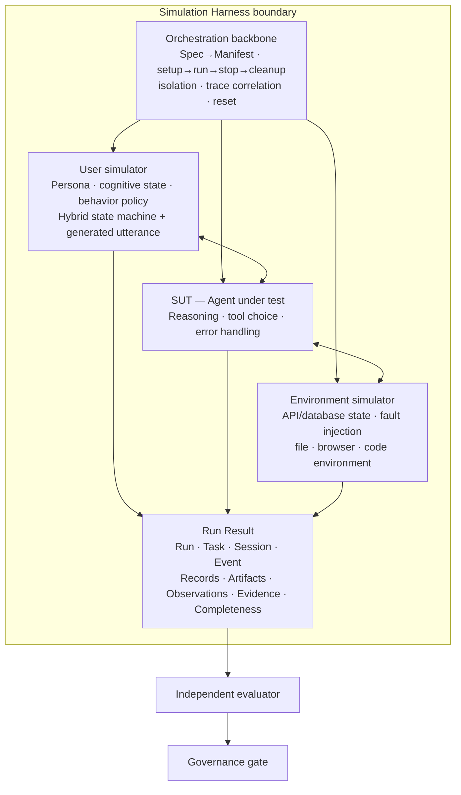
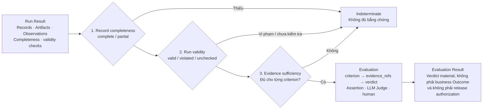
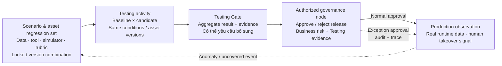

# Chương 16 - Sinh hành vi Agent và kiểm định chất lượng

Phần Quản trị tới đây đã thiết lập ba chiều: **observability** (chương 13) làm cho việc chạy của Agent nhìn thấy được; **bảo mật** (chương 14) làm cho hành vi của Agent có ranh giới; **khám phá và quản lý** (chương 15) làm cho tài sản Agent có sổ sách. Chương này bổ sung chiều thứ tư: **làm cho hành vi của Agent kiểm chứng được trước khi lên production.** Câu hỏi nó trả lời là: trong hiện tại khi chưa có chuẩn vai trò, chưa có cái giá cho thất bại, chưa có định danh liên tục - thì kỹ thuật chất lượng có thể lấy được gì.

## 16.1 Vì sao cần Agent Simulation

Hành vi Agent hiện **không kiểm chứng được không phải vì thiếu công cụ, mà vì thiếu tiền đề thể chế.** Mục này giải thích vì sao mô phỏng là việc duy nhất làm được ngay khi thể chế còn khuyết.

**1. Độ tin cậy là thứ được thiết kế ra bởi hệ thống, không phải được bảo đảm bởi từng cá nhân.**

Một bác sĩ có thể sai, nhưng hệ thống y tế về tổng thể vẫn dự đoán được: chứng chỉ hành nghề chặn ở lối vào, quy trình thao tác ràng buộc quá trình, hậu kiểm ca bệnh tích luỹ bài học, mô phỏng huấn luyện các tình huống hiếm. **Không thiết bị nào trong số đó cố "bảo đảm mỗi quyết định của mỗi bác sĩ đều đúng"** - tất cả đều làm cùng một việc: **ràng buộc một nhân lõi không đáng tin, để lỗi khó xuyên qua hệ thống mà chạm tới bệnh nhân.**

Mô hình lớn tự nhiên chính là cái nhân không đáng tin ấy: suy luận có thể ảo giác, tool có thể gọi sai, tham số có thể vượt biên - mỗi tầng đều mang tính xác suất. Mỗi tầng cấu trúc bên ngoài của kỹ thuật Agent - kỷ luật suy luận, quản lý context, giao thức tool, phân công orchestration - về bản chất cũng làm cùng một việc: **dùng một Harness đáng tin để ràng buộc một nhân không đáng tin.** Hệ thống y tế mất một trăm năm để dựng bộ thiết bị đó; kỹ thuật Agent thì cần nó **ngay bây giờ.**

**2. Agent thiếu ba tiền đề thể chế so với con người.**

Độ tin cậy của xã hội loài người thành lập được là nhờ ba thứ mà Agent hiện chưa có.

**Vai trò có chuẩn bên ngoài.** Bốn chữ "bác sĩ hành nghề" đứng sau là chế độ đăng ký, giấy phép và phạm vi hành nghề tra cứu được; còn hai "Agent hoàn tiền" trùng tên thì ranh giới quyền hạn, ràng buộc hành vi và cách nói có thể khác nhau hoàn toàn - **mà không tổ chức nào biết sự khác biệt đó.**

**Thất bại có cái giá tự nhiên.** Bác sĩ chẩn đoán sai thì bệnh nhân chịu thiệt, giấy phép bị thu, danh tiếng về không; còn lỗi của Agent, **nếu không bị phát hiện, thì không sinh ra hậu quả nào** - nó không đau, không bị sa thải, thậm chí không ai biết.

**Định danh là liên tục.** Chẩn đoán sai hôm nay của bác sĩ sẽ được ghi vào hồ sơ ngày mai của anh ta; danh tiếng và trách nhiệm tích luỹ dọc theo một định danh liên tục. Còn dưới cùng một cái tên Agent có thể đang chạy những version khác nhau; **lỗi của hôm qua bị xoá sạch bởi bản phát hành hôm nay, và danh tiếng cùng trách nhiệm không có chỗ bám.**

Ba thứ này là **đề tài quản trị**, cần xây dựng lâu dài ở cấp thể chế - không phải thứ mà một framework test bù được.

**3. Mô phỏng là việc duy nhất làm được ngay khi thiếu cả ba tiền đề.**

Bù đủ chuẩn vai trò, cái giá cho thất bại và định danh liên tục - mỗi thứ đều tính bằng năm. **Nhưng mô phỏng không phụ thuộc vào ba thứ đó - nó chỉ cần một môi trường có thể thất bại an toàn.** Trường y dùng bệnh nhân chuẩn hoá để luyện các biến chứng hiếm; trung tâm chăm sóc khách hàng dùng cuộc gọi mô phỏng để huấn luyện các tình huống cực đoan; còn buồng lái mô phỏng thì biến nguyên lý đó thành một sản phẩm - **khác ngành, cùng một bản chất.**

Thứ Agent cần còn nhiều hơn một buồng lái: **một đối phương biết hỏi dồn, biết đổi ý, và một hệ thống backend biết timeout, biết mất phản hồi, biết thực sự chuyển tiền đi.** Mô phỏng của phi công thì đã có sẵn; của Agent thì chưa.

**4. Case hoàn tiền: từ năm lớp bảo đảm của nhân viên chăm sóc khách hàng, tới con số không của Agent.**

Một người dùng đòi hoàn tiền, không nhớ rõ mã đơn, giọng điệu khó chịu. Nhân viên tiếp cô ta có **năm lớp bảo đảm** phía sau: đào tạo và sát hạch trước khi vào ca giúp cô có năng lực cơ bản; SOP (Standard Operating Procedure - quy trình thao tác chuẩn) vạch ra ranh giới hành vi; việc kiểm tra mẫu ghi âm mỗi ngày khiến dịch vụ xem lại được; khiếu nại đi vào đánh giá hiệu suất khiến thất bại có cái giá; và diễn tập mô phỏng hằng năm giúp cô từng được huấn luyện trong các tình huống cực đoan.

Đổi sang bàn giao cho Agent, **cả năm lớp đều về không:** không sát hạch trước khi vào việc, không ranh giới bên ngoài, không kiểm tra mẫu, không cái giá, không diễn tập. Việc dựng lại bốn lớp đầu cần thời gian và thể chế; **còn lớp thứ năm - đưa Agent vào một môi trường mô phỏng có kiểm soát chạy một lần, và để lại bằng chứng xem lại được - chính là thứ làm được ngay và làm xong là lập tức sinh ra bằng chứng.**

Đó là điểm xuất phát của Agent Simulation: **không chờ thể chế hoàn chỉnh, hãy lấy lại lớp bảo đảm thứ năm bằng biện pháp kỹ thuật trước.**

Buồng lái mô phỏng thì có sẵn, của Agent thì chưa. Muốn tạo ra nó, trước hết phải định nghĩa nó rốt cuộc là gì.

## 16.2 Định nghĩa, ranh giới và ba chế độ thực thi

Kết luận của mục trên là "cần một môi trường thất bại an toàn được". Mục này định nghĩa môi trường đó: nó là gì, ranh giới ở đâu, và có mấy cách tạo ra.

**1. Agent Simulation dùng phần mềm để gánh thế giới bên ngoài mà Agent được test vận hành trong đó, khiến việc thực thi khởi động lại được nhiều lần, cấu hình được và không có hậu quả thật.**

Nó gồm hai phần. **User Simulation** đảm nhiệm con người tương tác với Agent được test - người dùng, đối phương, bên cộng tác: một khách hàng nhớ sai số tiền, một người duyệt rút lại chỉ thị, một đồng nghiệp nêu nhu cầu mơ hồ. **Environment Simulation** gánh mọi điều kiện bên ngoài mà Agent được test phụ thuộc - tool và API, dữ liệu và trạng thái nghiệp vụ, file, dịch vụ model, sự kiện bên ngoài, và **cả bản thân thời gian.**

Hai phần hợp lại chính là **dời "thế giới mà Agent vận hành trong đó" từ production vào phần mềm**: thế giới có thể lưu lại, sửa, phát lại, và khi sai thì không có hậu quả thật nào. Hình 16-1 cho thấy vị trí của nó trong hệ kỹ thuật chất lượng - Simulation cùng Evaluation, Testing, Governance là những năng lực **tổ hợp được, không phải một dây chuyền cố định**: Simulation sinh ra việc thực thi có kiểm soát và bằng chứng; Evaluation thiết lập đánh giá; Testing tổ chức hoạt động kiểm chứng; Governance nắm quyền phát hành. Việc đánh giá Trace production và unit test có tính xác định thì hoàn toàn không cần đi qua Simulation. Quan hệ này sẽ được nhìn lại từ phía bàn giao ở mục 16.6.



*Hình 16-1 - Kiến trúc kỹ thuật chất lượng cho Agent: quan hệ tổ hợp được giữa Simulation với Evaluation, Testing và Governance*

**2. Ranh giới mô phỏng là uỷ quyền và hậu quả, không phải cách hiện thực.**

Có một khẳng định lan truyền rộng: "chỉ cần một request thực sự gửi đi thì không còn là mô phỏng nữa". **Ranh giới này vạch sai chỗ.** Ranh giới thật chỉ có hai điều: **không chạm tới tài khoản, dữ liệu và mạng production chưa được uỷ quyền; và không sinh ra tác dụng phụ nghiệp vụ thật không kiểm soát được.** Thoả hai điều đó thì dù Agent được test kết nối tới một backend thật đã cô lập - instance database riêng, tài khoản test chuyên dụng, hạ nguồn bị giới hạn mạng - **nó vẫn ở trong mô phỏng, vì uỷ quyền còn đó và hậu quả kiểm soát được.** Ngược lại, dù mọi component đều là bản thế thân phần mềm, mà kịch bản lại route request tới tài khoản production, thì **đó không phải mô phỏng, mà là một sự cố.**

**3. Chế độ thực thi chia ba theo độ trung thực và rủi ro: toàn thế thân, lai, và phụ thuộc thật đã cô lập.**

Đi từ toàn thế thân tới phụ thuộc thật đã cô lập, thành phần thật tăng dần, khả năng tái lập giảm dần, và rủi ro tăng theo:

| Chế độ | Ý nghĩa | Khả năng tái lập | Rủi ro | Bối cảnh áp dụng |
| --- | --- | --- | --- | --- |
| Toàn thế thân | Cả người dùng và môi trường đều do simulator gánh, không có phụ thuộc bên ngoài thật | Cao nhất | Thấp nhất | Test hồi quy, lặp nhanh |
| Lai | Một phần component dùng backend thật đã cô lập, phần còn lại do simulator gánh | Trung bình | Thấp | Kiểm chứng tích hợp đầu cuối |
| Phụ thuộc thật đã cô lập | Kết nối tới dịch vụ hạ nguồn thật nhưng cô lập, chỉ mô phỏng phía người dùng | Khá thấp | Cần bảo đảm cô lập | Kiểm chứng stack dịch vụ, thí nghiệm sự cố |

Khả năng tái lập của toàn thế thân hỗ trợ việc hồi quy - cùng một kịch bản chạy lại được mỗi đêm; còn độ trung thực của phụ thuộc thật đã cô lập thì hỗ trợ việc kiểm chứng stack dịch vụ - **hành vi lock của database thật, network stack thật là thứ thế thân không mô phỏng ra được.** Việc chọn chế độ phụ thuộc vào mục tiêu kiểm chứng lần này; **các chế độ khác nhau kiểm chứng phạm vi hệ thống khác nhau, nên kết luận không dùng lẫn được - một hồi quy pass ở chế độ toàn thế thân không tạo thành bất kỳ kết luận nào về stack phụ thuộc thật.**

**4. Hệ thống được test không nằm trong mô phỏng.**

**SUT (System Under Test)** là đối tượng mà mô phỏng phục vụ, **không phải một thành phần của mô phỏng.** Suy luận, chọn tool, dựng tham số và xử lý ngoại lệ thuộc về SUT - **một khi những hành vi đó bị thay thế, đối tượng được test đã ra khỏi vòng lặp.** Cố định thứ tự gọi tool thành một script là ví dụ ẩn giấu nhất: Run trông như bình thường, nhưng thứ đang được test **không còn là quyết định của Agent, mà là đoạn script đó** - và **không có cảnh báo nào nhắc ta điều này.**

**5. Trước khi thay thế, hãy qua một phép đánh giá: thứ đang khảo sát thì không được thay, thứ đang thiết lập thì phải thay.**

Trước khi thay mỗi đối tượng, hãy hỏi một câu: **hành vi của đối tượng này là nội dung ta khảo sát lần này, hay là điều kiện ta thiết lập lần này?** Là nội dung thì không được thay; là điều kiện thì phải thay, **và phải viết rõ đã thay thành gì.** Cùng một Agent cộng tác: khi khảo sát năng lực orchestration thì nó là nội dung - chất lượng phản hồi của nó ảnh hưởng trực tiếp tới kết luận; còn khi khảo sát khả năng chịu lỗi của Agent chính thì nó là điều kiện - biểu hiện sự cố của nó là một thiết lập thí nghiệm, phải kiểm soát và tái lập được. **Phép đánh giá này thuộc về thiết kế kịch bản; không công cụ nào làm thay được.**

Còn bản thân thế thân được hiện thực ra sao thì là một **lựa chọn đa chiều, chứ không phải một bậc thang độ khó.** Sắp theo độ mở từ thấp lên cao, mỗi cơ chế có đánh đổi riêng về tính xác định, độ phức tạp state và chi phí bảo trì:

| Cơ chế | Độ mở | Tính xác định | Độ phức tạp state | Chi phí bảo trì | Đối tượng điển hình |
| --- | --- | --- | --- | --- | --- |
| Script | Thấp | Cao | Thấp | Thấp | Phản hồi tool của quy trình cố định |
| Ghi – phát lại | Thấp | Cao | Trung bình | Trung bình, trôi theo version interface | Phiên thật trong lịch sử |
| Rule | Thấp | Cao | Thấp | Thấp | Interface truy vấn idempotent |
| State machine | Trung bình | Cao | Cao | Trung bình | Quy trình nghiệp vụ nhiều giai đoạn |
| Model sinh | Cao | Thấp | Trung bình | Cao | Hành vi người dùng mở |
| Lai | Trung bình | Trung bình | Trung bình | Trung bình | Lựa chọn chủ đạo trong kỹ thuật |

**Việc chọn cơ chế phụ thuộc vào tính xác định và độ mở của đối tượng được mô phỏng, chứ không phụ thuộc vào ngân sách:** đối tượng càng xác định thì càng hợp với script và rule; càng mở thì càng cần model sinh; state càng phức tạp thì càng thiên về state machine và ghi – phát lại.

Định nghĩa và các chế độ đã rõ. Nhưng "một lần thực thi mô phỏng" rốt cuộc sinh ra những đối tượng nào, và quan hệ giữa chúng ra sao? Điều đó cần một **hợp đồng dữ liệu.**

## 16.3 Hợp đồng dữ liệu: mô hình đối tượng và vòng đời

Mục trên nói mô phỏng bàn giao "một lần thực thi tái lập được". Tiền đề của việc tái lập là **mọi đối tượng liên quan tới lần thực thi đó đều có định nghĩa và vòng đời rõ ràng.** Mục này định nghĩa trọn chuỗi đối tượng, từ đặc tả kịch bản tới kết quả chạy.

**1. Chuỗi đối tượng.**

```plaintext
Scenario Spec (đặc tả kịch bản)
  └── Manifest (cấu hình chạy bất biến, khoá lúc khởi động)
        └── Run (một lần thực thi có kiểm soát)
              ├── 1..N Task (nhiệm vụ nghiệp vụ, ví dụ "gửi yêu cầu hoàn tiền")
              │     └── 1..N Session (phiên, ví dụ hội thoại người dùng + chuỗi gọi tool)
              │           └── Event (sự thật thực thi nguyên tử, ĐÃ xảy ra)
              └── Run Result
                    ├── Records (bản ghi chạy gốc: message, lời gọi, thay đổi trạng thái)
                    ├── Artifacts (sản phẩm sinh ra: ảnh chụp, file, trạng thái trình duyệt)
                    ├── Observations (quan sát mang tính sự thật trích từ Records)
                    ├── Evidence (tham chiếu bằng chứng hướng tới từng mục đánh giá)
                    └── Completeness (đánh giá tính đầy đủ, dựa trên hợp đồng thu thập)
```

Hãy đi một vòng cây này theo kịch bản hoàn tiền. Đặc tả kịch bản là `refund-timeout-retry@1.3.0`: một người dùng mới thiếu kiên nhẫn muốn đòi lại 199 nhân dân tệ tiền hoàn, và chỉ đưa mã đơn khi bị hỏi dồn; môi trường thì đặt lần truy vấn hoàn tiền đầu tiên timeout, lần thứ hai hồi phục. Lúc khởi động, Harness phân giải và khoá đặc tả cùng toàn bộ version tài sản được tham chiếu, sinh ra một **Manifest bất biến** - version Agent, version model người dùng, version dữ liệu môi trường - và từ đó **không sửa được nữa.** Run `r-20260914-001` là một lần thực thi có kiểm soát, chứa một Task "gửi yêu cầu hoàn tiền"; dưới Task có một Session - 12 lượt hội thoại người dùng cộng một chuỗi gọi tool song song; mỗi bước trong Session rơi thành một Event: "người dùng từ chối cung cấp mã đơn", "trúng timeout ở lần truy vấn đầu", "truy vấn lần hai thành công", "create_refund đã tiếp nhận". Khi thực thi kết thúc, Run Result gom mọi sản phẩm: Records chứa bản ghi gốc của 12 message và 7 lời gọi tool; Observations trích các quan sát sự thật - số yêu cầu hoàn tiền = 1, số tiền = 19900 (đơn vị nhỏ nhất, tức 199 tệ), trạng thái = accepted; Evidence tổ chức các quan sát thành tham chiếu bằng chứng theo từng mục đánh giá; còn Completeness thì đối chiếu theo hợp đồng thu thập - lần này tài liệu đầy đủ.

**2. Tách các tầng bằng chứng.**

**Trace, snapshot và Artifact là tài liệu bằng chứng gốc; chúng không tự động chứng minh Outcome (kết quả nghiệp vụ).** Run Result phân biệt ba tầng: `records` (bản ghi gốc) → `observations` (quan sát sự thật) → `evidence` (tham chiếu bằng chứng hướng tới mục đánh giá); còn quan hệ `criterion → evidence_refs → verdict` (mục đánh giá → tham chiếu bằng chứng → đánh giá) thì do **Evaluation Result** thiết lập, **không thuộc Run Result.**

Giá trị của việc phân tầng lộ ra ngay ở thời điểm bàn giao: cùng một bộ `records`, đội chất lượng dùng để chấm lại điểm, đội tuân thủ kiểm tra thước đo số tiền, hệ hồi quy so sánh khác biệt giữa các version - **mỗi bên tham chiếu cùng một bộ tài liệu gốc, mỗi bên tự tổ chức bằng chứng và nhận định riêng.** Nếu tài liệu gốc và kết luận chất lượng trộn vào cùng một tầng, thì mọi mục đích sử dụng về sau đều bị kết luận của lượt trước làm ô nhiễm. Bản cũ chưa tách tầng này - **đó là món nợ lớn nhất về hợp đồng dữ liệu.**

**3. Vòng đời của Manifest và Run Result khép kín với nhau.**

Lúc khởi động thì sinh Manifest bất biến, lưu tổ hợp version đã phân giải cùng các tham số đặt trước; còn những sự thật chỉ biết được trong lúc chạy - giá trị ngẫu nhiên thực sự lấy mẫu, lựa chọn route động, trạng thái cuối của các thao tác chưa quyết - thì **toàn bộ đi vào Run Result.** Ranh giới này cho chữ "tái lập" một nghĩa chính xác: **dùng Manifest để dựng lại điều kiện, dùng Run Result để đối chiếu sự thật.**

Một lỗi dễ mắc là **gọi các kế hoạch tương lai trong kịch bản là Event.** Thứ viết trong Scenario Spec là `triggers` (hay `event_specs`): "khi truy vấn lần đầu timeout thì tiêm timeout" là **một kế hoạch**; chỉ sau khi trúng, thì "truy vấn đã timeout" mới là **Event.** **Kế hoạch đang chờ, sự thật đã rơi xuống - hai thứ không dùng chung một cái tên.**

**4. Bốn loại trạng thái của Run được biểu đạt độc lập.**

Đi từ sự thật thực thi tới nhận định chất lượng, trạng thái của Run triển khai theo bốn chiều:

| Chiều | Nội dung biểu đạt | Giá trị điển hình |
| --- | --- | --- |
| Trạng thái thực thi | Có khởi động không, kết thúc ra sao | `completed` / `crashed` / `cancelled` |
| Tính hợp lệ của mô phỏng | Điều kiện thí nghiệm có thành lập không | `valid` / `violated` / `unchecked` |
| Tính đầy đủ của bằng chứng | Tài liệu thu thập có đủ không | `complete` / `partial` (liệt kê mục thiếu) |
| Chất lượng task | Kết quả nghiệp vụ có đạt yêu cầu không | Do một Evaluation độc lập đưa ra |

**Bốn trạng thái tổ hợp độc lập với nhau** - một Run hoàn tất, hợp lệ, tài liệu đầy đủ vẫn hoàn toàn có thể cho ra số tiền hoàn sai. **Ép chúng thành một chữ "thành công/thất bại" là làm bốn sự thật độc lập rối thành một kết luận không gỡ ra được:** khi quy kết thì không nói rõ được là môi trường hỏng hay Agent sai; khi báo cáo thì không nói rõ được là thiếu tài liệu hay task thất bại.

Hợp đồng dữ liệu đã định nghĩa xong. Ai đọc hợp đồng, đẩy việc thực thi, và quản lý phần mô phỏng người dùng cùng môi trường? - **Harness.**

## 16.4 Engine thực thi: kiến trúc Harness và cách hiện thực mô phỏng

Mục trên định nghĩa "dữ liệu trông như thế nào"; mục này trả lời "ai chạy, chạy ra sao".

**Harness là engine thực thi của Simulation:** nhận Scenario Spec, đẩy một lần thực thi có kiểm soát, và bàn giao Run Result. Bên trong engine có ba mối quan tâm. **Tầng orchestration** đọc đặc tả kịch bản, quản vòng đời Run, phối hợp dòng dữ liệu và ranh giới cô lập - đó là bộ khung của engine; **simulator người dùng** và **simulator môi trường** lần lượt gánh đối phương của Agent được test và thế giới bên ngoài mà nó phụ thuộc - đó là hai cánh. **Ba thứ không ngang hàng nhau:** tầng orchestration định nghĩa trách nhiệm và ràng buộc ở mức kiến trúc; còn hai simulator thì quyết định mô phỏng cái gì, mô phỏng ra sao ở mức hiện thực. Hình 16-2 cho kiến trúc tổng thể; phần dưới triển khai theo thứ tự tầng kiến trúc, mô phỏng người dùng, mô phỏng môi trường.



*Hình 16-2 - Kiến trúc kỹ thuật của Simulation Harness: tầng orchestration (khung) + simulator người dùng, simulator môi trường (hai cánh)*

### 16.4.1 Tầng kiến trúc

**1. Trách nhiệm và ranh giới.** Harness làm **năm việc**: phân giải kịch bản - phân giải Scenario Spec cùng version tài sản thành một Manifest bất biến; điều phối một Run có kiểm soát - đi hết vòng đời nạp, chạy, chấm dứt, hội tụ, dọn dẹp; quản lý thế thân và cô lập - duy trì ranh giới mô phỏng; gom tham chiếu bản ghi - liên kết quá trình tương tác và điều khiển tới Trace cùng Artifact; và dọn môi trường - đưa thế giới về trạng thái ban đầu. Đồng thời, nó **không làm năm việc**: không quản vòng đời task - đó là trách nhiệm của SUT hay tầng orchestration của nó; không đánh giá xác thực và quyền hạn - đó là việc của Gateway và framework bảo mật (chương 14); không thu thập telemetry - đó là việc của observability (chương 13), Harness chỉ liên kết tham chiếu trong bản ghi; không chấm điểm và đánh giá chất lượng - đó là việc của Evaluation; và không ra quyết định phát hành - đó là việc của cổng quản trị.

**Năm trách nhiệm định nghĩa năng lực engine, năm việc không làm định nghĩa ranh giới engine - hai mặt của một thứ.** Mỗi mục "không làm" đều ứng với một hệ chuyên trách trong thể chế quản trị; **thu bất kỳ mục nào vào thì Harness sẽ phình từ một engine thực thi thành một bộ điều khiển tổng**, xung đột với cách phân định trách nhiệm của cả cuốn sách.

**2. Dòng dữ liệu và phối hợp.** Dòng dữ liệu trong engine chia ba tuyến: **dòng tương tác** là message, yêu cầu tool và các event nhìn thấy được; **dòng điều khiển** là các lệnh nạp, khởi tạo, sự cố, chấm dứt và dọn dẹp; **dòng bằng chứng** là phần tích tụ Trace, trạng thái, sản phẩm và bản ghi điều khiển. Ba tuyến đan nhau, và được phối hợp bằng **hai cuốn sổ.**

Cuốn thứ nhất là **sổ liên động event.** Người dùng, môi trường và Agent liên kết qua event, nhưng thời điểm cập nhật có thể khác nhau: một message bị thu hồi phát sinh cục bộ ở phía người dùng (t1), được Agent nhận (t2), và có hiệu lực với giao dịch đang bay (t3) - **đó là ba giai đoạn khác nhau:** trên giao diện thì đã thu hồi, nhưng Agent có thể vẫn đang gửi theo chỉ thị cũ. Sổ liên động ghi trạng thái và thời điểm của từng event ở cả ba bên, để câu hỏi **"việc thu hồi rốt cuộc có hiệu lực chưa"** được trả lời chính xác.

Cuốn thứ hai là **sổ phân tách thời gian.** Trong thế giới mô phỏng có **bốn loại thời gian chạy song song**, từ luật nghiệp vụ tới phép đo vật lý, mỗi loại một công dụng và **không dùng lẫn được:**

| Thời gian | Trả lời cái gì | Ví dụ trong kịch bản hoàn tiền |
| --- | --- | --- |
| Thời gian lịch nghiệp vụ | Đánh giá thời hạn của luật nghiệp vụ | Đặt hàng 2026-09-01, còn trong hạn 7 ngày đổi trả không lý do không |
| Thời gian logic của mô phỏng | Lập lịch các sự kiện ảo | Tiêm timeout truy vấn ở lượt thứ 3 |
| Đồng hồ đơn điệu | Đo thời lượng thật | Suy luận và gọi tool mất bao lâu |
| Thời gian đồng hồ treo tường | Liên hệ với ngày tháng thực tế | Run xảy ra lúc nào, báo cáo sinh lúc nào |

**Dùng đồng hồ treo tường để đánh giá hạn hoàn tiền thì việc tăng tốc thời gian ảo sẽ phá vỡ luật nghiệp vụ; dùng lịch nghiệp vụ để đo thời lượng suy luận thì được một con số vô nghĩa.**

### 16.4.2 Simulator người dùng

**1. Thiết kế mô hình.** Mô hình người dùng chia ba tầng. **Persona** định nghĩa nền tính cách của vai: mức chuyên môn, thiên hướng diễn đạt, xu hướng hành vi - "người mới thương mại điện tử thiếu kiên nhẫn" và "người sành luật lệ thương mại điện tử" phản ứng hoàn toàn khác nhau trước cùng một lời từ chối. **Trạng thái nhận thức** định nghĩa cô ta biết gì: sự thật đã biết, cách hiểu hiện tại - và **cho phép khác với trạng thái khách quan**: khi test việc nhớ sai số tiền, hiểu nhầm chính sách hoàn tiền hay cố ý cung cấp thông tin sai, simulator lưu riêng trạng thái thật và nhận thức của người dùng, **giữ cả hai.** **Chiến lược hành vi** định nghĩa cô ta hành động ra sao: Reaction Rules (luật phản ứng) + state machine + độ kiên nhẫn được đồng hồ dẫn dắt - bị hỏi ba lần mới đưa mã đơn, chờ quá hai phút thì bắt đầu doạ khiếu nại.

Về mặt kỹ thuật, phương pháp **Hybrid (lai)** là chủ đạo: việc chọn ý định giao cho state machine - "chỉ ra số tiền sai" là một node ý định xác định; còn việc diễn đạt bằng ngôn ngữ tự nhiên thì giao cho model - sinh cách nói phù hợp Persona; rồi output đi qua kiểm tra sự thật (không được nói ra số tiền nằm ngoài nhận thức của người dùng) và kiểm tra luật tiết lộ (mã đơn chỉ đưa khi bị hỏi dồn) rồi mới gửi. Run thăm dò thì nới lỏng việc chọn nhánh để người dùng mô phỏng đi ra những đường đa dạng; còn Run hồi quy thì khoá các ràng buộc hành vi then chốt để bảo đảm tái lập được.

**2. Kiểm soát chất lượng.** **Chất lượng simulator không đồng nghĩa với tỉ lệ thành công của Agent** - một simulator quá dễ chiều sẽ đánh giá cao quá mức năng lực Agent, còn một simulator luôn từ chối thì tạo ra những thất bại vô nghĩa. Việc kiểm soát chất lượng triển khai theo chiều, với đơn vị thống kê đi từ một message tới cả lô:

| Chiều | Kiểm tra cái gì | Đơn vị thống kê |
| --- | --- | --- |
| Tính nhất quán của vai | Hành vi có bám Persona không | Mỗi message |
| Tỉ lệ tuân thủ luật phản ứng | Khi điều kiện kích hoạt trúng thì có thực hiện phản ứng không | Mỗi lần kích hoạt |
| Tuân thủ tính nhìn thấy được của thông tin | Có chỉ tiết lộ thông tin trong nhận thức người dùng không | Mỗi lần tiết lộ |
| Tỉ lệ tuân thủ luật chấm dứt theo mục tiêu | Có tiếp tục, làm rõ hay dừng đúng luật không | Mỗi Run |
| Độ đa dạng phân bố hành vi | Việc chọn nhánh có khớp phân bố mục tiêu không | Mỗi lô Run |

Mỗi chỉ số phải định nghĩa điều kiện áp dụng và đơn vị thống kê, **tránh những phát biểu không đối chiếu được kiểu "độ chính xác của simulator là 95%".** Việc sinh và việc chấm điểm dùng model khác nhau để giảm thiên lệch chung; rồi kết hợp thêm dữ liệu độc lập, context bị giới hạn và hiệu chỉnh bởi con người, để **chính câu hỏi "người dùng có giống thật không" cũng trở thành một đối tượng quản trị được.**

### 16.4.3 Simulator môi trường

**1. Mô hình sự thật và cô lập.** Yêu cầu đầu tiên để môi trường đáng tin là **nhất quán về sự thật**: giá trị API trả về và trạng thái database phải đến từ **cùng một mô hình sự thật** - sau khi `create_refund` trả về "đã tiếp nhận" thì `get_refund` **bắt buộc** phải tra ra đúng trạng thái đó, **không được bên nói đã tiếp nhận còn bên nói không tồn tại.** Timeout là điều kiện đáng gia công tinh nhất; theo vòng đời request thì nó chia ba vị trí, và mỗi vị trí kiểm chứng một năng lực khác nhau:

| Vị trí timeout | Trạng thái hệ thống | Kiểm chứng cái gì |
| --- | --- | --- |
| Request chưa gửi | Lời gọi chưa xảy ra | Chiến lược retry và backoff |
| Đã gửi, chưa commit | Hạ nguồn đã nhận nhưng chưa xử lý | Việc chờ và truy vấn xác nhận |
| Đã commit, phản hồi mất | Nghiệp vụ đã có hiệu lực | Chống gửi trùng và việc đối chiếu trạng thái |

**Loại cuối cùng là then chốt nhất:** yêu cầu thực ra đã được tiếp nhận, nhưng Agent lại không nhận được biên nhận - **nó sẽ đi đối chiếu trạng thái trước, hay gửi thẳng lần nữa?**

Việc cô lập phủ tính toán, lối ra mạng, dữ liệu, file, cache và memory: mỗi Run dùng workspace, dữ liệu tài khoản và phiên độc lập, và **giữa các Run không chia sẻ bất kỳ state khả biến nào.** Việc tái lập chia ba tầng: **tái lập cấu hình** - dùng Manifest khôi phục kịch bản và version, trả lời "cùng một thí nghiệm có làm lại được không"; **tái lập sự kiện** - phát lại input và lịch, trả lời "cùng một đường có đi lại được không"; **tái lập thống kê** - lặp thí nghiệm để có phân bố gần nhau, trả lời "kết luận có vững không".

**2. Tiêm sự cố.** **Vị trí tiêm sự cố quyết định phạm vi test:** tiêm ở tầng adapter tool thì kiểm chứng cách Agent xử lý phản hồi lỗi; tiêm lên phụ thuộc thật đã cô lập thì kiểm chứng năng lực khôi phục đầu cuối. Cách tích hợp ChaosBlade dưới đây là **kiến trúc tham chiếu do cuốn sách đề xuất**: ChaosBlade chỉ đóng vai backend thực thi sự cố; còn **khi nào, với ai, áp sự cố gì thì do Harness quyết định.** ChaosBlade chạy thí nghiệm; Harness lo việc đồng bộ kích hoạt, kiểm chứng khôi phục và dọn dẹp.

```bash
# Ví dụ kiến trúc tham chiếu: tiêm độ trễ mạng 300ms cho Pod refund-service
# Tiền đề chạy: kubeconfig của cụm đích và phần uỷ quyền phạm vi thí nghiệm
blade create k8s pod-network delay --time 300 \
  --namespace default --labels app=refund-service \
  --kubeconfig ~/.kube/config
```

Bản ghi sự cố lưu riêng theo **bốn bước**: kế hoạch tiêm (kịch bản viết gì), executor có hiệu lực (ChaosBlade báo thí nghiệm đã khởi động), trúng đích (quan sát được độ trễ thực sự rơi lên lời gọi đích), và kiểm chứng khôi phục (dịch vụ trở lại bình thường sau khi huỷ thí nghiệm). **Thiếu một trong bốn bước thì kết luận của thí nghiệm sự cố không đáng tin - "đã tiêm" và "đã có hiệu lực" là hai chuyện khác nhau.**

**3. Môi trường thực thi.** Môi trường thực thi chuẩn bị theo loại task: task file thì chuẩn bị thư mục và quyền khôi phục được; task trình duyệt thì chuẩn bị trang và phiên; task chạy code thì cố định runtime và ngân sách tài nguyên. **Thay hay không thay phụ thuộc vào mục tiêu kiểm chứng:** khi chỉ test việc chọn tool thì có thể thay tool tương ứng; còn khi kiểm chứng việc phân giải đường dẫn, tương tác trang hay hành vi thực tế của code sinh ra thì **bắt buộc phải giữ môi trường thực thi thật** - đây chính là ứng dụng của phép đánh giá "nội dung hay điều kiện" ở mục 16.2.

Engine và hai hệ con đều đã có. Nhưng engine không biết "lần này phải chạy cái gì" - **cần cấu hình kịch bản nói cho nó.**

## 16.5 Cấu hình vận hành: tầng kịch bản và tài sản

Engine trả lời "chạy ra sao"; mục này trả lời "chạy cái gì". Trước hết là hai định nghĩa.

**Kịch bản (Scenario)** là mô tả trọn vẹn về một lần thực thi có kiểm soát: điều kiện ban đầu là gì, bên tham gia là ai, luật tương tác đặt ra sao, cho phép những đường tiến hoá nào, và kết thúc khi nào. **Nó không phải một script** - không cố định nội dung hội thoại cụ thể; **cũng không phải sinh ngẫu nhiên** - có ràng buộc và ranh giới rõ ràng; **nó là một đặc tả khai báo cho phép nhiều đường thực thi hợp lý.**

**Tài sản (Asset)** là sản phẩm build được kịch bản tham chiếu và **gắn version độc lập**: chiến lược hành vi người dùng, dữ liệu khởi tạo môi trường, hợp đồng tool, cấu hình simulator, đặc tả đánh giá. Kịch bản tổ hợp tài sản; tài sản tiến hoá độc lập với kịch bản. Quan hệ giữa hai bên: **kịch bản là "phương án thiết kế của thí nghiệm lần này", tài sản là "vật liệu chuẩn hoá mà phương án đó tham chiếu".** Sửa tham số kiên nhẫn của người dùng là một version kịch bản mới; sửa logic luật tiết lộ của simulator người dùng là một version tài sản mới.

**1. Mô hình hoá chung cho người dùng và môi trường, để cùng một đối tượng nghiệp vụ có ý nghĩa nhất quán ở cả hai phía.**

Đơn hàng trong miệng người dùng, mã đơn trong tham số tool, và bản ghi đơn hàng trong database **bắt buộc phải là cùng một tờ đơn** - hở chỗ nào thì kịch bản đang test một vấn đề giả. Ràng buộc chung phủ năm chiều: gắn thực thể với sự thật (đơn hàng chỉ có một version sự thật), tính nhìn thấy được của thông tin (nhận thức người dùng và trạng thái môi trường được phép khác nhau, nhưng mỗi bên phải nhất quán nội bộ), lối vào hành động và quy thuộc trạng thái (lối gửi chỉ có một, chuyển trạng thái có chủ sở hữu duy nhất), kích hoạt sự kiện và trình tự (sự kiện nào xảy ra theo thứ tự nào), cùng tiến hoá mục tiêu và yêu cầu kết quả (tiêu chí hoàn thành task cập nhật theo tiến hoá kịch bản). Dọc theo trục thời gian của luồng hoàn tiền, từ lần tương tác đầu tới khi task kết thúc, có thể chắt ra **bốn biến thể điển hình** - trong mỗi biến thể, điều kiện hành vi người dùng và điều kiện môi trường thay đổi độc lập, và trọng tâm kiểm chứng chung đổi theo:

| Biến thể kịch bản | Điều kiện hành vi người dùng | Điều kiện môi trường | Trọng tâm kiểm chứng chung |
| --- | --- | --- | --- |
| Truy vấn bất thường ngắn | Đưa mã đơn sau khi bị hỏi dồn | Truy vấn lần đầu timeout, sau đó hồi phục | Có giữ lại thông tin đã biết, xử lý ngoại lệ và lấy được xác nhận không |
| Chờ lâu | Có thể chọn rời đi tuỳ thời gian chờ | Truy vấn liên tục không xong | Việc đếm giờ chờ, sự kiện rời đi và việc khớp với các thao tác đang bay |
| Thu hồi trước khi gửi | Đã đồng ý gửi, rồi thu hồi | Việc thu hồi và việc gửi có thứ tự sự kiện rõ ràng | Sau khi biết đã thu hồi thì có điều chỉnh theo yêu cầu không |
| Mất phản hồi sau khi tiếp nhận | Chưa thấy biên nhận nên hỏi tiếp | Yêu cầu đã được tiếp nhận, phản hồi chưa tới | Có đối chiếu trạng thái và tránh gửi trùng yêu cầu không |

**2. Scenario Spec dùng mười nhóm trường để trả lời trọn vẹn thiết kế, từ "test cái gì" tới "đánh giá ra sao".**

Một đặc tả kịch bản chạy được phải trả lời một chuỗi câu hỏi tiệm tiến: kịch bản này là ai, test cái gì, môi trường đặt ra sao, người dùng và môi trường liên kết thế nào, các bên tham gia khác là ai, sự kiện tiến hoá ra sao, việc chạy bị ràng buộc gì, đánh giá ra sao, và đến từ đâu. Mười nhóm trường triển khai dọc chuỗi câu hỏi đó:

| Nhóm trường | Nội dung chính | Công dụng |
| --- | --- | --- |
| `identity` | ID kịch bản, version, nhãn, người phụ trách | Định danh và quản trị thay đổi |
| `sut` | Ranh giới được test, version Agent, tham chiếu model và Prompt | Cố định đối tượng thí nghiệm |
| `user` | Persona, mục tiêu, sự thật riêng tư, luật tiết lộ, chiến lược hành vi | Dẫn dắt tương tác phía người dùng |
| `environment` | Dữ liệu khởi tạo, hợp đồng tool, chế độ backend, chính sách đồng hồ | Dựng thế giới bên ngoài |
| `interaction` | Gắn thực thể, kênh nhìn thấy được, lối vào hành động, mẫu tương tác | Liên kết người dùng với môi trường |
| `participants` | Vai trò, interface và quyền của các Agent khác | Topology cộng tác |
| `events` | Điều kiện kích hoạt, hành động sự cố, chiến lược khôi phục | Kiểm soát tiến hoá kịch bản |
| `execution` | Seed, mức đồng thời, số lượt, ngân sách thời gian và tài nguyên | Ràng buộc việc chạy |
| `evaluation_ref` | Tham chiếu version của assertion độc lập, Rubric, trạng thái kỳ vọng | Liên kết với đánh giá chất lượng |
| `provenance` | Yêu cầu gốc, vị trí tài sản, phiên đã ẩn danh, bản ghi sự cố | Truy nguyên nguồn gốc |

Trích đoạn đặc tả của kịch bản hoàn tiền như sau (lược hai nhóm `interaction` ⑤ và `participants` ⑥); số trong chú thích ứng với bảng trên:

```yaml
schema_version: 1
identity:                          # ① Định danh và quản trị thay đổi
  id: refund-timeout-retry
  version: 1.3.0
  owner: quality-team
sut:                               # ② Cố định đối tượng thí nghiệm
  agent: refund-agent@2.4.1
  boundary: [reasoning, tool-selection, parameters]
user:                              # ③ Dẫn dắt tương tác phía người dùng
  persona: { expertise: novice, patience: low, tone: annoyed }
  goal: "Đòi lại 199 tệ tiền hoàn"
  private_facts: { order_no: "B2026-0901-7734", paid_amount_minor: 19900 }
  disclosure: { order_no: on-request }   # Mã đơn chỉ đưa khi bị hỏi dồn
environment:                       # ④ Dựng thế giới bên ngoài
  backend_mode: surrogate          # Chế độ toàn thế thân
  clock: { policy: virtual, start: "2026-09-01T10:00:00+08:00" }
events:                            # ⑦ Kiểm soát tiến hoá kịch bản (kế hoạch tương lai; trúng rồi mới thành Event)
  triggers:
    - { target: refund.query, effect: timeout, at: turn-1, recover: turn-2 }
execution:                         # ⑧ Ràng buộc việc chạy
  seed: 20260914
  budget: { max_turns: 12, wall_clock: 20m }
evaluation_ref:                    # ⑨ Liên kết đánh giá chất lượng (tham chiếu version, không chứa đánh giá)
  assertions: refund-assertions@1.1.0
provenance:                        # ⑩ Truy nguyên nguồn gốc
  source: "Phiên đã ẩn danh từ sự cố #7742"
```

Chú ý hai chi tiết: `user.private_facts` và đơn hàng trong dữ liệu khởi tạo của `environment` **bắt buộc phải là cùng một thực thể** - đó là việc mô hình hoá chung được hiện thực; còn `events.triggers` là **kế hoạch tương lai, trúng rồi mới sinh Event** - đúng theo ranh giới tên gọi mà mục 16.3 đã đặt.

**3. Tài liệu kịch bản thu thập theo bốn hướng: khai báo → hiện thực → quan sát → bất thường; còn cơ chế sinh thì chia bốn loại theo khả năng kiểm soát từ cao xuống thấp.**

**Tài liệu quyết định "có gì để dùng", cơ chế quyết định "tổ hợp ra sao".** Bốn hướng thu thập, đi từ cái phải là, tới cái thực tế là, rồi tới cái bất thường:

| Nguồn | Nội dung trích ra | Hướng |
| --- | --- | --- |
| Yêu cầu và chính sách nghiệp vụ | Điều kiện áp dụng, tiêu chí thành công và hành vi bị cấm | **Khai báo:** cái gì là "đúng" |
| Mã nguồn Agent và cấu hình build | Đường thực thi, quản lý state, ranh giới phụ thuộc | **Hiện thực:** thực tế làm ra sao |
| Phiên production và Trace vận hành | Mục tiêu người dùng, cách diễn đạt, nhánh tương tác | **Quan sát:** thực tế được dùng ra sao |
| Sự cố, lỗi và bản ghi con người tiếp quản | Điều kiện kích hoạt, trình tự sự cố, hậu quả nghiệp vụ | **Bất thường:** hỏng ở đâu |

Cơ chế sinh chia bốn loại theo khả năng kiểm soát từ cao xuống thấp:

| Cơ chế sinh | Cách làm | Khả năng kiểm soát |
| --- | --- | --- |
| Điền template | Điền tham số vào một bộ khung kịch bản đã kiểm chứng | Cao nhất, cấu trúc cố định |
| Phái sinh theo rule | Dựng biến thể theo điều kiện nghiệp vụ và đường trạng thái | Cao, tổ hợp kiểm soát được |
| LLM hỗ trợ | Đề xuất nhánh tương tác và tổ hợp bất thường dựa trên tài liệu phân tích | Thấp, cần kiểm chứng và sàng lọc |
| Sinh lai | Template + rule khoá cấu trúc, LLM đề xuất biến thể, bộ kiểm tra sàng lọc | Chủ đạo trong kỹ thuật |

Lý do sinh lai thành chủ đạo nằm ngay trong rủi ro ở dòng thứ ba: **LLM đề xuất được những tổ hợp bất thường mà con người không nghĩ ra, nhưng sản phẩm của nó không tin thẳng được** - hãy dùng template và rule để khoá cấu trúc, dùng bộ kiểm tra để sàng những biến thể không đạt; **khả năng kiểm soát và độ mở khi đó có được cả hai.**

**4. Kịch bản và tài sản gắn version riêng; trong Run thì khoá tổ hợp để bảo đảm tái lập được.**

Đối tượng gắn version có **năm loại**: kịch bản, dữ liệu, tool, simulator, đặc tả đánh giá - mỗi thứ tiến hoá độc lập; còn một Run thì khoá tổ hợp version của kịch bản cùng toàn bộ tài sản, và **kết luận chỉ chịu trách nhiệm cho đúng tổ hợp đó.** Độ phủ thì lập ma trận rủi ro theo "giai đoạn nghiệp vụ × hành vi người dùng × trạng thái quyền hạn × sự cố phụ thuộc"; còn các lỗ hổng thì quyết định độ ưu tiên của lô kịch bản kế tiếp. Các lỗi tương tác và lỗi xác nhận mới xuất hiện thì **phải xác minh sự thật và quy thuộc trách nhiệm trước, rồi mới cố định vào bộ hồi quy** - **chép thẳng biểu hiện bề mặt của một sự cố production thành kịch bản chẳng khác gì kê đơn thẳng từ một bệnh án chưa chẩn đoán.**

Kịch bản đã chạy xong. Lần thực thi này bàn giao cái gì? Và kết luận của nó có hiệu lực trong phạm vi nào?

## 16.6 Bàn giao bằng chứng và ranh giới áp dụng

Năm mục trước đã đi hết chuỗi: định nghĩa ranh giới (16.2), hợp đồng dữ liệu (16.3), engine thực thi (16.4), cấu hình kịch bản (16.5). Một kịch bản chạy xong, Harness bàn giao Run Result - bản ghi hội thoại, chuỗi gọi tool, snapshot trạng thái, tình hình trúng sự cố, kết quả kiểm tra tính hợp lệ. **Nhưng bản thân những tài liệu đó không phải kết luận:** "số yêu cầu hoàn tiền = 1" là một **quan sát**; còn "Agent có xử lý đúng việc hoàn tiền không" là một **nhận định.** Cái trước là điểm cuối của Simulation; cái sau là điểm bắt đầu của Evaluation. Mục này trả lời ba câu hỏi tiệm tiến: **thứ Simulation bàn giao về bản chất là gì, nó được dùng ra sao trong thể chế quản trị, và kết luận của nó mất hiệu lực ở đâu.**

**1. Run Result bàn giao tài liệu bằng chứng, không phải kết luận chất lượng.**

**Chạy xong, task thành công, và được phép phát hành là ba kết luận độc lập, không suy ra lẫn nhau được:** chạy xong là sự thật về vòng đời thực thi; task thành công thuộc về **Outcome (kết quả nghiệp vụ)**, do ứng dụng nghiệp vụ hay một Verifier (bên kiểm chứng) được uỷ quyền đánh giá theo tiêu chí thành công; còn quyền phát hành thì thuộc về cổng quản trị. Trách nhiệm của Simulation và Evaluation từ đó được vạch rõ:

| Hạng mục | Trách nhiệm của Simulation | Trách nhiệm của Evaluation |
| --- | --- | --- |
| Mục tiêu người dùng | Dẫn dắt người dùng tiếp tục, làm rõ hay dừng | Đánh giá mục tiêu nghiệp vụ có thực sự hoàn thành không |
| Sự cố môi trường | Áp điều kiện và ghi lại việc có hiệu lực cùng việc khôi phục | Đánh giá cách Agent ứng phó và hậu quả nghiệp vụ |
| Trạng thái nghiệp vụ | Duy trì và thu thập trạng thái theo hợp đồng | Đối chiếu mục tiêu và chính sách để kiểm tra kết quả |
| Thời hạn vận hành | Kết thúc khi đạt điều kiện | Đánh giá có thoả yêu cầu về thời hạn không |
| Hợp đồng mô phỏng | Báo cáo việc trôi vai và lỗi thực thi | Giới hạn phạm vi chấm điểm được và độ tin cậy của kết luận |

**Kiểm tra tính hợp lệ là output cuối cùng của Simulation:** xác minh cấu hình kịch bản có đúng không, hành vi người dùng có tuân thủ luật nhận thức và tiết lộ không, sự cố có hiệu lực và trúng đích không, bằng chứng bắt buộc có truy cập được không. Kết quả kiểm tra được giao cho bộ đánh giá cùng với Run Result. Phần kiểm tra tính dùng được của bằng chứng ở phía bộ đánh giá **cũng không phải một cánh cổng, mà là ba cánh** - tính đầy đủ của bản ghi (tài liệu có không), tính hợp lệ của lần chạy (điều kiện có thành lập không), và tính đầy đủ của bằng chứng (có đủ để hỗ trợ mục đánh giá này không), như hình 16-3. **Những mục thiếu bằng chứng thì xuất ra "không đánh giá được", còn lại thì đánh giá theo bằng chứng hiện có - "không đánh giá được" là một kết luận trung thực, tốt hơn việc ép chấm bằng bằng chứng không đủ.**



*Hình 16-3 - Quy trình đánh giá dựa trên bằng chứng mô phỏng: ba cánh cổng kiểm tra tính dùng được của bằng chứng*

**2. Cùng một gói bằng chứng phục vụ nhiều loại quyết định trong thể chế quản trị.**

Sản phẩm của một Run **không chỉ để phán một lần "đạt/không đạt".** Với tư cách bằng chứng có cấu trúc, Run Result có ít nhất **bảy công dụng** trong thể chế quản trị; bốn cái đầu dùng bằng chứng để trả lời câu hỏi, ba cái sau dùng bằng chứng để phản hồi trở lại thể chế:

| Công dụng | Dùng ra sao | Ranh giới áp dụng |
| --- | --- | --- |
| Đánh giá chất lượng và chấm lại điểm | Giao quỹ đạo và trạng thái cho assertion/Judge/con người | Mục đánh giá mới chỉ được dùng thông tin mà bằng chứng gốc đủ sức hỗ trợ |
| Định vị lỗi và quy kết | Liên kết phản ứng người dùng → hành động Agent → thực thi tool → thay đổi trạng thái | Nhân quả phức tạp có thể cần lần chạy đối chứng |
| Hồi quy version và cổng kiểm soát | So sánh theo cặp giữa baseline và ứng viên trong cùng điều kiện | Giữ lại căn cứ hồi quy và phát hành |
| Tái lập và phát lại | Dùng Manifest dựng lại điều kiện, hoặc dùng Trace để phát lại tương tác | Phân biệt công dụng theo ba tầng tái lập |
| Trích kịch bản và bù độ phủ | Trích kịch bản ứng viên từ các đường bất thường và sự kiện chưa trúng | **Bắt buộc phải kiểm chứng lại** |
| Quản trị chất lượng simulator | Tổng hợp các vi phạm sự thật của người dùng và việc trạng thái môi trường bất nhất | Tránh quy nhầm vấn đề của simulator thành vấn đề của Agent |
| Phân tích hiệu năng và chi phí | Tổng hợp thời lượng, token và chi phí theo bên tham gia và theo giai đoạn | Phân biệt phần thực thi nghiệp vụ với chi phí nền tảng mô phỏng |

Khi đọc một kết quả hồi quy **zero vi phạm**, hãy cẩn thận với ranh giới thống kê: với n lần chạy độc lập mà không có vi phạm, cận trên một phía 95% của tỉ lệ vi phạm là 1 − 0,05^(1/n), và ở mẫu lớn thì xấp xỉ 3/n - **300 lần zero vi phạm nghĩa là "tỉ lệ vi phạm nhiều khả năng không vượt 1%", chứ không phải bằng không.** Tiền đề của cận trên này là cỡ mẫu cố định, độc lập cùng phân bố, và không loại bỏ có chọn lọc; **đọc cận trên tin cậy thành "tỉ lệ vi phạm thật có 95% xác suất thấp hơn giá trị đó" là cách hiểu sai phổ biến nhất.**

Công dụng làm cổng kiểm soát đặc biệt phải giữ ranh giới: **Testing Gate tổng hợp kết quả kiểm chứng và tổ chức bằng chứng hồi quy, nhưng nó không phải bên ra quyết định phát hành** - một node quản trị được uỷ quyền cầm bằng chứng mà Testing bàn giao để ra quyết định phát hành, và các đường ngoại lệ thì có phê duyệt cùng lưu dấu, như hình 16-4.



*Hình 16-4 - Vòng khép kín ứng dụng Testing: phân công giữa Testing Gate và node quản trị được uỷ quyền*

**3. Kết luận của Simulation dựng trên những giả định sẽ hết hạn.**

**Người dùng mô phỏng không phải người dùng thật** - mô hình người dùng là một giả định, và **việc tỉ lệ thành công trong mô phỏng tăng lên không thay thế được chỉ số nghiệp vụ thật.** Kịch bản đến từ các kiểu thất bại đã biết - **nó không phủ được những rủi ro chưa biết nằm ngoài phân bố huấn luyện.** Hợp đồng tool, phân bố hành vi người dùng và tần suất sự cố sẽ trôi theo nghiệp vụ - **tỉ lệ thành công mô phỏng tăng mà tỉ lệ con người tiếp quản ở production vẫn tăng chính là tín hiệu giả định đã hết hạn.** Việc hiệu chỉnh nên **do sự kiện dẫn dắt**: kích hoạt khi interface đổi, khi hậu kiểm sự cố, khi cơ cấu người dùng thay đổi - **chứ không chạy định kỳ theo chu kỳ cố định**; chu kỳ cố định sẽ để lọt phần trôi giữa hai lần hiệu chỉnh, còn cách do sự kiện dẫn dắt thì tiêu chi phí vào đúng chỗ mà sự trôi thực sự xảy ra.

Về cấu trúc chi phí, **bước tiến môi trường không đắt; nút thắt nằm ở phần model sinh:** bước tiến môi trường là một chuyển trạng thái có tính xác định, còn model sinh là suy luận mang tính xác suất. Một thí nghiệm cụ thể mà bài báo AgentSociety công bố (10 nghìn Agent, năm lượt tương tác) khớp với trực giác đó - thông lượng giao tiếp phía môi trường trong cấu hình thí nghiệm đó đạt mức hàng chục nghìn message mỗi giây, còn xa mới thành nút thắt; **kết luận này phụ thuộc vào cấu hình thí nghiệm, không nên ngoại suy thành quy luật phổ quát.** Khi chọn chế độ thực thi, hãy cân nhắc giữa độ trung thực và chi phí: **toàn thế thân thì rẻ và tái lập được; phụ thuộc thật đã cô lập thì đắt nhưng đáng tin - hãy tiêu ngân sách vào đúng đoạn "thật" mà kết luận phụ thuộc nhiều nhất.**

Simulation cung cấp input bằng chứng cho cổng quản trị, **nhưng không thay thế các biện pháp quản trị khác:** observability ở production (chương 13) cung cấp dữ liệu vận hành thật; framework bảo mật (chương 14) cung cấp mô hình đe doạ và luật phòng thủ; còn khám phá và quản lý (chương 15) thì cung cấp sổ tài sản Agent và quản trị version. **Bốn thứ bổ trợ nhau, không phải quan hệ thay thế.**

## 16.7 Tóm tắt chương

Nhìn tổng thể, **Agent Simulation nghĩa là dùng một môi trường kiểm soát được để đổi lấy hành vi kiểm chứng được.** Trong hiện tại khi ba tiền đề thể chế - chuẩn vai trò, cái giá cho thất bại, định danh liên tục - đều còn khuyết, **mô phỏng là biện pháp kiểm chứng duy nhất làm được ngay.** Ranh giới của nó do **uỷ quyền và hậu quả** vạch ra, và chia ba chế độ thực thi theo độ trung thực cùng rủi ro. Toàn bộ đối tượng của một lần thực thi neo vào chuỗi **Spec → Manifest → Run → Result**, với bằng chứng trích theo ba tầng. Harness lấy tầng orchestration làm khung, hai simulator làm hai cánh, với **năm trách nhiệm và năm việc không làm là hai mặt của một thứ.** Kịch bản và tài sản được mô hình hoá chung, gắn version riêng, và khoá tổ hợp trong Run. Thứ bàn giao là **tài liệu bằng chứng chứ không phải kết luận chất lượng**, và **kết luận thì dựng trên những giả định sẽ hết hạn.**
