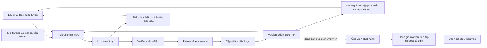
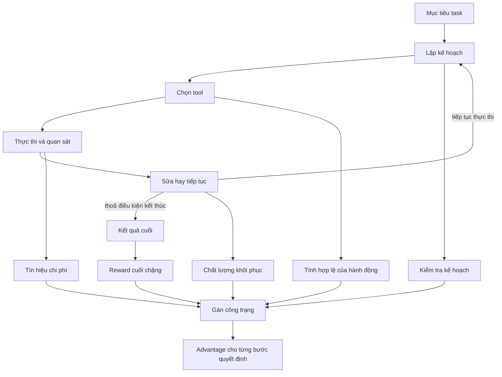
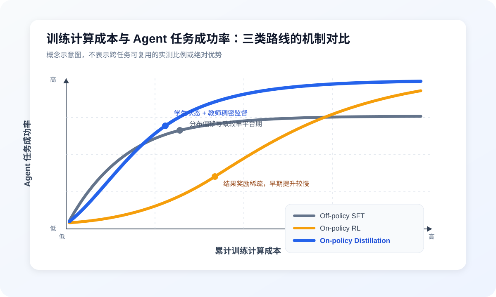
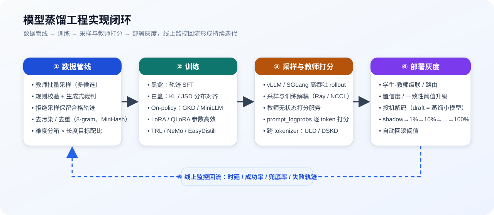

# Chương 17 - Tối ưu model

**Model là hạt nhân ra quyết định để Agent hiểu task, chọn tool, tổ chức hành động nhiều bước và điều chỉnh chiến lược theo phản hồi từ môi trường.** Với tiền đề là Harness cùng môi trường thực thi đã đáp ứng yêu cầu vận hành, năng lực model chủ yếu quyết định trần ra quyết định của Agent, đồng thời ảnh hưởng rõ rệt tới hiệu quả task và chi phí trên mỗi task thành công. Vì vậy, trong các biện pháp tối ưu Agent, tối ưu model là khâu cốt lõi để nâng trần năng lực và cải thiện hiệu suất vận hành ở quy mô lớn.

Model đa dụng có năng lực ngôn ngữ và suy luận rộng, nhưng chưa chắc tự nhiên phù hợp với phân bố task, hệ tool và ràng buộc nghiệp vụ của một Agent cụ thể. Tối ưu model hướng tới kịch bản mục tiêu giúp model nhận diện mục tiêu task ổn định hơn, sinh ra hành động hợp lệ, tận dụng phản hồi thực thi và hoàn tất quyết định chuỗi dài; đồng thời cải thiện độ trễ đầu cuối cùng chi phí trên mỗi task thành công nhờ giảm prompt dài dòng, lời gọi vô ích, retry thất bại và sự phụ thuộc vào model mạnh. Giá trị của nó không chỉ là làm model "mạnh hơn", mà là huấn luyện ra một model có hiệu quả tốt hơn trên task mục tiêu, chi phí kiểm soát được hơn và điều kiện triển khai khớp hơn.

Tối ưu model cũng không phải câu trả lời chung cho mọi vấn đề của Agent. Giao thức tool mơ hồ, thiếu context, kiểm soát quyền hạn hỏng hay dịch vụ ngoài bất thường lần lượt thuộc về vấn đề của Harness hoặc môi trường thực thi, và không thể bù bằng việc huấn luyện model. Chỉ khi đã xác định rõ kịch bản Agent cùng yêu cầu năng lực của nó, và xác nhận vấn đề thực sự đến từ năng lực hiểu, suy luận hay ra quyết định của model, thì việc huấn luyện model mới tạo ra lợi ích kiểm chứng được và tái sử dụng được.

## 17.1 Tổng quan các phương pháp tối ưu Agent

Tối ưu model cho Agent bắt đầu từ kịch bản mục tiêu: Agent phải hoàn thành task gì, cần model đưa ra những quyết định then chốt nào, khoảng hụt năng lực hiện ở đâu, và yêu cầu về hiệu quả, độ trễ, tài nguyên cùng bảo mật là gì. Dựa trên những điều kiện đó, đội ngũ mới đánh giá được có cần tối ưu model không, chọn được tín hiệu học và phương pháp phù hợp, rồi kiểm chứng lợi ích trong toàn hệ Agent.

Mục này triển khai quanh bốn câu hỏi:

* Agent đặt ra những yêu cầu năng lực nào cho model;

* Khi nào tối ưu model, khi nào tối ưu Harness hay môi trường thực thi;

* Định nghĩa mục tiêu tối ưu ra sao, đặt chỉ số chất lượng, độ tin cậy, chi phí và lan can bảo mật thế nào;

* Chọn giữa SFT, Agentic RL và model distillation ra sao.


*Hình 17.1-1 - Toàn cảnh vòng lặp khép kín tối ưu Agent*

### 17.1.1 Đánh giá đối tượng tối ưu: model, Harness và môi trường thực thi

Năng lực đầu cuối của Agent được hình thành chung bởi **model, Harness và môi trường thực thi**:

* **Model** chịu trách nhiệm hiểu task, ra quyết định, sinh hành động và diễn giải phản hồi trong phạm vi thông tin và không gian hành động đã cho;

* **Harness** chịu trách nhiệm tổ chức context, giao thức tool, trạng thái task, định tuyến lời gọi, truyền phản hồi, cùng các hỗ trợ vận hành như retry và dừng;

* **Môi trường thực thi** gồm hệ thống nghiệp vụ, dịch vụ dữ liệu, tài nguyên tính toán và dịch vụ ngoài, chịu trách nhiệm thực sự gánh hành động và trả về kết quả.


*Hình 17.1-2 - Ranh giới trách nhiệm model - Harness - môi trường thực thi*

Vì vậy, tối ưu Agent trước hết phải đánh giá vấn đề xảy ra ở tầng nào. Lấy việc khôi phục sau thất bại làm ví dụ: model đánh giá lỗi hiện tại có khôi phục được không, bước tiếp theo nên làm gì - đó là năng lực ra quyết định; Harness dựa trên đề xuất của model và chính sách đặt trước để quyết định retry, dừng hay xin uỷ quyền - đó là điều khiển vận hành; còn môi trường thực thi không hoàn tất được hành động vì dịch vụ không khả dụng hay thiếu tài nguyên - đó là sự cố môi trường. Cả ba có thể biểu hiện thành hiện tượng thất bại giống nhau, nhưng biện pháp tối ưu tương ứng thì khác nhau.

Nguyên tắc cơ bản khi quy kết thất bại là: trước hết hãy đánh giá xem lúc ra quyết định sai, model đã có được thông tin chính xác và đầy đủ chưa, có interface hành động rõ ràng và dùng được không, và môi trường thực thi có bình thường không. Nếu thiếu thông tin cần thiết, giao thức tool mơ hồ, trạng thái không nhìn thấy được hay phản hồi bị cắt cụt, thì nên ưu tiên sửa Harness; nếu tool không khả dụng, thiếu tài nguyên hay dịch vụ ngoài bất thường, thì nên sửa môi trường thực thi; chỉ khi thông tin, không gian hành động và điều kiện phản hồi đều rõ ràng và ổn định mà cùng một loại lỗi quyết định vẫn lặp lại qua nhiều biến thể task, thì mới đủ lý do để liệt nó vào mục tiêu tối ưu năng lực model.

Việc một Agent phân tích dữ liệu liên tục sinh SQL sai minh hoạ nguyên tắc này: nếu model chưa nhận được ý nghĩa của các trường, hãy cải thiện việc tra cứu từ điển dữ liệu và việc cấp context; nếu mô tả của tool về khoảng thời gian có chỗ nhập nhằng, hãy sửa giao thức tool; nếu bản thân dịch vụ truy vấn không khả dụng, hãy xử lý môi trường thực thi; còn nếu trường, thước đo thống kê và phản hồi thực thi đều đã cung cấp rõ mà model vẫn nhầm lẫn logic loại bỏ trùng lặp hay logic join ở các task khác nhau, thì mới nên đánh giá tiếp việc tối ưu model.

Bản thân hiện tượng thất bại không quyết định được việc quy kết. Chẳng hạn, chọn sai tool vừa có thể do model yếu, vừa có thể do mô tả tool mơ hồ. Bảng 17.1-1 vì thế kết hợp hiện tượng với điều kiện đánh giá, và đưa thẳng ra đối tượng nên ưu tiên tối ưu.

*Bảng 17.1-1 - Quy kết thất bại của Agent*

| **Đối tượng quy kết** | **Tình huống thất bại thường gặp** | **Kiểm chứng ra sao** |
| --- | --- | --- |
| Môi trường thực thi | Model đã đưa ra hành động thực thi được, nhưng hệ thống nghiệp vụ, dịch vụ dữ liệu, Sandbox, tài nguyên tính toán hay dịch vụ ngoài không thực thi và trả kết quả bình thường được | Gọi thẳng tool hay dịch vụ tương ứng, bỏ qua model; nếu sự cố vẫn tái hiện thì quy về môi trường thực thi |
| Harness | Model không nhận được thông tin cần thiết, interface tool rõ ràng hay phản hồi đầy đủ; hoặc trạng thái task, retry, dừng và kiểm soát quyền hạn không được quản lý đáng tin | Cố định model và môi trường thực thi, chỉnh context, giao thức tool hay điều khiển vận hành; nếu vấn đề giảm rõ rệt thì quy về Harness |
| Model | Thông tin, interface hành động và phản hồi đều đầy đủ, môi trường thực thi cũng bình thường, nhưng model vẫn liên tục hiểu, suy luận, chọn tool, khôi phục sau lỗi hay quyết định kết thúc sai | Cố định Harness và môi trường thực thi rồi test lặp hoặc thay model; nếu lỗi xuất hiện ổn định qua các biến thể task, hoặc cải thiện rõ khi đổi model, thì quy về model |

Khi rà soát thực tế, hãy loại trừ trước các sự cố môi trường thực thi tái hiện độc lập được, rồi kiểm tra xem Harness đã cung cấp đủ thông tin và điều khiển vận hành đáng tin chưa, cuối cùng mới đánh giá có phải khoảng hụt năng lực model không. Thứ tự này không có nghĩa những hiện tượng như chọn tool sai hay thực thi lặp chỉ do một tầng gây ra, mà là để tránh dùng việc huấn luyện model bù cho những vấn đề vốn thuộc về kỹ thuật hệ thống.

Với những vấn đề mà ranh giới model và Harness chưa rõ, có thể tổ chức bốn nhóm đối chứng trên tiền đề môi trường thực thi ổn định: model gốc + Harness gốc, model gốc + Harness ứng viên, model ứng viên + Harness gốc, model ứng viên + Harness ứng viên. Với cùng bộ task và cùng ngân sách, hãy so sánh lợi ích do thay đổi model, thay đổi Harness và tương tác giữa hai thứ mang lại. Nếu model ứng viên cần prompt hay adapter giao thức chuyên biệt, hãy đưa phần thích ứng đó vào bản ghi cấu hình tương ứng, tránh quy toàn bộ thay đổi của tổ hợp về phía model.

Ngoài ra, tối ưu model cũng có thể do mục tiêu chi phí dẫn dắt. Một số task tần suất cao đã hoàn thành được nhờ prompt dài, sửa sai lặp lại hay để nhiều model cùng soát, nhưng chi phí thực thi vượt ngân sách. Nếu phân bố task tương đối ổn định và các hành vi hữu hiệu học được, thì có thể đánh giá việc dùng SFT hay distillation để giảm những chi phí đó. Lúc này cần chỉnh đồng thời cả model lẫn Harness, đồng thời vẫn giữ lại phần kiểm soát quyền hạn, ràng buộc thực thi và kiểm chứng độc lập cần thiết.

### 17.1.2 Yêu cầu năng lực model của Agent

Sau khi vấn đề đã được quy về model, cần đánh giá tiếp là năng lực ra quyết định loại nào của model còn thiếu. Trong vòng lặp "nhận quan sát - ra quyết định - nhận phản hồi - điều chỉnh quyết định", vấn đề của model có thể quy về bốn loại:

* **Hiểu task và nhận diện ràng buộc.** Model cần chuyển yêu cầu bằng ngôn ngữ tự nhiên thành mục tiêu thực thi được, nhận ra tiêu chí hoàn thành, điều kiện tiên quyết và phạm vi thao tác được phép. Chẳng hạn, Agent phân tích dữ liệu khi nhận "so sánh tăng trưởng khách hàng giữa hai quý" thì cần làm rõ thước đo khách hàng, khoảng thời gian và luật loại bỏ trùng lặp, đồng thời đánh giá thông tin hiện có đã đủ chưa; khi điều kiện cần chưa rõ, thì việc nêu câu hỏi làm rõ cũng là một cách đẩy task tiến lên hữu hiệu.

* **Dùng tool và hiểu phản hồi.** Model cần chọn tool phù hợp, sinh hành động khớp yêu cầu interface, và đánh giá kết quả trả về có hỗ trợ được quyết định tiếp theo không. Gọi thành công chỉ nói lên rằng interface đã hoàn thành request; model còn phải nhận ra kết quả có đầy đủ không, thước đo dữ liệu có nhất quán không, và có cần kiểm chứng thêm không.

* **Quyết định nhiều bước và tận dụng trạng thái.** Model cần hiểu phần việc đã xong, vấn đề chưa giải quyết và thông tin hiện có, rồi điều chỉnh thứ tự hành động theo phản hồi. Với các task có sự cộng tác của người dùng, còn phải xác nhận người dùng đã hoàn tất thao tác cần thiết chưa. τ²-Bench đưa trường hợp cả người dùng lẫn Agent đều thao tác được lên môi trường chung vào phạm vi đánh giá, và dùng thí nghiệm ablation để phân biệt lỗi suy luận với lỗi giao tiếp, phối hợp - cho thấy năng lực hoàn thành task phải phủ cả quyết định lẫn tương tác.

* **Khôi phục sau thất bại và kết thúc hợp lý.** Sau khi tool báo lỗi, model cần đánh giá nên sửa tham số, bổ sung thông tin, đổi đường hay xin trợ giúp; còn khi kết quả đã thoả điều kiện hoàn thành, thì cần đánh giá task có thể kết thúc chưa.

Những năng lực này mô tả biểu hiện ra quyết định của model, chứ không phải toàn bộ năng lực vận hành của Agent. Model có thể đề nghị gọi tool, retry hay dừng, nhưng việc tool thực sự chạy, trạng thái được lưu bền, quyền hạn được kiểm và hành động được cho qua thì vẫn do Harness và môi trường thực thi gánh. Làm xong bước này, ta mới chuyển được câu "hiệu quả Agent kém" chung chung thành một mục tiêu tối ưu model mà dữ liệu huấn luyện dựng được, tín hiệu học chọn được và nghiệm thu độc lập được.

### 17.1.3 Đặt mục tiêu tối ưu: chất lượng, độ tin cậy, chi phí và lan can bảo mật

Sau khi xác định đối tượng tối ưu, cần chuyển "mạnh hơn" hay "tiết kiệm hơn" thành mục tiêu kiểm chứng được. Động cơ tối ưu chia hai loại: **hướng hiệu quả** quan tâm chất lượng task và độ ổn định còn thiếu; **hướng hiệu suất** quan tâm việc task đã hoàn thành được nhưng còn phụ thuộc vào prompt quá dài, retry lặp lại, nhiều model cùng soát hay chi phí suy luận cao. Cả hai loại mục tiêu đều nên đánh giá chung theo ba chiều chất lượng, độ tin cậy và chi phí.

* **Chất lượng.** Đo task có hoàn thành đúng yêu cầu không. Ngoài đáp án cuối, còn phải kiểm tra các hành động then chốt có đúng không, kết quả có thoả thước đo nghiệp vụ không, ràng buộc có được tuân thủ không. Với Agent phân tích dữ liệu, có thể kiểm tra nguồn dữ liệu và khoảng thời gian có đúng không, kết quả truy vấn có tái lập được không, kết luận có được dữ liệu hỗ trợ không. Các chỉ số cục bộ như tỉ lệ đúng định dạng gọi tool có thể hỗ trợ định vị vấn đề, nhưng nghiệm thu cuối cùng vẫn phải quay về task trọn vẹn.

* **Độ tin cậy.** Đo Agent có hoàn thành task liên tục được trong các điều kiện khác nhau không. Cùng một task nên chạy nhiều lần, phủ các tình huống input thay đổi, tương tác dài, tool bất thường và người dùng bổ sung điều kiện. Khi tỉ lệ thành công trung bình tăng, vẫn phải xác nhận các kịch bản nghiệp vụ then chốt không bị thụt lùi; còn những trường hợp vi phạm ranh giới quyền hạn hay ranh giới thực thi thì phải báo cáo riêng.

* **Chi phí.** Đo tổng đầu tư để có được kết quả hữu hiệu, bao gồm lời gọi model, thực thi tool, retry thất bại và sự can thiệp của con người; đồng thời quan sát độ trễ đầu cuối cùng biểu hiện ở các phân vị cao. Có thể dùng **"chi phí trên mỗi task thành công"**, tức chi phí thực thi của toàn bộ task trong kỳ thống kê chia cho số task hoàn thành thành công - tài nguyên mà các task thất bại tiêu tốn cũng tính vào tử số. Khi so sánh thì nên cố định cấu thành task và báo cáo kèm tỉ lệ thành công, tránh việc bỏ các task khó tạo ra một sự giảm chi phí bề ngoài.

Hướng hiệu suất không có nghĩa là huấn luyện model tất yếu làm giảm chi phí. SFT chỉ có thể giảm chi phí đầu cuối khi nó rút ngắn được prompt, giảm số lần retry và soát lại, hoặc khiến một model nhỏ hơn đảm đương được task mục tiêu; ngược lại, khoản đầu tư một lần cho việc chuẩn bị dữ liệu, huấn luyện, đánh giá, phát hành và bảo trì có thể triệt tiêu phần tiết kiệm khi vận hành. Với các task tần suất thấp hay thay đổi nhanh, một chỉnh sửa Harness nhẹ nhàng có thể kinh tế hơn; với các task tần suất cao và tương đối ổn định, phần tiết kiệm trên mỗi lần thực thi nhờ huấn luyện model hay distillation mới dễ tích luỹ thành lợi ích. Kết luận cụ thể cần tính toán dựa trên quy mô nghiệp vụ thực tế.

Ngoài chỉ số còn phải đặt **lan can bảo mật**. Model chịu trách nhiệm nhận diện ràng buộc và đề xuất hành động, nhưng không thể chỉ trông vào việc model tự tuân thủ: Harness lo kiểm quyền hạn, cho qua hành động, giới hạn số retry, điều kiện dừng và kiểm chứng độc lập ở phía lời gọi; còn môi trường thực thi lo kiểm tra cưỡng chế và thực thi hành động ở phía tài nguyên và dịch vụ. Trước khi huấn luyện, phải làm rõ task mục tiêu, baseline đối chứng, ngưỡng chất lượng, yêu cầu độ tin cậy, ngân sách chi phí, ràng buộc bảo mật và phạm vi hồi quy; sau khi huấn luyện, hãy đo lại bằng đúng thước đo đó, mới đánh giá được lợi ích có đến từ phần nâng năng lực như kỳ vọng không, và xác nhận không đánh đổi độ tin cậy hay tính an toàn để lấy một cải thiện chỉ số cục bộ.

### 17.1.4 Chọn phương pháp tối ưu model phù hợp

Sau khi xác nhận khoảng hụt năng lực của model, hãy chọn phương pháp theo tín hiệu học và mục đích tối ưu:

* **Có mẫu trình diễn rõ ràng thì chọn SFT.** Khi việc dùng tool, đẩy task tiến lên hay khôi phục sau thất bại đã có mẫu trình diễn hữu hiệu khá rõ, mà model thực thi chưa đủ ổn định, thì có thể dùng supervised fine-tuning để nâng xác suất xuất hiện của những hành vi đó trong điều kiện tương ứng. Mẫu huấn luyện nên chứa đủ context, phản hồi tool và biến động task cần thiết để sinh ra hành động mục tiêu, giúp model vận dụng được hành vi đã học trong những input và trạng thái tương tác mới.

* **Cần khám phá bằng tương tác và môi trường cấp được phản hồi đáng tin thì chọn Agentic RL.** Khi task có nhiều đường thực thi, hơn kém giữa các đường phải thực sự chạy mới đánh giá được, và môi trường cấp được phản hồi kiểm chứng được, thì có thể tối ưu chiến lược hành động bằng Agentic RL. Tiền đề của phương pháp này là môi trường tương tác chạy được, phản hồi nhất quán với mục tiêu task thật, và chi phí khám phá cùng huấn luyện gánh được.

* **Teacher model đã đủ năng lực và mục tiêu là di chuyển, nén hay triển khai thì chọn model distillation.** Khi teacher model hoàn thành được task mục tiêu, mà môi trường production lại muốn dùng một student model thoả quy mô, độ trễ hay điều kiện triển khai nhất định, thì có thể dùng output hay trajectory mà teacher sinh ra trên phân bố task mục tiêu để huấn luyện student model. Student model khi thực thi thực tế có thể rơi vào những trạng thái mà mẫu trình diễn của teacher chưa phủ, nên vẫn phải kiểm tra sự tích luỹ lệch và năng lực khôi phục sau thất bại.

Ba loại phương pháp không loại trừ nhau. Riêng với phần distillation theo output hay trajectory mà chương này bàn, distillation thường được hiện thực qua SFT trên dữ liệu do teacher sinh; còn model sau SFT cũng có thể tiếp tục làm Agentic RL. Có kết hợp hay không và sắp thứ tự ra sao thì do năng lực model nền, chất lượng tín hiệu huấn luyện, Harness mục tiêu và ngân sách chi phí cùng quyết định. Giai đoạn huấn luyện nên phủ hết mức có thể các cách tổ chức context, giao thức tool và cách phản hồi chủ đạo trong production, hoặc kiểm chứng rằng khác biệt giữa điều kiện huấn luyện và điều kiện production có thể được thích ứng một cách đáng tin.


*Hình 17.1-3 - Đường chọn phương pháp tối ưu model*

Trước khi vào các khâu huấn luyện tiếp theo, nên hình thành một định nghĩa nhiệm vụ tối ưu rõ ràng: task mục tiêu và phân bố của nó là gì, khoảng hụt năng lực cần cải thiện là gì, bằng chứng quy kết ra sao, Harness và môi trường thực thi hiện tại đã cung cấp những điều kiện nào, dùng tín hiệu học và phương pháp tối ưu nào, ngưỡng chất lượng, độ tin cậy, chi phí và bảo mật lần lượt là bao nhiêu, và sẽ dùng bộ task độc lập cùng phạm vi hồi quy nào để nghiệm thu. Các mục sau sẽ triển khai theo đó các phương pháp SFT, Agentic RL, model distillation và kiểm chứng lên production.

## 17.2 SFT: xây dựng năng lực thực thi task hướng Agent

Khi vấn đề đã được quy về model, và hành vi đúng có thể được trình diễn rõ ràng, thì có thể dùng **supervised fine-tuning (SFT)** để nâng độ ổn định của việc model tái hiện những hành vi đó. Tác dụng của SFT không phải thay thế Harness hay môi trường thực thi, cũng không phải tự động tìm ra chiến lược tối ưu chưa biết, mà là làm cho những cách hiểu, cách quyết định và cách phản hồi đã được kiểm chứng dễ được model áp dụng hơn trong các task tương tự.

Với SFT hướng Agent, đối tượng giám sát không chỉ là đáp án cuối, mà còn gồm các quyết định then chốt trong quá trình thực thi task, ví dụ có cần gọi tool không, chọn tool nào, sinh tham số ra sao, diễn giải phản hồi thế nào, và khi nào thì tiếp tục, làm rõ, xin trợ giúp hay kết thúc. Đơn vị học cơ bản của nó có thể tóm lại là: **trong phạm vi thông tin và không gian hành động hiện thấy, model nên sinh ra phản hồi hay hành động gì.**

Nối tiếp ví dụ phân tích dữ liệu ở trên: người dùng yêu cầu so sánh số khách hàng doanh nghiệp trả phí mới tăng giữa hai quý, kèm căn cứ kiểm chứng. Ngay cả khi các thước đo như "loại bỏ trùng lặp theo doanh nghiệp, xác định khách mới theo thời điểm trả phí hợp lệ đầu tiên trong lịch sử, loại trừ tài khoản test" đã rõ, model vẫn có thể lọc đơn hàng trong quý trước rồi mới tính thời điểm trả phí đầu tiên, khiến khách cũ bị tính vào khách mới. Lúc này, mục tiêu của SFT không phải là để model nhớ một câu truy vấn nào đó, mà là thông qua nhiều mẫu trình diễn đa dạng, giúp nó học ổn định phương pháp thực thi "trước hết xác định thời điểm trả phí đầu tiên của doanh nghiệp trên toàn bộ bản ghi trả phí hợp lệ, rồi mới thống kê theo quý mục tiêu".


*Hình 17.2-1 - Cơ chế tác động của Agent SFT lên hành vi model*

Như hình 17.2-1 cho thấy, trong điều kiện mục tiêu task, thông tin nhìn thấy được và không gian hành động giữ nguyên, SFT dùng cặp "điều kiện quyết định hiện tại - hành vi mục tiêu đã kiểm chứng" làm tín hiệu giám sát, điều chỉnh tham số model để xu hướng sinh ra hành vi mục tiêu trong các context tương tự tăng lên. Thứ nó thay đổi là phân bố hành vi có điều kiện của model, chứ không phải việc duy trì trạng thái, thực thi tool và kiểm soát quyền hạn của Harness; nó cũng không dựa vào tương tác với môi trường để khám phá chiến lược tối ưu chưa biết.

Phần trước đã bàn về xử lý trajectory và việc xây dựng tài sản chất lượng. Mục này tiếp nối các thành quả đó, tập trung nói cách xác định mục tiêu giám sát từ trajectory, cách tổ chức mẫu huấn luyện, và cách dùng đánh giá theo thực thi để đánh giá model có thực sự thu được năng lực thực thi task chuyển giao được hay không.

### 17.2.1 Làm rõ ranh giới áp dụng của SFT

Trước khi vào SFT, ngoài việc xác nhận vấn đề thuộc về model, còn phải đánh giá hành vi mục tiêu có trình diễn được một cách đáng tin không. Nếu chuyên gia, hệ luật hay một model mạnh hơn đưa ra được hành vi đúng ổn định và kiểm chứng được, thì SFT có thể di chuyển những hành vi đó sang model mục tiêu; còn nếu hơn kém giữa các đường chỉ đánh giá được qua tương tác với môi trường, hoặc trong cùng một trạng thái mà thiếu hành động mục tiêu đáng tin, thì không nên lấy thẳng kết quả bất định làm nhãn giám sát, mà nên hoàn thiện điều kiện kiểm chứng trước, hoặc cân nhắc các phương pháp dựa vào phản hồi môi trường như Agentic RL.

Mục tiêu giám sát nên xuất phát từ khoảng hụt năng lực đã nhận diện, chứ không định nghĩa chung chung là "nâng năng lực Agent". Chẳng hạn, gọi tool thất bại có thể tách tiếp thành sai thời điểm gọi, sai lựa chọn tool, sai ngữ nghĩa tham số hay sai cách hiểu phản hồi; còn task nhiều lượt thất bại thì có thể định vị thành mất ràng buộc, tận dụng trạng thái chưa đủ hay đánh giá kết thúc sai. Chỉ khi đưa vấn đề về đúng một điểm quyết định cụ thể, ta mới xác định được cần bổ sung mẫu gì, giám sát output nào, và dùng test nào để kiểm chứng cải thiện.

SFT hướng Agent thường phủ các loại hành vi mục tiêu sau: trả lời thẳng khi thông tin đủ, chọn tool khi cần thông tin từ ngoài, nêu câu hỏi làm rõ khi thiếu điều kiện then chốt; sinh tham số theo yêu cầu người dùng và interface hiện có; cập nhật kế hoạch dựa trên kết quả tool; chọn sửa, xin trợ giúp hay dừng khi gặp lỗi, thiếu quyền hạn hay kết quả không đầy đủ. Model lo học những quyết định đó, còn việc duy trì trạng thái task, thực sự gọi tool, kiểm quyền hạn, giới hạn số retry và cho qua hành động thì vẫn do Harness và môi trường thực thi lo.

### 17.2.2 Dựng mẫu giám sát được từ trajectory

Trajectory ghi lại quá trình thực thi task, nhưng bản thân trajectory không đồng nghĩa với mục tiêu giám sát. Một trajectory có thể đồng thời chứa system instruction, request người dùng, định nghĩa tool, hành động model, phản hồi môi trường và các lần sửa về sau; trong đó chỉ những hành vi model đã được kiểm chứng và đáng tái dùng mới nên tham gia giám sát. Việc dựng mẫu hướng Agent, về bản chất, là chuyển trajectory trọn vẹn thành một số mẫu "context nhìn thấy được - hành vi mục tiêu" **trong khi vẫn giữ nguyên quan hệ nhân quả của quyết định.**

Mỗi hành vi mục tiêu chỉ được dựa vào thông tin đã nhìn thấy được tại đúng thời điểm quyết định đó. Khi một lời gọi tool chưa trả về, hành động mục tiêu không được dùng kết quả của nó; những điều kiện mà người dùng bổ sung ở các lượt sau cũng không được vào sớm trong input của quyết định trước đó. Ngược lại, điều kiện thông tin lúc huấn luyện offline sẽ tốt hơn điều kiện vận hành thật, và model dù có khớp được dữ liệu giám sát cũng khó tái hiện cùng biểu hiện khi lên production.

Toàn bộ tương tác có thể vào làm một context liên tục, cũng có thể tách theo điểm quyết định thành nhiều mẫu tiền tố lịch sử. Cả hai cách đều cần giữ lại ràng buộc task, mô tả tool, hành động lịch sử và phản hồi môi trường mà hành động mục tiêu phụ thuộc. Thứ model cần học là cách dùng những thông tin đó để ra quyết định hiện tại, chứ không phải gánh việc lưu trạng thái lúc chạy; nếu trạng thái cần thiết đã bị cắt cụt, bỏ sót hay tổ chức sai trước khi vào model, thì phải sửa Harness trước, chứ không dựa vào SFT để bù.

Độ phủ mẫu nên bao gồm cả thực thi bình thường, đẩy tiến nhiều lượt và khôi phục bất thường, nhưng không cần chẻ ba thứ thành các năng lực tách rời. Với việc dùng tool, cần phủ các lựa chọn khác nhau như trả lời thẳng, phát lời gọi và xin làm rõ, tránh để model hình thành thói quen đơn điệu "gặp task là gọi tool"; với task nhiều lượt, cần giữ quan hệ giữa các ràng buộc thay đổi, kết quả đã có và những bước còn phải làm; còn với kịch bản bất thường, cần trình bày trạng thái nhìn thấy được sau khi lỗi xảy ra, cùng hành vi sửa, xin trợ giúp hay kết thúc đã được kiểm chứng.

Trong task phân tích khách hàng mới, mẫu nên giữ lại thước đo khách hàng, mô tả trường và tool hiện dùng được, và lấy hành động truy vấn đúng cùng căn cứ của nó làm mục tiêu. Sau khi tool trả về, mục tiêu tiếp theo có thể là kiểm chứng thước đo thống kê, bổ sung truy vấn hay hình thành câu trả lời có bằng chứng hỗ trợ. Bằng cách đổi khoảng quý, cách diễn đạt trường, cấu trúc bảng và phân bố dữ liệu, ta khiến model học được nguyên tắc xử lý chuyển giao được, chứ không phải nhớ một template cố định.

### 17.2.3 Sàng lọc nội dung giám sát và kiểm soát chất lượng mẫu

Task cuối cùng thành công không có nghĩa mỗi bước trong trajectory đều đáng bắt chước. Trajectory thành công có thể chứa truy vấn thừa, nhận định không căn cứ, hay những bước tình cờ có kết quả đúng sau khi đã sai; còn trajectory thất bại cũng có thể chứa phản hồi lỗi và quá trình khôi phục có giá trị. Vì vậy, chất lượng mẫu không thể chỉ do kết quả cuối quyết định, mà còn phải soát từng hành vi then chốt.

Với kịch bản sửa sai, có thể giữ hành động sai trong context lịch sử để model hiểu vì sao hiện phải sửa, nhưng che loss huấn luyện ứng với hành động sai đó, chỉ giám sát các hành vi tiếp theo đã được kiểm chứng. Chẳng hạn, model gửi truy vấn rồi nhận phản hồi "trường không tồn tại": mẫu có thể giữ lại lời gọi gốc cùng thông tin lỗi, và lấy việc kiểm tra các trường khả dụng, sửa truy vấn rồi kiểm chứng lại làm mục tiêu. Cách này huấn luyện quyết định khôi phục sau lỗi, chứ không phải chính hành động sai.

Vai trò của các loại nội dung tương tác trong huấn luyện có thể xử lý theo bảng 17.2-1.

*Bảng 17.2-1 - Cách xử lý giám sát với các loại nội dung tương tác trong Agent SFT*

| Nội dung tương tác | Vai trò trong mẫu | Cách xử lý giám sát thường dùng |
| --- | --- | --- |
| System instruction, request người dùng và định nghĩa tool | Cung cấp mục tiêu task, ràng buộc và không gian hành động | Làm context input, thường không làm mục tiêu sinh của task này |
| Kết quả tool, quan sát môi trường và phản hồi lỗi | Cung cấp trạng thái thực thi nhìn thấy được lúc ra quyết định | Giữ trong input, thường không tính loss sinh |
| Lời gọi tool, câu làm rõ, phần sửa và câu trả lời cuối đã kiểm chứng | Biểu thị hành vi mục tiêu mà model nên học | Tính loss giám sát trên phần nội dung đã chọn |
| Bước model sai dùng để giải thích kịch bản khôi phục | Nói rõ trạng thái thất bại và điểm xuất phát của phần sửa | Giữ lại làm context nhưng che loss tương ứng |
| Các bước chưa kiểm chứng hoặc chất lượng đáng ngờ | Không xác nhận được có đáng cho model tái dùng không | Bổ sung kiểm chứng; không xác nhận được thì loại khỏi tập huấn luyện |

Mask theo vai trò và mask theo chất lượng giải quyết hai vấn đề khác nhau. Chỉ tính loss trên nội dung do model sinh thì loại được message người dùng và phần tool trả về; nhưng bản thân lời gọi sai cũng do model sinh, nên vẫn cần đánh dấu hành vi ở mức mịn hơn. Khi hiện thực, nên lấy mẫu kiểm tra phần nội dung thực sự tham gia tính loss, xác nhận cấu trúc lời gọi tool, ranh giới phản hồi và cách xử lý bước sai đúng như thiết kế.

### 17.2.4 Tổ chức huấn luyện và giữ ranh giới năng lực

Tỉ lệ pha mẫu nên phản ánh đồng thời phân bố task production và khoảng hụt năng lực đã xác nhận. Task tần suất cao dùng để dựng hành vi cơ bản ổn định, task chuỗi dài dùng để luyện việc tận dụng thông tin xuyên bước, còn các bất thường tần suất thấp nhưng ảnh hưởng lớn thì dùng để bù năng lực khôi phục. Với những task đơn giản vốn đã làm thẳng được, cũng nên giữ mẫu tương ứng, phòng việc sau huấn luyện model tăng số lời gọi tool hay số lượt tương tác một cách phổ quát.

Mẫu không cần pha đều một cách máy móc. Cách hợp lý hơn là điều chỉnh phạm vi phủ theo các loại thất bại trên tập phát triển, đồng thời giữ lại một lượng mẫu tuân thủ chỉ thị và hỏi đáp đa dụng cần thiết, rồi kiểm tra xem cải thiện ở task chuyên biệt có kèm theo sự thụt lùi ở năng lực khác không. Nhân bản lặp lại một ít mẫu trình diễn đồng chất chỉ nâng trọng số của chính những mẫu đó, chứ không thay thế được độ phủ thật với biến động task, nhánh trạng thái và điều kiện bất thường.

Huấn luyện và suy luận nên dùng cùng một template hội thoại, cùng định dạng gọi tool và cùng token kết thúc tương thích nhau. Với mẫu dài, còn phải kiểm tra vị trí cắt cụt, tránh việc giữ được hành động mục tiêu mà mất phần ràng buộc hay kết quả tool mà nó phụ thuộc. Ngược lại, loss huấn luyện có thể giảm bình thường, nhưng hành động model sinh ra thì runtime không phân giải được, hoặc thiếu thông tin cần thiết để ra quyết định đúng.

Việc cập nhật tham số có thể dùng full fine-tuning, cũng có thể dùng các phương pháp tinh chỉnh hiệu quả tham số như LoRA. LoRA giảm được số tham số huấn luyện và chi phí tài nguyên liên quan, hợp với việc lặp nhanh khi ngân sách eo hẹp; còn full fine-tuning cho không gian điều chỉnh tham số lớn hơn nhưng thường tốn chi phí huấn luyện và bảo trì version cao hơn. Cả hai đều không thay thế được việc kiểm soát chất lượng dữ liệu, cũng không tự nhiên tránh được sự thụt lùi năng lực; lựa chọn cuối cùng nên dựa trên model nền, độ phức tạp task, ngân sách tài nguyên và kết quả đánh giá độc lập.

### 17.2.5 Kiểm chứng khả năng tổng quát hoá hành vi bằng đánh giá theo thực thi

Loss huấn luyện giảm chỉ nói lên rằng model dễ sinh ra nội dung mục tiêu trong mẫu giám sát hơn, chứ không chứng minh nó hoàn thành được task trong tương tác thật. Việc nghiệm thu SFT nên để model ứng viên tự chạy dưới Harness, interface tool và ngân sách thực thi cố định, để môi trường trả về phản hồi thực tế, rồi quan sát các quyết định sớm ảnh hưởng thế nào tới phần thực thi về sau. Nếu mỗi bước đều cấp sẵn lịch sử chuẩn và chỉ kiểm tra model có viết tiếp được đúng một phản hồi chuẩn không, thì sẽ không lộ ra được sự tích luỹ lỗi và thất bại trong khôi phục.

Chất lượng quan tâm task có hoàn thành không, ràng buộc then chốt có thoả không, và câu trả lời có được kết quả thực thi hỗ trợ không; độ tin cậy quan tâm biểu hiện lặp lại dưới các input khác nhau, tương tác dài và điều kiện bất thường; chi phí quan tâm số lần gọi tool, token, độ trễ đầu cuối và chi phí trên mỗi task thành công; còn bảo mật thì kiểm tra ranh giới quyền hạn, hành động nguy hiểm và điều kiện dừng có được tuân thủ không. Các chỉ số cục bộ như tỉ lệ đúng định dạng gọi tool dùng được để định vị vấn đề, nhưng không thay được việc nghiệm thu trên task trọn vẹn.

Tập test nên gom nhóm theo họ task, template hay nguồn dữ liệu hết mức có thể, tránh để những biến thể gần giống của cùng một task đồng thời vào cả tập huấn luyện lẫn tập test. Với task phân tích khách hàng mới, có thể đổi khoảng quý, cách diễn đạt trường và phân bố dữ liệu, rồi thêm các điều kiện như khách cũ trả phí lại, cùng một doanh nghiệp có nhiều đơn hàng, để kiểm tra model còn áp dụng đúng thước đo khách mới không. Cũng nên phủ cả các trường hợp mô tả tool thay đổi, người dùng đổi yêu cầu giữa chừng và lỗi thực thi khôi phục được, để kiểm chứng thứ model học là phương pháp thực thi chứ không phải một cách diễn đạt cố định.

Khi so sánh các version model, phải giữ Harness, điều kiện task và ngân sách thực thi nhất quán; nếu đồng thời sửa prompt, giao thức tool hay chiến lược context, thì phải ghi riêng đó là một thay đổi tổ hợp. Với các task có tính ngẫu nhiên khi lấy mẫu, cần chạy lặp và báo cáo biên độ dao động. Sản phẩm bàn giao cuối cùng nên gồm model ứng viên hay adapter, cấu hình huấn luyện và suy luận, version dữ liệu, cùng báo cáo đánh giá tổ chức theo khoảng hụt năng lực và bộ chỉ số nghiệm thu thống nhất.

### 17.2.6 Nối tiếp với Agentic RL và model distillation

SFT hợp với việc biến những hành vi đúng đã rõ thành một chiến lược khởi đầu ổn định, nhưng hiệu quả của nó bị ràng buộc bởi chất lượng mẫu trình diễn, độ phủ task và năng lực model nền. Khi model đã thực thi được task nhưng cần tương tác với môi trường để tìm những đường tốt hơn ngoài phạm vi mẫu trình diễn, hoặc cần xử lý bài toán gán công trạng ở tầm xa, thì có thể tiến tiếp vào Agentic RL; còn khi một năng lực đã chín cần di chuyển sang model nhỏ hơn, rẻ hơn hay dễ triển khai hơn, thì có thể dùng output hay trajectory của teacher để dựng dữ liệu distillation, và chủ yếu huấn luyện student model bằng SFT.

Ba phương pháp do các vấn đề khác nhau dẫn dắt, chứ không phải một dây chuyền cố định. SFT có thể làm điểm xuất phát ổn định cho Agentic RL, cũng có thể trực tiếp đảm nhiệm distillation theo output hay trajectory; còn có tiếp tục dùng phương pháp khác hay không thì nên do khoảng hụt năng lực còn lại mà đánh giá theo thực thi phơi ra, cùng mục tiêu triển khai, quyết định.

## 17.3 Agentic RL: tối ưu chiến lược quyết định bằng phản hồi môi trường

Agentic RL dùng các trajectory sinh ra khi model thực thi task trong môi trường làm mẫu học, rồi cập nhật chiến lược model theo kết quả task, trạng thái quá trình hay phản hồi của Verifier. Thứ nó tối ưu không phải một câu trả lời cố định nào đó, mà là xu hướng chọn hành động của model trong chuỗi quyết định liên tục: khi nào gọi tool, chọn tool nào, sinh tham số ra sao, diễn giải kết quả trả về thế nào, và khi nào thì sửa, xin trợ giúp hay kết thúc task.

SFT và Agentic RL đều tối ưu được việc gọi tool và quyết định nhiều bước; khác biệt giữa hai bên nằm ở nguồn tín hiệu giám sát. SFT học hành vi mục tiêu từ mẫu trình diễn cố định, nâng xác suất sinh ra hành động mẫu trong các context tương tự; còn Agentic RL thì để chiến lược sinh ra một hay nhiều trajectory thực thi trong môi trường, rồi dùng phản hồi kết quả hay quá trình để tối ưu kỳ vọng lợi ích task. Cái trước đòi hỏi hành vi mục tiêu trình diễn được một cách đáng tin; cái sau cho phép tồn tại nhiều đường khả thi, nhưng đòi hỏi hơn kém giữa các đường phải đánh giá được một cách ổn định.

Nối tiếp mạch phân tích dữ liệu ở trên, giả sử task đổi thành "kiểm chứng đơn hàng có thoả luật không rồi phát yêu cầu hoàn tiền". Model có thể truy vấn đơn hàng đúng nhưng bỏ qua khâu kiểm chứng chính sách hoàn tiền; cũng có thể hoàn tiền xong nhưng dùng những lời gọi tool không cần thiết. Việc gán nhãn hành động đúng duy nhất cho từng bước không dễ, nhưng task có hoàn thành không, số tiền hoàn có đúng không, chính sách có thoả không, có xảy ra thao tác vượt quyền không thì thường kiểm chứng được. Loại task như vậy đủ điều kiện cơ bản để vào Agentic RL.

Agentic RL không phải để bù cho khiếm khuyết của Harness hay môi trường thực thi. Nếu context cần thiết không vào được model, định nghĩa tool có chỗ nhập nhằng, kiểm soát quyền hạn né được, hay môi trường không tái hiện ổn định được, thì huấn luyện chỉ cố định những quan sát và phản hồi sai vào trong chiến lược. Mục này vì thế triển khai theo thứ tự: đánh giá điều kiện vào - môi trường và task - reward và Verifier - Rollout và cập nhật chiến lược - tối ưu tầm xa - kiểm chứng độc lập.

### 17.3.1 Đánh giá task có hợp với Agentic RL không

Trước khi vào Agentic RL, cần trả lời riêng hai câu hỏi: task này có đáng dùng học tăng cường không, và hệ thống hiện tại có đủ điều kiện huấn luyện không. Cái trước do khoảng hụt năng lực model và cấu trúc phản hồi của task quyết định; cái sau do môi trường, Verifier, ranh giới bảo mật và chi phí huấn luyện quyết định. Chỉ khi cả hai loại điều kiện cùng thoả thì Agentic RL mới là lựa chọn hợp lý.

*Bảng 17.3-1 - Đánh giá điều kiện vào Agentic RL*

| Chiều đánh giá | Điều kiện hợp để vào Agentic RL | Xử lý ưu tiên khi chưa thoả điều kiện |
| --- | --- | --- |
| Quy kết vấn đề | Thất bại đến từ việc chọn hành động, tận dụng phản hồi hay chiến lược khôi phục của model | Sửa context, giao thức tool, quyền hạn hay môi trường thực thi trước |
| Tính sẵn có của mẫu trình diễn | Đường hữu hiệu không duy nhất, khó cấp nhãn ổn định cho từng điểm quyết định | Nếu hành vi đúng trình diễn ổn định được thì ưu tiên dùng SFT |
| Tính kiểm chứng được của kết quả | Kết quả task hay các trạng thái trung gian then chốt có thể do luật, test hay bên thẩm định đáng tin đánh giá ổn định | Xây Verifier hay bộ thước đo chất lượng cao trước |
| Năng lực môi trường | Task chạy lặp được, trạng thái reset được, việc khám phá cô lập được, quá trình truy vết được | Xây Sandbox, simulator hay môi trường phát lại được trước |
| Chiến lược nền | Model đã có năng lực tuân thủ chỉ thị và gọi tool cơ bản, sinh được một tỉ lệ trajectory hữu hiệu nhất định | Dựng điểm xuất phát học được bằng prompt, SFT hay model nền mạnh hơn trước |
| Đầu tư và lợi ích | Cải thiện dự kiến về tỉ lệ thành công, độ tin cậy hay chi phí trên mỗi task thành công đủ bù chi phí Rollout và bảo trì môi trường | Dùng phương án tối ưu model, dữ liệu hay Harness rẻ hơn |

Trong đó, **"kết quả kiểm chứng được" quan trọng hơn "quá trình gán nhãn đầy đủ được".** Agentic RL có thể tìm chiến lược tốt hơn giữa nhiều đường, nhưng không tự suy ra được mục tiêu thật từ phản hồi không đáng tin. Nếu Verifier hoàn tiền chỉ kiểm "có sinh bản ghi hoàn tiền không" mà không kiểm chính sách, số tiền và quyền hạn, thì model có thể học được cách tạo các khoản hoàn tiền không tuân thủ nhanh hơn.

Với task hoàn tiền, điều kiện vào Agentic RL có thể cụ thể hoá thành: đơn hàng, chính sách và trạng thái hoàn tiền thực thi và reset được trong môi trường cô lập; task thành công đánh giá được bằng trạng thái database kết hợp luật nghiệp vụ; model đã gọi được các tool cơ bản nhưng vẫn còn những vấn đề chiến lược như sót kiểm chính sách, khôi phục sau lỗi chưa đủ hay chi phí gọi quá cao. Nếu model còn chưa sinh ổn định được cả định dạng tham số tool, thì nên hoàn thành SFT trước, chứ không phải mở rộng Rollout ngay.

### 17.3.2 Xây môi trường huấn luyện tương tác được và kiểm chứng được

Agentic RL trước hết cần chuyển task nghiệp vụ thành một quá trình tương tác lặp lại được. Hệ thống ngoài có trạng thái thật `sₜ` mà model không quan sát trực tiếp được; model thường chỉ thấy được phần thông tin cục bộ `oₜ` gồm request người dùng, message lịch sử, định nghĩa tool và phần tool trả về. Vì vậy, cách mô tả phù hợp hơn là: model chọn hành động dựa trên lịch sử tương tác tính tới thời điểm hiện tại `hₜ=(o₀,a₀,…,oₜ)`, chứ không coi một lần quan sát đơn lẻ là trạng thái trọn vẹn.

Với phần lớn Agent, hệ thống ngoài có trạng thái thật mà model không quan sát trực tiếp được; model chỉ thấy các quan sát cục bộ như request người dùng, message lịch sử và phần tool trả về. Do đó, nên mô tả task như một quá trình quyết định chuỗi quan sát được một phần. Model chọn hành động dựa trên lịch sử tương tác, chứ không coi thẳng quan sát một bước là trạng thái trọn vẹn.

Gọi thông tin nhìn thấy được ở bước thứ `t` là `oₜ`, hành động là `aₜ`, phản hồi do môi trường hay Verifier trả về là `rₜ`, thì một trajectory thực thi biểu diễn được là:

```text
τ = (o₀, a₀, r₀, o₁, a₁, r₁, …, oₜ, aₜ, rₜ)
```

Lịch sử của model ký hiệu là `hₜ=(o₀,a₀,…,oₜ)`, chiến lược viết là `πθ(aₜ|hₜ)`, và mục tiêu huấn luyện là cực đại hoá kỳ vọng lợi ích tích luỹ dưới phân bố task và phép chuyển trạng thái môi trường:

```text
J(θ) = E[ Σₜ γᵗ rₜ ],  aₜ ~ πθ(·|hₜ)
```

Việc mô hình hoá task cần làm rõ bốn yếu tố:

* **Quan sát**: mỗi bước model thấy được gì, gồm mục tiêu người dùng, context, mô tả tool, hành động lịch sử, kết quả tool và ngân sách còn lại. Quan sát phải nhất quán với môi trường production, tránh việc lúc huấn luyện có được thông tin mà lên production không dùng được.

* **Hành động**: model làm được gì, gồm xuất phản hồi, gọi tool, ghi vào memory, xin làm rõ, chờ sự kiện ngoài hay kết thúc task. Độ mịn của hành động có thể định nghĩa theo phản hồi trọn vẹn, theo lời gọi tool hay theo mức token mịn hơn.

* **Chuyển trạng thái**: hành động thay đổi môi trường ra sao. Lời gọi tool có thể thành công, thất bại, timeout hay trả về kết quả không đầy đủ; người dùng và hệ thống ngoài cũng có thể làm đổi trạng thái về sau.

* **Kết thúc task**: còn phải phân biệt **termination (chấm dứt)** với **truncation (cắt cụt)**. Khi task thành công, thất bại nghiệp vụ hay cạn ngân sách được mô hình hoá rõ ràng là trạng thái thất bại, thì ghi là chấm dứt; chỉ khi dừng vì những lý do không liên quan tới mục tiêu task như hết hạn lấy mẫu bên ngoài hay hạ tầng gián đoạn, thì mới thuộc cắt cụt. Chỉ khi sau cắt cụt vẫn lấy được quan sát kế tiếp hữu hiệu, và hàm giá trị ước lượng được lợi ích về sau dựa trên lịch sử kế tiếp `hₜ₊₁` hay một biểu diễn trạng thái đủ của nó, thì mới hợp để làm value bootstrap; không được coi mọi trajectory chưa hoàn tất là thất bại, cũng không được cố ước lượng tiếp khi thiếu trạng thái kế tiếp.

Môi trường huấn luyện nên thoả các yêu cầu sau:

* **Thực thi được**: tool, database, sandbox hay simulator phản hồi thật được với hành động của model;

* **Reset được**: mỗi lần rollout khôi phục được về một trạng thái ban đầu rõ ràng, tránh các mẫu làm ô nhiễm lẫn nhau;

* **Tái lập được**: ghi lại task, seed ngẫu nhiên, version tool, Prompt và snapshot môi trường;

* **Kiểm toán được**: lưu trọn vẹn quan sát, hành động, phần trả về, độ trễ, chi phí và lý do kết thúc;

* **Cô lập được**: việc khám phá lúc huấn luyện không được tác động thẳng lên dữ liệu production thật hay hệ thống rủi ro cao.

Task hoàn tiền có thể nén thành đặc tả môi trường như sau:

```json
{
  "task_id": "refund_017",
  "environment_version": "refund-sandbox-v4",
  "initial_observation": {
    "user_goal": "Kiểm chứng đơn hàng rồi phát yêu cầu hoàn tiền",
    "available_tools": [
      "query_order",
      "check_policy",
      "create_refund"
    ]
  },
  "limits": {
    "max_steps": 12,
    "max_tool_calls": 8,
    "timeout_seconds": 90
  },
  "terminal_checks": [
    "refund_created",
    "policy_satisfied",
    "amount_verified"
  ]
}
```

Đặc tả này không chỉ định nghĩa model làm được gì, mà còn định nghĩa hệ thống đánh giá task hoàn thành ra sao. Khi version môi trường, giao thức tool hay luật dừng thay đổi thì bài toán quyết định mà model đối diện cũng thay đổi theo, nên bắt buộc phải ghi lại như một phần của version huấn luyện.

### 17.3.3 Thiết kế reward và Verifier

Reward định nghĩa hướng cập nhật chiến lược. Nguyên tắc thiết kế không phải "làm reward phong phú hơn", mà là làm reward bám sát mục tiêu task thật hết mức có thể, và thu hẹp không gian để model lợi dụng lỗ hổng đánh giá mà ăn điểm cao.

Reward thường gồm bốn loại tín hiệu:

* **Reward kết quả**: task có hoàn thành không, kết quả cuối có đúng, đầy đủ, kiểm chứng được không. Nó gần mục tiêu nghiệp vụ nhất, nên làm tín hiệu cốt lõi.

* **Reward quá trình**: các trạng thái trung gian then chốt có thoả yêu cầu không, ví dụ việc chọn tool có hợp lý không, tham số có hợp lệ không, bằng chứng cần thiết có được kiểm chứng xong không. Nó giảm nhẹ được sự thưa thớt của reward cuối chặng, nhưng không nên ép model chép lại một quy trình duy nhất.

* **Tín hiệu chi phí**: số lần gọi tool, lượng token tiêu tốn, độ trễ thực thi, retry thất bại và sự can thiệp của con người. Chi phí nên được tối ưu trên tiền đề task thành công, không được dụ model né task khó bằng cách kết thúc sớm.

* **Tín hiệu ràng buộc**: quyền hạn, quyền riêng tư, định dạng và ranh giới thao tác. Các ràng buộc rủi ro cao không thể chỉ dựa vào reward âm, mà bắt buộc còn phải có phần kiểm soát hệ thống không né được do Harness đặt ra.

Một dạng tổ hợp thao tác được là:

```text
R(τ) = w₁R_task + w₂R_process - λC_execution - μP_violation
```

Trong đó, `R_task` đo kết quả task, `R_process` đo các quá trình then chốt, `C_execution` biểu thị chi phí thực thi, `P_violation` biểu thị mức vi phạm ràng buộc. Trọng số không nên đặt chỉ bằng kinh nghiệm, mà nên hiệu chỉnh qua phát lại offline, lấy mẫu kiểm tra thủ công và thí nghiệm ablation.

*Bảng 17.3-2 - Các tầng phản hồi trong task hoàn tiền*

| Tầng phản hồi | Ví dụ trong task hoàn tiền | Ranh giới thiết kế |
| --- | --- | --- |
| Ràng buộc cứng của hệ thống | Cấm hoàn tiền vượt quyền, giới hạn số tiền, cô lập tài khoản thật | Do Harness và môi trường thực thi cưỡng chế, không thể chỉ dựa vào reward âm |
| Reward kết quả | Đã tạo khoản hoàn tiền, chính sách thoả, số tiền khớp đơn hàng | Ứng trực tiếp với task thành công, nên làm tín hiệu cốt lõi |
| Reward quá trình | Đã kiểm chứng trạng thái đơn hàng, chính sách hoàn tiền và căn cứ số tiền | Chỉ thưởng các trạng thái then chốt đánh giá khách quan được, không quy định chuỗi hành động duy nhất |
| Tín hiệu chi phí | Truy vấn vô ích, lời gọi lặp, độ trễ và can thiệp của con người | Ưu tiên so sánh giữa các chiến lược thành công, tránh dụ model kết thúc sớm |

Phản hồi do **Verifier** sinh ra, thường gồm ba loại:

* **Verifier theo luật**: chấm điểm dựa trên kiểm tra cấu trúc, trạng thái database, unit test hay luật nghiệp vụ. Kết quả ổn định, chi phí khá thấp, hợp với các task hình thức hoá được.

* **Verifier bằng model**: đánh giá tính đúng, tính đầy đủ và tính nhất quán của các kết quả dạng mở. Phủ rộng hơn, nhưng cần kiểm tra thiên lệch, ưu ái độ dài và thiên lệch tự nhất quán.

* **Phản hồi của con người**: dùng để hiệu chỉnh các sở thích phức tạp, soát các ca biên và kiểm chứng phần chấm tự động. Chi phí khá cao, hợp để xây bộ thước đo chất lượng cao chứ không phải phủ toàn bộ rollout.

Các rủi ro chính của thiết kế reward:

* **Đầu cơ reward**: model tìm ra lỗ hổng của luật chấm điểm thay vì hoàn thành task thật;

* **Lệch mục tiêu đại diện**: chỉ số cục bộ tăng, nhưng tỉ lệ thành công đầu cuối, độ tin cậy hay giá trị với người dùng lại giảm;

* **Trôi của bên thẩm định**: sau khi model kiểm chứng hay luật nghiệp vụ thay đổi, reward lịch sử không còn nhất quán với chuẩn hiện tại.

Nguyên tắc kiểm soát tương ứng là tách riêng reward huấn luyện, chỉ số đánh giá độc lập và ràng buộc hệ thống: reward lo cấp tín hiệu học, đánh giá độc lập đánh giá năng lực có thực sự tăng không, còn kiểm soát hệ thống bảo đảm không version model nào vượt được ranh giới thao tác. Ba cơ chế này tác động lên những đối tượng khác nhau, phản hồi ở những thời điểm khác nhau; quan hệ ranh giới giữa chúng như hình 17.3-1.


*Hình 17.3-1 - Ba lớp ranh giới kiểm soát của Agentic RL*

### 17.3.4 Tổ chức Rollout và cập nhật chiến lược

Vòng lặp cơ bản của Agentic RL là: model thực thi task trong môi trường, hệ thống ghi lại trajectory tương tác, Verifier tính phản hồi, trainer cập nhật chiến lược theo đó, rồi chiến lược mới lại thực thi task lần nữa.



*Hình 17.3-2 - Vòng khép kín huấn luyện của Agentic RL*

Một vòng huấn luyện thường gồm các bước sau:

* **Lấy mẫu task**: lấy mẫu từ phân bố task huấn luyện theo kịch bản, độ khó và độ dài chuỗi quyết định, tránh để task đơn giản chiếm phần lớn ngân sách huấn luyện;

* **Lấy mẫu tương tác**: dùng chiến lược hành vi để rollout, sinh một hay nhiều trajectory cho cùng một task, giữ lại cả đường thành công, thất bại và khôi phục;

* **Tính phản hồi**: từ trạng thái môi trường, Verifier theo luật và Verifier bằng model sinh ra reward kết quả cùng các tín hiệu quá trình cần thiết;

* **Gán công trạng**: ước lượng đóng góp của từng hành động vào lợi ích cuối, chuyển phản hồi ở mức trajectory thành tín hiệu **Advantage** học được;

* **Cập nhật chiến lược**: dùng PPO, tối ưu chiến lược tương đối theo nhóm hay các phương pháp policy gradient khác để cập nhật model, và kìm sự trôi chiến lược quá lớn bằng mục tiêu có clipping cùng KL regularization;

* **Đăng ký version**: gắn kết model, môi trường, tool, Prompt, Verifier và cấu hình huấn luyện với nhau, để lợi ích truy vết được và vấn đề phát lại được.

Một bộ khung huấn luyện không phụ thuộc thuật toán cụ thể có thể nén thành:

```python
policy = initialize_from_base_or_sft_model()

for iteration in range(num_iterations):
    rollout_policy = freeze(snapshot(policy))
    tasks = sample_tasks_by_scenario_and_difficulty()
    trajectories = rollout(tasks, rollout_policy, pinned_environment)
    rewards = verifier.score(trajectories, pinned_verifier)
    update_batch = assign_credit(trajectories, rewards)
    policy = update_policy(policy, rollout_policy, update_batch)
    evaluate_on_development_suite(policy)

candidate = freeze(select_by_validation_results())
evaluate_on_locked_holdout(candidate)
register_if_pass(candidate)
```

Khi huấn luyện bằng PPO dựa trên ước lượng giá trị, Rollout thường do chiến lược hành vi trước khi cập nhật sinh ra, rồi dùng clipping tỉ lệ xác suất để hạn chế mức thay đổi chiến lược, và ước lượng advantage bằng hàm giá trị; KL với chiến lược tham chiếu có thể kìm thêm độ lệch, nhưng không phải phần định nghĩa bắt buộc của PPO. PPO thuộc nhóm phương pháp xấp xỉ on-policy; việc tái dùng trajectory qua nhiều version chiến lược sẽ làm tăng độ lệch off-policy, nên cần hạn chế phạm vi tái dùng hoặc hiệu chỉnh tương ứng.

Phương pháp tương đối theo nhóm chủ yếu thay đổi baseline của advantage: nó sinh nhiều trajectory cho cùng một task, dùng return tương đối trong nhóm thay cho một value model huấn luyện riêng; việc cập nhật chiến lược vẫn dùng được clipping kiểu PPO, và cũng phải để ý độ lệch giữa chiến lược lấy mẫu với chiến lược hiện tại. Nó hợp với các kịch bản lấy mẫu song song được và cùng một task có chênh lệch return rõ rệt; còn nếu kết quả trong nhóm gần như giống nhau thì tín hiệu advantage sẽ tiến về không, trong khi Rollout nhiều trajectory lại làm tăng chi phí thực thi.

*Bảng 17.3-3 - Điều kiện chọn cách ước lượng advantage*

| Cách làm | Ưu thế chính | Cái giá chính | Điều kiện áp dụng |
| --- | --- | --- | --- |
| Baseline bằng value model | Kết hợp được ước lượng giá trị trạng thái, dựng advantage khá mịn cho các vị trí khác nhau trong trajectory | Phải huấn luyện và bảo trì value model, độ phức tạp hệ thống cao hơn | Lấy được ước lượng giá trị ổn định, task cần gán công trạng mịn |
| Baseline tương đối theo nhóm | Tận dụng việc so sánh nhiều trajectory cùng task, không cần huấn luyện value model riêng | Chi phí Rollout khá cao, phụ thuộc vào chênh lệch return trong nhóm | Task lấy mẫu lặp được, Verifier xếp hạng ổn định được |

Thuật toán không bù được khiếm khuyết trong thiết kế task và reward. Dù chọn cách ước lượng advantage và cách cập nhật chiến lược nào, trước hết vẫn phải xác nhận reward có độ phân biệt, Rollout phủ được các đường hữu hiệu, trạng thái môi trường reset được, và lợi ích sau khi cập nhật chiến lược tái hiện được trên bộ task độc lập.

Về mặt kỹ thuật, hệ thống thực thi Agent và hệ thống huấn luyện model thường cần tách rời. Phía thực thi lo duy trì context và trạng thái, gọi tool, thực thi quyền hạn, thu thập trajectory và phản hồi; phía huấn luyện lo lấy mẫu task, tính reward, dựng advantage, cập nhật tham số và đăng ký model. Hai phía nối nhau qua interface gọi model chuẩn hoá và giao thức trajectory, nhưng version tool, Prompt, môi trường, Verifier và chiến lược bắt buộc phải đăng ký chung, thì mới phát lại được lợi ích và định vị được sự thoái hoá.

Khi hiện thực trên nền tảng, dịch vụ học tăng cường của PAI dùng được để tổ chức task và Rollout song song, kết nối Verifier theo luật hay bằng model và chạy huấn luyện chiến lược; còn phần gọi tool và thay đổi trạng thái thì chạy được trong môi trường Sandbox cô lập. Giá trị của nền tảng không phải định nghĩa reward thay cho nghiệp vụ, mà là dùng interface chuẩn hoá để nối môi trường, trajectory, huấn luyện và đánh giá, giúp cả quá trình có nền tảng kỹ thuật tái lập được, mở rộng được và kiểm toán được.

### 17.3.5 Tối ưu quyết định tầm xa và khôi phục sau thất bại

Cái khó của task tầm xa không chỉ là nhiều bước hơn, mà là phản hồi tới muộn hơn, đường hữu hiệu ít hơn, và lỗi ở giai đoạn sớm làm đổi trạng thái về sau. Thất bại cuối chặng thường do nhiều quyết định cùng gây ra; chia đều cùng một return cho mọi hành động thì khó nhận ra vị trí thực sự cần điều chỉnh.



*Hình 17.3-3 - Cơ chế gán công trạng của Agentic RL*

Có thể nâng hiệu suất học tầm xa từ bốn hướng. Thứ nhất, dùng cách lấy mẫu task theo kiểu chương trình học, bắt đầu từ trajectory ngắn và task có phản hồi mạnh, rồi tăng dần số tool, mức biến động trạng thái và độ dài chuỗi quyết định. Thứ hai, chỉ cấp phản hồi quá trình ở những trạng thái từng chặng kiểm chứng khách quan được, ví dụ "đơn hàng đã kiểm chứng", "chính sách đã thoả", chứ không chấm điểm cho từng bước suy luận bằng ngôn ngữ tự nhiên. Thứ ba, lấy mẫu nhiều trajectory cho cùng một task, dùng kết quả tương đối để nhận ra đường tốt hơn. Cuối cùng, phủ một cách tường minh các hành vi sửa tham số, đổi tool, quay lui trạng thái, xin làm rõ và kết thúc hợp lý, để hành vi khôi phục đi vào phân bố task khám phá được.

Việc chia đoạn trajectory tự nó không cải thiện được việc gán công trạng. Chỉ khi các đoạn đồng thời ứng với những mục tiêu con kiểm chứng được, reward từng chặng, ước lượng giá trị hay chiến lược phân tầng, thì mới có thể rút ngắn quãng đường lan truyền tín hiệu; còn nếu chỉ cắt trajectory dài thành mấy mảnh văn bản mà không có phản hồi đáng tin, thì model vẫn không đánh giá được hành động sớm nào đã dẫn tới kết quả cuối.

Hai trajectory trong task hoàn tiền tạo thành một đối chứng trực quan:

```text
Trajectory A: truy vấn đơn hàng → tạo thẳng khoản hoàn tiền → kiểm chính sách thất bại → task thất bại
Trajectory B: truy vấn đơn hàng → kiểm chứng chính sách hoàn tiền → kiểm số tiền → tạo khoản hoàn tiền → task thành công
```

Agentic RL không đòi hỏi định nghĩa từng bước của trajectory B là đáp án chuẩn duy nhất, mà dùng các phản hồi như "hoàn tiền thành công, chính sách thoả, số tiền đúng, không có thao tác vượt quyền" để nâng xác suất sinh ra đường thành công và tuân thủ. Nếu một đường khác cũng thoả các mục tiêu về kết quả, ràng buộc và chi phí, thì nó cũng phải được coi là một chiến lược hữu hiệu. Hình 17.3-4 mở rộng ý này ra nhiều trajectory ứng viên: vừa có đường thất bại về kết quả và đường vi phạm ràng buộc cứng bị chặn, vừa có hai đường thành công tuân thủ với chi phí khác nhau; mục tiêu huấn luyện là nâng xác suất rơi vào tập chiến lược hữu hiệu, và trong tập đó thì ưu tiên chiến lược chi phí thấp hơn.


*Hình 17.3-4 - Khám phá đa đường và tập chiến lược hữu hiệu*

Trajectory thất bại cần được phân biệt theo cách dùng. Chúng dùng trực tiếp được cho việc phân tích lỗi, lấy mẫu lại task và thiết kế reward; cũng chuyển được thành mẫu khôi phục cho SFT sau khi kiểm chứng. Nhưng nếu dùng cho việc cập nhật policy gradient xấp xỉ on-policy như PPO, thì phải giữ đủ gần với chiến lược hiện tại, hoặc áp hiệu chỉnh off-policy phù hợp. Phát lại vô hạn các trajectory thất bại trong lịch sử sẽ không tự nhiên sinh ra policy gradient hữu hiệu.

Việc khám phá cũng phải phục tùng ranh giới hệ thống. Số bước tối đa, quyền hạn tool, ngân sách tài nguyên và phạm vi dữ liệu ghi được nên do Harness và Sandbox kiểm soát. Reward khuyến khích được model giảm hành động vô ích, nhưng không thay được hệ quyền hạn trong việc chặn các lời gọi rủi ro cao.

### 17.3.6 Xác nhận lợi ích thật bằng đánh giá độc lập

Reward huấn luyện tăng chỉ nói lên rằng chiến lược giỏi kiếm reward hiện tại hơn, chứ không chứng minh năng lực task thật đã tăng. Vai trò của đánh giá độc lập là trả lời một câu hỏi nghiêm ngặt hơn, bên ngoài vòng huấn luyện: **model RL sau khi đóng băng, trong cùng điều kiện hệ thống, có hoàn thành task thật ổn định hơn, an toàn hơn và kinh tế hơn model baseline không.** Vì vậy, việc nghiệm thu nên triển khai theo bốn bước sau.

**Bước một, đóng băng version ứng viên và dựng baseline so sánh được.** Khi đối chứng model nền, model SFT và model RL, phải giữ Prompt, Harness, giao thức tool, ngân sách thực thi và version môi trường nhất quán. Version model cùng cấu hình huấn luyện của nó phải đăng ký riêng, tránh phán nhầm lợi ích do chỉnh Prompt, nới quyền hạn tool hay đơn giản hoá môi trường thành phần năng lực chiến lược tăng lên.

**Bước hai, cô lập dữ liệu đánh giá và cơ chế đánh giá.** Phản hồi dùng trong giai đoạn huấn luyện không được trực tiếp đóng vai kết luận phát hành; cụ thể gồm:

* Tập phát triển dùng để thiết kế task, reward và Verifier, cho phép lặp nhiều lần;

* Tập validation dùng để chọn version model và cấu hình suy luận;

* Tập holdout bị khoá chỉ dùng cho việc nghiệm thu phát hành sau khi version ứng viên đã đóng băng, và được cô lập khỏi dữ liệu huấn luyện theo template task, thực thể nghiệp vụ, seed môi trường và version tool;

* Verifier huấn luyện và bên đánh giá độc lập nên tách nhau hết mức có thể. Khi dùng model thẩm định, cần kiểm chứng độ nhất quán qua một bộ thước đo do con người làm, và kiểm tra sở thích của nó với độ dài, cách diễn đạt và danh tính model; với các trajectory điểm cao thì còn nên lấy mẫu soát thủ công, để loại trừ việc lợi dụng lỗ hổng chấm điểm, trạng thái ẩn và chi tiết hiện thực của môi trường.

Ngay cả khi không trực tiếp dùng tập holdout để chỉnh tham số, việc lâu dài chọn version dựa trên kết quả pass của cùng một tập holdout cũng sinh ra overfitting gián tiếp. Vì vậy cần định kỳ cập nhật task riêng, xoay seed môi trường, hoặc giữ thêm những tập đánh giá bóng mới.

**Bước ba, báo cáo kết quả đầu cuối theo bốn chiều.** Đánh giá độc lập vẫn nên theo khung điều kiện vào về chất lượng, độ tin cậy, chi phí và bảo mật ở mục 17.1, nhưng chỉ số bắt buộc phải phủ kết quả vận hành trọn vẹn của Agent, chứ không chỉ quan sát output của model:

* **Chất lượng:** báo cáo tỉ lệ thành công task đầu cuối, và xác nhận điểm cao không đến từ đường tắt của môi trường hay lỗ hổng của Verifier;

* **Độ tin cậy:** Rollout nhiều lần trên cùng một task, báo cáo dao động tỉ lệ thành công, các loại thất bại và khoảng tin cậy cần thiết;

* **Chi phí:** thống kê token trung bình, số lần gọi tool, độ trễ và mức tiêu tài nguyên trên mỗi task thành công, chứ không chỉ so chi phí một lần gọi model;

* **Bảo mật:** thống kê các lần thử vượt quyền, số lần ràng buộc chặn được, các thay đổi trạng thái sai và kết thúc bất thường. Ở đây vừa phải đánh giá tần suất model sinh ra hành động vi phạm, vừa phải kiểm chứng riêng xem Harness và môi trường thực thi có chặn được một cách đáng tin không.

Cụ thể hoá vào task hoàn tiền, có thể tập trung báo cáo tỉ lệ hoàn tiền thành công và tuân thủ, tỉ lệ khôi phục sau khi tool thất bại, tỉ lệ vượt quyền hay sai số tiền, cùng token trung bình, số lần gọi tool và độ trễ đầu cuối trên mỗi khoản hoàn tiền thành công.

**Bước bốn, giải thích nguồn gốc của lợi ích và hình thành đánh giá phát hành.** Khi model RL tốt hơn baseline, vẫn phải dùng thí nghiệm ablation để đánh giá lợi ích đến từ đâu, ví dụ lần lượt bỏ reward quá trình, tín hiệu chi phí, lấy mẫu theo chương trình học, task khôi phục hay một Verifier nhất định, rồi quan sát thay đổi của tỉ lệ thành công đầu cuối, tỉ lệ khôi phục bất thường và chi phí trên mỗi task thành công. Nếu return huấn luyện tăng mà tỉ lệ thành công độc lập không cải thiện theo, thì nên kiểm tra các vấn đề sau trước:

* Định nghĩa reward có khuyến khích mục tiêu đại diện hay đường tắt không;

* Verifier huấn luyện có thiên lệch hệ thống không;

* Môi trường huấn luyện có rò đáp án hay trạng thái ẩn cho model không;

* Môi trường huấn luyện và môi trường production có khác nhau về phân bố task, tool hay trạng thái không.

Việc lên production nên dùng canary theo từng loại task, từng phần traffic, và đặt trước các điều kiện mở rộng, tạm dừng và rollback. Chỉ khi cả đánh giá độc lập lẫn traffic thật đều cho thấy lợi ích ổn định, và các lan can chất lượng, bảo mật, chi phí liên tục thoả yêu cầu điều kiện vào, thì mới coi như cải tiến của Agentic RL đã hoàn tất việc kiểm chứng từ "reward huấn luyện tăng" sang "lợi ích thật của hệ thống".

Đánh giá này cũng tạo thành ranh giới cuối cùng của việc đưa Agentic RL vào thực tế: vấn đề phải thực sự đến từ chiến lược model, môi trường phải chạy lặp được và cấp được phản hồi đáng tin, lợi ích huấn luyện còn phải tái hiện được trên bộ task độc lập và trong toàn hệ Agent. Nếu task không kiểm chứng được, môi trường không tái lập được hay phần kiểm soát hệ thống có khiếm khuyết, thì học tăng cường có thể cố định sự lệch lạc vào trong model. Vì vậy, Agentic RL vừa là một bài toán tối ưu model, vừa là bài toán chung của kỹ thuật môi trường, kỹ thuật phản hồi và kỹ thuật đánh giá.

## 17.4 Model distillation: di chuyển năng lực task, giảm chi phí thực thi

Model lớn cho Agent năng lực lập kế hoạch, dùng tool và khôi phục sau lỗi mạnh hơn; nhưng nếu mỗi bước quyết định đều phụ thuộc vào một model đắt tiền, thì chi phí gọi, độ trễ đầu cuối và sức chứa dịch vụ sẽ nhanh chóng thành nút thắt khi mở rộng quy mô. Mục tiêu của model distillation không phải đơn giản là làm model nhỏ "nói giống" model mạnh, mà là di chuyển những quyết định hữu hiệu mà model mạnh thể hiện trong lúc thực thi task sang model mục tiêu, giúp nó đảm đương độc lập với chi phí thấp hơn phần việc khoanh vùng được và đánh giá được, đồng thời chủ động trả lại cho teacher model khi vượt ranh giới năng lực.

Vì vậy, distillation cho Agent phải trả lời hai câu hỏi ràng buộc lẫn nhau: **năng lực nào di chuyển ổn định được, và sau khi di chuyển thì tổng chi phí trên mỗi task thành công có thực sự giảm không.** Câu trước đòi hỏi dữ liệu huấn luyện phủ được các quyết định tương tác của Agent chứ không chỉ đáp án cuối; câu sau đòi hỏi tính cả thất bại, retry, lời gọi tool và phần teacher gánh lại vào sổ, chứ không chỉ so giá một lần gọi model.

### 17.4.1 Xác định mục tiêu distillation: phạm vi năng lực cùng teacher model và student model

Thiết kế distillation nên xuất phát từ trách nhiệm trên production, chứ không từ kích thước model. Teacher model cần có tỉ lệ thành công đủ cao và đủ ổn định trên task mục tiêu, và sinh được mẫu trình diễn kiểm chứng được; còn student model thì phải đạt một điểm cân bằng triển khai được giữa ngưỡng chất lượng tối thiểu, độ trễ suy luận, mức chiếm VRAM, thông lượng và chi phí mỗi lần gọi. Nếu bản thân teacher không ổn định trên một loại task nào đó, thì distillation chỉ sao chép lỗi của nó hiệu quả hơn. Nếu dung lượng student quá nhỏ, thì tăng số mẫu trình diễn cũng chưa chắc bù được phần thiếu hụt về năng lực biểu diễn và năng lực lập kế hoạch tầm xa.

Có thể lập trước một ma trận "task - trách nhiệm - rủi ro", chia task thành ba loại: student thực thi độc lập, student thực thi và teacher soát, teacher thực thi thẳng. Ranh giới task ít nhất phải gồm phân bố input, các tool được phép gọi, số bước hành động tối đa, cách đánh giá thành công và các loại thất bại không chấp nhận được. Với các thao tác rủi ro cao hay không đảo ngược được, dù student đạt tỉ lệ thành công khá cao trong đánh giá offline thì cũng không nên chỉ dựa vào điểm trung bình mà bỏ khâu teacher soát.

Việc di chuyển năng lực Agent thường có hai phạm vi. **Di chuyển hành vi Agent trọn vẹn** đòi hỏi student học cả quá trình liên tục từ hiểu mục tiêu, lập kế hoạch, chọn tool, sinh tham số, diễn giải quan sát tới trả lời cuối; còn **di chuyển ở mức kỹ năng** thì chỉ để student gánh một khâu ổn định trong đó, ví dụ định tuyến tool, sinh truy vấn, trích tham số, kiểm chứng kết quả hay chuyển đổi định dạng. Cách sau dễ định nghĩa tiêu chí thành công và ranh giới sự cố hơn, cũng hợp hơn để làm điểm khởi đầu cho lần triển khai đầu tiên.

Thí nghiệm của AgentDistill cho thấy việc distill trajectory Thought - Action - Observation giúp model nhỏ hơn học được cách phối hợp dùng tool tra cứu và tool code, chứ không chỉ tái hiện đáp án cuối; loss huấn luyện của nó phủ các token suy nghĩ và hành động của teacher, không lấy observation do môi trường trả về làm mục tiêu dự đoán. Kết quả này cho thấy tên tool, nội dung truy vấn và tham số gọi, chỉ cần được tuần tự hoá thành hành động, thì đưa được vào một mục tiêu language modeling thống nhất. Nhưng công trình đó chỉ kiểm chứng trên giao thức tool cố định, số bước hữu hạn và một bộ task nhất định, nên không thể từ đó suy ra rằng mọi năng lực Agent phức tạp đều di chuyển trọn vẹn được.

Việc chọn teacher và student có thể quyết định chung bởi bốn ràng buộc:

* Độ phủ task quyết định teacher có "biết làm" không;

* Tính kiểm chứng được của mẫu trình diễn quyết định dữ liệu sai có lọc được không;

* Dung lượng student quyết định nó gánh được các kỹ năng cần thiết không;

* Ngân sách production quyết định sau distillation có ý nghĩa kinh tế không.

Trong thực tế, nên dùng student ứng viên làm một bài test khả năng dạy được ở quy mô nhỏ trước, rồi mới quyết định quy mô dữ liệu và mức đầu tư huấn luyện, tránh mở rộng tập distillation một cách mù quáng khi trần năng lực còn chưa rõ.

### 17.4.2 Dựng tín hiệu teacher: từ output task tới quyết định tương tác

Giá trị của tín hiệu teacher phụ thuộc vào việc nó có phủ được những quyết định mà student bắt buộc phải đưa ra sau khi lên production không. Chỉ huấn luyện bằng đáp án cuối thì student có thể học được hình thức kết quả, nhưng không học được khi nào gọi tool, dựng tham số ra sao và điều chỉnh thế nào sau khi quan sát thấy bất thường. Với Agent, phần giám sát hữu ích hơn thường tăng dần theo bốn tầng:

* Output cuối cấp phần bắt chước ở mức kết quả;

* Phần diễn giải suy luận cấp căn cứ trung gian;

* Hành động có cấu trúc cấp quyết định về tool và tham số;

* Trajectory nhiều lượt phủ thêm phần thay đổi trạng thái sau hành động và hành vi khôi phục.

| **Tín hiệu teacher** | **Đối tượng học chính** | **Ưu điểm** | **Hạn chế chính** |
| --- | --- | --- | --- |
| Output cuối | Đáp án, định dạng, văn phong | Chi phí sinh thấp, hợp với teacher hộp đen | Khó học thời điểm dùng tool và việc khôi phục sau thất bại |
| Nhãn và lý do | Kết quả cùng căn cứ liên quan tới task | Cấp giám sát dày hơn so với chỉ nhãn | Lý do có thể là sự hợp lý hoá hậu kỳ, cũng có thể chép lại thiên lệch của teacher |
| Hành động có cấu trúc | Chọn tool, tham số, ràng buộc | Đánh giá trực tiếp được hành động có hợp lệ không | Cần giao thức tool ổn định và bộ kiểm tham số |
| Trajectory nhiều lượt | Kế hoạch, hành động, quan sát, sửa chữa | Gần nhất với phân bố thực thi Agent thật | Trajectory đắt, lỗi tích luỹ qua nhiều lượt |
| Tín hiệu xác suất | Sở thích tương đối tại mỗi vị trí quyết định | Giữ được độ bất định của teacher, giám sát mịn hơn | Phụ thuộc interface xác suất của teacher, việc khớp vocab và tokenizer |

Theo phần thông tin nhìn thấy được của teacher, distillation lại chia thành **hard target** và **soft target**. Hard target chỉ cần teacher sinh ra văn bản hay chuỗi hành động, dùng được cho API đóng, kiến trúc model khác nhau và vocab khác nhau, nhưng làm mất phần sở thích tương đối của teacher giữa các token ứng viên. Soft target dùng phân bố xác suất hay log-prob của teacher, nói cho student biết "hành vi thay thế nào cũng hợp lý, hành vi nào gần như không nên chọn", nhưng thường đòi hỏi truy cập được interface xác suất của teacher. Trong hệ thống cụ thể, việc huấn luyện bằng soft target còn có thể làm tăng chi phí truyền và lưu dữ liệu xác suất; khi tokenizer của teacher và student không khớp, còn phải thiết kế thêm phương án căn chỉnh. Vì vậy, dùng distillation theo xác suất hay không không thuần tuý là sở thích thuật toán, mà là một ràng buộc kỹ thuật do cách truy cập teacher và hạ tầng huấn luyện cùng quyết định.

Mẫu trình diễn của teacher còn bắt buộc phải qua kiểm chứng trước khi vào tập huấn luyện. Đáp án cuối kiểm được bằng đáp án chuẩn hay bộ thẩm định, hành động tool kiểm được bằng schema, quyền hạn và kết quả thực thi, còn trajectory nhiều lượt thì nên kiểm đồng thời task thành công, bước hợp lệ, hiệu suất gọi và ràng buộc bảo mật. Lọc bỏ trajectory sai và giữ lại nguyên nhân thất bại quan trọng hơn việc chỉ mở rộng số mẫu teacher chưa kiểm chứng.

### 17.4.3 Chọn tuyến distillation: mẫu trình diễn của teacher và tương tác tự chủ của student

Mẫu trình diễn offline của teacher là điểm khởi đầu trực tiếp nhất. Trước hết, rút task từ phân bố nghiệp vụ thật, yêu cầu teacher sinh trajectory trọn vẹn gồm suy nghĩ, hành động, quan sát và kết quả cuối; tiếp đó, dùng executor môi trường, bộ kiểm theo luật hay lấy mẫu soát thủ công để kiểm chứng trajectory, chỉ giữ những mẫu trình diễn thành công và tuân thủ; cuối cùng, dùng supervised fine-tuning để học output và hành động của teacher. Tuyến này dễ hiện thực, huấn luyện ổn định, hợp cho khởi động nguội, nhưng trạng thái huấn luyện chủ yếu đến từ chiến lược của teacher. Một khi student đưa ra hành động khác lúc triển khai, nó có thể rơi vào những trạng thái chưa từng xuất hiện trong mẫu trình diễn của teacher, khiến sai số về sau tích luỹ liên tục.

**On-policy Distillation (OPD)** nhắm vào chính sự lệch phân bố này: để student hiện tại sinh hành vi trong môi trường trước, rồi teacher cấp giám sát trên chính những trạng thái mà student thực sự đi tới. So với SFT offline, trạng thái của OPD đến từ student; so với học tăng cường online, OPD không chỉ dựa vào reward thưa thớt sau khi task kết thúc, mà nhận được đánh giá dày của teacher tại mỗi vị trí token hay hành động. Điều này giúp việc huấn luyện tập trung xử lý những "lỗi mà student thực sự mắc", thay vì học lại những trạng thái teacher đã thành thạo.

Gọi chiến lược student là $\pi\_\theta$, chiến lược teacher là $\pi\_T$; student lấy mẫu hành động hay token $a\_t$ trên tiền tố $s\_t=x\_{<t}$. OPD cực tiểu hoá KL ngược từ student tới teacher:

$\mathcal{L}\_{\mathrm{OPD}} = \mathbb{E}\_{\tau\sim\pi\_\theta} \left\[ \sum\_t D\_{\mathrm{KL}} \left( \pi\_\theta(\cdot\mid s\_t) \,\|\, \pi\_T(\cdot\mid s\_t) \right) \right\].$

Với những token student đã lấy mẫu, có thể dùng ước lượng một mẫu dưới đây cho phần chênh KL cục bộ tại một trạng thái cho trước:

$\hat d\_t = \log \pi\_\theta(a\_t\mid s\_t) - \log \pi\_T(a\_t\mid s\_t).$

Đại lượng này là một số hạng ước lượng Monte Carlo của hàm mục tiêu, không đồng nghĩa với gradient huấn luyện trọn vẹn; việc tối ưu thực tế vẫn phải kết hợp policy gradient hay một phương pháp ước lượng gradient tương đương. Điều đó nghĩa là hệ thống huấn luyện không nhất thiết phải lưu trọn bộ logits của teacher. Teacher có thể chấm điểm cho chuỗi mà student đã sinh dưới chế độ teacher forcing, chỉ trả về log-prob đã chuẩn hoá của từng token đã lấy mẫu; nhưng dịch vụ teacher vẫn phải hỗ trợ tính xác suất cho một chuỗi cho trước - nếu chỉ có interface sinh văn bản mà không có năng lực log-prob thì không dùng trực tiếp được phương án này. Việc căn chỉnh ổn định giữa các tokenizer khác nhau cũng cần kiểm chứng riêng.

Khi dung lượng student hay họ chiến lược biểu diễn được bị hạn chế, KL ngược thường thể hiện đặc tính **"mode-seeking" (tìm mode)**: khi teacher gán xác suất rất thấp cho một hành vi nào đó, việc student dồn xác suất lên hành vi đó sẽ bị phạt nặng; còn student thì không nhất thiết phải phủ mọi mode có thể của teacher. Với Agent, điều này giúp student hội tụ về một đường quyết định xác suất cao và mạch lạc, giảm xu hướng lấy trung bình giữa những tool hay phương án tham số loại trừ nhau. Nhưng **"teacher xác suất cao" không đồng nghĩa với "task đúng"**. KL ngược vẫn có thể chép lại thiên lệch của teacher, đè bẹp phần khám phá cần thiết, thậm chí khiến student bám chặt vào một chiến lược tối ưu cục bộ; vì vậy bắt buộc phải dùng kèm việc kiểm chứng task thành công và độ phủ bất thường.



_Hình minh hoạ cơ chế, không phải đường cong đo thực tái dùng được xuyên model, xuyên task. Thinking Machines Lab báo cáo ưu thế của OPD về hiệu suất mẫu và hiệu suất tính toán trong một thiết lập suy luận toán học nhất định, nhưng một phần chi phí SFT trong đó đến từ ngoại suy xu hướng, và task thí nghiệm cũng không phải môi trường Agent đa dụng. Vì vậy, dự án chính thức nên khớp lại đường cong bằng các điểm đo thực của chính task mình, chứ không nên trích thẳng độ dốc tương đối trong hình như một lời hứa về lợi ích._

| **Tuyến** | **Nguồn trạng thái huấn luyện** | **Giám sát chính** | **Ưu thế điển hình** | **Rủi ro điển hình** |
| --- | --- | --- | --- | --- |
| Off-policy SFT | Teacher hay trajectory lịch sử | Văn bản, hành động hay lý do của teacher | Ổn định, dễ hiện thực, hợp khởi động nguội | Phân bố trạng thái của student lệch, dễ vào vùng bão hoà sớm |
| On-policy RL | Trajectory của student hiện tại | Reward kết quả từ môi trường hay Verifier | Tối ưu trực tiếp được task thành công | Reward thưa, gán công trạng khó, phương sai huấn luyện khá lớn |
| On-policy Distillation | Trajectory của student hiện tại | Đánh giá của teacher theo từng token hay từng hành động | Kết hợp trạng thái của student với tín hiệu teacher dày | Phụ thuộc interface chấm điểm của teacher, có thể đè bẹp khám phá và thừa hưởng thiên lệch của teacher |

### 17.4.4 Bù khoảng hụt năng lực: task khó, lệch thực thi và khôi phục sau thất bại

Thất bại của Agent nhiều lượt thường không đột ngột xảy ra ở bước cuối, mà do lệch lạc sớm lớn dần lên. Một lần chọn tool sai kéo theo những quan sát không liên quan, tham số sai làm ô nhiễm context về sau, còn những kết luận trung gian chưa kiểm chứng thì khiến kế hoạch dựng trên tiền đề sai. Vì vậy, trọng tâm của việc bù năng lực không nên chỉ nhìn nhãn thất bại cuối, mà phải định vị **điểm lệch then chốt đầu tiên** của student so với đường hữu hiệu.

Có thể tách trajectory thất bại thành bốn loại khoảng hụt:

* Khoảng hụt tri thức biểu hiện thành hiểu sai mục tiêu hay ràng buộc;

* Khoảng hụt quyết định biểu hiện thành chọn tool hay sắp thứ tự bước sai;

* Khoảng hụt thực thi biểu hiện thành tham số, định dạng, quyền hạn hay giao thức gọi không hợp lệ;

* Khoảng hụt khôi phục biểu hiện thành việc lặp lại đúng hành động cũ khi gặp kết quả rỗng, timeout, bằng chứng xung đột hay tool báo lỗi.

Mỗi loại khoảng hụt cần cách bù dữ liệu khác nhau. Khoảng hụt tri thức hợp với việc thêm mẫu giải thích và mẫu đối chiếu; khoảng hụt quyết định hợp với việc thêm các hành động ứng viên lân cận cùng căn cứ lựa chọn; khoảng hụt thực thi hợp với việc thêm phần kiểm tra có cấu trúc; còn khoảng hụt khôi phục thì cần cấp tường minh các trajectory sửa sai theo mạch "phát hiện bất thường - chẩn đoán nguyên nhân - đổi đường - kiểm chứng lại".

Một vòng lặp khép kín bù năng lực chạy được là: trước hết gom cụm theo vị trí lỗi đầu tiên, loại tool và nguyên nhân thất bại; rồi bổ sung task khó, phản ví dụ và mẫu sửa sai cục bộ cho những khoảng hụt tần suất cao hay tổn thất lớn; tiếp đó để student mới tự chạy trên các task cùng loại; cuối cùng kiểm tra đồng thời tỉ lệ thành công, tỉ lệ khôi phục, số bước gọi và các kiểu thất bại mới phát sinh. Chỉ khi student cải thiện trên cả tập holdout độc lập lẫn tập áp lực ngoài phân bố, thì mới nên coi phần bù chuyên đề là hữu hiệu, chứ không phải là việc học thuộc tập huấn luyện.

### 17.4.5 Kiểm chứng lợi ích của distillation: giữ chất lượng và chi phí trên mỗi task thành công

Lợi ích của distillation bắt buộc phải được so sánh trên cùng bộ task, cùng môi trường tool, cùng cách đánh giá thành công và cùng điều kiện traffic, giữa ba loại hệ thống: teacher model, student model và model production hiện hành. Ít nhất phải ghi lại tỉ lệ thành công task, tỉ lệ pass ngay lần đầu, số bước hành động trung bình và ở phân vị cao, số lần gọi model, số lần gọi tool, số lần retry, tỉ lệ teacher gánh lại, độ trễ đầu cuối P50/P95/P99 và chi phí toàn tuyến. Chỉ so đơn giá token sẽ bỏ qua phần bước phát sinh thêm và retry thất bại do năng lực lập kế hoạch của student giảm.

**"Chi phí trên mỗi task thành công"** nên định nghĩa là tổng chi phí thực tế của mọi task chia cho số task thành công:

$C\_{\mathrm{success}} = \frac{ \sum\_{i=1}^{N} \sum\_{a=1}^{A\_i} \left( C\_{\mathrm{student}} +C\_{\mathrm{teacher}} +C\_{\mathrm{verifier}} +C\_{\mathrm{tool}} +C\_{\mathrm{runtime}} \right)\_{i,a} }{ \sum\_{i=1}^{N}\mathbf{1}(\mathrm{task}\_i\;\mathrm{success}) }.$

Trong đó, $A\_i$ là toàn bộ số lần thử thực sự xảy ra với task $i$, nên chi phí retry đã được tính vào qua phép tổng trên các lần thử, không cần đặt thêm một $C{\mathrm{retry}}$ có nguy cơ tính trùng. Phần teacher gánh lại, Verifier, dịch vụ tool và runtime orchestration đều phải tính vào theo đúng đường gọi thật. Chỉ khi $\mathbb{E}\[C{\mathrm{task}}\]$ đã bao gồm trọn vẹn các chi phí có điều kiện đó, thì mới viết gọn được thành:

$C\_{\mathrm{success}} = \frac{\mathbb{E}\[C\_{\mathrm{task}}\]}{P(\mathrm{success})}.$

Vì vậy, công thức "chi phí một lần suy luận × số lần retry trung bình ÷ tỉ lệ thành công" chỉ là một xấp xỉ cực giản. Nó ngầm định mỗi lần thử tốn như nhau, đường thất bại và đường thành công dài như nhau, và bỏ qua lời gọi tool cùng phần teacher gánh lại; trong một Agent nhiều model, nhiều tool thì điều đó thường không thành lập.

Mức giữ chất lượng có thể biểu diễn bằng tỉ lệ thành công của student so với teacher:

$R\_Q=\frac{P\_{\mathrm{success,student}}}{P\_{\mathrm{success,teacher}}}.$

Nhưng quyết định triển khai không nên chỉ đặt một ngưỡng $R\_Q$ trung bình. Với các task rủi ro cao, nên đặt riêng các ngưỡng như tỉ lệ vi phạm bảo mật, tỉ lệ lỗi không đảo ngược được và độ nhạy của việc gọi teacher gánh lại. Nếu student đạt yêu cầu chất lượng trên các task rủi ro thấp, tần suất cao, mà lại không ổn định trên các task tầm xa, miền mở hay rủi ro cao, thì có thể dùng định tuyến hay xếp tầng: student chạy trước, còn khi độ tự tin, phần kiểm theo luật hay mức nhất quán giữa nhiều mẫu chưa đủ thì gọi teacher.

Các nghiên cứu về distillation ở thời điểm suy luận cho thấy đúng ý xếp tầng này: khi student lấy mẫu nhiều lần cho kết quả nhất quán thì thực thi thẳng, ngược lại thì gọi teacher. Lợi ích có thể đến từ việc "giảm số lời gọi teacher", chứ không nhất thiết đòi hỏi thay thế teacher hoàn toàn sau một lần huấn luyện.

Case AI giọng nói của Prodinit cho biết, khi dời phần lớn traffic từ GPT-4.1 sang GPT-4o-mini đã tinh chỉnh và giữ lại khoảng 10% traffic cho teacher, chi phí suy luận ước tính giảm khoảng 70%. Case này cho một tham chiếu thực hành về phát hành canary và giám sát liên tục, nhưng thiếu dữ liệu kiểm toán được đầy đủ về chất lượng, độ trễ, retry và chi phí vận hành, nên chỉ nên coi là case của nhà cung cấp chứ không phải một chuẩn lợi ích phổ quát.

ROI cuối cùng còn phải cộng cả khoản đầu tư một lần. Gọi khoản đầu tư cố định cho việc dựng dữ liệu, huấn luyện, đánh giá, triển khai và di chuyển là $F$, kỳ vọng chi phí toàn tuyến trên mỗi task gốc của phương án mới và cũ lần lượt là $\bar C{\mathrm{new}}$ _và_ $\bar C{\mathrm{old}}$; nếu chất lượng và giá trị nghiệp vụ gần như không đổi, thì sản lượng task hoà vốn là:

$N^\* = \frac{F}{\bar C\_{\mathrm{old}}-\bar C\_{\mathrm{new}}}.$

Nếu hai phương án có tỉ lệ thành công khác nhau, thì trước hết phải đưa giá trị mà task thành công mang lại cùng tổn thất khi thất bại vào lợi ích ròng trên mỗi task. Gọi giá trị thành công là $V$, tổn thất thất bại là $L$, tỉ lệ thành công là $p$, thì lợi ích ròng trên mỗi task là:

$g=pV-(1-p)L-\bar C.$

Khi đó sản lượng task hoà vốn nên viết là:

$N^\*=\frac{F}{g\_{\mathrm{new}}-g\_{\mathrm{old}}}.$

Các phép tính trên đòi hỏi $F$, $V$, $L$ và các loại chi phí dùng chung một đơn vị giá trị, và $g{\mathrm{new}}-g{\mathrm{old}}>0$; nếu lợi ích ròng trên mỗi task của phương án mới không cao hơn phương án cũ, thì không tồn tại điểm hoà vốn dương hữu hạn. Cách biểu đạt này tránh được kiểu lợi ích giả "chi phí giảm nhưng tổn thất do thất bại tăng". Với những hệ thống vẫn cần teacher gánh lại, hãy coi phần gánh lại là một bộ phận của kiến trúc mục tiêu, chứ không phải ngoại lệ của một lần distillation thất bại. Chỉ cần định tuyến chính xác, tỉ lệ gánh lại kiểm soát được, và chi phí trên mỗi task thành công cùng độ trễ đầu cuối tốt hơn phương án cũ, thì việc thay thế một phần cũng tạo ra được giá trị thương mại kiểm chứng được.

### 17.4.6 Hiện thực kỹ thuật: từ data pipeline tới canary trên production

Năm mục trước trả lời câu "di chuyển cái gì, huấn luyện ra sao, bù năng lực và tính sổ thế nào". Nhưng với đội kỹ thuật, việc distillation có triển khai được hay không thường phụ thuộc vào một nhóm câu hỏi khác: trajectory của teacher được sản xuất hàng loạt và kiểm chứng tự động ra sao, việc huấn luyện và lấy mẫu tách rời hiệu quả thế nào trên số GPU hữu hạn, xác suất của teacher được cấp ổn định dưới dạng dịch vụ online ra sao, và student model được mở traffic an toàn cùng giám sát liên tục thế nào. Mục này điểm qua các cách làm kỹ thuật đã khá chín và tái dùng trực tiếp được trong ngành, theo bốn khâu: dữ liệu, huấn luyện, suy luận, triển khai.



_Vòng khép kín đầu cuối của model distillation: data pipeline cho ra mẫu trình diễn đã kiểm chứng, khâu huấn luyện hoàn tất việc di chuyển năng lực, dịch vụ lấy mẫu và chấm điểm của teacher hỗ trợ vòng lặp on-policy, khâu triển khai kiểm soát rủi ro bằng định tuyến xếp tầng và mở traffic canary, còn phần giám sát trên production cùng trajectory thất bại thì chảy ngược về data pipeline, tạo thành vòng lặp liên tục._

1. **Trước hết chốt tuyến kỹ thuật: hộp đen ở mức chuỗi hay hộp trắng ở mức phân bố**

   Bước đầu của hiện thực kỹ thuật không phải chọn framework, mà là xác nhận dạng tín hiệu mà teacher cấp được - chính nó quyết định độ phức tạp của cả tuyến về sau.

   Tuyến **hộp đen (mức chuỗi)** chỉ dựa vào văn bản hay hành động do teacher sinh, với quy trình "sinh trajectory → kiểm chứng → SFT". Nó không đòi hỏi teacher cho truy cập trọng số hay xác suất, dùng được xuyên nhà cung cấp, xuyên tokenizer, và là lựa chọn chủ đạo khi doanh nghiệp triển khai. Giai đoạn distillation của DeepSeek-R1 nêu rõ "chỉ làm SFT, không gồm giai đoạn RL", thuộc kiểu huấn luyện hard target ở mức chuỗi điển hình (tham khảo: DeepSeek-AI, [_DeepSeek-R1: Incentivizing Reasoning Capability in LLMs via Reinforcement Learning_](https://arxiv.org/abs/2501.12948), 2025); phần khởi động nguội chuỗi suy luận dài của Qwen3 cũng là "teacher sinh nhiều ứng viên cho mỗi câu, chỉ giữ các mẫu qua kiểm chứng rồi mới SFT" (tham khảo: Yang et al., [_Qwen3 Technical Report_](https://arxiv.org/abs/2505.09388), 2025). Điều này cho thấy việc di chuyển năng lực ở các model suy luận hàng đầu không tất yếu phụ thuộc vào việc căn chỉnh ở mức logits; tuyến hộp đen đã được kiểm chứng khả thi ở quy mô lớn.

   Tuyến **hộp trắng (mức phân bố)** lấy được logits hay log-prob của teacher, dùng KL/JSD để căn chỉnh theo từng token. Giám sát dày hơn, hiệu suất mẫu cao hơn, nhưng thường đòi hỏi teacher và student chung tokenizer, và cần thêm phần kỹ thuật cache cùng căn chỉnh xác suất.

   | **Chiều** | **Hộp đen mức chuỗi** | **Hộp trắng mức phân bố** |
   | --- | --- | --- |
   | Tín hiệu teacher | Văn bản sinh ra / trajectory hành động | logits hay log-prob |
   | Truy cập teacher | Chỉ cần API suy luận | Cần trọng số hay interface chấm xác suất |
   | tokenizer | Xuyên vocab được | Thường cần cùng vocab (phương án xuyên vocab xem mục 5 bên dưới) |
   | Phương pháp tiêu biểu | SFT theo trajectory, KD mức chuỗi | GKD, MiniLLM, distillation top-K logits |
   | Kịch bản điển hình | Teacher model nguồn đóng, di chuyển xuyên nhà cung cấp | Model cùng họ tự phát triển, theo đuổi hiệu suất mẫu |

   Trong thực tế, có thể dùng cây quyết định dưới đây để chọn nhanh: trước hết xem có lấy được logits/log-prob của teacher không, rồi xem teacher và student có chung vocab không, tiếp đó đánh giá có cần on-policy để phủ trạng thái thật của student không, và VRAM có gánh được cache logits không; cuối cùng rơi vào một trong bốn tuyến triển khai được - hộp đen mức chuỗi, hộp trắng xuyên vocab, hộp trắng on-policy, hay hộp trắng logits-KD offline.

   

   _Cây quyết định tuyến distillation hộp đen/hộp trắng: bốn node đánh giá thu hẹp dần lựa chọn từ trên xuống - teacher chỉ cho văn bản thì đi hộp đen mức chuỗi; cho được xác suất nhưng khác vocab thì tuỳ việc có chấp nhận đưa vào phần căn chỉnh xuyên vocab hay không mà cân nhắc giữa "hộp trắng xuyên vocab" và "lùi về hộp đen"; cùng vocab và cần phủ trạng thái của student thì đi distillation on-policy, ngược lại thì theo điều kiện VRAM mà chọn cache logits offline hay JSD theo khối._

2. **Data pipeline: sản xuất, kiểm chứng, khử ô nhiễm và tỉ lệ pha**

   Với tuyến hộp đen, data pipeline vừa là trung tâm chi phí, vừa là nơi định trần chất lượng. Giai đoạn sinh thường lấy nhiều ứng viên cho mỗi task: DeepSeek-R1 dùng rejection sampling trên các checkpoint học tăng cường để dựng dữ liệu suy luận, còn Qwen3 dùng Pass@N để giữ các mẫu giải được.

   Việc kiểm chứng nên thiết kế phân tầng, ưu tiên phần kiểm theo luật tự động hoá được: toán thì yêu cầu đáp án viết ở định dạng box phân giải được, code thì dùng trình biên dịch chạy test case; phần không quy về luật được thì mới giao cho bộ thẩm định sinh hay LLM-as-judge. DeepSeek-R1 nêu rõ không dùng neural reward model, với lý do nó dễ bị reward hacking - quyết định kiến trúc này có giá trị tham chiếu trực tiếp cho việc doanh nghiệp tự xây Verifier.

   Khử ô nhiễm và loại bỏ trùng lặp là thao tác then chốt để ngăn điểm đánh giá bị thổi phồng. Tulu 3 dùng khớp 8-gram để khử ô nhiễm: một mẫu trùng với tập test quá 50% thì coi là mẫu ô nhiễm và loại bỏ, còn cả tập dữ liệu trùng quá 2% thì bỏ luôn; ở quy mô lớn, có thể dùng NVIDIA NeMo Curator với loại bỏ trùng lặp chính xác / mờ (MinHash+LSH) / theo ngữ nghĩa được tăng tốc bằng GPU. Tỉ lệ pha thì nên tham số hoá hết mức thay vì áng chừng: EasyDistill của Alibaba Cloud PAI chia bin theo độ khó nhận thức cho phần distillation CoT, rồi đặt mục tiêu độ dài suy luận và trần số mẫu mỗi bin cho từng mức khó, biến "tỉ lệ pha dữ liệu" thành một mục cấu hình được.

3. **Framework huấn luyện và distillation hiệu quả tham số**

   Các framework mã nguồn mở chủ đạo đã kết tinh những tuyến trên thành component cấu hình được. HuggingFace TRL cung cấp `GKDTrainer` (dùng `lmbda` để kiểm soát tỉ lệ dữ liệu do student tự sinh, `beta` để nội suy giữa KL xuôi và KL ngược), `DistillationTrainer` (dùng JSD theo khối để tránh vật chất hoá tensor logits cỡ vocab×seq nhằm tiết kiệm VRAM), `MiniLLMTrainer` (KL ngược, phía chính thức nói là bản hiện thực tổng quát hoá của on-policy distillation của Thinking Machines), cùng `AsyncDistillationTrainer` (teacher cấp qua một vLLM server URL độc lập, triển khai được trên phần cứng riêng, nhưng bắt buộc teacher và student chung tokenizer). NVIDIA NeMo/ModelOpt hiện thực distillation bằng cách thay loss thành KL giữa các logits output; NeMo-Aligner thì để student khớp top-K logits của teacher và khuyến nghị cache logits teacher offline - một cái bẫy dễ dính là cache bắt buộc phải lưu theo thứ tự giảm dần, nếu không sẽ ảnh hưởng hội tụ, và trong thực tế `top_k` thường lấy khoảng 100 chứ không phải giá trị nhỏ như trong ví dụ. Các đội trong nước dùng trực tiếp được CLI thống nhất của PAI EasyDistill để nối trọn các giai đoạn từ mở rộng chỉ thị, sinh, đánh giá, lọc chất lượng tới dựng dữ liệu SFT; backend của nó tương thích mọi endpoint kiểu OpenAI, và output đưa thẳng được vào framework huấn luyện LLaMA-Factory hay ms-swift.

   Distillation hiệu quả tham số nay đã là lựa chọn ưu tiên. Tài liệu chính thức của TRL nói mọi trainer đều bật được LoRA/QLoRA qua `peft_config`; learning rate của LoRA thường lấy khoảng 10 lần so với full fine-tuning, còn QLoRA thì cần thêm `bitsandbytes`. Với các đội bị hạn chế VRAM, dùng LoRA để distill giúp hoàn tất việc di chuyển năng lực trên một hay vài card, rồi mới quyết định có gộp trọng số để tinh chỉnh toàn tham số hay không.

4. **Tách rời việc lấy mẫu và việc huấn luyện**

   Nút thắt thật của tuyến on-policy là việc rollout lấy mẫu của student, chứ không phải phần tính gradient. Về mặt kỹ thuật, nên giao phần "sinh" cho engine suy luận thông lượng cao, phần "huấn luyện" cho backend huấn luyện, rồi cho hai bên tách rời và chạy song song. TRL hỗ trợ phối hợp với vLLM server: trainer gửi prompt token ID tới endpoint kiểu OpenAI để lấy mẫu, sau mỗi bước tối ưu thì đẩy trọng số mới nhất về engine suy luận qua ba chặng NCCL, và server cùng trainer bắt buộc phải nằm trên các thiết bị CUDA khác nhau. verl dùng 3D-HybridEngine để tách rời tính toán và phụ thuộc dữ liệu, backend sinh hỗ trợ vLLM và SGLang, backend huấn luyện hỗ trợ FSDP và Megatron-LM, đồng thời cung cấp Rollout Correction dùng importance sampling và rejection sampling để hiệu chỉnh phần trôi phân bố giữa "chiến lược của engine suy luận" và "chiến lược huấn luyện". Còn OpenRLHF thì dùng Ray+vLLM để phân bố Actor/Reward/Reference/Critic lên các GPU khác nhau.

   Hai nhắc nhở thực dụng: một là ma trận version giữa framework và engine suy luận thường rất chặt (ví dụ distillation bất đồng bộ có ràng buộc cứng với version vLLM, transformers và FSDP2), nên môi trường production phải khoá và ghi lại tổ hợp version; hai là việc bất đồng bộ và tách rời tất yếu đưa vào một độ lệch off-policy nhất định, cần kèm theo importance sampling hay rejection sampling để hiệu chỉnh, nếu không việc huấn luyện dễ mất ổn định.

5. **Dịch vụ chấm điểm của teacher và căn chỉnh xuyên tokenizer**

   Cả tuyến hộp trắng lẫn tuyến on-policy đều đòi hỏi teacher chấm được từng token cho chuỗi mà student đã sinh. Về kỹ thuật, hãy triển khai teacher thành một "dịch vụ chấm điểm" không trạng thái - chỉ chạy forward, không lấy mẫu, tách rời khỏi việc sinh của student, và chia bin theo độ dài chuỗi để nâng mức tận dụng GPU. Tham số `prompt_logprobs` của vLLM hợp tự nhiên với kiểu chấm điểm teacher-forcing này: nó trả về log-prob của từng token trong chuỗi input dưới tiền tố của nó, đúng là đại lượng cần cho phép tính "log-prob của student trừ log-prob của teacher" theo từng token. Cần lưu ý rằng engine suy luận không phải lúc nào cũng bảo đảm log-prob ổn định hoàn toàn giữa các version, nên trước khi dùng làm giám sát huấn luyện thì phải kiểm tra tính nhất quán và khoá version engine. Cách làm của Thinking Machines là để student sinh trajectory, gửi teacher chạy một lần forward để lấy log-prob, lấy giá trị âm của nó làm advantage rồi cập nhật student bằng policy gradient có importance sampling, với chiết khấu bằng không và chỉ tối ưu token liền kề.

   ```python
   from vllm import LLM, SamplingParams

   # Teacher thường trú như một "dịch vụ chấm điểm": chỉ forward, không lấy mẫu
   teacher = LLM(model="teacher-checkpoint", tensor_parallel_size=4)

   # prompt_logprobs trả về log-prob của từng token trong chuỗi dưới tiền tố của nó,
   # tức đại lượng cần để teacher chấm teacher-forcing cho trajectory student đã sinh
   params = SamplingParams(temperature=0, max_tokens=1, prompt_logprobs=1)
   outputs = teacher.generate(student_trajectories, params)

   for out in outputs:
       teacher_logprobs = out.prompt_logprobs  # log-prob của teacher theo từng token
       # Phía huấn luyện dùng (student_logprob - teacher_logprob) làm phạt per-token
   ```

   Khi vocab của teacher và student không khớp, không căn chỉnh logits trực tiếp được, thì có thể dùng các phương pháp distillation xuyên tokenizer: ULD dùng optimal transport để căn chỉnh ở mức phân bố, không đòi hỏi chung vocab; DSKD dùng phép chiếu hai không gian cộng cross-model attention để thống nhất không gian output của teacher và student; MultiLevelOT dùng khoảng cách Sinkhorn để căn chỉnh ở cả mức token lẫn mức chuỗi, và báo cáo kết quả tốt hơn SFT, SeqKD, MinED và ULD. Những phương pháp này khiến việc "lấy một model mạnh khác họ làm teacher" trở nên khả thi, nhưng độ phức tạp tính toán và hiện thực cao hơn, nên chỉ đưa vào khi thực sự có nhu cầu xuyên vocab.

6. **Triển khai: định tuyến xếp tầng, speculative decoding và giám sát canary**

Sản phẩm distillation lên production không nhất thiết phải là "thay toàn bộ một lần". Kiểu xếp tầng LLM mà FrugalGPT đề xuất - học xem "request nào đi qua tổ hợp model nào" - báo cáo giảm chi phí tối đa khoảng 98% trong khi giữ nguyên độ chính xác, hoặc tăng độ chính xác khoảng 4% ở cùng mức chi phí. Áp vào Agent, đó chính là định tuyến / xếp tầng: student chạy trước, còn khi độ tự tin, phần kiểm theo luật hay mức nhất quán giữa nhiều mẫu chưa đủ thì nâng lên cho teacher gánh, và đường gánh lại luôn trỏ về model mạnh.

Model nhỏ sinh ra từ distillation còn có một công dụng giá trị cao thứ hai - làm **draft model (model nháp)** cho speculative decoding. Yêu cầu cốt lõi của draft model là "phân bố khớp cao với model đích và đủ nhanh", mà distillation căn chỉnh theo KL chính là biện pháp chủ đạo để huấn luyện ra model nhỏ có tỉ lệ chấp nhận cao đó; tỉ lệ chấp nhận càng cao thì tỉ lệ tăng tốc càng lớn. vLLM hỗ trợ các chế độ draft-model, EAGLE, n-gram, dùng rejection sampling để bảo đảm phân bố output không tổn hao; chế độ draft xuyên vocab của nó hiện chỉ thích ứng với cách draft-model và chỉ hỗ trợ lấy mẫu nháp tham lam, nên trước khi chọn phải đối chiếu năng lực theo version.

Việc mở traffic khi lên production nên theo kỷ luật canary: trước hết dùng shadow traffic (không nhận request thật) để kiểm chứng, rồi mở dần theo từng nấc, chẳng hạn 1%→10%→25%→50%→90%→100%, mỗi nấc đặt cửa sổ quan sát tối thiểu và ngưỡng rollback tự động (đây là khuyến nghị thực hành kỹ thuật, các nấc cụ thể thì điều chỉnh theo rủi ro nghiệp vụ). Trên production cần giám sát liên tục độ trễ P50/P95/P99, độ trễ token đầu (TTFT), tỉ lệ thành công task, tỉ lệ teacher gánh lại / nâng cấp, tỉ lệ chấp nhận của speculative decoding, mức nhất quán hay KL giữa teacher và student, cùng phần lấy mẫu kiểm chất lượng ở phía nghiệp vụ. Đồng thời, hãy duy trì một golden dataset cố định cộng với tập đánh giá hồi quy lấy mẫu chảy ngược từ production, chạy hồi quy offline ở mỗi nấc canary và đối chiếu chéo với chỉ số trên production, để ngăn student model âm thầm thoái hoá ở các kịch bản đuôi dài - và đây cũng chính là điểm khởi đầu của vòng lặp khép kín: dữ liệu giám sát chảy ngược về data pipeline, dẫn dắt vòng distillation kế tiếp.

## 17.5 Nghiệm thu model và lên production: kiểm chứng lợi ích tối ưu trong toàn hệ Agent

Huấn luyện xong không đồng nghĩa model đã đủ điều kiện lên production. SFT, Agentic RL hay model distillation thay đổi tham số model, nhưng hiệu quả ứng dụng thật thì do model, Harness và môi trường thực thi cùng quyết định: model lo hiểu trạng thái và đề xuất hành động; Harness lo tổ chức context, phơi bày và kiểm giao thức tool, quản trạng thái task và quyền hạn, định tuyến các request đã cho qua tới môi trường thực thi rồi trả quan sát về; còn môi trường thực thi lo thực sự chạy hành động, duy trì trạng thái nghiệp vụ và trả kết quả. Model ứng viên chỉ khi đã vào toàn hệ Agent, chứng minh được lợi ích trong điều kiện hệ thống so sánh được, và qua canary kiểm chứng được độ ổn định trên traffic thật, thì mới coi là hoàn tất một lần tối ưu model.

Mục này trả lời hai câu hỏi: model sau huấn luyện có cải thiện được ứng dụng thật không, và làm sao hoàn tất việc thay thế, rollback cùng vòng lặp kế tiếp mà không phá vỡ năng lực sẵn có và ranh giới hệ thống. Cả quá trình gồm năm khâu: dựng version so sánh được, hoàn tất thích ứng hệ thống, đặt cổng điều kiện vào, thực hiện thay thế canary, và chọn đường tối ưu cho vòng sau dựa trên kết quả trên production.

### 17.5.1 Dựng version so sánh được: cấu hình model, ứng dụng và môi trường

Việc đưa model lên production trước hết cần định nghĩa "đối tượng để so sánh". Nếu model ứng viên đồng thời dùng Prompt mới, quyền hạn tool nới lỏng hơn hay môi trường task đơn giản hơn, thì dù tỉ lệ thành công đầu cuối có tăng cũng không đánh giá được lợi ích đến từ việc huấn luyện model hay từ việc đổi điều kiện hệ thống. Vì vậy, trước khi phát hành phải đóng băng và gắn kết các cấu hình, nhưng không được trộn lẫn trách nhiệm của các tầng khác nhau:

* **Cấu hình model:** model nền, checkpoint hay adapter ứng viên, phương pháp huấn luyện, version dữ liệu huấn luyện, siêu tham số huấn luyện, template hội thoại, version Tokenizer và tham số suy luận;

* **Cấu hình Harness:** System Prompt, Skill, chiến lược cắt gọt context và memory, Schema tool, định tuyến lời gọi, chiến lược song song, trần số retry, điều kiện dừng, kiểm quyền hạn và luật can thiệp của con người;

* **Cấu hình môi trường thực thi:** version tool và dịch vụ nghiệp vụ, image Sandbox, snapshot dữ liệu test, phụ thuộc ngoài, quy cách tài nguyên cùng phạm vi đọc ghi;

* **Cấu hình đánh giá:** version bộ task, seed môi trường, ngân sách thực thi, version Verifier, số lần chạy lặp, thước đo chỉ số và ngưỡng điều kiện vào.

Những thông tin này hợp lại thành một đơn vị phát hành ứng viên truy nguyên được. Đơn vị phát hành không có nghĩa là gộp model, Harness và môi trường thực thi thành cùng một đối tượng, mà là dùng quan hệ phụ thuộc tường minh để ghi lại "model nào đã qua nghiệm thu dưới điều kiện ứng dụng và môi trường nào". Khi Prompt, giao thức tool hay version môi trường thay đổi, kết luận cũ không tự động dùng tiếp được.

Để phân biệt lợi ích của việc huấn luyện model với lợi ích của việc thích ứng ứng dụng, ít nhất phải giữ hai nhóm đối chứng:

* **Đối chứng model thuần:** model baseline và model ứng viên dùng cùng Harness, cùng môi trường thực thi và cùng ngân sách, để đánh giá thay đổi do chính việc cập nhật tham số mang lại;

* **Đối chứng tổ hợp triển khai:** model ứng viên dùng Harness đã thích ứng cho việc lên production, so với version production hiện hành, để đánh giá tổ hợp phát hành cuối cùng có thực sự cải thiện kết quả nghiệp vụ không.

Nếu model ứng viên chỉ đạt điểm cao hơn sau khi Prompt được viết dài ra đáng kể, thêm retry hay nới quyền hạn tool, thì phải báo cáo riêng những thay đổi đó như chi phí và rủi ro ứng dụng, chứ không được quy hết về phần năng lực model tăng lên.

### 17.5.2 Hoàn tất thích ứng hệ thống: giao thức tool, quản lý context và ngân sách thực thi

Các model khác nhau nhạy cảm khác nhau với template message, output có cấu trúc, mô tả tool và tín hiệu dừng. Thay thẳng endpoint model có thể dẫn tới tình trạng điểm năng lực offline tăng nhưng Agent không phân giải được lời gọi tool, thực thi lặp hành động hay không kết thúc đúng. Vì vậy, mục tiêu của việc thích ứng hệ thống không phải tiếp tục "chỉnh điểm", mà là xác nhận model ứng viên làm việc ổn định được trong ranh giới vận hành sẵn có.

Việc kiểm tra thích ứng nên phủ các nội dung sau:

* **Tương thích giao thức tool:** kiểm tra việc chọn tool, tên hàm, kiểu tham số, trường bắt buộc, giá trị enum và output có cấu trúc có được Harness phân giải ổn định không; model lo sinh hành động ứng viên, còn Harness vẫn lo kiểm giao thức và cho qua hành động;

* **Tương thích context:** kiểm tra template hội thoại, System Prompt, phần tool trả về, trajectory lịch sử, việc cắt gọt context dài và việc tiêm memory có giữ lại thông tin mà model cần để ra quyết định không;

* **Tương thích hành vi thực thi:** kiểm tra model khi thành công, thất bại, thiếu quyền hạn và thiếu thông tin có chọn đúng việc tiếp tục, sửa, xin trợ giúp hay kết thúc không, tránh lập kế hoạch vô hạn, gọi lặp và kết thúc quá sớm;

* **Tương thích ngân sách:** so sánh token, số lần gọi tool, mức song song, timeout, retry và độ trễ đầu cuối trước và sau khi thay, xác nhận model ứng viên hoàn thành được task mục tiêu trong trần tài nguyên hiện có;

* **Tương thích ranh giới bảo mật:** kiểm chứng rằng khi model sinh ra hành động vượt quyền hay rủi ro cao, Harness và môi trường thực thi vẫn kiểm độc lập và chặn cưỡng chế được - không được vì model biểu hiện tốt lên mà bỏ lan can hệ thống.

Quá trình thích ứng nên theo thứ tự test từ cục bộ tới khép kín. Trước hết dùng input cố định để kiểm message và Schema tool, rồi dùng tiền tố lịch sử chuẩn để kiểm chứng hành động một bước, tiếp đó tự chạy task trọn vẹn trong Sandbox, và kiểm chứng hành vi khôi phục bằng cách tiêm sự cố như tool timeout, trả về không hợp lệ, thiếu tài nguyên và bị từ chối quyền hạn. Chỉ khi việc thực thi khép kín đã ổn định, thì tỉ lệ đúng định dạng ở mức cục bộ mới có ý nghĩa với việc lên production.

Việc thích ứng ứng dụng nên tạo thành bản ghi thay đổi độc lập. Nếu đã chỉnh Prompt, chiến lược context, mô tả tool hay luật retry, thì phải chạy lại bộ hồi quy tương ứng; còn nếu việc thích ứng làm đổi độ khó task, thông tin nhìn thấy được hay quyền hạn hành động, thì phải dựng baseline đánh giá mới, chứ không dùng tiếp điểm số cũ.

### 17.5.3 Đặt cổng điều kiện vào: lợi ích task, ràng buộc hành vi và hồi quy năng lực

Mục 17.1 đã đưa ra bộ chỉ số thống nhất về chất lượng, độ tin cậy, chi phí và bảo mật; các mục 17.2-17.4 lần lượt nói rõ trọng tâm đánh giá độc lập của từng phương pháp huấn luyện. Mục này không lặp lại việc thiết kế hệ đánh giá, mà chuyển kết quả đánh giá đã có thành đánh giá phát hành. Điều kiện vào không thể dựa vào một tổng điểm có trọng số, mà nên dùng **"ngưỡng cứng + lợi ích mục tiêu"**: bất kỳ hạng mục tương thích then chốt, bảo mật hay hồi quy năng lực nào không đạt đều phải chặn phát hành; sau khi qua ngưỡng cứng, mới đánh giá lợi ích trên task mục tiêu có đủ bù chi phí thích ứng, triển khai và bảo trì không.

Đơn vị phát hành ứng viên ít nhất phải qua các cổng sau:

* **Cổng tương thích interface:** định dạng gọi tool, tính hợp lệ của tham số, ranh giới message và tín hiệu kết thúc đạt yêu cầu vận hành, không phải dựa vào một lượng lớn phần vá phân giải mới hoàn thành được task;

* **Cổng lợi ích mục tiêu:** trên tập test đã khoá và với ngân sách thực thi nhất quán, chỉ số task mục tiêu đạt mức cải thiện tối thiểu đặt trước, và báo cáo kèm kết quả chạy lặp cùng khoảng tin cậy;

* **Cổng hồi quy năng lực:** năng lực đa dụng cốt lõi, các task giá trị cao sẵn có và các kịch bản đuôi dài then chốt thoả biên không kém hơn đặt trước, không được lấy phần cải thiện ở task cục bộ che sự thụt lùi ở năng lực khác;

* **Cổng ngân sách vận hành:** chi phí trên mỗi task thành công, tỉ lệ timeout, tỉ lệ retry và độ trễ đầu cuối ở phân vị cao thoả ngân sách lên production, tránh việc chi phí một lần suy luận giảm nhưng chi phí cả task lại tăng;

* **Cổng cứng về bảo mật:** hành động nguy hiểm, lần thử vượt quyền, thay đổi trạng thái sai và output có hại thoả ngưỡng rủi ro; việc xuyên thủng các ràng buộc then chốt không được bù trừ bằng các chỉ số khác.

Ngưỡng, biên không kém hơn, cỡ mẫu tối thiểu, thước đo khoảng tin cậy và cửa sổ quan sát phải được chốt **trước khi** xem kết quả của ứng viên. Cổng bảo mật còn phải phân biệt hai đối tượng: tần suất model sinh ra hành động vi phạm đo rủi ro chiến lược, còn tần suất hành động vi phạm xuyên qua ranh giới hệ thống và thực sự được thực thi thì đo hiệu lực phòng thủ của Harness và môi trường thực thi. Model đề xuất ít hành động vi phạm hơn là điều đáng ghi nhận, nhưng hệ thống vẫn bắt buộc phải chặn độc lập các thao tác không chấp nhận được.

Đánh giá phát hành có thể quy về ba kết quả: toàn bộ ngưỡng cứng đều qua và lợi ích mục tiêu đạt chuẩn thì vào canary; ngưỡng cứng qua nhưng cỡ mẫu, độ ổn định của lợi ích hay độ phủ đuôi dài chưa đủ thì chỉ được tiếp tục kiểm chứng trong phạm vi giới hạn; còn nếu bất kỳ ngưỡng cứng nào hỏng thì trả về đúng tầng chịu trách nhiệm để sửa. Nếu model vẫn chọn sai tool khi thông tin đã đủ, hãy sửa model; nếu mô tả tool bỏ sót ràng buộc, hãy sửa Harness; còn nếu hành động đúng không được thực thi vì dịch vụ bất thường, hãy sửa môi trường thực thi.

### 17.5.4 Thay thế canary và rollback: kiểm chứng hiệu quả trên traffic thật

Đánh giá offline chỉ phủ được phân bố task đã dựng ra. Trước khi vào canary, nên dựng ánh xạ giữa chỉ số offline với kết quả trên production, ví dụ ánh xạ tỉ lệ thành công task offline sang tỉ lệ hoàn thành nghiệp vụ thật, ánh xạ việc khôi phục sau thất bại sang tỉ lệ con người tiếp quản, ánh xạ mức tiêu tool và token sang chi phí trên mỗi task thành công. Đối chứng A/B trên production còn phải cố định đơn vị chia traffic, thường chia bin theo người dùng, phiên hay task, tránh để cùng một task tầm xa bị chuyển qua lại giữa model cũ và mới; cỡ mẫu tối thiểu, cửa sổ quan sát và thước đo ước lượng khoảng cũng phải chốt trước.

Việc thay thế model nên mở rộng phạm vi ảnh hưởng dần theo thứ tự sau:

1. **Kiểm chứng bóng.** Với các task hỏi đáp hay chỉ đọc không có tác dụng phụ, có thể nhân bản request thật đã ẩn danh sang version ứng viên và chạy song song với version cũ. Với các task nhiều bước phụ thuộc vào thay đổi trạng thái, nên phát lại trong Sandbox cô lập hay trên bản sao trạng thái, hoặc chỉ so sánh hành động ứng viên mà không thực thi - không được coi "chưa sinh ra tác dụng phụ" là đã kiểm chứng đầu cuối xong.

2. **Canary rủi ro thấp.** Trước hết chọn các tool chỉ đọc, task rủi ro thấp, người dùng nội bộ hay phạm vi nghiệp vụ rõ ràng để gánh một ít traffic thật, kiểm chứng trọn chuỗi lời gọi, việc thu thập chỉ số và chuỗi cảnh báo.

3. **Mở rộng theo giai đoạn.** Sau khi thoả cỡ mẫu tối thiểu và cửa sổ quan sát, hãy mở rộng dần theo loại task, phạm vi người dùng hay tỉ lệ traffic; các thao tác ghi rủi ro cao nên mở sau các task hỏi đáp và chỉ đọc thông thường.

4. **Thay thế ổn định.** Sau khi chuyển toàn bộ, vẫn giữ lại version cũ cùng snapshot cấu hình, và quan sát chất lượng task, việc khôi phục bất thường, chi phí, độ trễ và sự cố bảo mật trong trọn một chu kỳ nghiệp vụ.

Mỗi giai đoạn đều nên định nghĩa trước ba loại điều kiện đánh giá:

* **Điều kiện mở rộng:** lợi ích trên task mục tiêu đạt ngưỡng, phần hồi quy cốt lõi thoả yêu cầu không kém hơn, chi phí và độ trễ trong ngân sách, và chưa xuất hiện sự cố bảo mật then chốt;

* **Điều kiện tạm dừng:** cỡ mẫu chưa đủ, chỉ số dao động quá lớn, dữ liệu trễ hay việc quy kết chưa rõ - hãy giữ nguyên tỉ lệ traffic hiện tại và quan sát thêm;

* **Điều kiện rollback:** xuất hiện việc xuyên thủng ràng buộc then chốt, task thoái hoá kéo dài, chi phí tăng bất thường, độ ổn định dịch vụ giảm, hay chỉ số nghiệp vụ cốt lõi vượt ngưỡng xấu đi đặt trước.

Đối tượng rollback phải là **trọn đơn vị phát hành ứng viên**, chứ không chỉ trọng số model. Nếu model mới phụ thuộc vào Prompt, Schema tool hay chiến lược context mới, thì chỉ lùi model có thể tạo ra một tổ hợp không tương thích. Phía production cần giữ sẵn dịch vụ model, cấu hình Harness và version phụ thuộc khôi phục nhanh được, và định kỳ kiểm chứng đường rollback. Rollback chỉ ngăn được các request sau đó tiếp tục dùng version hỏng, chứ không thu hồi được các thao tác ghi đã hoàn tất trong hệ thống bên ngoài; những task liên quan tới tiền, tài khoản hay trạng thái nghiệp vụ còn cần cơ chế idempotent, kiểm toán và bù trừ độc lập.

Khi hiện thực trên nền tảng, có thể dùng service group và trọng số traffic của PAI-EAS để cho model cũ và mới cùng tồn tại, rồi thay dần instance bằng rolling update; khi cần cập nhật dịch vụ theo lô, tạm dừng hay lùi lại, hãy kết hợp kế hoạch cập nhật và cấu hình version tương ứng. Ngoài dịch vụ model, các phần Prompt, Skill, Harness và giao thức tool vẫn nên được phía ứng dụng gắn version độc lập, và đăng ký chung với version dịch vụ EAS tương ứng, tránh tình trạng chỉ phía model lùi được còn phía ứng dụng không khôi phục được.

### 17.5.5 Lặp liên tục: nhận diện thay đổi năng lực và chọn đường tối ưu cho vòng sau

Việc model lên production không phải điểm kết của vòng huấn luyện này, mà là điểm khởi đầu của vòng thu thập bằng chứng tiếp theo. Trajectory, Badcase, phản hồi người dùng, thay đổi chi phí và sự kiện rollback mà version mới sinh ra nên được gắn với đơn vị phát hành ứng viên, và quy kết lại theo ba tầng model, Harness và môi trường thực thi. Chỉ những vấn đề được quan sát thấy liên tục, ảnh hưởng rõ ràng và kiểm chứng được mới nên vào vòng tối ưu kế tiếp; một thất bại lẻ tẻ không nên tự động kích hoạt việc huấn luyện.

Đường đi của vòng sau nên do tính chất của các vấn đề còn lại quyết định:

* **Chọn SFT:** hành vi đúng đã biết có thể trình diễn rõ ràng, vấn đề chính là định dạng tool, quy trình cố định, việc tuân thủ ràng buộc hay các hành động khôi phục thường gặp chưa ổn định;

* **Chọn Agentic RL:** model đã vào được task, nhưng cần khám phá chiến lược nhiều bước qua một môi trường lặp lại được, và kết quả hay các quá trình then chốt kiểm chứng đáng tin được;

* **Chọn model distillation:** teacher hiện có dẫn trước ổn định trên task mục tiêu, và trọng tâm giai đoạn sau là giảm quy mô model, chi phí suy luận hay độ trễ, đồng thời chấp nhận được một mức ràng buộc nhất định về độ trung thành năng lực;

* **Sửa Harness:** vấn đề đến từ việc cấp thông tin, tổ chức context, mô tả tool, quản trạng thái, retry, dừng hay kiểm soát quyền hạn, chứ không phải năng lực ra quyết định của model trong điều kiện đầy đủ;

* **Sửa môi trường thực thi:** hành động đúng thất bại vì độ khả dụng dịch vụ, trạng thái dữ liệu, giới hạn tài nguyên hay phụ thuộc ngoài - lúc này tiếp tục huấn luyện model sẽ không xoá được căn nguyên.

Với tiền đề đã có trajectory connector, ánh xạ metadata version và cấu hình workflow tối ưu, có thể đưa trajectory đã gắn version, phần quy kết thất bại, báo cáo đánh giá, chỉ số canary và sự kiện phát hành vào Trace2Optimizers, giúp các đề xuất tối ưu truy nguyên được về task, version model và điều kiện hệ thống cụ thể. Mục tiêu ở đây không phải tự động đổ mọi dữ liệu production ngược vào huấn luyện, mà là thiết lập một cơ chế kích hoạt rõ ràng: khi một loại vấn đề tái hiện ổn định trên mẫu độc lập, ảnh hưởng nghiệp vụ vượt ngưỡng, tầng chịu trách nhiệm đã được xác nhận và tồn tại một đường sửa kiểm chứng được, thì mới tạo nhiệm vụ SFT, Agentic RL, distillation hay tối ưu ứng dụng cho vòng sau.
