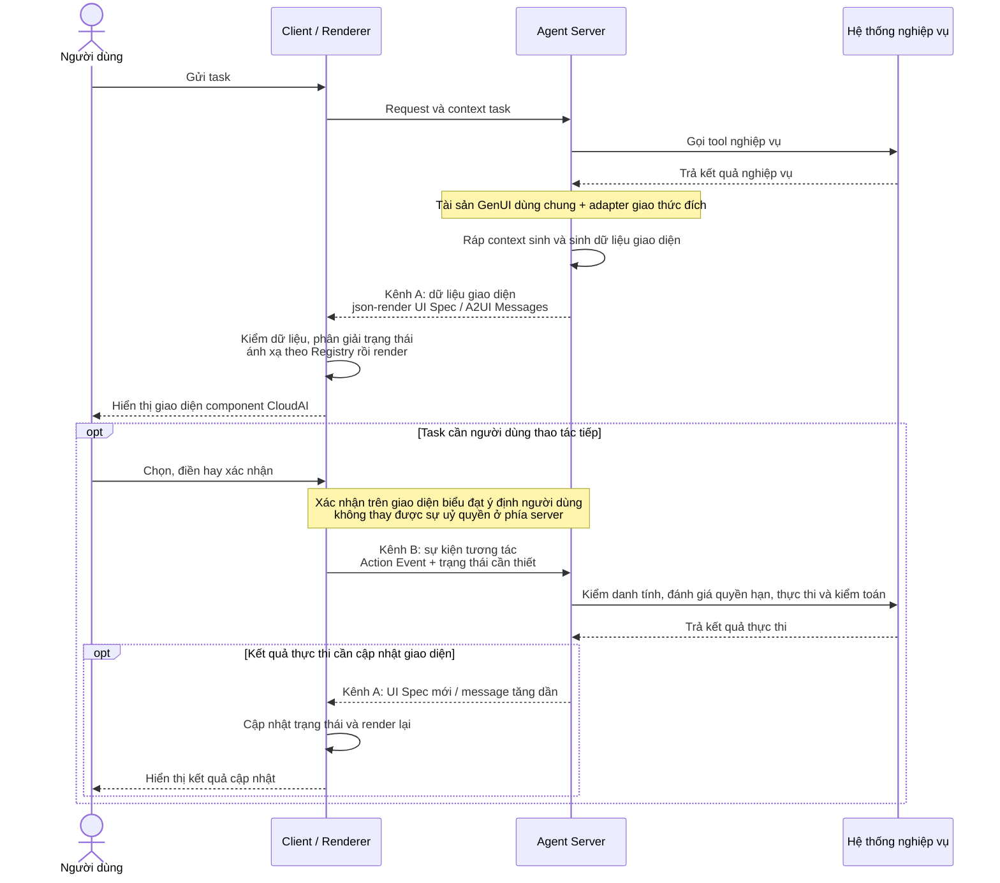

# GenUI: đưa Agent từ chỗ đưa ra câu trả lời tới chỗ bàn giao kết quả

# Một - Bối cảnh và động lực vấn đề

> Thứ thực sự chặn trải nghiệm không phải model trả lời hay hay dở, mà là "một dặm cuối" của việc bàn giao kết quả: thứ người dùng nhận được là một đoạn chữ, trong khi việc họ cần làm là so sánh bằng chứng, đánh giá rủi ro, rồi bắt tay thao tác.

Trong các kịch bản dùng cloud và quản cloud theo kiểu Agentic, yêu cầu của người dùng với kết quả không chỉ dừng ở "đọc hiểu": người dùng cần so sánh ngang vài nhóm bằng chứng, đánh giá rủi ro của một thao tác, rồi thực thi thẳng hành động ngay trong context hiện tại. Hai cách biểu đạt hiện có đều có hạn chế:

* **Văn bản thuần** giỏi giải thích và biểu đạt mở, nhưng hễ cần so sánh nhiều nhóm chỉ số, định vị thời điểm bất thường, hay phát một thao tác kèm xác nhận, thì năng lực tổ chức và năng lực thao tác của nó đều không đủ.

* **Trang cố định** giỏi đảm nhiệm các quy trình ổn định, tần suất cao, nhưng nó bắt buộc phải được thiết kế từ trước; trong khi hình thái kết quả mà Agent cho ra lúc chạy lại thuộc phần đuôi dài, không thể liệt kê hết thành các trang tương ứng từ trước.

GenUI bù đúng đoạn "một dặm cuối" đó: Agent dựa trên kết quả thật của task lần này mà tổ chức động phần kết luận, bằng chứng và các thao tác thực thi được, để người dùng hiểu được chuyện gì đã xảy ra ngay trong hội thoại, và tiếp tục hoàn thành task luôn.


Markdown


GenUI


# Hai - Tư tưởng thiết kế của GenUI

**GenUI (Generative UI - UI sinh thành) là một cơ chế**: để Agent lúc chạy dựa vào context task và kết quả nghiệp vụ mà tổ chức động nội dung, component và thao tác trong một phạm vi bị ràng buộc, rồi giao cho client render thành giao diện. Sản phẩm của nó là giao diện, nhưng bản thân nó là một chuỗi "sinh + ràng buộc + render", chứ không phải một trang cụ thể nào đó.

Nó không thay thế ngôn ngữ tự nhiên, cũng không thay thế trang cố định. Phân công của ba thứ rất rõ ràng: **ngôn ngữ tự nhiên** lo phần biểu đạt mở và giải thích, **trang cố định** lo các quy trình đã định, ổn định và tần suất cao, còn **GenUI** thì kéo phần biểu đạt giàu và thao tác giàu ra tới các task đuôi dài không liệt kê hết trước được.


### Tài sản thiết kế dùng chung: ràng buộc Agent "được dùng cái gì" và "phải dùng ra sao"

Mức tự do sinh của Agent cần được tài sản ràng buộc, nếu không thì không có cơ sở nào để nói tới tính nhất quán. CloudAI GenUI kết tinh các ràng buộc đó thành một bộ **tài sản thiết kế dùng chung**, không phụ thuộc giao thức cụ thể, rồi để tầng adapter dịch chúng thành hợp đồng dữ liệu của từng giao thức:


Tài sản thiết kế CloudAI

| **Tài sản** | **Ràng buộc cái gì** | **Diễn giải** |
| --- | --- | --- |
| **Catalog** | "Được dùng cái gì" | Danh sách component dùng được cho task lần này cùng hợp đồng dữ liệu và thao tác của chúng - đây là ranh giới cứng của việc sinh. Gồm component nền đa dụng, component nghiệp vụ và component tổ hợp ngữ nghĩa (Block) |
| **Template** | "Thông thường tổ chức ra sao" | Đưa ra cấu trúc thông tin và cấu trúc ví dụ được khuyến nghị theo các ý định task thường gặp, giúp Agent hội tụ về cách tổ chức |
| **Luật sử dụng** | "Phải dùng ra sao" | Các luật về phân tầng thông tin, chọn component, cảnh báo rủi ro và xác nhận thao tác, để tránh ghép ghiếc tuỳ tiện |

> Từ "Catalog" cũng tồn tại ở phía giao thức (ví dụ A2UI dùng catalog để chỉ tập các kiểu component mà client đã khai báo là dùng được). Trong bài này, **GenUI Catalog** chỉ tài sản thiết kế dùng chung xuyên giao thức, còn **catalog phía giao thức** chỉ danh sách component do tầng adapter sinh ra từ nó, hướng tới một giao thức và một renderer cụ thể.

Giao diện cuối cùng vẫn do Agent sinh động dựa trên context và kết quả nghiệp vụ của task lần này. Sở dĩ "động" không đồng nghĩa với "không kiểm soát được" là vì tính xác định không đến từ quá trình sinh, mà đến từ ba lớp ràng buộc của nó: **whitelist Catalog giới hạn các phần tử dùng được**, **Schema kiểm và chặn các cấu trúc không hợp lệ**, và **component đáng tin của client độc quyền phần hiện thực render**. Tính linh hoạt thuộc về Agent, còn tính xác định thuộc về client.

### Vì sao là khai báo, chứ không phải sinh code giao diện

Cốt lõi của GenUI không phải để model cho ra thẳng HTML, JavaScript hay JSX, mà là để Agent dùng dữ liệu có cấu trúc mà khai báo **"cần trình bày cái gì"**, rồi client quyết định **"trình bày cụ thể ra sao"**.

Sinh thẳng code giao diện có hai vấn đề không né được: một là không gian output mở, nên tính nhất quán thương hiệu và ranh giới tương tác đều khó ràng buộc; hai là nó đưa thẳng nội dung model sinh ra vào ranh giới thực thi được. Với hệ thống production, output của Agent cần mang tính **khai báo**, bị giới hạn trong các phần tử đã biết, và kiểm chứng được trước khi render - đó chính là lý do chọn mô tả UI có cấu trúc.


Cách này tuân theo ba nguyên tắc:

1. **Tách kết quả nghiệp vụ khỏi phần biểu đạt giao diện**: kết quả nghiệp vụ là nguồn sự thật, còn dữ liệu giao thức chỉ lo trình bày ra sao, và tổ chức lại được theo context.

2. **Tách ngữ nghĩa biểu đạt khỏi phần hiện thực thị giác**: Agent chọn các ngữ nghĩa như chỉ số, bằng chứng, rủi ro và thao tác; còn thương hiệu, bố cục, kiểu dáng và tương tác thì do component đáng tin của client hiện thực.

3. **Tách tri thức thiết kế khỏi framework kỹ thuật**: ngữ nghĩa Component, Block, ý định Template và các luật là tri thức thiết kế dùng chung, rồi tầng adapter mới chuyển chúng thành hợp đồng dữ liệu của từng giao thức.

# Ba - Đặc tính then chốt và ưu thế

### Tài sản thiết kế nâng chất lượng sinh của GenUI

json-render và A2UI cung cấp cơ chế sinh và render, shadcn cung cấp component nền; nhưng khi chỉ có giao thức và component nền thì việc phân tầng thông tin, tổ hợp component và ranh giới thao tác vẫn chủ yếu dựa vào việc Agent tổ chức tạm thời. Chúng tôi dùng Block, Catalog tăng dần, Template và luật sử dụng để mang kinh nghiệm thiết kế vào quá trình sinh, giúp Agent vừa tổ chức nội dung động, vừa sinh ra giao diện sản phẩm có cấu trúc rõ ràng hơn, trải nghiệm nhất quán hơn và ranh giới thao tác rõ hơn.

Before: hiệu quả sinh thẳng dựa trên component nền shadcn


After: hiệu quả sau khi tích hợp tài sản thiết kế


### Từ trình bày kết quả tới hoàn thành task

GenUI không chỉ trưng ra kết quả nghiệp vụ. Khi task cần người dùng tham gia tiếp, giao diện cung cấp được lối vào để nhập, chọn, xác nhận và thao tác, rồi gửi thao tác của người dùng ngược về Agent để tiếp tục dẫn dắt việc thực thi nghiệp vụ và cập nhật giao diện. Người dùng không cần rời khỏi context hiện tại mà vẫn đi tự nhiên từ việc hiểu kết quả sang bước thao tác tiếp theo, đẩy task tiến lên liên tục.

Ví dụ Template

### Output kiểm chứng được, vấn đề truy vết được

Thứ Agent xuất ra là dữ liệu giao thức có cấu trúc, chứ không phải HTML / JavaScript / JSX thực thi được. Dữ liệu qua phần kiểm Schema trước, rồi mới ánh xạ sang các component đáng tin của client. Điều đó mang lại ba thứ: các vấn đề cấu trúc (component chưa biết, sai kiểu trường, thiếu tham chiếu) bị chặn ngay trước khi render; rủi ro tiêm script và các tương tác không lường trước giảm rõ rệt; và bản thân dữ liệu giao thức là một sản phẩm ghi lại được, so sánh được, để ngỏ interface cho việc phát lại và định vị vấn đề.

Trong kịch bản streaming, độ mịn của phép kiểm là **theo từng message, theo từng node**: renderer tiêu thụ từng message tăng dần, vừa kiểm vừa render; node nào không qua kiểm thì hạ cấp hoặc bỏ qua, chứ không đợi cả màn dữ liệu đủ rồi mới bắt đầu render.

> 🌰 **Json Render Case**

Spec

```json
{
  "root": "insight",
  "elements": {
    "insight": {
      "type": "InsightBlock",
      "props": {
        "tag": "analysis",
        "title": "Slow log là nguyên nhân chính của vấn đề hiệu năng hiện tại",
        "summary": "Tài nguyên của instance nhìn chung dư dả; đỉnh slow log xuất hiện đồng bộ với các dao động tài nguyên, nên ưu tiên xử lý các câu SQL chậm tần suất cao."
      },
      "children": [
        "metrics",
        "evidence"
      ]
    },
    "metrics": {
      "type": "Grid",
      "props": {
        "columns": 4,
        "gap": "sm",
        "className": null
      },
      "children": [
        "cpu",
        "memory",
        "connections",
        "locks"
      ]
    },
    "cpu": {
      "type": "MetricCard",
      "props": {
        "badgeText": "Đỉnh CPU",
        "title": "68%",
        "description": null
      }
    },
    "memory": {
      "type": "MetricCard",
      "props": {
        "badgeText": "Mức dùng bộ nhớ",
        "title": "61%",
        "description": null
      }
    },
    "connections": {
      "type": "MetricCard",
      "props": {
        "badgeText": "Mức dùng kết nối",
        "title": "42%",
        "description": null
      }
    },
    "locks": {
      "type": "MetricCard",
      "props": {
        "badgeText": "Chờ khoá",
        "title": "3",
        "description": null
      }
    },
    "evidence": {
      "type": "ChartGroup",
      "props": {
        "title": "Số lượng slow log",
        "layout": "single"
      },
      "children": [
        "health-chart"
      ]
    },
    "health-chart": {
      "type": "ComboChart",
      "props": {
        "data": [
          {
            "time": "12:00",
            "slowLogs": 2,
            "cpu": 44,
            "memory": 31,
            "connections": 20
          },
          {
            "time": "13:00",
            "slowLogs": 9,
            "cpu": 32,
            "memory": 25,
            "connections": 38
          },
          {
            "time": "14:00",
            "slowLogs": 2,
            "cpu": 28,
            "memory": 33,
            "connections": 30
          },
          {
            "time": "15:00",
            "slowLogs": 3,
            "cpu": 30,
            "memory": 28,
            "connections": 37
          },
          {
            "time": "16:00",
            "slowLogs": 13,
            "cpu": 45,
            "memory": 28,
            "connections": 31
          },
          {
            "time": "17:00",
            "slowLogs": 4,
            "cpu": 18,
            "memory": 39,
            "connections": 30
          }
        ],
        "categoryKey": "time",
        "barSeries": {
          "key": "slowLogs",
          "label": "Số lượng slow log",
          "colorToken": "chart-1"
        },
        "lineSeries": [
          {
            "key": "cpu",
            "label": "CPU",
            "colorToken": "chart-4"
          },
          {
            "key": "memory",
            "label": "Bộ nhớ",
            "colorToken": "chart-3"
          },
          {
            "key": "connections",
            "label": "Kết nối",
            "colorToken": "chart-2"
          }
        ],
        "height": 240,
        "showGrid": true,
        "showLegend": true,
        "xAxisInterval": null,
        "leftDomain": [
          0,
          16
        ],
        "rightDomain": [
          0,
          100
        ],
        "rightUnit": "%"
      }
    }
  }
}
```

Hiệu quả render


# Bốn - Cơ chế vận hành và luồng dữ liệu

Với các task cần người dùng thao tác tiếp, lúc chạy có hai kênh dữ liệu ngược chiều nhau cùng tạo thành vòng lặp khép kín: **Server → Client** lo bàn giao dữ liệu giao diện, còn **Client → Server** lo gửi ngược các sự kiện tương tác. Cái trước làm cho kết quả hiểu được, cái sau làm cho thao tác của người dùng tiếp tục dẫn dắt việc thực thi nghiệp vụ và cập nhật giao diện.

**Kênh A**

### Server → Client: dữ liệu giao diện

Agent Server dựa trên kết quả nghiệp vụ, tài sản thiết kế dùng chung và giao thức đích mà sinh dữ liệu giao diện: json-render thì bàn giao UI Spec, còn A2UI thì bàn giao message giao thức. Client lo việc kiểm và phân giải trạng thái; còn Renderer thì dựa vào phần ánh xạ trong Registry mà tổ chức và render các component CloudAI.

**Kênh B**

### Client → Server: sự kiện tương tác

Thao tác của người dùng được ráp thành Action Event, gửi ngược về kèm các trạng thái cần thiết. **Việc xác thực, thực thi và kiểm toán nhất loạt diễn ra ở phía server** - thao tác xác nhận trên giao diện chỉ là biểu đạt ý định, không tạo thành sự uỷ quyền. Nếu kết quả thực thi làm đổi giao diện thì lại chảy ngược qua kênh A.



Cách truyền cụ thể do giao thức và vật chủ nghiệp vụ quyết định. A2UI cập nhật Surface liên tục được bằng message dạng stream; còn json-render thì không giới hạn cách truyền qua mạng, mà để vật chủ lo việc truyền Spec và sự kiện tương tác. Thứ hai bên dùng chung là ngữ nghĩa thiết kế và luật sử dụng, **chứ không phải cùng một bản JSON hoán đổi thẳng cho nhau được**.

# Năm - Kịch bản ứng dụng

GenUI là nền trải nghiệm cho việc dùng cloud và quản cloud theo kiểu Agentic, giúp Agent chuyển các kết quả nghiệp vụ động thành giao diện hiểu được và thao tác được. Dưới đây là ba kịch bản triển khai trong sản phẩm database AIDBS:

**➊ Chẩn đoán và vận hành**

Trình bày phần tóm tắt chẩn đoán, chỉ số bất thường, bằng chứng, so sánh phương án và phần xác nhận cho các thao tác rủi ro cao.


**➋ Truy vấn dữ liệu và phân tích nghiệp vụ**

Tổ chức động phần kết luận, đối tượng dữ liệu, căn cứ tri thức, chỉ số, biểu đồ và lối vào truy vấn.


**➌ Bán hàng**

Hoàn tất trọn quy trình làm rõ nhu cầu, chọn phương án, chỉnh tham số, xác nhận và đặt hàng ngay trong hội thoại.


# Sáu - Ranh giới và hạn chế

> Miền giá trị của GenUI là các task đuôi dài. Dùng nó vào chỗ không nên dùng thì cái giá là độ ổn định và chi phí; còn giả định quá mạnh về năng lực của nó thì cái giá là niềm tin.

### Khi nào không nên dùng GenUI

* **Các thao tác ổn định, tần suất cao, quy trình chặt**: hãy đi trang cố định. Hình thái tối ưu của loại quy trình này thiết kế trước được, nên không cần tổ chức lại lúc chạy.

* **Các câu trả lời thuần giải thích, dạng mở**: hãy đi ngôn ngữ tự nhiên. Khoác component lên một đoạn giải thích chỉ thêm nhiễu.

* **Các cấu hình phức tạp, tuân thủ chặt, giao dịch chặt, cực nhiều trường**: hãy đi console. Loại giao diện này đòi hỏi về luật kiểm và state machine vượt quá vùng đáng tin của việc tổ chức bằng sinh thành.

### Ranh giới năng lực

* **Cấu trúc kiểm chứng được, sự thật thì không:** Schema chặn được component chưa biết và sai trường, nhưng không chặn được những con số bị bịa ra hay những kết luận không thành lập. Số liệu bắt buộc phải đến từ phần hệ thống nghiệp vụ trả về, kết luận phải có bằng chứng truy nguyên được, và khi cần thì phía nghiệp vụ phải đối chiếu lần hai.

* **Xác nhận trên giao diện không đồng nghĩa với uỷ quyền:** mọi việc xác thực, thực thi và kiểm toán đều hoàn tất ở phía server; tương tác xác nhận ở client chỉ biểu đạt ý định người dùng.

* **Chi phí và độ trễ là ràng buộc thật:** kích thước Spec ảnh hưởng trực tiếp tới thời gian màn đầu và chi phí Token; các giao diện phức tạp phải dựa vào việc sinh dạng stream và cập nhật tăng dần thì mới có được hiệu năng cảm nhận chấp nhận được.

* **Không hoán đổi thẳng được giữa các giao thức:** thứ dùng chung là ngữ nghĩa thiết kế và luật sử dụng; còn hợp đồng dữ liệu của từng giao thức thì do tầng adapter sinh riêng.

* **Bản thân các giao thức phụ thuộc vẫn đang tiến hoá:** A2UI hiện vẫn ở giai đoạn tiến hoá tích cực (dòng ổn định là loạt v0.9, còn v1.0 là bản ứng viên), và hệ sinh thái OpenUI cũng đang lặp. Vì vậy GenUI dùng chiến lược "tài sản giữ ổn định, tầng adapter đảm nhiệm thay đổi", để cô lập phần biến động của giao thức ra ngoài ngữ nghĩa nghiệp vụ.

# Bảy - Lộ trình kỹ thuật và tiến hoá về sau

Chiến lược lộ trình của chúng tôi là **dùng chung tài sản, tương thích nhiều hướng kỹ thuật**: Component, Block, Catalog, Template và luật sử dụng giữ ổn định, còn tầng adapter thì đấu nối với các hợp đồng dữ liệu và Renderer khác nhau.

Dưới đây là ba hướng kỹ thuật chính:

| **Hướng** | **Hình thái** | **Trạng thái** | **Tiến độ hiện tại** | **Bước tiếp theo** |
| --- | --- | --- | --- | --- |
| **json-render** | UI Spec + renderer | **Đã thông** | Chuỗi sinh, kiểm, render đã khép kín | Mở rộng kiểm chứng trên nghiệp vụ thật |
| [**A2UI**](https://a2ui.org/) | Giao thức UI khai báo (message JSON dạng stream) | **Đang tiến hành** | Đã kiểm chứng xong trong kịch bản nghiệp vụ, đang thích ứng tài sản thiết kế CloudAI | Hoàn tất phần ánh xạ Catalog và component |
| [**OpenUI (OpenUI Lang)**](https://www.openui.com/docs/openui-lang) | Framework UI sinh thành + DSL theo dòng hướng tới LLM | **Đang lên kế hoạch** | Đã đưa vào kế hoạch tương thích, chưa tích hợp | Triển khai kiểm chứng kỹ thuật và ánh xạ tài sản CloudAI |

Về sau sẽ tập trung đánh giá bốn chiều:

* **Sinh và trải nghiệm**: tỉ lệ cấu trúc hữu hiệu, mức trọn vẹn nghiệp vụ, việc chọn component và trải nghiệm hoàn thành task;

* **Tương tác và hiệu năng**: sinh dạng stream, cập nhật tăng dần, trạng thái nhiều lượt, thời gian màn đầu và chi phí Token;

* **Bảo mật và observability**: kiểm Schema, kiểm toán quyền hạn, chịu lỗi và hạ cấp, truy vết chuỗi và phát lại;

* **Tương thích và tích hợp**: độ phủ tài sản, chi phí bảo trì adapter, tái dùng xuyên nền tảng và chi phí tích hợp nghiệp vụ.

# Tám - Giải thích thuật ngữ

| **Thuật ngữ** | **Ý nghĩa** |
| --- | --- |
| **Agent Server** | Phía server lo việc hiểu ý định, gọi tool nghiệp vụ và sinh dữ liệu giao diện. Mọi việc xác thực, thực thi và kiểm toán đều diễn ra ở đây. |
| **Client / Renderer** | Client và renderer lo việc nhận dữ liệu giao thức, hoàn tất phần kiểm và phân giải trạng thái, rồi render các node thành component cục bộ. |
| **Registry** | Bảng ánh xạ đăng ký từ kiểu component trong giao thức tới phần hiện thực component cục bộ, là điểm rơi của whitelist ở phía client. |
| **Spec** | Dữ liệu có cấu trúc mô tả một màn giao diện trong json-render: `root` chỉ định lối vào, còn `elements` tổ chức cây node bằng một từ điển phẳng cộng tham chiếu theo id. |
| **Surface** | Đơn vị canvas gánh component trong A2UI (như main view, sidebar, popup), cập nhật liên tục được bằng message tăng dần. |
| **Action Event** | Sự kiện mà client ráp từ lựa chọn, phần điền, xác nhận hay thao tác của người dùng cùng trạng thái hiện tại, rồi gửi ngược về server để kích hoạt thực thi. |
| **Component CloudAI** | Thư viện component đáng tin đã qua thẩm định thiết kế và bảo mật ở phía client, là nguồn hiện thực render duy nhất cho mọi giao diện GenUI. |
| **Kiểm Schema** | Phép kiểm cấu trúc với dữ liệu giao thức trước khi render: component đã biết chưa, kiểu trường có đúng không, tham chiếu có đầy đủ không. Nó không kiểm sự thật nghiệp vụ. |
